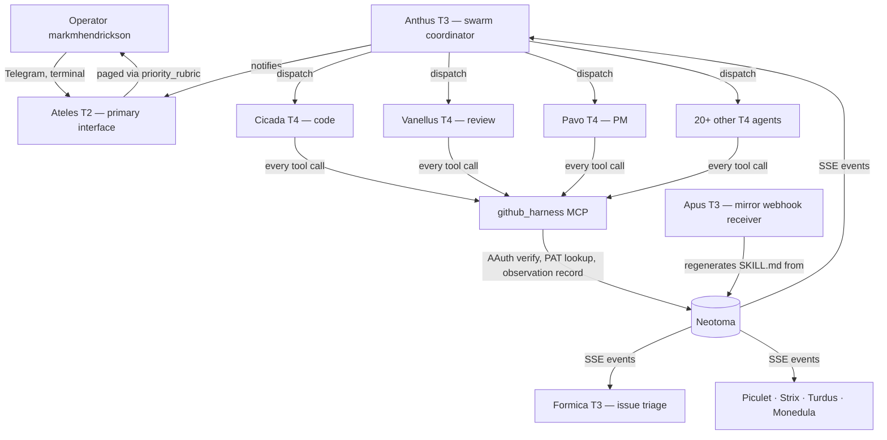

# Ateles

Personal agent swarm infrastructure. Every agent action attributed, versioned, and queryable.

Built around [Neotoma](https://github.com/markmhendrickson/neotoma) as the canonical memory and state layer. T1 hosts, T2 resident agents, T3 daemons, and T4 invocable agents — all defined as Neotoma entities, dispatched through AAuth-signed identities, and audited through the same observation log they write to. Open source. Local-first. MIT licensed.

**Architecture:** [docs/architecture.md](docs/architecture.md) · **Taxonomy:** [docs/taxonomy.md](docs/taxonomy.md) · **Phases:** [docs/phases.md](docs/phases.md)

## Why this exists

You run AI agents across tools and tasks. Without a swarm infrastructure layer, you become the swarm:

- Every agent operates from zero context — nothing it learns is shared across agents or sessions
- Identities collapse — a code-writing agent acts as you on GitHub, and there's no audit trail tying the AAuth subject to the action
- Decisions execute without a reproducible trail — you can't trace why an agent did something or whether it stayed in scope
- Orchestration is ad-hoc — kicking off a multi-agent workflow means manually opening multiple chats and hoping they don't conflict

These are not hypothetical. They are what happens when a single operator runs more than three agents in parallel across more than two products. You compensate with bespoke scripts, redundant prompts, and manual sync. Ateles removes that tax.

## What Ateles does

Ateles is a reference architecture for a single-operator agent swarm where:

- **Agents are entities, not files.** Each agent_definition lives in Neotoma. Updating an agent's behaviour is a `correct()` call, not a code commit. SKILL.md files on disk are generated mirror artifacts.
- **Every action is attributed.** Agents authenticate via AAuth-signed JWTs. The `github_harness` MCP server records every tool call as an `agent_action_observation` with both the AAuth subject (who claimed to act) and the PAT attribution (who actually acted on GitHub).
- **Workflows are typed.** A `workflow_definition` entity declares phases, gates, owner agents, and skip conditions. Anthus (the swarm coordinator) reads workflows from Neotoma and dispatches gates in order.
- **State is canonical.** Participation records, release criteria, agent grants, and policies are all Neotoma entities. The swarm has no other source of truth.

Not a framework. Not a toy. A working production blueprint that runs daily under launchd.

## Architecture



- **AAuth-verified.** Every agent has a keypair. Every tool call is signed. The harness verifies before acting.
- **Capability-scoped.** `agent_grant` entities declare which agents can call which tools against which repos. Wrong-capability calls fail with structured errors.
- **Observation-backed.** Every harness call writes an `agent_action_observation`. Replay any agent's actions over any time window from the log.
- **Mirror-canonical.** Agent definitions live in Neotoma; Apus mirrors them to disk as SKILL.md files. Direct disk edits are reverted on next mirror pass.

### Four foundations

| Foundation                | What it means                                                                                                                                              |
| ------------------------- | ---------------------------------------------------------------------------------------------------------------------------------------------------------- |
| **Attributed**            | Every action records `agent_sub` (AAuth identity) and `pat_attribution` (GitHub identity). Trust boundary visible at every call.                            |
| **Capability-scoped**     | Agents only have the powers their `agent_grant` declares. Out-of-scope calls return `wrong_capability` before any side effect.                              |
| **Workflow-driven**       | Phases, gates, and skip conditions live in `workflow_definition` entities. Anthus reads them and dispatches accordingly — no hardcoded sequencing.          |
| **Canonical-source-of-truth** | Agent definitions, grants, policies, and participation records all live in Neotoma. Disk artifacts are mirror outputs, never inputs.                       |

Full design: [docs/architecture.md](docs/architecture.md).

## Entities, not files

Everything Ateles knows about itself is a Neotoma entity. The filesystem is a generated mirror — useful for IDE tooling, but never the source of truth.

| Concept                | Lives as              | Mirrored to                              | Direction          |
| ---------------------- | --------------------- | ---------------------------------------- | ------------------ |
| Agent prompt           | `agent_definition`    | `.claude/skills/<agent>/SKILL.md`        | Neotoma → disk     |
| Agent capability       | `agent_grant`         | (none — read live by github_harness)     | Neotoma only       |
| Workflow phases        | `workflow_definition` | (none — read live by Anthus)             | Neotoma only       |
| Gate state             | `participation_record`| (none — written by harness)              | Neotoma only       |
| Every tool call        | `agent_action_observation` | (none — append-only log)            | Neotoma only       |
| Operating rules        | `agent_policy`        | (none — enforced at dispatch)            | Neotoma only       |
| Strategy posture       | `business_strategy` / `domain_strategy` / `agent_strategy` | (none) | Neotoma only |

**What this means in practice:**

- **Behaviour changes are corrections, not commits.** Updating Pavo's prompt is `neotoma correct --entity-id ent_… --field prompt_markdown`. Apus regenerates the SKILL.md mirror on the next webhook. Direct edits to `.claude/skills/pavo/SKILL.md` are reverted.
- **Capability changes are entities, not configs.** Granting Cicada access to a new repo is a `correct()` on the `agent_grant` entity. The next `github_harness` call sees the new scope on the next pre-check; no daemon restart.
- **Workflow changes are entities, not code.** Adding a phase to the copy workflow is a `correct()` on the `workflow_definition` entity. Anthus picks it up from the SSE event stream.
- **Audit is a query, not a grep.** "What did Cicada do last Tuesday?" is `retrieve_entities --entity-type agent_action_observation --agent-sub cicada@ateles-swarm`. Git logs only show committed code; observations cover every harness call, including reads.
- **Reasoning about the swarm is reasoning about entities.** The mental model is "which entities flow through which daemons", not "which files do which scripts read".

The filesystem layout matters for the runtime substrate — daemons need code on disk, Claude Code needs SKILL.md on disk — but it is downstream of the entity model, not the other way around.

## Agent taxonomy

Four tiers. Twelve product-panel agents plus daemons plus 20+ domain T4s. Naming follows bird and animal genera.

| Tier   | Role                                  | Examples                                                                                  |
| ------ | ------------------------------------- | ----------------------------------------------------------------------------------------- |
| **T1** | Hosts (process that owns a channel)   | OpenClaw (Telegram), launchd (daemon scheduling), raw aiohttp Bot API                     |
| **T2** | Resident agents (always-on, conversational) | Ateles (primary operator interface), Menura (public-facing personal representative)  |
| **T3** | Daemons (event-driven, persona-less)  | Formica · Anthus · Apus · Apis · Piculet · Strix · Turdus · Monedula · neotoma-agent · Tyto · mic-recorder · Cyphorhinus |
| **T4** | Invocable agents (stateless, spawned per task) | Pavo · Waxwing · Phoenicurus · Buteo · Robin · Struthio · Accipiter · Corvus · Regulus · Cicada · Vanellus · Manucode · and 20+ domain agents |

Full agent table with AAuth identities, grants, and status: [docs/taxonomy.md](docs/taxonomy.md).

## Quick start

Ateles is not an installable package — it's a reference architecture. The fastest way to evaluate whether to adopt the pattern is to read the architecture doc and inspect a working daemon.

```bash
git clone https://github.com/markmhendrickson/ateles.git
cd ateles
less docs/architecture.md
less execution/daemons/anthus/anthus.py
less execution/daemons/apus/apus.py
```

To run any daemon locally requires Neotoma running (see [neotoma installation](https://github.com/markmhendrickson/neotoma#quick-start)), AAuth keypairs provisioned, and `agent_grant` entities for each daemon. The full setup walkthrough lives in [docs/setup.md](docs/setup.md).

### Open architecture issues to track

Three umbrella issues shape what adoption looks like next:

- **[ateles#18 — Make Ateles installable](https://github.com/markmhendrickson/ateles/issues/18)** — ten blockers to package-based adoption (identity provisioning UX, operator-specific agent definitions, config schema, keypair format unification, launchd plist generation, dependency manifest, `ateles-private/` boundary, versioning, multi-operator path). Adopt-by-forking works today; install-by-package needs this work.
- **[ateles#19 — Input attribution](https://github.com/markmhendrickson/ateles/issues/19)** — record which Neotoma entities each agent read before deciding. Today the swarm records who acted and what they produced, but not the evidence the decision was built on. Closing this loop enables reverse impact analysis (which downstream decisions does a corrected strategy invalidate?) and precedent graphs. Broken into execution sub-issues [#20–#25](https://github.com/markmhendrickson/ateles/issues/20).
- **[ateles#26 — Tool-level authorization](https://github.com/markmhendrickson/ateles/issues/26)** — extend `agent_grant` to declare which MCP tools each agent can call, against which resources, with which parameter constraints (e.g. Monedula can call `btc_send_transfer` up to 500k sats; Pavo cannot call `btc-wallet` at all). `github_harness` already implements this pattern; #26 generalizes it across all MCP servers via a proxy enforcement layer.

## Example

A real Pavo dispatch traced through the entity layer. The CLI invocation is one step among ten; the rest happens in Neotoma.

1. **Operator files an issue.** `gh issue create --repo markmhendrickson/ateles --title "Decide feature A vs B for next release"`. The issue body is the task body for Pavo.

2. **`formica` (T3) ingests the issue.** It reads the GitHub webhook event, calls `store(issue, ...)` on Neotoma, and emits a triage observation classifying it as a product decision.

3. **`anthus` (T3) reads the SSE event stream.** It matches the new `issue` entity against `workflow_definition` entities and picks the `product_decision_workflow`.

4. **Anthus opens a `participation_record`.** One per gate. The first gate has `owner_agent: pavo`, `status: dispatched`, `dispatched_at: now()`.

5. **Anthus reads `agent_definition` for Pavo from Neotoma.** It pulls `prompt_markdown`, `context_entity_types`, `operational_entity_types`, and `allowed_tools`. The SKILL.md mirror is the same content on disk — Anthus could use either, but Neotoma is canonical.

6. **Anthus spawns a `claude --print` subprocess** with Pavo's SKILL.md as `--append-system-prompt` and the issue body as the user prompt. Pavo's AAuth keypair is loaded from `ateles-private/keys/`.

7. **Pavo reads context entities through `mcpsrv_neotoma`.** It queries recent `business_strategy`, `domain_strategy`, customer-signal observations, prior `acceptance_criteria` entities — whatever its `context_entity_types` lists.

8. **Pavo writes its decision.** It calls `store(acceptance_criteria, body="Build feature B first…")` on Neotoma. The observation is attributed to `pavo@ateles-swarm` via AAuth signature. Pavo also emits the artifact-header line as its final stdout: `[pavo] acceptance_criteria: Build feature B first. Higher strategic fit, lower implementation risk after webhook v0.1, customer-signal weight 2.3× feature A.`

9. **Anthus parses the artifact header, updates the `participation_record`** to `status: satisfied`, `satisfied_at: now()`, `artifact_ref: ent_…` pointing at the new `acceptance_criteria` entity.

10. **Anthus advances the workflow.** It opens the next `participation_record` for the next gate (e.g. `cicada` to scaffold the implementation), and the loop repeats.

Everything Anthus does after step 1 is driven by entities. The operator can replay the full sequence later with `retrieve_entities` against `agent_action_observation` and `participation_record`. No grep, no git log.

## Structure

The filesystem is the runtime substrate that supports the entity layer. This is the mirror, not the source — every behaviour-defining artifact below is generated from or read by Neotoma entities at runtime.

```
ateles/
├── .claude/skills/        # generated SKILL.md mirrors (do not edit — corrections go through Neotoma)
├── docs/
│   ├── architecture.md         # system design and Neotoma integration
│   ├── taxonomy.md             # canonical agent table
│   ├── phases.md               # implementation roadmap (mirror of Neotoma plan)
│   ├── swarm_orchestration.md  # workflow_definition + gate semantics
│   ├── swarm_smoke_test_plan.md # tiered smoke-test programme
│   └── setup.md                # daemon installation + AAuth provisioning
├── execution/
│   ├── daemons/                # T3 daemon implementations
│   │   ├── anthus/             # swarm coordinator — workflow dispatch
│   │   ├── apus/               # mirror webhook receiver — Neotoma → git pipeline
│   │   ├── apis/               # universal task dispatcher
│   │   ├── formica/            # GitHub issue/PR triage
│   │   ├── monedula/           # recurring payment daemon (Wise + BTC)
│   │   ├── neotoma-agent/      # neotoma-repo automation
│   │   ├── piculet/            # audio transcription watcher
│   │   ├── strix/              # meeting/ambient audio recorder
│   │   ├── turdus/             # email triage daemon
│   │   ├── tyto/               # screenshot watcher
│   │   ├── mic-recorder/       # menu bar mic toggle + launchd
│   │   └── cyphorhinus/        # recurring report generator
│   ├── scripts/                # domain scripts (transcription, finance, OCR, etc.)
│   └── mcp-servers/            # local MCP server packages
└── lib/
    ├── daemon_runtime/         # SSE subscription, AAuth signer, agent_definition loader
    └── notify/                 # Apprise-backed notification routing
```

## Key dependencies

- [Neotoma](https://github.com/markmhendrickson/neotoma) — canonical memory and state layer
- [mcp-server-github-harness](https://github.com/markmhendrickson/mcp-server-github-harness) — AAuth-verified GitHub MCP with PAT loader and observation recording
- [Claude Agent SDK / Claude CLI](https://docs.anthropic.com/claude/agent-sdk) — agent execution runtime
- [Apprise](https://github.com/caronc/apprise) — notification delivery (Telegram, email, etc.)
- `gws` CLI — Google Calendar / Gmail integration
- `neotoma` CLI — Neotoma entity operations
- `launchd` — macOS scheduling for T3 daemons

## State guarantees 🔒

The swarm makes specific commitments about what is verifiable.

| Property                                        | Without swarm infra   | Ad-hoc agents             | Ateles                            |
| ----------------------------------------------- | --------------------- | ------------------------- | --------------------------------- |
| 🪪 Agent identity verifiable                    | ❌                    | ⚠️ partial (PAT only)     | ✅ AAuth-signed JWT                |
| 🔍 Trust boundary visible (sub ≠ pat)           | ❌                    | ❌                        | ✅ both recorded                   |
| 🚧 Capability scope enforced                    | ❌                    | ⚠️ via PAT scopes only    | ✅ agent_grant pre-check           |
| 📋 Per-action audit trail                       | ❌                    | ⚠️ git commits only       | ✅ agent_action_observation        |
| 🔄 Workflow phase ordering                      | ⚠️ manual             | ⚠️ manual                 | ✅ workflow_definition + Anthus    |
| ⏭️ Gate skip conditions                         | ❌                    | ❌                        | ✅ declared per-workflow           |
| ⏪ Replayable orchestration                     | ❌                    | ❌                        | ✅ participation_record log        |
| 📜 Agent definitions are versioned              | ❌                    | ⚠️ git history            | ✅ Neotoma observation history     |
| 🔔 Operator paged only on real escalations      | ❌                    | ⚠️ notification spam      | ✅ priority_rubric filter          |
| 🧠 Inputs to a decision are recorded            | ❌                    | ❌                        | ⚠️ in flight (see [ateles#19](https://github.com/markmhendrickson/ateles/issues/19)) |
| 🔗 Agent version pinned at dispatch             | ❌                    | ⚠️ git SHA, not entity    | ⚠️ in flight (see [ateles#19](https://github.com/markmhendrickson/ateles/issues/19)) |
| 🪜 Precedent chain queryable                    | ❌                    | ❌                        | ⚠️ in flight (see [ateles#19](https://github.com/markmhendrickson/ateles/issues/19)) |

The first nine rows are live in operator-driven use today. The final three rows are tracked in [ateles#19](https://github.com/markmhendrickson/ateles/issues/19) — input attribution, which records the Neotoma entities each agent consulted before deciding. Output attribution (who acted, against which capability, producing what) is solved; input attribution closes the loop so decisions can be audited against the evidence they were built on.

## Interfaces

The swarm exposes four operational surfaces, all converging on Neotoma as source of truth.

| Interface              | Description                                                                                                                  |
| ---------------------- | ---------------------------------------------------------------------------------------------------------------------------- |
| **Telegram (Ateles)** | Primary operator surface. Bot at `AtelesBot`. Receives BLOCKER / OPERATOR_DECISION pages; the operator replies inline.    |
| **`claude --print`**   | Agent dispatch surface used by both operator and Anthus. Each invocation passes `--append-system-prompt "$(cat SKILL.md)"`.   |
| **GitHub harness MCP** | Every code-touching agent's call surface. AAuth-verified, capability-scoped, observation-logged.                              |
| **Neotoma SSE**        | The substrate. Daemons subscribe by entity type; new issues, PRs, escalations, daemon reports flow through this stream.       |

## Who this is for

Solo operators running a multi-agent personal stack — agents for code, content, finance, household ops, customer development, residency admin, and so on — who need to keep all of them coordinated, auditable, and within scope. Three modes, one operator:

| Mode          | What you're doing                                  | The tax without Ateles                                                       | What you get back                                |
| ------------- | -------------------------------------------------- | ---------------------------------------------------------------------------- | ------------------------------------------------ |
| **Operating** | Dispatching agents across products and tasks        | Manual sequencing, redundant context-setting, no idea who did what            | Single dispatch surface; verifiable history       |
| **Building**  | Adding new agents or workflows                      | Hardcoded sequencing, ad-hoc identity glue, no contract between agents        | Declarative workflow_definition; reusable grants  |
| **Debugging** | Tracing why an agent acted out of scope             | Reading git logs, guessing which agent ran when                                | observation replay over any time window           |

**Not for:** Single-agent setups. Teams (Ateles assumes one operator across all agents — multi-operator requires multi-tenant Neotoma). Hosted-agent providers. Anyone who needs zero-install onboarding (Ateles is a reference architecture, not a packaged product).

## Agent entity types

Every swarm-defining record is a typed Neotoma entity. The canonical `entity_type` values that Ateles reads and writes:

| `entity_type`              | What it stores                                                                                | Key fields                                            |
| -------------------------- | --------------------------------------------------------------------------------------------- | ----------------------------------------------------- |
| `agent_definition`         | Identity, prompt, triggers, context types, operational types, allowed tools                   | `name`, `triggers`, `prompt_markdown`, `allowed_tools`, `context_entity_types`, `operational_entity_types` |
| `agent_grant`              | Capability scope — Neotoma entity-type allowlist + MCP tool allowlist + external resource scope | `agent_sub`, `op`, `repos`, `capabilities` (entity ops + tools — [ateles#26](https://github.com/markmhendrickson/ateles/issues/26)) |
| `agent_action_observation` | One row per harness tool call — AAuth sub, PAT attribution, tool, owner/repo, result          | `agent_sub`, `pat_attribution`, `tool`, `owner`, `repo`, `result` |
| `agent_policy`             | Operating rules (mandatory/recommended/prohibited) with scope                                 | `scope`, `rule_kind`, `body`                          |
| `workflow_definition`      | Phases, gates, owner agents, skip conditions, preconditions                                   | `name`, `gates[]`, `gate_name`, `owner_agent`, `skip_if`, `preconditions` |
| `participation_record`     | Per-gate dispatch + satisfaction history                                                      | `workflow_id`, `gate_name`, `status`, `dispatched_at`, `satisfied_at`, `artifact_ref` |
| `business_strategy` / `domain_strategy` / `agent_strategy` | Hierarchical strategy DAG — root + per-area + per-agent posture | `north_star_metric`, `assumptions`, `success_criteria`, `parent_strategy_ref` |
| `strategy_drift_signal`    | Agent-emitted observation when work contradicts current operating assumptions                 | `observation`, `severity`, `relates_to_assumption`    |

Full type catalog: [docs/data_types.md](docs/data_types.md).

## Current status

**Phase:** Reference architecture in operator-driven use. **Operator:** one (Mark Hendrickson). **Daemons running under launchd:** Apus, Formica, Anthus. **License:** MIT.

### What works

- **Agent definitions in Neotoma → mirrored to disk** (Apus pipeline)
- **AAuth verification + capability scoping** (`github_harness` MCP, with `agent_grant` lookup)
- **Anthus dispatch via `claude --print --append-system-prompt`** (workflow_definition-driven, fire-and-forget subprocess)
- **`participation_record` and `agent_action_observation`** schemas registered and queryable
- **23-schema slate** for strategy hierarchy, doc surfaces, code review, release criteria, brand voice, etc.
- **Per-agent context + operational type + allowed_tools declarations** populated for all 12 product-panel agents
- **Operator-driven Tier 1 smoke test** — single-agent gate satisfaction (12 agents, artifact-header convention)

### What's in flight

- **Tier 2** — phase ordering + parallelism on synthetic issues
- **Tier 3** — multi-repo identity correctness (AAuth → PAT mapping)
- **Tier 4** — real product work end-to-end
- **Tier 5** — fully autonomous Anthus dispatch

### What is not guaranteed yet

- Stable workflow_definition schema across versions
- Anthus runs without intermittent restarts
- Schema sprawl is consolidated (feedback / UI / release types still overlap)
- Backward compatibility — corrections may invalidate prior gate outputs

See [docs/swarm_smoke_test_plan.md](docs/swarm_smoke_test_plan.md) for the full phased rollout cadence.

## Security defaults

The runtime substrate that supports the entity layer. AAuth keypairs, PATs, and the Apus tunnel sit beneath Neotoma; the swarm's trust model and audit trail are defined by entities (`agent_grant`, `agent_action_observation`), not by the on-disk material that runs the daemons.

Ateles is single-operator infrastructure. Defaults assume the operator owns the machine, the keypairs, and the Neotoma instance.

- **Authentication:** AAuth keypairs per agent, signed JWTs verified against published JWKS. Operator token used as fallback for daemons without their own grant.
- **Authorization:** `agent_grant` entities pre-check every tool call. Wrong-capability returns structured `wrong_capability` error before any side effect.
- **Sensitive material:** GitHub PATs live in `.env` only, loaded per-repo by the harness PAT loader. Agents never see PATs.
- **Audit:** Every harness call writes an `agent_action_observation`. Replay over any time window.
- **Tunnel:** Apus webhook receiver listens on `localhost:8741` only; Cloudflare tunnel surfaces it to Neotoma's prod webhook deliveries.

## Development

Daemons run from disk under launchd; the IDE reads SKILL.md mirrors from disk. Both are runtime conveniences. The only artifact that defines swarm behaviour is an entity in Neotoma — every workflow below reflects that.

**Daemon iteration:**

```bash
# venv at .venv/ with httpx, apprise, etc.
.venv/bin/python3 execution/daemons/anthus/anthus.py    # foreground test
launchctl unload ~/Library/LaunchAgents/com.ateles.anthus.plist
launchctl load ~/Library/LaunchAgents/com.ateles.anthus.plist
tail -f /tmp/com.ateles.anthus.err.log
```

**Updating an agent's prompt (the canonical path):**

```bash
# Never edit .claude/skills/<agent>/SKILL.md directly — Apus reverts on next mirror.
# Correct the agent_definition entity instead:
neotoma correct --entity-id ent_… --field prompt_markdown --value "$(cat new_prompt.md)"
# Apus webhook fires; SKILL.md regenerates from the canonical entity.
```

**Updating an agent's capability scope:**

```bash
# agent_grant is also an entity. Add a repo to Cicada's github_harness:write scope:
neotoma correct --entity-id <cicada-grant-id> --field repos --append neotoma-docs
# Next harness call sees the new scope on the next pre-check; no daemon restart.
```

**Adding a workflow phase:**

```bash
# workflow_definition is an entity. Insert a new gate:
neotoma correct --entity-id <workflow-id> --field gates --json '[...new gate...]'
# Anthus picks it up from the SSE event stream on the next dispatch.
```

**Smoke testing:**

```bash
# Operator-driven Tier 1 — single-agent gate
claude --print --append-system-prompt "$(cat .claude/skills/pavo/SKILL.md)" \
  --dangerously-skip-permissions \
  "Invoke pavo. <task body>"
```

**Prerequisites:** Python 3.13+ (`.venv/`), Node v22+ via NVM (for `claude` CLI), Neotoma running on prod URL, the `op` CLI for `.env` loading, `gh` and `gws` CLIs.

## Using with AI tools

Ateles operates through `claude` CLI and MCP servers. The MCP layer is what connects each agent to the Neotoma state layer and the GitHub harness.

| Tool                    | How Ateles uses it                                                                                                                                            |
| ----------------------- | ------------------------------------------------------------------------------------------------------------------------------------------------------------- |
| **Claude Code**         | Operator-driven sessions in worktrees. Skills under `.claude/skills/` invoke agents by trigger word.                                                            |
| **`claude --print`**    | Headless agent dispatch (operator and Anthus). `--append-system-prompt` loads the agent's SKILL.md.                                                              |
| **mcpsrv_neotoma**      | Every agent reads/writes Neotoma state via this MCP. Schema-aware tool surface.                                                                                  |
| **github_harness MCP**  | AAuth-verified GitHub operations. Issues, PRs, comments, branches, commits, reviews — all observation-logged.                                                  |
| **typefully MCP**       | Corvus's social-post scheduling surface.                                                                                                                         |
| **parquet MCP**         | Bulk-data query surface for finance, transcription, and WhatsApp parquet stores.                                                                                |

**Agent dispatch contract:** Agents emit a single bracketed artifact-header line as their final response (`[<agent>] <artifact_kind>: <body>` or `BLOCKED — <reason>`). Anthus parses this to mark workflow gates satisfied. Agents optionally append a second line, `[<agent>] strategy_drift_signal: <observation>`, when their work surfaces evidence contradicting their current `agent_strategy`. See [docs/swarm_orchestration.md](docs/swarm_orchestration.md) for the full contract.

## Common questions

**Why a reference architecture instead of a packaged framework?**
A single-operator agent swarm is too tightly coupled to the operator's specific tooling, repos, identities, and grants to package generically. Ateles is the design and a working example — fork it, adapt the daemons to your infrastructure, keep the contract (AAuth identity, observation recording, workflow_definition, mirror pipeline).

**How does this compare to LangGraph / CrewAI / AutoGen?**
Those frameworks orchestrate multi-step LLM calls inside one process. Ateles orchestrates long-running background daemons that spawn `claude` subprocesses, each with its own AAuth identity, and that write to a canonical state store. Different problem — agent fleets across days, not chains across seconds.

**Why launchd instead of Docker / k8s?**
Single operator, one machine. launchd is the lowest-overhead scheduler that survives reboots. The architecture would work the same way under systemd or supervisord; the daemons don't care.

**Is this production-ready?**
Tier 1 (single-agent gate satisfaction) passes. Tier 5 (full autonomous Anthus dispatch) is still scaffolded. Daily real use: Apus, Formica, Anthus, Monedula run under launchd. Most T4 agents are operator-dispatched. See [docs/swarm_smoke_test_plan.md](docs/swarm_smoke_test_plan.md) for the gating tiers.

**What if I want to add a new agent?**
File an `agent_definition` entity in Neotoma. Mint an AAuth keypair. File an `agent_grant` with the capabilities it needs. Apus mirrors the SKILL.md to disk. Anthus picks it up on next workflow that references its trigger. The whole loop is documented in [docs/swarm_orchestration.md](docs/swarm_orchestration.md).

## Related posts

- [Your agent fleet now signs its writes](https://markmhendrickson.com/posts/your-agent-fleet-now-signs-its-writes) — Neotoma v0.6 fleet-grade attribution
- [Your agent's memory is a markdown file](https://markmhendrickson.com/posts/your-agents-memory-is-a-markdown-file) — convergent evolution of file-based memory
- [Building a truth layer for persistent agent memory](https://markmhendrickson.com/posts/truth-layer-agent-memory)
- [Agent command centers need one source of truth](https://markmhendrickson.com/posts/agent-command-centers-source-of-truth)
- [Six agentic trends I'm betting on](https://markmhendrickson.com/posts/six-agentic-trends-betting-on)

## Documentation

Full documentation lives in `docs/`.

**Getting oriented:** [Architecture](docs/architecture.md), [Taxonomy](docs/taxonomy.md), [Phases](docs/phases.md)

**Operating:** [Swarm orchestration](docs/swarm_orchestration.md), [Swarm smoke-test plan](docs/swarm_smoke_test_plan.md), [Agent execution runbook](docs/agent_execution_runbook.md), [Setup](docs/setup.md)

**Reference:** [Data types](docs/data_types.md), Auth + key management (see `docs/`), [Data publishing transformation](docs/data_publishing_transformation.md)

**Operations:** [Workflows](docs/workflows.md), [Usage](docs/usage.md), [Linting guide](docs/linting-guide.md), [Test setup](docs/test-setup-guide.md)

## Contributing

Ateles is in active development by one operator. Issues and discussions welcome — open one at [github.com/markmhendrickson/ateles/issues](https://github.com/markmhendrickson/ateles/issues). Pull requests for the reference architecture (daemon hardening, AAuth improvements, harness extensions) are reviewed. Pull requests that bundle in operator-specific configuration are not — fork instead.

**License:** MIT
