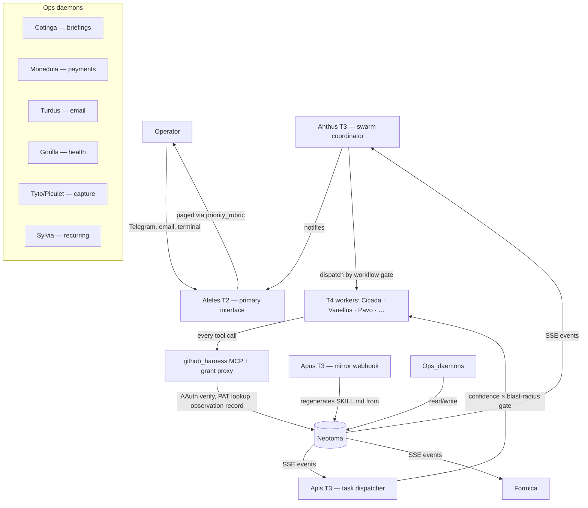

# Ateles

**A single-operator AI agent swarm that runs a founder's company and personal life — every agent action
attributed, capability-scoped, and queryable.**

Ateles is the reference architecture for running a *fleet* of AI agents as one person. It is two systems in
one repository:

1. **A governed runtime substrate** — AAuth-signed agent identities, capability grants, an append-only
   observation log, confidence × blast-radius execution gating, and workflow orchestration. This is what
   makes a fleet *trustworthy*: you always know which agent did what, on whose authority, and within what
   scope.
2. **A working operations suite** — 18 background daemons and ~87 skills that already automate code review,
   releases, issue triage, email, calendar, recurring payments (fiat + Bitcoin), meeting capture and recap,
   health tracking, customer development, content and social, multi-jurisdiction tax prep, and CRM.

Everything is built around [Neotoma](https://github.com/markmhendrickson/neotoma) as the canonical memory
and state layer. T1 hosts, T2 resident agents, T3 daemons, and T4 invocable agents are all defined as
Neotoma entities, dispatched through AAuth-signed identities, and audited through the same observation log
they write to. Open source. Local-first. MIT licensed.

**Who it's for:** [docs/icp.md](docs/icp.md) · **Architecture:** [docs/architecture.md](docs/architecture.md)
· **Taxonomy:** [docs/taxonomy.md](docs/taxonomy.md) · **Phases:** [docs/phases.md](docs/phases.md)

> **Not a package — a blueprint.** Ateles is a reference architecture you fork and adapt, not an installable
> product. It assumes one operator who owns the machine, the keypairs, and the Neotoma instance. See
> [Who this is for](docs/icp.md) for the precise profile and the explicit anti-profile.

## Why this exists

You run AI agents across tools and tasks. Without a swarm infrastructure layer, *you* become the swarm:

- Every agent operates from zero context — nothing it learns is shared across agents or sessions.
- Identities collapse — a code-writing agent acts as you on GitHub, with no audit trail tying the AAuth
  subject to the action.
- Decisions execute without a reproducible trail — you can't trace why an agent did something or whether it
  stayed in scope.
- Orchestration is ad-hoc — kicking off a multi-agent workflow means manually opening chats and hoping they
  don't conflict.

These are not hypothetical. They are what happens when one operator runs more than three agents in parallel
across more than two products. You compensate with bespoke scripts, redundant prompts, and manual sync.
Ateles removes that tax.

## What the swarm actually does

The largest part of this repo is not abstract — it is concrete automation the operator runs every day. The
fleet spans the operator's whole surface area, company and life alike:

| Domain | What runs | Daemons / skills |
| --- | --- | --- |
| **Software delivery** | Implement issues, review and steward PRs, QA, cut releases, triage issues/PRs off GitHub webhooks | `cicada`, `vanellus`, `lanius`, `phoenicurus`, `struthio` skills; `formica`, `neotoma-agent`, `phoenicurus-release` daemons; `loxia` PR-review GHA |
| **Email** | Triage inbox, draft replies, route operator replies back to run threads, daily digests | `turdus`, `riparia` daemons; `email-triage`, `email-triage-auto` skills |
| **Calendar & scheduling** | 05:00 meeting-prep briefings, recurring-task ↔ calendar sync, slot-finding | `cotinga`, `sylvia` daemons; `remember-calendar`, `find-technician-slot` skills |
| **Payments & finance** | Calendar-triggered recurring payments in fiat (Wise) and Bitcoin, portfolio/liquidity analysis, expense capture | `monedula` daemon; `fringilla`, `run-scorecard`, `extract-amazon-order`, `quarterly-portfolio-review` skills |
| **Meetings** | Toggle recording, transcribe (with consent tracking), extract decisions/action items, draft recaps | `strix`, `tyto`, `piculet` daemons; `record_meeting`, `analyze-meeting`, `import-audio` skills |
| **Health & fitness** | Log workouts, analyze progression, nudge on inactivity | `gorilla` daemon; `gorilla`, `scrape-chatgpt-workout` skills |
| **Content & GTM** | Long-form and build-in-public writing, platform-adapted social, marketing/positioning, brand & UX | `corvus`, `write`, `write-blog-post`, `social`, `ciconia`, `manucode`, `aythya`, `accipiter` skills |
| **Customer development** | ICP synthesis, feedback analysis, interview admin, contact intake | `hirundo`, `analyze-neotoma-feedback`, `process-feedback`, `interview-admin`, `intake-relationship` skills |
| **Relationships / CRM** | Lifecycle management of investors, advisors, partners, customers | `sturnus` agent (CRM in Neotoma) |
| **Tax & legal** | Multi-jurisdiction tax prep, contract/GDPR/IP review | `picus`, `buteo` skills |
| **Operator briefing** | 05:30 digest in the operator's voice; pages only on real escalations | `morning-brief`, `aquila` daemons; `priority_rubric` filter |
| **Mirror & sync** | Neotoma → git mirror of agent definitions, env/secret sync | `apus` daemon; `sync-env-from-1password`, `deploy-website` skills |

Underneath all of it, the **governance substrate** records, scopes, and gates every action — described next.

## What makes the fleet trustworthy

Ateles is a single-operator agent swarm where:

- **Agents are entities, not files.** Each `agent_definition` lives in Neotoma. Updating an agent's
  behaviour is a `correct()` call, not a code commit. SKILL.md files on disk are generated mirror artifacts.
- **Every action is attributed.** Agents authenticate via AAuth-signed JWTs (RFC 9421 HTTP message
  signatures, ECDSA P-256). The `github_harness` MCP server records tool calls with both the AAuth subject
  (who claimed to act) and the PAT attribution (who actually acted on GitHub).
- **Capability is scoped.** `agent_grant` entities declare which agents may call which tools, against which
  repos, with which parameter constraints. A `mcp_tool_grant_proxy` sits in front of every MCP server and
  rejects out-of-scope calls before any side effect.
- **Dangerous actions checkpoint.** A confidence × blast-radius gate runs low-blast work unattended and
  parks high-blast actions (push, merge, payment, external comms) as a `checkpoint_brief` for operator
  approval.
- **Workflows are typed.** A `workflow_definition` declares phases, gates, owner agents, and skip
  conditions. Anthus reads workflows from Neotoma and dispatches gates in order.
- **State is canonical.** Participation records, grants, policies, and observations are all Neotoma
  entities. The swarm has no other source of truth.

### Four foundations

| Foundation | What it means |
| --- | --- |
| **Attributed** | Every action records `agent_sub` (AAuth identity) and `pat_attribution` (GitHub identity). The trust boundary is visible at every call. |
| **Capability-scoped** | Agents only have the powers their `agent_grant` declares. Out-of-scope calls return `wrong_capability` before any side effect, enforced by the MCP grant proxy. |
| **Workflow-driven** | Phases, gates, and skip conditions live in `workflow_definition` entities. Anthus reads them and dispatches accordingly — no hardcoded sequencing. |
| **Canonical-source-of-truth** | Agent definitions, grants, policies, and participation records all live in Neotoma. Disk artifacts are mirror outputs, never inputs. |

Full design: [docs/architecture.md](docs/architecture.md).

## Architecture



- **AAuth-verified.** Every agent has a keypair. Every signed request carries an RFC 9421 signature the
  harness verifies before acting.
- **Capability-scoped.** `agent_grant` entities declare which agents can call which tools against which
  repos. Wrong-capability calls fail with structured errors at the grant proxy.
- **Observation-backed.** Harness and proxy calls write observation entities. Replay any agent's actions
  over any time window from the log.
- **Mirror-canonical.** Agent definitions live in Neotoma; Apus mirrors them to disk as SKILL.md files.
  Direct disk edits are reverted on the next mirror pass.

## Entities, not files

Everything Ateles knows about itself is a Neotoma entity. The filesystem is a generated mirror — useful for
IDE tooling, but never the source of truth.

| Concept | Lives as | Mirrored to | Direction |
| --- | --- | --- | --- |
| Agent prompt | `agent_definition` | `.claude/skills/<agent>/SKILL.md` and `docs/agents/<agent>.md` | Neotoma → disk |
| Agent capability | `agent_grant` | (none — read live by the harness + grant proxy) | Neotoma only |
| Workflow phases | `workflow_definition` | (none — read live by Anthus) | Neotoma only |
| Gate state | `participation_record` | (none — written by the coordinator) | Neotoma only |
| Every tool call | observation entity | (none — append-only log) | Neotoma only |
| Operating rules | `agent_policy` | (none — enforced at dispatch) | Neotoma only |
| Strategy posture | `business_strategy` / `domain_strategy` / `agent_strategy` | (none) | Neotoma only |

**What this means in practice:**

- **Behaviour changes are corrections, not commits.** Updating an agent's prompt is a `correct()` on its
  `agent_definition`. Apus regenerates the SKILL.md mirror on the next webhook. Direct edits to
  `.claude/skills/<agent>/SKILL.md` are reverted.
- **Capability changes are entities, not configs.** Granting an agent access to a new repo is a `correct()`
  on the `agent_grant`. The next harness call sees the new scope on the next pre-check; no daemon restart.
- **Workflow changes are entities, not code.** Adding a phase to a workflow is a `correct()` on the
  `workflow_definition`. Anthus picks it up from the SSE event stream.
- **Audit is a query, not a grep.** "What did this agent do last Tuesday?" is a `retrieve_entities` against
  the observation log. Git logs only show committed code; observations cover every harness call.

The filesystem layout matters for the runtime substrate — daemons need code on disk, Claude Code needs
SKILL.md on disk — but it is downstream of the entity model, not the other way around.

## Agent taxonomy

Four tiers, named after bird and animal genera. **35 agent definitions** live in Neotoma today —
**16 active, 18 planned, 1 proposed** — split **2 T2 · 14 T3 · 19 T4**. (Status is tracked in the generated
table and drifts from runtime reality faster than the daemons do — see [docs/taxonomy.md](docs/taxonomy.md)
for the canonical list and [Current status](#current-status) for what is actually running.)

| Tier | Role | Examples |
| --- | --- | --- |
| **T1** | Hosts (a process that owns a channel) | OpenClaw / Claude Code (terminal), launchd (daemon scheduling), aiohttp Bot API |
| **T2** | Resident agents (always-on, conversational) | Ateles (primary operator interface), Menura (public-facing representative) |
| **T3** | Daemons (event-driven or scheduled, persona-light) | Anthus · Apis · Apus · Aquila · Cotinga · Formica · Monedula · Sturnus · Sylvia · Turdus · Tyto · neotoma-agent · … |
| **T4** | Invocable agents (stateless, spawned per task) | Cicada · Vanellus · Pavo · Waxwing · Phoenicurus · Fringilla · Gorilla · Picus · Corvus · Hirundo · … |

Full agent table with tiers, genera, and status: [docs/taxonomy.md](docs/taxonomy.md) and
[docs/agents/](docs/agents/).

## Daemons

18 daemons live under `execution/daemons/`. They split into **event-driven** (subscribe to the Neotoma SSE
stream or an HTTP webhook) and **scheduled** (run under a launchd calendar interval or poll on a timer).

| Daemon | Role | Trigger | Notes |
| --- | --- | --- | --- |
| **anthus** | Swarm coordinator — workflow gate dispatch, escalation surfacing | SSE (task/issue/PR/escalation) | Coordination + escalation complete; full gate orchestration phasing in |
| **apis** | Universal task dispatcher — routing, readiness + execution gates, A2A + GitHub gateway | SSE + HTTP (:8742) | Feature-complete core; several run-thread features flag-gated |
| **apus** | Neotoma → git mirror webhook receiver (HMAC-verified) | HTTP (:8741) | Complete |
| **aquila** | Monthly cofounder/strategy report | launchd (monthly) | Thin scheduler; reasoning in the `aquila` skill |
| **cotinga** | 05:00 meeting-prep briefings (calendar + contacts + research) | launchd (daily) | Phase 1 complete; deep-prep agents fire-and-forget |
| **cyphorhinus** | Telegram reply router | Telegram long-poll | **Deprecated** — superseded by `riparia` (email) |
| **formica** | GitHub issue/PR triage → dispatch Cicada/Vanellus (ateles repo) | SSE | Dispatch complete; full automation phasing in |
| **gorilla** | Weekly fitness summaries + inactivity nudges | poll | Complete; read-only |
| **monedula** | Daily recurring payments (Wise + Bitcoin) with operator approval | launchd (daily) | Calendar→preview→approve→execute flow solid |
| **morning-brief** | 05:30 operator digest in Ateles voice | launchd (daily) | Depends on Cotinga briefs; fallbacks present |
| **neotoma-agent** | neotoma-repo automation + task due-date hygiene | SSE | Dispatch works; hygiene flag-gated |
| **phoenicurus-release** | Mon–Thu release-candidate preparation | launchd (weekdays) | Preflight gate complete; release logic in `/release` skill |
| **piculet** | Voice Memos + meeting-recording import & transcription | poll (~60s) | Fully fleshed import pipeline |
| **riparia** | Email reply router (operator replies → run threads) | poll (~60s) | E3 transport, succeeding Cyphorhinus |
| **strix** | macOS menu-bar recording toggle | click handler | Minimal but functional |
| **sylvia** | Recurring-task lifecycle + calendar sync | launchd (daily) | Core scan present; recurrence logic phasing in |
| **turdus** | Email triage → email_message entities + tasks | poll (~5m) | Keyword classification; LLM triage deferred |
| **tyto** | Screenshot watcher + recording transcription (consent-stamped) | poll (~10s) | Watch + dispatch; OCR/analysis deferred |

Scheduling is `launchd` on macOS (plist templates in-repo for several daemons) or `docker-compose` on a
small cloud host — see [deploy/cloud/](deploy/cloud/) and [docs/cloud_hosting.md](docs/cloud_hosting.md).

## Runtime substrate

The shared library under `lib/daemon_runtime/` is the engineered core, with **44 test files** across the
codebase. Every module is fully implemented and used by at least one daemon; pure decision logic is kept
separate from I/O and fails open on network errors.

| Module | What it implements |
| --- | --- |
| `aauth_httpsig.py` / `aauth_signer.py` / `neotoma_signed.py` | RFC 9421 ECDSA P-256 HTTP message signing; per-agent keypair loading (JWK/PEM); signed Neotoma requests |
| `grant_checker.py` | Loads `agent_grant`, normalizes capabilities, enforces tool allowlists + parameter constraints (table allowlists, `max_amount_sats`, etc.) |
| `gating.py` | Confidence × blast-radius execution gate; writes `checkpoint_brief` to block on operator approval |
| `readiness.py` | Pre-dispatch task readiness scoring; parks under-specified tasks and emails the operator for the missing pieces |
| `task_lifecycle.py` | Task status state machine (PENDING → … → DONE/FAILED/BLOCKED) with retry policy |
| `generalizer.py` / `drift.py` | Cluster `strategy_drift_signal` evidence into agent-local `agent_policy` entities; contradiction handling |
| `sse_client.py` | Async Neotoma SSE subscription with exponential-backoff reconnect |
| `session_finalize.py` / `run_email.py` | End-of-run capture (conversation + turns); deterministic email threading for run conversations |
| `notify/notifier.py` | Apprise-backed priority routing (Telegram + email), silence windows, digest collapse |

MCP servers live under `execution/mcp/`: **`github_harness`** (AAuth-verified GitHub operations, per-repo
PAT loading, observation recording) and **`mcp_tool_grant_proxy`** (a chokepoint that enforces `agent_grant`
on every `tools/call` and records a `tool_call_observation`, plus an observe-only session-integrity
invariant).

## Skills

`.claude/skills/` holds **87 skills** in two kinds:

- **~39 agent-persona mirrors** generated from Neotoma `agent_definition` entities (do not edit — corrections
  go through Neotoma). These are how a harness loads an agent's prompt.
- **~48 hand-authored skills** the operator invokes directly — engineering workflow (`commit`, `push`,
  `pull`, `debug`, `fix-feature-bug`, `create-release`, `final-review`), personal ops (`record_meeting`,
  `email-triage`, `find-technician-slot`, `run-scorecard`, `language`, `scrape-chatgpt-workout`), content
  (`write`, `write-blog-post`, `social`, `deploy-website`), and Neotoma/meta (`update-plan`, `update-tasks`,
  `store-neotoma`, `intake`, `learn`).

## Quick start

Ateles is a reference architecture, not an installable package. The fastest way to evaluate whether to adopt
the pattern is to read the architecture doc and inspect a working daemon and the runtime substrate.

```bash
git clone https://github.com/markmhendrickson/ateles.git
cd ateles
less docs/architecture.md
less execution/daemons/apus/apus.py          # a complete event-driven daemon
less execution/daemons/monedula/monedula.py  # a complete scheduled daemon
less lib/daemon_runtime/gating.py            # the execution-gating core
```

Running any daemon locally requires Neotoma running (see
[neotoma installation](https://github.com/markmhendrickson/neotoma#quick-start)), AAuth keypairs (or the
documented operator-token fallback), and `agent_grant` entities for each daemon. The full setup walkthrough
lives in [docs/setup.md](docs/setup.md).

### Roadmap that shapes adoption

- **Installability.** Adopt-by-forking works today; install-by-package does not yet exist — identity
  provisioning UX, an operator config schema, keypair-format unification, plist generation, and a
  multi-operator path are the gating work. Tracked on the
  [issues board](https://github.com/markmhendrickson/ateles/issues).
- **Input attribution.** The swarm records *who acted* and *what they produced*, but not yet the full set
  of Neotoma entities each agent *read* before deciding. Closing that loop enables reverse impact analysis
  and precedent graphs.

## Example: a dispatch traced through the entity layer

A product-decision dispatch. The CLI invocation is one step among ten; the rest happens in Neotoma.

1. **Operator files an issue.** The body is the task body for the owning agent.
2. **`formica` (T3) ingests the issue.** It reads the GitHub webhook event, stores the `issue` entity on
   Neotoma, and emits a triage observation.
3. **`anthus` (T3) reads the SSE event stream.** It matches the new `issue` against `workflow_definition`
   entities and picks the matching workflow.
4. **Anthus opens a `participation_record`** — one per gate. The first gate has `owner_agent`,
   `status: dispatched`, `dispatched_at: now()`.
5. **Anthus reads the owner's `agent_definition`** from Neotoma — `prompt_markdown`,
   `context_entity_types`, `operational_entity_types`, `allowed_tools`.
6. **Anthus spawns `claude --print`** with the agent's SKILL.md as `--append-system-prompt` and the issue
   body as the user prompt. The agent's AAuth keypair is loaded from `ateles-private/keys/`.
7. **The agent reads context entities** through `mcpsrv_neotoma` — whatever its `context_entity_types`
   lists.
8. **The agent writes its decision** as a new entity, attributed to its AAuth subject, and emits a single
   bracketed artifact-header line as its final stdout.
9. **Anthus parses the artifact header** and updates the `participation_record` to `status: satisfied`,
   `satisfied_at: now()`, `artifact_ref: ent_…`.
10. **Anthus advances the workflow** — opens the next `participation_record` for the next gate, and the loop
    repeats.

Everything after step 1 is driven by entities. The operator can replay the full sequence later from the
observation log and `participation_record` history. No grep, no git log.

## Structure

The filesystem is the runtime substrate that supports the entity layer — the mirror, not the source.

```
ateles/
├── .claude/
│   ├── skills/             # 87 skills: agent-definition mirrors + hand-authored operator/dev skills
│   └── hooks/              # session-integrity hooks (session_start, user_prompt_submit, stop_finalizer)
├── docs/                   # architecture, taxonomy, phases, ICP, runbooks, design notes (see docs/README.md)
│   └── agents/             # canonical harness-neutral agent_definition mirrors
├── execution/
│   ├── daemons/            # 18 T3 daemon implementations (see Daemons table)
│   ├── mcp/                # github_harness MCP + mcp_tool_grant_proxy
│   ├── scripts/            # domain scripts (transcription, grants, PR review, releases, sweeps)
│   └── lib/telegram/       # Telegram send helpers
├── lib/
│   ├── daemon_runtime/     # AAuth signer, SSE client, grant checker, gating, readiness, lifecycle, …
│   ├── notify/             # Apprise-backed priority notification routing
│   ├── activity/           # observation/activity helpers
│   └── issue_labels.py     # frozen GitHub label enums shared by daemons + GHA
├── scripts/                # linters, git hooks, setup, secrets tooling
├── deploy/cloud/           # Docker + docker-compose + bootstrap for a cloud host (SOPS+age, Tailscale)
└── .github/workflows/      # CI: secret/PII scan, Loxia PR review, Lanius stale-issue sweep
```

## State guarantees 🔒

The swarm makes specific, code-backed commitments about what is verifiable.

| Property | Without swarm infra | Ad-hoc agents | Ateles |
| --- | --- | --- | --- |
| 🪪 Agent identity verifiable | ❌ | ⚠️ partial (PAT only) | ✅ AAuth-signed (RFC 9421) |
| 🔍 Trust boundary visible (sub ≠ pat) | ❌ | ❌ | ✅ both recorded |
| 🚧 Capability scope enforced | ❌ | ⚠️ via PAT scopes only | ✅ `agent_grant` pre-check + MCP grant proxy |
| 📋 Per-action audit trail | ❌ | ⚠️ git commits only | ✅ observation log |
| 🚦 High-blast actions gated | ❌ | ❌ | ✅ confidence × blast-radius checkpoint |
| 🔄 Workflow phase ordering | ⚠️ manual | ⚠️ manual | ✅ `workflow_definition` + Anthus |
| ⏪ Replayable orchestration | ❌ | ❌ | ✅ `participation_record` log |
| 📜 Agent definitions versioned | ❌ | ⚠️ git history | ✅ Neotoma observation history |
| 🔔 Operator paged only on real escalations | ❌ | ⚠️ notification spam | ✅ `priority_rubric` filter |
| 🧠 Inputs to a decision recorded | ❌ | ❌ | ⚠️ in flight (input attribution) |

Output attribution (who acted, against which capability, producing what) is solved and tested. Input
attribution — recording the entities each agent consulted before deciding — is the open frontier.

## Interfaces

The swarm exposes operational surfaces that all converge on Neotoma as source of truth.

| Interface | Description |
| --- | --- |
| **Telegram (Ateles)** | Operator paging surface. Receives BLOCKER / OPERATOR_DECISION pages; the operator replies inline. |
| **Email (swarm mailbox)** | Run-thread transport: Apis emails run kickoff/outcome; Riparia routes operator replies back into the run conversation. |
| **`claude --print`** | Agent dispatch surface for both operator and coordinator. Each invocation passes `--append-system-prompt "$(cat SKILL.md)"`. |
| **github_harness MCP** | Every code-touching agent's call surface — AAuth-verified, capability-scoped, observation-logged. |
| **Neotoma SSE** | The substrate. Daemons subscribe by entity type; issues, PRs, tasks, escalations, and reports flow through this stream. |

## Agent entity types

Every swarm-defining record is a typed Neotoma entity. The canonical `entity_type` values Ateles reads and
writes:

| `entity_type` | What it stores |
| --- | --- |
| `agent_definition` | Identity, prompt, triggers, context types, operational types, allowed tools |
| `agent_grant` | Capability scope — Neotoma entity-op allowlist + MCP tool allowlist + parameter constraints |
| `agent_action_observation` / `tool_call_observation` | One row per tool call — AAuth sub, PAT attribution, tool, owner/repo, result |
| `agent_policy` | Operating rules (mandatory / recommended / prohibited) with scope |
| `workflow_definition` | Phases, gates, owner agents, skip conditions, preconditions |
| `participation_record` | Per-gate dispatch + satisfaction history |
| `checkpoint_brief` | A high-blast action parked for operator approval |
| `business_strategy` / `domain_strategy` / `agent_strategy` | Hierarchical strategy DAG — root + per-area + per-agent posture |
| `strategy_drift_signal` | Agent-emitted observation when work contradicts current operating assumptions |

Full type catalog: [docs/data_types.md](docs/data_types.md).

## Current status

**Phase:** Reference architecture in daily autonomous + operator-driven use. **Operator:** one (Mark
Hendrickson). **License:** MIT.

**What is solid (implemented and tested):**

- The **runtime substrate** — AAuth RFC 9421 signing, grant checking with parameter constraints, execution
  gating, readiness scoring, task lifecycle, drift-driven generalization, SSE subscription, notification
  routing — backed by 44 test files.
- **MCP enforcement** — the grant proxy rejects out-of-scope tool calls before side effects and records
  observations; the session-integrity invariant rides the same chokepoint (observe-only).
- **Complete daemons** — Apus (mirror webhook), Monedula (payments), Piculet (audio import), Gorilla
  (fitness), and the Apis dispatch core.
- **Session-integrity hooks** — `.claude/hooks/` mechanically check plan binding and turn storage at Stop
  (WARN by default, BLOCK behind a flag).
- **Operational tooling** — 8 linters, git hooks, three GitHub Actions (secret/PII scan, Loxia PR review,
  Lanius stale-issue sweep), and a SOPS+age cloud-deploy path.

**What is in flight (skeletons, flags, or phasing-in):**

- Full workflow-gate orchestration in Anthus; LLM-based email triage in Turdus; recurrence logic in Sylvia;
  several Apis run-thread features behind feature flags; the Cyphorhinus → Riparia transport migration.
- **18 of 35** agent definitions are marked `planned`/`proposed`; the active set is the daily-use core.

**What is not guaranteed yet:**

- A stable `workflow_definition` schema across versions.
- Consolidated schemas (feedback / UI / release types still overlap).
- Backward compatibility — corrections may invalidate prior gate outputs.
- A packaged install path (adopt-by-forking only).

See [docs/swarm_smoke_test_plan.md](docs/swarm_smoke_test_plan.md) for the phased rollout cadence.

## Security defaults

Ateles is single-operator infrastructure. Defaults assume the operator owns the machine, the keypairs, and
the Neotoma instance.

- **Authentication:** AAuth keypairs per agent, signed requests verified against published JWKS. An operator
  token is the documented fallback for daemons without their own minted key.
- **Authorization:** `agent_grant` entities pre-check every tool call at the MCP grant proxy. Wrong-capability
  returns a structured error before any side effect.
- **Sensitive material:** GitHub PATs live in `.env` only, loaded per-repo by the harness PAT loader. Agents
  never see PATs. Operator secrets ride a SOPS+age snapshot decrypted offline (never committed to this
  public repo).
- **Audit:** Every harness/proxy call writes an observation. Replay over any time window.
- **Public-repo hygiene:** A structural PII gitleaks config + a `check_hardcoded_config` linter keep prompts
  PII-free and operator config env/Neotoma-sourced, so any operator can fork.
- **Tunnel:** The Apus webhook receiver listens on `localhost:8741` only; a Cloudflare tunnel surfaces it to
  Neotoma's prod webhook deliveries.

See [docs/secrets_management.md](docs/secrets_management.md) and [docs/aauth.md](docs/aauth.md).

## Development

Daemons run from disk under launchd (or Docker); the IDE reads SKILL.md mirrors from disk. Both are runtime
conveniences. The only artifact that defines swarm behaviour is an entity in Neotoma.

**Daemon iteration:**

```bash
# venv at .venv/ with httpx, apprise, cryptography, PyJWT, etc.
.venv/bin/python3 execution/daemons/anthus/anthus.py    # foreground test
launchctl unload ~/Library/LaunchAgents/com.ateles.anthus.plist
launchctl load   ~/Library/LaunchAgents/com.ateles.anthus.plist
tail -f /tmp/com.ateles.anthus.err.log
```

**Updating an agent's prompt (the canonical path):**

```bash
# Never edit .claude/skills/<agent>/SKILL.md directly — Apus reverts on the next mirror.
neotoma correct --entity-id ent_… --field prompt_markdown --value "$(cat new_prompt.md)"
# The Apus webhook fires; SKILL.md regenerates from the canonical entity.
```

**Updating an agent's capability scope:**

```bash
# agent_grant is also an entity. Add a repo to an agent's harness:write scope:
neotoma correct --entity-id <grant-id> --field repos --append neotoma-docs
# The next harness call sees the new scope on the next pre-check; no daemon restart.
```

**Running the linters:**

```bash
scripts/lint.sh            # ruff, yamllint, shellcheck + 6 custom linters
```

**Prerequisites:** Python 3.13+ (`.venv/`), Node v22+ via NVM (for the `claude` CLI), Neotoma running on its
prod URL, the `op` CLI for `.env` loading, and the `gh` and `gws` CLIs.

## Using with AI tools

Ateles operates through the `claude` CLI and MCP servers. The MCP layer connects each agent to the Neotoma
state layer and the GitHub harness.

| Tool | How Ateles uses it |
| --- | --- |
| **Claude Code** | Operator-driven sessions. Skills under `.claude/skills/` invoke agents by trigger word. |
| **`claude --print`** | Headless agent dispatch (operator and coordinator). `--append-system-prompt` loads the agent's SKILL.md. |
| **mcpsrv_neotoma** | Every agent reads/writes Neotoma state via this MCP. Schema-aware tool surface. |
| **github_harness MCP** | AAuth-verified GitHub operations — issues, PRs, comments, branches, commits, reviews — all observation-logged. |
| **typefully MCP** | Corvus's social-post scheduling surface. |
| **parquet MCP** | Bulk-data query surface for finance, transcription, and messaging parquet stores. |

**Agent dispatch contract:** Agents emit a single bracketed artifact-header line as their final response
(`[<agent>] <artifact_kind>: <body>` or `BLOCKED — <reason>`). The coordinator parses this to mark workflow
gates satisfied. Agents optionally append a second line, `[<agent>] strategy_drift_signal: <observation>`,
when their work surfaces evidence contradicting their current `agent_strategy`. See
[docs/swarm_orchestration.md](docs/swarm_orchestration.md) for the full contract.

## Common questions

**Why a reference architecture instead of a packaged framework?**
A single-operator agent swarm is too tightly coupled to the operator's tooling, repos, identities, and
grants to package generically. Ateles is the design and a working example — fork it, adapt the daemons to
your infrastructure, keep the contract (AAuth identity, observation recording, `workflow_definition`, mirror
pipeline).

**How does this compare to LangGraph / CrewAI / AutoGen?**
Those frameworks orchestrate multi-step LLM calls inside one process. Ateles orchestrates long-running
background daemons that spawn `claude` subprocesses, each with its own AAuth identity, writing to a canonical
state store. Different problem — agent fleets across days, not chains across seconds.

**Why launchd instead of Docker / k8s?**
Single operator, one machine. launchd is the lowest-overhead scheduler that survives reboots. The same
daemons also run under `docker-compose` on a cloud host; they don't care about the scheduler.

**Is this production-ready?**
The substrate routes, scopes, gates, and executes low-blast tasks end-to-end unattended; high-blast actions
checkpoint for operator approval. A dozen-plus daemons run daily. Full autonomous gate orchestration is still
in validation, and many T4 agents are still `planned`. See
[docs/swarm_smoke_test_plan.md](docs/swarm_smoke_test_plan.md).

**What if I want to add a new agent?**
File an `agent_definition` entity in Neotoma. Mint an AAuth keypair. File an `agent_grant` with the
capabilities it needs. Apus mirrors the SKILL.md to disk. The coordinator picks it up on the next workflow
that references its trigger. The whole loop is in [docs/swarm_orchestration.md](docs/swarm_orchestration.md).

## Related posts

- [Your agent fleet now signs its writes](https://markmhendrickson.com/posts/your-agent-fleet-now-signs-its-writes)
- [Your agent's memory is a markdown file](https://markmhendrickson.com/posts/your-agents-memory-is-a-markdown-file)
- [Building a truth layer for persistent agent memory](https://markmhendrickson.com/posts/truth-layer-agent-memory)
- [Agent command centers need one source of truth](https://markmhendrickson.com/posts/agent-command-centers-source-of-truth)
- [Six agentic trends I'm betting on](https://markmhendrickson.com/posts/six-agentic-trends-betting-on)

## Documentation

Full documentation lives in `docs/` — index at [docs/README.md](docs/README.md). Start here:

**Orientation:** [Who it's for (ICP)](docs/icp.md) · [Architecture](docs/architecture.md) ·
[Taxonomy](docs/taxonomy.md) · [Phases](docs/phases.md) ·
[Neotoma vs. alternatives](docs/neotoma_vs_alternatives.md)

**Operating:** [Swarm orchestration](docs/swarm_orchestration.md) ·
[Agent execution runbook](docs/agent_execution_runbook.md) ·
[Task execution loop](docs/task_execution_loop.md) · [Setup](docs/setup.md) ·
[Smoke-test plan](docs/swarm_smoke_test_plan.md)

**Reference:** [Data types](docs/data_types.md) · [AAuth](docs/aauth.md) ·
[Secrets management](docs/secrets_management.md) · [PR review routing](docs/pr_review_routing.md) ·
[Session integrity](docs/session_integrity.md)

**Deploying & operating:** [Cloud hosting](docs/cloud_hosting.md) ·
[Daemon RC autodeploy](docs/daemon_rc_autodeploy.md) · [Linting guide](docs/linting-guide.md) ·
[Test setup](docs/test-setup-guide.md)

**Planning:** [Documentation plan & reconciliation](docs/documentation_plan.md)

## Contributing

Ateles is in active development by one operator. Issues and discussions welcome — open one at
[github.com/markmhendrickson/ateles/issues](https://github.com/markmhendrickson/ateles/issues). Pull requests
for the reference architecture (daemon hardening, AAuth improvements, harness extensions) are reviewed. Pull
requests that bundle in operator-specific configuration are not — fork instead.

**License:** [MIT](LICENSE)
