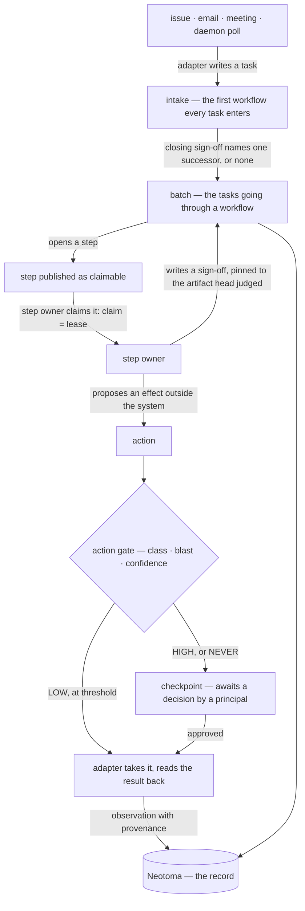

# Ateles

**The operating system for organizations where humans and AI agents jointly initiate, delegate, execute,
review, approve, and reconcile work — under explicit authority, with every action attributed,
capability-scoped, and queryable.**

That is the category Ateles is built toward. What ships today is its first proving ground: a
**single-operator reference implementation** — an AI agent swarm that runs a founder's company and personal
life end to end, with the governance substrate (identity, capability, gating, audit) already real. See
[Vision and execution status](#vision-and-execution-status) for exactly where the implementation stands
against the vision.

Ateles is a design and a working example of it. The design is
[`docs/foundation/`](docs/foundation/): twenty documents that state how work is created, taken,
executed, and approved, and what the swarm does when it cannot reach its own record. The example is what
runs against that design — background daemons and skills that already automate code review, releases,
issue triage, email, calendar, recurring payments (fiat + Bitcoin), meeting capture and recap, health
tracking, customer development, content and social, multi-jurisdiction tax prep, and CRM.

Everything is built around [Neotoma](https://github.com/markmhendrickson/neotoma) as the canonical memory
and state layer. Agents are Neotoma entities, act under signed identities, and are audited through the same
observations they write. Open source. Local-first. MIT licensed.

**Who it's for:** [docs/icp.md](docs/icp.md) · **The design of record:** [docs/foundation/](docs/foundation/)
· **Architecture:** [docs/architecture.md](docs/architecture.md) · **Taxonomy:** [docs/taxonomy.md](docs/taxonomy.md)
· **Implementation phases:** [docs/phases.md](docs/phases.md)

> **Not a package — a blueprint.** Ateles is a reference architecture you fork and adapt, not an installable
> product. Today it assumes one operator who owns the machine, the keypairs, and the Neotoma instance — the
> single-principal case of the multi-operator model described below. See
> [Who this is for](docs/icp.md) for the precise profile and the explicit anti-profile.

## What makes the fleet trustworthy

Most agent infrastructure argues trustworthiness from record-keeping: identities are signed, calls are
logged, state is centralized. Ateles keeps all of that, and it is not the argument. Logging an action does
not constrain it, and a record nobody must write is a record that goes missing exactly when it matters.

The argument is **bindingness**: for each rule, name the thing that fails when the rule is violated. If
nothing fails, it is reporting, not a control
([`principles.md`](docs/foundation/principles.md), invariant 1). Six properties carry the weight, and each
one is a mechanism something breaks against rather than a fact something writes down.

- **Nothing is delivered; work is claimed.** No router chooses who does what. An agent takes a task by
  claiming it, and the claim *is* the lease — one atomic primitive, read back after the write. Assignment
  narrows who is eligible to claim; it never installs a holder and never hands work to anyone. The reason
  is accountability, not taste: the actor that judges fit must be the actor that acts and answers for the
  outcome, and a router's wrong guess reaches an executor with nobody accountable for the choice
  ([`work_model.md`](docs/foundation/work_model.md)).
- **State is derived, not stored.** A step has no status row. Whether it is open, claimed, or signed is
  read from three edges — the batch, the lease, the sign-off — so it cannot go stale because the process
  that would have updated it died. The same rule governs liveness and lease expiry: the clock ends a lease,
  and the sweeper that would have done it is retired
  ([`principles.md`](docs/foundation/principles.md), invariant 11).
- **Only a sign-off closes a step, and no principal signs for another.** A required step stays open however
  long it has been open and however obvious its outcome looks. There is no waiver flag and no override
  boolean; the one close by someone other than the step owner is the operator's, and that close is itself a
  sign-off, attributed, carrying its reason, and visible as `waived`. **No step is closed by elapsed time** —
  a gate that expires into a pass fails open on a timer
  ([`gates_and_workflows.md`](docs/foundation/gates_and_workflows.md)).
- **Unknown is a third value, and it denies.** "We could not tell" and "we can tell and it is bad" are
  different claims. Every reader of gate, grant, or reachability state carries `Indeterminate`, and at a
  policy enforcement point `Indeterminate` resolves to deny — never to permit, never coerced to pending or
  clear ([`authority_model.md`](docs/foundation/authority_model.md)).
- **When the record is unreachable, the swarm stops.** Not degraded operation, not a hardcoded fallback.
  A swarm that acts while its record is unreachable produces work with no record, which across unattended
  daemons is unaccountable work — worse than the work not happening. The halt announces itself on a path
  that survives the outage, and observation, forensics, and alerting stay live throughout
  ([`failure_posture.md`](docs/foundation/failure_posture.md)).
- **External systems reach the work model only through adapters, and no external event advances a step.**
  The workflow engine reads the record and never calls GitHub, a mailbox, or a payment rail. An inbound
  event can become a sign-off by a named principal, an observation on an artifact, an action confirmation,
  or a new task for intake — and nothing else. An automated account's approval never stands in for a
  reviewing lens ([`adapters.md`](docs/foundation/adapters.md)).

Authority sits underneath all six: `principal + domain + scope + action + conditions + time`, structured,
scoped, delegable, revocable, and inspectable. Zero grants is deny; a grant declaring no such tool is deny
for that tool; a policy check that raises is deny. Every write carries the agent that made it and the
principal it acted for — a shared bearer that never identifies its caller is not attribution.

The design of record is [`docs/foundation/`](docs/foundation/); what a given checkout actually implements,
with its as-of date and instrument, is [`status.md`](docs/foundation/status.md); what a checkout would have
to pass, from zero, is [`conformance_suite.md`](docs/foundation/conformance_suite.md), the acceptance suite
designed before it is built. This README describes the
design. Where the two differ, `status.md` is the honest side.

## Vision and execution status

As AI makes execution abundant, the constraint stops being "can we produce the work?" and becomes **agency
fragmentation**: many humans and many agents can initiate and execute work, but authority, accountability,
approval, and reconciliation stay implicit — scattered across chat threads, managerial memory, and
convention. Generic agent orchestration coordinates *computation*. Ateles is built to coordinate
**legitimate action**: who or what may act, on whose authority, against which state, through which
workflow, with which approvals, and under whose accountability.

Two commitments define the direction:

- **Governed autonomy under distributed authority.** Authority is modeled as
  `principal + domain + scope + action + conditions + time` — structured, scoped, delegable, revocable, and
  inspectable. Reconciliation is a topology of domain owners, approvers, and quorums, not a single human
  bottleneck.
- **Governed initiative ("bounded open work").** Vague expectations like *act like an owner* become
  explicit, auditable rights — to propose, investigate, run experiments, execute in a sandbox, approve,
  veto, escalate, and receive attributable credit — with risk-tiered approval and explicit reprioritization
  when new work displaces old.

### Where execution stands

The phases below are a **roadmap over one design**, not five designs. The foundation is phase-agnostic:
each document states its part whole and marks undecided questions open. Which sections are built, which
are designed and unbuilt, and which are open is
[`status.md`](docs/foundation/status.md#roadmap-the-vision-phases-over-the-foundation), as of its date.

| Vision phase | What it means | Foundation sections | Status |
| --- | --- | --- | --- |
| **P1 — Governed execution for one principal** | Agent identity, agent-to-principal binding, capability grants, risk-gated actions with operator checkpoints, declared workflows, append-only audit | `principles` · `work_model` · `gates_and_workflows` · `failure_posture` · `authority_model` (tuple, grants, attribution) · `conformance` | ✅ **In daily use.** This is the current repo: one operator, the full governance substrate. Per-section build state is `status.md` |
| **P2 — Multi-operator identity & ownership** | Multiple human operators, teams, workflow ownership, named accountability, personal/shared queues, basic roles | `authority_model` (principals, tenant, ownership) | 🔜 Designed except the identity decision, which is **open** — which entity type is the human principal |
| **P3 — Delegation & approval** | Scoped delegation, approval matrices, escalation, veto, timeouts, substitution, operator absence, risk-tiered checkpoints across principals | `authority_model` (delegation, approval) | 🔜 Design stated; unbuilt |
| **P4 — Distributed authority & initiative** | Two kinds of mechanism, doing different work: rights that *scope* what a principal may do (domain ownership, budget/resource rights, cross-team workflows, first-class initiative + proposal + reprioritization objects), and structural checks on how those rights get *exercised* (quorum, separation of duties) — which make an outcome depend on more than one interest rather than on one principal's judgement | `authority_model` (structural checks, initiative objects) | 🔭 Object set decided; eight questions open, awaiting the operator |
| **P5 — Organizational operating system** | Strategy/rubric ownership, authority graph, workflow contracts, governance analytics, enterprise audit | none yet | 🔭 Vision; no design until P4 is designed |

> These vision stages (P1–P5) are a different axis from the Phase 0–9 implementation checklist in
> [docs/phases.md](docs/phases.md): P1–P5 describe how far the product's governance model reaches;
> Phase 0–9 tracks implementation sequencing. An implementation item cites the foundation section it
> implements, never a vision phase.

Scoping and structural checks are complementary, not interchangeable. A well-specified grant bounds what a
principal may do; it says nothing about a principal exercising authority they legitimately hold in a
motivated way — which is the failure most organizational governance exists to catch. Quorum and separation
of duties are what address that, structurally, by refusing to let one interest decide alone.

The substrate was deliberately built so the single-operator case is not a dead end: agents already carry
their own verified identities, capability is already entity-scoped rather than assumed, and high-blast
actions already checkpoint to a principal. Multi-operator is an extension of the entity model (more
principals, ownership, delegation edges), not a rewrite.
[Neotoma](https://github.com/markmhendrickson/neotoma) evolves in lock-step as the shared, governed state
substrate the swarm acts against.

## Why this exists

You run AI agents across tools and tasks. Without a swarm infrastructure layer, *you* become the swarm:

- Every agent operates from zero context — nothing it learns is shared across agents or sessions.
- Identities collapse — a code-writing agent acts as you on GitHub, with no audit trail tying the signed
  subject to the action.
- Decisions execute without a reproducible trail — you can't trace why an agent did something or whether it
  stayed in scope.
- Coordination is ad-hoc — starting a multi-agent workflow means manually opening chats and hoping they
  don't conflict.

These are not hypothetical. They are what happens when one operator runs more than three agents in parallel
across more than two products. You compensate with bespoke scripts, redundant prompts, and manual sync.
Ateles removes that tax.

## What the swarm actually does

The largest part of this repo is not abstract — it is concrete automation the operator uses every day. The
fleet spans the operator's whole surface area, company and life alike:

| Domain | What it covers | Daemons / skills |
| --- | --- | --- |
| **Software delivery** | Implement issues, review and steward PRs, QA, cut releases, triage issues/PRs off GitHub webhooks | `cicada`, `vanellus`, `lanius`, `phoenicurus`, `struthio` skills; `formica`, `neotoma-agent`, `phoenicurus-release` daemons; `loxia` PR-review GHA |
| **Email** | Triage inbox, draft replies, route operator replies back to run threads, daily digests | `turdus`, `riparia` daemons; `email-triage`, `email-triage-auto` skills |
| **Calendar & scheduling** | 05:00 meeting-prep briefings, recurring-task ↔ calendar sync, slot-finding | `cotinga`, `sylvia` daemons; `remember-calendar`, `find-technician-slot` skills |
| **Payments & finance** | Calendar-triggered recurring payments in fiat (Wise) and Bitcoin, portfolio/liquidity analysis, expense capture | `monedula` daemon; `fringilla`, `run-scorecard`, `extract-amazon-order`, `quarterly-portfolio-review` skills |
| **Meetings** | Toggle recording, transcribe (with consent tracking), extract decisions/action items, draft recaps | `strix`, `tyto`, `piculet` daemons; `record_meeting`, `analyze-meeting`, `import-audio` skills |
| **Health & fitness** | Log workouts, analyze progression, nudge on inactivity | `gorilla` daemon; `gorilla`, `scrape-chatgpt-workout` skills |
| **Content & GTM** | Long-form and build-in-public writing, platform-adapted social, marketing/positioning, brand & UX | `corvus`, `write`, `write-blog-post`, `social`, `ciconia`, `manucode`, `aythya`, `accipiter` skills |
| **Customer development** | ICP synthesis, feedback analysis, interview scheduling, contact intake | `hirundo`, `analyze-neotoma-feedback`, `process-feedback`, `interview-admin`, `intake-relationship` skills |
| **Relationships / CRM** | Lifecycle management of investors, advisors, partners, customers | `sturnus` agent (CRM in Neotoma) |
| **Tax & legal** | Multi-jurisdiction tax prep, contract/GDPR/IP review | `picus`, `buteo` skills |
| **Operator briefing** | 05:30 digest in the operator's voice | `morning-brief`, `aquila` daemons |
| **Mirror & sync** | Neotoma → git mirror of agent definitions, env/secret sync | `apus` daemon; `sync-env-from-1password`, `deploy-website` skills |

Every one of these produces **tasks**, which enter intake and are executed through a declared workflow, and
**actions** — a send, a publish, a merge, a payment, a release — each of which passes the action gate on its
own. A blog post and a code merge are gated by the same mechanism; non-code work is not a second system.

## How work moves

Four concepts carry the whole model. Definitions are [`vocabulary.md`](docs/foundation/vocabulary.md); how
each is recorded is [`data_model.md`](docs/foundation/data_model.md).

- A **task** is the atomic unit of accountable work. It carries a status and edges, and nothing else — no
  claimant field, no liveness flag, no lifecycle.
- A **batch** is one or more tasks going through a workflow together, and the record of that. A single task
  is a batch of one. Batches chain along `FOLLOWS`, and a task's history is read back along that chain.
- A **step** is one declared position in a workflow, with an owner *role* the roster resolves at claim time.
  It has no entity of its own; its state is derived.
- A **sign-off** is what a step owner writes to close a step: a verdict, the findings behind it, the pinned
  artifact heads it judged, and the agent definition version it was made under.


```mermaid
graph TB
  Source["issue · email · meeting · daemon poll"] -->|adapter writes a task| Intake
  Intake["intake — the first workflow every task enters"] -->|closing sign-off names one successor, or none| Batch
  Batch["batch — the tasks going through a workflow"] -->|opens a step| Claimable["step published as claimable"]
  Claimable -->|step owner claims it: claim = lease| Owner["step owner"]
  Owner -->|writes a sign-off, pinned to the artifact head judged| Batch
  Owner -->|proposes an effect outside the system| Action["action"]
  Action --> Gate{"action gate — class · blast · confidence"}
  Gate -->|LOW, at threshold| Adapter["adapter takes it, reads the result back"]
  Gate -->|HIGH, or NEVER| Checkpoint["checkpoint — awaits a decision by a principal"]
  Checkpoint -->|approved| Adapter
  Adapter -->|observation with provenance| Record[("Neotoma — the record")]
  Batch --> Record
```

Read the diagram for what is *absent*: no arrow delivers work to an agent, and no coordinator marks a step
complete. A step opens, and its owner claims it. The step owner's own sign-off closes it.

**The action gate.** Every action carries a class; the class resolves to a blast tier under the
`action_policy` at the moment the action would be taken. `LOW` is taken at or above the confidence
threshold. `HIGH` is checkpointed until a recurring series of that class graduates it. `NEVER` —
`operator_only` — is cleared by no confidence and no recurrence, and short-circuits ahead of both axes, so
a policy cannot demote it. A declared class in neither set logs a warning and resolves to `NEVER`, never to
the policy default. An unreachable policy source is a halt, not an empty low-blast set.

⚠️ **In flight:** the gate decides on confidence *and* blast by design, but the confidence input is not
produced by the proposing agents, which degrades the gate to blast alone. The foundation records this as a
gap in the agents rather than a design change, and what an absent confidence score should do — the
`Indeterminate` treatment every other reader carries — is not yet settled
([`gates_and_workflows.md`](docs/foundation/gates_and_workflows.md), C11).

## Entities, not files

Everything Ateles knows about itself lives in Neotoma. The filesystem is a generated mirror — useful for IDE
tooling and for daemons that need code on disk, but never the source of truth.

| Concept | Authoritative side | Mirror |
| --- | --- | --- |
| Agent prompt | `agent_definition.prompt_markdown` | `.claude/skills/<agent>/SKILL.md`, `docs/agents/<agent>.md` |
| Agent capability | `agent_grant` | none — read at the enforcement point on every check |
| Workflow steps | the `workflow` entity for (project, type) | `docs/foundation/workflows.md` tables, via `render_workflow_docs.py --check` |
| Step closure | `sign_off` | none |
| Step state | derived from batch + lease + sign-off | none — never stored |
| Operating rules | `agent_policy` | rendered skills and `docs/agents/` |
| Entity types and edges | the schema registry on the record | `docs/foundation/data_model.md` tables, via `render_data_model.py --check` |
| A plan's statement and decisions | the planning record and the `decision` entities `PART_OF` it, written by the `planning` workflow ([`planning_model.md`](docs/foundation/planning_model.md)) | any document rendered from the statement; a plan's progress is never stored |

The full entity and relationship tables — `task`, `batch`, `LEASE`, `sign_off`, `action`, `checkpoint`,
`artifact`, `workflow`, `action_policy`, `agent_session`, the authority entities, and the `ADDRESSED_BY` /
`FOLLOWS` / `CLOSES` / `PRODUCES` / `CHECKPOINTS` edges — are in
[`data_model.md`](docs/foundation/data_model.md#concepts), which is a render target of the schema registry.
They are not restated here: one rule, one home
([`principles.md`](docs/foundation/principles.md), invariant 9).

**What this means in practice:**

- **Behaviour changes are corrections, not commits.** Updating an agent's prompt is a `correct()` on its
  `agent_definition`, with an idempotency key naming the intent, a re-read-and-merge before the write, and a
  read-back after it — a response code is not evidence
  ([`principles.md`](docs/foundation/principles.md), invariant 2).
- **Capability changes are entities, not configs.** Granting an agent access to a new repo is a `correct()`
  on the `agent_grant`. How fast that takes effect is a property of the reader, not of the record: grants
  are read at every check, or from a cache whose staleness bound is declared and whose expiry resolves to
  `Indeterminate` — which denies. A checker that loads grants once at startup enforces a snapshot, and the
  failure is silent ([`authority_model.md`](docs/foundation/authority_model.md)). Rotation is staged, never
  a flag day: the new credential is admitted alongside the old before the agent presents it, so at no
  moment is the set of matching grants empty.
- **Editing a mirror is drafting, and the draft must be merged upward.** A mirror edited in place can carry
  material the canonical side never received, and regenerating over it destroys work rather than fixing a
  defect. The sequence is **merge upward, then render downward**. A `--check` failure says only that the two
  sides differ — it does not say which one is ahead, so read both before regenerating
  ([`conformance.md`](docs/foundation/conformance.md)).
- **History is a query, not a grep.** An entity's history is read from its observations: every write is
  append-only, with a timestamp and provenance, and there is no parallel log, transition event, or
  assignment record. A task's chain is read along `FOLLOWS` from its live batch back to intake.

## Reconstructing what happened

Because step state is derived rather than stored, the record does not hold a per-step status history to read
back. What it holds is stronger in one respect and narrower in another, and the difference is worth being
precise about.

**What reconstructs:** a batch's sign-offs, each carrying its verdict, its findings, the agent and the
`agent_definition` version behind it, and the artifact heads it judged; the `FOLLOWS` chain back to intake;
every entity's own observations, with provenance; the checkpoints raised, whom they awaited, and who
resolved them. Together those answer what was decided, by whom, against which version of the artifact, and
on whose authority.

**What does not, yet:** there is no audit read model indexed by agent and time window, so "what did this
agent do last Tuesday, across everything" is not a read the design defines. Per-entity history is designed;
per-agent-per-window is not. Note also that `replay` names something this design deliberately **refuses** —
re-executing pre-interrupt code repeats every outbound effect that already ran, which with consent-gated
sends and payments is a repeat send. A lapsed task is re-claimed and its verdict re-derived, never replayed
([`failure_posture.md`](docs/foundation/failure_posture.md)).

⚠️ **In flight:** input attribution. The record carries who acted and what they produced, but not yet the
full set of entities each agent read before deciding. The foundation names input attribution as part of the
record; closing that loop enables reverse impact analysis and precedent graphs.

## Agent taxonomy

Four tiers, named after bird and animal genera. Agent definitions live in Neotoma; the generated table in
[docs/taxonomy.md](docs/taxonomy.md) is the canonical list, and counts there carry their own as-of date.

| Tier | Role | Examples |
| --- | --- | --- |
| **T1** | Hosts (a process that owns a channel) | OpenClaw / Claude Code (terminal), launchd (daemon scheduling), aiohttp Telegram Bot API |
| **T2** | Resident agents (always-on, conversational) | Ateles (primary operator interface), Menura (public-facing representative) |
| **T3** | Daemons (event-driven or scheduled, persona-light) | Anthus · Apis · Apus · Aquila · Cotinga · Formica · Monedula · Sturnus · Sylvia · Turdus · Tyto · neotoma-agent · … |
| **T4** | Invocable agents (stateless, one per task) | Cicada · Vanellus · Pavo · Waxwing · Phoenicurus · Fringilla · Gorilla · Picus · Corvus · Hirundo · … |

In the work model, the daemons that touch an external system are **adapters**: they self-trigger, receive no
task, and translate in both directions — inbound events into signals about artifacts, outbound actions into
operations on that system. An adapter never reads a workflow, and never writes step state in any form
([`adapters.md`](docs/foundation/adapters.md)).

Full agent table with tiers, genera, and status: [docs/taxonomy.md](docs/taxonomy.md) and
[docs/agents/](docs/agents/).

## Daemons

Daemons live under `execution/daemons/`. They split into **event-driven** (subscribe to the Neotoma SSE
stream or an HTTP webhook) and **scheduled** (launchd calendar interval or a poll timer). Per-daemon build
state, and where the adapter and the engine are still one process, is
[`status.md`](docs/foundation/status.md).

| Daemon | Role | Trigger |
| --- | --- | --- |
| **anthus** | Swarm coordination — opens steps from the `workflow` entity, reads sign-offs | SSE (task / issue / PR / checkpoint) |
| **apis** | Task routing, readiness, the action gate, A2A + GitHub gateway | SSE + HTTP |
| **apus** | Neotoma → git mirror webhook receiver (HMAC-verified) | HTTP |
| **aquila** | Monthly cofounder/strategy report | launchd (monthly) |
| **cotinga** | 05:00 meeting-prep briefings (calendar + contacts + research) | launchd (daily) |
| **formica** | GitHub issue/PR intake for the ateles repo | SSE |
| **gorilla** | Weekly fitness summaries + inactivity nudges | poll |
| **monedula** | Daily recurring payments (Wise + Bitcoin), each an action through the gate | launchd (daily) |
| **morning-brief** | 05:30 operator digest in Ateles voice | launchd (daily) |
| **neotoma-agent** | neotoma-repo automation + task due-date hygiene | SSE |
| **phoenicurus-release** | Mon–Thu release-candidate preparation | launchd (weekdays) |
| **piculet** | Voice Memos + meeting-recording import & transcription | poll |
| **riparia** | Email reply router (operator replies → run threads) | poll |
| **strix** | macOS menu-bar recording toggle | click handler |
| **sylvia** | Recurring-task lifecycle + calendar sync | launchd (daily) |
| **turdus** | Email intake → `email_message` entities + tasks | poll |
| **tyto** | Screenshot watcher + recording transcription (consent-stamped) | poll |

Scheduling is `launchd` on macOS (plist templates in-repo for several daemons) or `docker-compose` on a
small cloud host — see [deploy/cloud/](deploy/cloud/) and [docs/cloud_hosting.md](docs/cloud_hosting.md).

## Runtime substrate

The shared library under `lib/daemon_runtime/` is the engineered core. Pure decision logic is kept separate
from I/O, so a policy decision can be tested without a network.

| Module | What it implements |
| --- | --- |
| `aauth_httpsig.py` / `aauth_signer.py` / `neotoma_signed.py` | RFC 9421 ECDSA P-256 HTTP message signing; per-agent keypair loading (JWK/PEM); signed Neotoma requests |
| `grant_checker.py` | Loads `agent_grant`, normalizes capabilities, enforces tool allowlists + parameter constraints (table allowlists, `max_amount_sats`, etc.) |
| `gating.py` | The action gate: blast tier under the policy, checkpoint on hold |
| `readiness.py` | Task readiness scoring before a claim; holds under-specified tasks and asks the operator for the missing pieces |
| `task_lifecycle.py` | Task status handling and retry policy |
| `generalizer.py` / `drift.py` | Cluster drift evidence into agent-local `agent_policy` entities; contradiction handling |
| `sse_client.py` | Async Neotoma SSE subscription with exponential-backoff reconnect |
| `session_finalize.py` / `run_email.py` | End-of-run capture (conversation + turns); deterministic email threading for run conversations |
| `notify/notifier.py` | Apprise-backed priority routing (Telegram + email), silence windows, digest collapse |
| `checkout_drift.py` | Reports whether a daemon's checkout diverged from upstream — **reporting, not enforcement**, and named as such in `principles.md` invariant 10 |

MCP servers live under `execution/mcp/`: **`github_harness`** (signed GitHub operations, per-repo PAT
loading, observation recording) and **`mcp_tool_grant_proxy`** (an enforcement point that checks
`agent_grant` on every `tools/call` and records an observation).

Module-by-module build state, and which paths still fail open, is
[`status.md`](docs/foundation/status.md). A count of test files is not evidence that the substrate is
correct — the design's evidence standard is the recorded revert result: revert the fix, confirm the test
goes red, and say in the PR what red looked like
([`principles.md`](docs/foundation/principles.md), invariant 4).

## Skills

`.claude/skills/` holds two kinds of skill:

- **Agent-persona mirrors** generated from Neotoma `agent_definition` entities (do not edit in place —
  corrections go through Neotoma, and an in-place edit is a draft that must be merged upward before the next
  render). These are how a harness loads an agent's prompt.
- **Hand-authored skills** the operator invokes directly — engineering workflow (`commit`, `push`, `pull`,
  `debug`, `fix-feature-bug`, `create-release`, `final-review`), personal ops (`record_meeting`,
  `email-triage`, `find-technician-slot`, `run-scorecard`, `language`, `scrape-chatgpt-workout`), content
  (`write`, `write-blog-post`, `social`, `deploy-website`), and Neotoma/meta (`update-plan`, `update-tasks`,
  `store-neotoma`, `intake`, `learn`).

## Quick start

Ateles is a reference architecture, not an installable package. The fastest way to evaluate whether to adopt
the pattern is to read the design of record, then inspect a working daemon and the runtime substrate.

```bash
git clone https://github.com/markmhendrickson/ateles.git
cd ateles
less docs/foundation/principles.md              # the invariants, and what makes each one bind
less docs/foundation/work_model.md              # pull-only delivery, claim = lease, batches
less docs/foundation/gates_and_workflows.md     # steps, sign-offs, the action gate, the checkpoint
less execution/daemons/apus/apus.py             # an event-driven daemon
less lib/daemon_runtime/gating.py               # the action gate
```

Operating a daemon locally requires Neotoma reachable (see
[neotoma installation](https://github.com/markmhendrickson/neotoma#quick-start)), AAuth keypairs (or the
documented operator-token fallback), and `agent_grant` entities for each daemon. The full setup walkthrough
lives in [docs/setup.md](docs/setup.md).

### Roadmap that shapes adoption

- **Installability.** Adopt-by-forking works today; install-by-package does not yet exist — identity
  provisioning UX, an operator config schema, keypair-format unification, plist generation, and a
  multi-operator path are the gating work. Tracked on the
  [issues board](https://github.com/markmhendrickson/ateles/issues).
- **Input attribution.** Recording which entities each agent read before deciding, so impact can be traced
  backward as well as forward.

## Example: an issue traced through the entity layer

The CLI invocation is one step among many; the rest happens in Neotoma. Walkthroughs of the model in full
are [`scenarios.md`](docs/foundation/scenarios.md).

1. **The operator files an issue.** GitHub holds it; the record does not yet know about it.
2. **The GitHub adapter reads the webhook event.** A new-record event on a record the swarm does not track
   yields **a task for intake**, with the issue attached as an **artifact** — identified by its `system` and
   `external_id`. The adapter writes an observation carrying its own provenance and the delivery id, so a
   redelivery lands once. It does not read a workflow, and it does not open a step.
3. **The task enters intake**, its first workflow: `classify`, `link`, `dedupe`, `prioritize`, `route`.
   Intake's closing sign-off names exactly one successor workflow, or none, or operator-only.
4. **A batch opens** for the task in the successor workflow, carrying a `FOLLOWS` edge back to the intake
   batch. Its first step opens — which is publication of claimable step work, not delivery to anyone.
5. **The step owner claims it.** The role declared on the step resolves through the roster to a principal at
   claim time; that principal takes the lease. Two claimants cannot both hold it, and the holder is read
   back from the persisted lease rather than assumed from the write.
6. **The runner starts** with the agent's prompt loaded from its `agent_definition` mirror. The agent reads
   only the context entity types its own definition names — a grant that would admit more is not permission
   to read more.
7. **The agent does the work**, writing entities attributed to its own signed identity, each an append-only
   observation with provenance.
8. **The step owner writes a sign-off**, closing the step: a verdict, the findings behind it, and the
   artifact heads as observed at the moment the verdict was made. A blocking finding cites an executed
   command and its output; reasoning that ran no check is filed non-blocking, saying so.
9. **The batch advances.** The next step opens and is claimed by its own step owner. If a sign-off is
   blocking, the step's `on_fail` names the earlier step that opens again — from the artifact's recorded
   head, not the previous round's branch point.
10. **Effects outside the system are actions.** Opening the PR, merging it, cutting the release — each is an
    `action` with its own class, gated on its own at the moment it would be taken, and taken by the adapter,
    which reads the external system back to confirm the effect landed.

Everything after step 1 is driven by the record. If Neotoma cannot be reached at step 5, no step is claimed
and no work is done — the halt announces itself off-record, and the work resumes when the record returns.

## Structure

The filesystem is the runtime substrate that supports the entity layer — the mirror, not the source.

```
ateles/
├── .claude/
│   ├── skills/             # agent-definition mirrors + hand-authored operator/dev skills
│   └── hooks/              # session-integrity hooks (session_start, user_prompt_submit, stop_finalizer)
├── docs/
│   ├── foundation/         # the design of record: principles, work model, gates, failure, authority, …
│   └── agents/             # canonical harness-neutral agent_definition mirrors
├── execution/
│   ├── daemons/            # T3 daemon implementations (see Daemons table)
│   ├── mcp/                # github_harness MCP + mcp_tool_grant_proxy
│   ├── scripts/            # domain scripts, foundation checks (anchors, vocabulary), renderers
│   └── lib/telegram/       # Telegram send helpers
├── lib/
│   ├── daemon_runtime/     # signer, SSE client, grant checker, gating, readiness, lifecycle, …
│   ├── notify/             # Apprise-backed priority notification routing
│   ├── activity/           # observation/activity helpers
│   └── issue_labels.py     # frozen GitHub label enums shared by daemons + GHA
├── scripts/                # linters, git hooks, setup, secrets tooling
├── deploy/cloud/           # Docker + docker-compose + bootstrap for a cloud host (SOPS+age, Tailscale)
└── .github/workflows/      # CI: secret/PII scan, Loxia PR review, Lanius stale-issue sweep
```

## What the design commits to 🔒

The table compares **designs**, not checkouts: it says what each approach makes binding. Whether a given
mechanism fires on a given checkout, and where any of them still fail open, is
[`status.md`](docs/foundation/status.md), per row, with its as-of date.

Read the third column as three values, not two. `unknown` is a real outcome that the design gives a defined
behaviour — it denies, holds, or halts — and the rows say which.

| Property | Without swarm infra | Ad-hoc agents | Ateles design |
| --- | --- | --- | --- |
| 🪪 Agent identity verifiable | ❌ | ⚠️ partial (PAT only) | ✅ per-agent signature on every write; unknown identity denies |
| 🔍 Attribution names the principal, not just the credential | ❌ | ❌ | ✅ the agent that wrote and the principal it acted for; a shared bearer is not attribution |
| 🚧 Capability scope enforced | ❌ | ⚠️ via PAT scopes only | ✅ `agent_grant` read at the enforcement point; zero grants denies; unreachable policy source denies |
| 📋 Per-action history | ❌ | ⚠️ git commits only | ✅ append-only observations with provenance; no parallel log |
| 🚦 Outbound effects gated | ❌ | ❌ | ✅ action gate per action, at the moment it would be taken; `operator_only` is never auto-cleared |
| 🔄 Step and workflow sequencing | ⚠️ manual | ⚠️ manual | ✅ `workflow` steps + `successors` / `FOLLOWS`; one engine, sequencing from the entities |
| ✍️ Step closure | ⚠️ convention | ⚠️ convention | ✅ only a sign-off closes a step; no principal signs for another; no step closes on a timer |
| ⏪ Reconstructable step history | ❌ | ❌ | ✅ sign-offs + the batch `FOLLOWS` chain (per-agent-per-window audit: not designed) |
| 📜 Agent definitions versioned | ❌ | ⚠️ git history | ✅ Neotoma observation history; a sign-off pins the version it was made under |
| 🛑 Behaviour when the record is unreachable | ⚠️ undefined | ⚠️ undefined | ✅ halt: no claim, no step opens, nothing claimed complete; announced off-record |
| 🧠 Inputs to a decision recorded | ❌ | ❌ | ⚠️ in flight (input attribution) |
| 🎚️ Confidence axis on the gate | ❌ | ❌ | ⚠️ in flight (designed; the input is not produced — C11) |

Two rows rest on questions the foundation marks **open**, and the README does not assert past them: which
readers, if any, may fail open when a policy source is unreachable, and what the gate does when a
confidence score is absent. Both are named in the foundation as open rather than settled.

## Interfaces

The swarm exposes operational surfaces that all converge on Neotoma as the record.

| Interface | Description |
| --- | --- |
| **Telegram (Ateles)** | The operator's decision surface. Checkpoints awaiting the operator are presented here; the operator replies inline. |
| **Email (swarm mailbox)** | Run-thread transport: Apis emails run kickoff/outcome; Riparia routes operator replies back into the run conversation. |
| **`claude --print`** | The runner surface. Each invocation loads the agent's prompt with `--append-system-prompt "$(cat SKILL.md)"`. |
| **github_harness MCP** | Every code-touching agent's call surface — signed, capability-scoped, observation-recorded. |
| **Neotoma SSE** | The substrate. Daemons subscribe by entity type; nothing an SSE event carries advances a step by itself — it wakes an agent, and the agent claims. |

## Current status

**Phase:** P1 of the [vision roadmap](#vision-and-execution-status) — a single-principal reference
architecture in daily autonomous and operator-driven use. **Operator:** one. **License:** MIT.

Measured build state — which mechanisms exist, which fail open, which are unbuilt, each with its as-of date
and instrument — is [`status.md`](docs/foundation/status.md). It is regenerated rather than maintained, and
it is the authoritative side for implementation state; this README states design.

**What is designed and in daily use:**

- The **runtime substrate** — signing, grant checking with parameter constraints, the action gate, readiness
  scoring, task handling, drift-driven generalization, SSE subscription, notification routing.
- **Enforcement at the MCP boundary** — the grant proxy checks out-of-scope tool calls before any effect and
  records an observation; the session-integrity check rides the same enforcement point.
- **The foundation binding** — review lenses read the kernel documents on every change; anchors and
  vocabulary are checked mechanically; every issue and PR states the foundation section it conforms to.
- **Session-integrity hooks** — `.claude/hooks/` check plan binding and turn storage at Stop (WARN by
  default, BLOCK behind a flag).
- **Operational tooling** — linters, git hooks, GitHub Actions (secret/PII scan, Loxia PR review, Lanius
  stale-issue sweep), and a SOPS+age cloud-deploy path.

**Known gaps between the design and what fires**, each recorded in `status.md` with where the gap lives:
the confidence input the gate is designed around; adapters and the workflow engine still sharing a process
in places; no mechanism ages an open step, so a stalled step is invisible rather than mis-resolved; and the
renames of the current design not yet reflected in the checkout's field names.

**What is not guaranteed yet:**

- A stable `workflow` schema across versions.
- Consolidated schemas (feedback / UI / release types still overlap).
- Backward compatibility — corrections may invalidate prior sign-offs.
- A packaged install path (adopt-by-forking only).

## Security defaults

Ateles is single-operator infrastructure. Defaults assume the operator owns the machine, the keypairs, and
the Neotoma instance.

- **Authentication:** AAuth keypairs per agent, signed requests verified against published JWKS. An operator
  token is the documented fallback for daemons without their own minted key — with two rules that always
  apply: a credential read from a file is returned as a value and never written into the process
  environment (an environment is inherited by every child process), and it is resolved once per invocation
  and reused across that invocation's retries. The fallback also collapses per-agent attribution, which is
  its real cost.
- **Custody follows revocability.** A credential that *is* the asset — a wallet seed, a signing key whose
  compromise cannot be undone by withdrawing it — is never materialized into a resident process; it is
  loaded inside the short-lived subprocess that takes the one action, which ends with the action. A
  revocable credential may be materialized, because recovery from its exposure exists.
- **Authorization:** `agent_grant` is read at the enforcement point on every check. Zero grants denies; a
  grant declaring no such tool denies for that tool; a check that raises denies. Revocation reaches every
  grant that matched the credential — which is why credentials stay narrow.
- **Sensitive material:** GitHub PATs live in `.env` only, loaded per-repo by the harness PAT loader. Agents
  never see PATs. Operator secrets ride a SOPS+age snapshot decrypted offline (never committed to this
  public repo).
- **Audit:** every harness and proxy call writes an observation carrying its provenance — the author, and
  for an adapter the external system and the delivery id. Provenance is what makes the observation
  auditable; the write alone is not.
- **Public-repo hygiene:** a structural PII gitleaks config + a `check_hardcoded_config` linter keep prompts
  PII-free and operator config env/Neotoma-sourced, so any operator can fork.
- **Tunnel:** the Apus webhook receiver listens on localhost only; a Cloudflare tunnel surfaces it to
  Neotoma's prod webhook deliveries.

See [docs/secrets_management.md](docs/secrets_management.md) and [docs/aauth.md](docs/aauth.md).

## Development

Daemons operate from disk under launchd (or Docker); the IDE reads SKILL.md mirrors from disk. Both are
runtime conveniences. The only artifact that defines swarm behaviour is an entity in Neotoma.

**Daemon iteration:**

```bash
# venv at .venv/ with httpx, apprise, cryptography, PyJWT, etc.
.venv/bin/python3 execution/daemons/anthus/anthus.py    # foreground test
launchctl unload ~/Library/LaunchAgents/com.ateles.anthus.plist
launchctl load   ~/Library/LaunchAgents/com.ateles.anthus.plist
tail -f /tmp/com.ateles.anthus.err.log
```

**Updating an agent's prompt (the canonical path):**

```bash
# .claude/skills/<agent>/SKILL.md is a mirror. Editing it in place is drafting:
# merge the draft upward as a correction first, then let the render happen.
neotoma correct --entity-id ent_… --field prompt_markdown --value "$(cat new_prompt.md)"
# Read the field back — a success response is not evidence the write landed.
# The Apus webhook fires; SKILL.md regenerates from the canonical entity.
```

**Updating an agent's capability scope:**

```bash
# agent_grant is also an entity. Add a repo to an agent's harness:write scope:
neotoma correct --entity-id <grant-id> --field repos --append neotoma-docs
# When this takes effect depends on the reader: at the next check if grants are
# read per check, or after the declared staleness bound if they are cached.
```

**Running the checks:**

```bash
scripts/lint.sh                                          # ruff, yamllint, shellcheck + custom linters
python3 execution/scripts/check_foundation_anchors.py    # foundation links resolve
python3 execution/scripts/check_foundation_vocabulary.py # foundation prose against the banned words
```

**Prerequisites:** Python 3.13+ (`.venv/`), Node v22+ via NVM (for the `claude` CLI), a reachable Neotoma
instance, the `op` CLI for `.env` loading, and the `gh` and `gws` CLIs.

## Using with AI tools

Ateles operates through the `claude` CLI and MCP servers. The MCP layer connects each agent to the Neotoma
record and the GitHub harness.

| Tool | How Ateles uses it |
| --- | --- |
| **Claude Code** | Operator-driven sessions. Skills under `.claude/skills/` load an agent's prompt. |
| **`claude --print`** | The headless runner. `--append-system-prompt` loads the agent's SKILL.md. |
| **mcpsrv_neotoma** | Every agent reads and writes the record via this MCP. Schema-aware tool surface. |
| **github_harness MCP** | Signed GitHub operations — issues, PRs, comments, branches, commits, reviews — all observation-recorded. |
| **typefully MCP** | Corvus's social-post scheduling surface. |
| **parquet MCP** | Bulk-data query surface for finance, transcription, and messaging parquet stores. |

**Runner output contract:** an agent emits a single bracketed artifact-header line as its final response
(`[<agent>] <artifact_kind>: <body>` or `BLOCKED — <reason>`). That header is how a runner reports its
result — it does not close anything. **The step owner's own sign-off closes the step**, written to the
record; no principal writes another's sign-off, and a verdict that reached only the code host is an
observation on the artifact, never a sign-off. See
[docs/archive/swarm_orchestration.md](docs/archive/swarm_orchestration.md) for the full header contract
(archived; the step and gate model is
[docs/foundation/gates_and_workflows.md](docs/foundation/gates_and_workflows.md)).

## Common questions

**Why a reference architecture instead of a packaged framework?**
A single-operator agent swarm is too tightly coupled to the operator's tooling, repos, identities, and
grants to package generically. Ateles is the design and a working example — fork it, adapt the daemons to
your infrastructure, keep the contract: signed identity, observations with provenance, workflows and steps
as data, and only a sign-off closing a step.

**How does this compare to LangGraph / CrewAI / AutoGen?**
Those frameworks orchestrate multi-step LLM calls inside one process — they coordinate *computation*.
Ateles coordinates long-running background daemons and per-task runners, each with its own signed identity,
writing to a canonical record — and is built toward coordinating *legitimate action*: authority, approval,
accountability, and reconciliation across humans and agents. Different problem — governed fleets across
days, not chains across seconds.

**Why launchd instead of Docker / k8s?**
Single operator, one machine. launchd is the lowest-overhead scheduler that survives reboots. The same
daemons also operate under `docker-compose` on a cloud host; they don't care about the scheduler.

**Is this production-ready?**
The substrate routes, scopes, and gates low-blast work unattended; high-blast actions are held as
checkpoints awaiting the operator's decision. A checkpoint ends in a terminal approval — silence never
accepts, a deferral is bounded, and a timeout is terminal rather than a quiet continuation. Full autonomous
step sequencing is still in validation, and many T4 agents are not yet active. Current build state, and the
open questions around the surrounding safety model, are
[`status.md`](docs/foundation/status.md).

**What if I want to add a new agent?**
Create an `agent_definition` entity in Neotoma. Mint an AAuth keypair. Create an `agent_grant` with the
capabilities it needs. Apus mirrors the SKILL.md to disk. Declare its role as a step owner on the workflows
it serves — `owner_role` names a role, not an agent, so the roster resolves it at claim time. The step and
gate model is in [docs/foundation/gates_and_workflows.md](docs/foundation/gates_and_workflows.md).

## Related posts

- [Your agent fleet now signs its writes](https://markmhendrickson.com/posts/your-agent-fleet-now-signs-its-writes)
- [Your agent's memory is a markdown file](https://markmhendrickson.com/posts/your-agents-memory-is-a-markdown-file)
- [Building a truth layer for persistent agent memory](https://markmhendrickson.com/posts/truth-layer-agent-memory)
- [Agent command centers need one source of truth](https://markmhendrickson.com/posts/agent-command-centers-source-of-truth)
- [Six agentic trends I'm betting on](https://markmhendrickson.com/posts/six-agentic-trends-betting-on)

## Documentation

Full documentation lives in `docs/` — index at [docs/README.md](docs/README.md). Start here:

**The design of record:** [Foundation](docs/foundation/) —
[Principles](docs/foundation/principles.md) · [Work model](docs/foundation/work_model.md) ·
[Gates and workflows](docs/foundation/gates_and_workflows.md) ·
[Failure posture](docs/foundation/failure_posture.md) ·
[Authority model](docs/foundation/authority_model.md) · [Data model](docs/foundation/data_model.md) ·
[Vocabulary](docs/foundation/vocabulary.md) · [Adapters](docs/foundation/adapters.md) ·
[GitHub](docs/foundation/github.md) · [Gmail](docs/foundation/gmail.md) ·
[Calendar](docs/foundation/calendar.md) · [Telegram](docs/foundation/telegram.md) ·
[Payments](docs/foundation/payments.md) · [Conformance](docs/foundation/conformance.md) ·
[Scenarios](docs/foundation/scenarios.md) · [Workflows](docs/foundation/workflows.md) ·
[Migration](docs/foundation/migration.md) · [Status](docs/foundation/status.md)

**Orientation:** [Who it's for (ICP)](docs/icp.md) · [Architecture](docs/architecture.md) ·
[Taxonomy](docs/taxonomy.md) · [Phases](docs/phases.md) ·
[Neotoma vs. alternatives](docs/neotoma_vs_alternatives.md)

**Operating:** [Agent execution runbook](docs/agent_execution_runbook.md) · [Setup](docs/setup.md) ·
[Smoke-test plan](docs/swarm_smoke_test_plan.md)

**Reference:** [Data types](docs/data_types.md) · [AAuth](docs/aauth.md) ·
[Secrets management](docs/secrets_management.md) · [PR review routing](docs/pr_review_routing.md) ·
[Session integrity](docs/session_integrity.md)

**Deploying & operating:** [Cloud hosting](docs/cloud_hosting.md) ·
[Daemon RC autodeploy](docs/daemon_rc_autodeploy.md) · [Linting guide](docs/linting-guide.md) ·
[Test setup](docs/test-setup-guide.md)

**Planning:** [Documentation plan & reconciliation](docs/documentation_plan.md)

## Contributing

Ateles is in active development by one operator. Issues and discussions welcome — open one at
[github.com/markmhendrickson/ateles/issues](https://github.com/markmhendrickson/ateles/issues). Pull requests
for the reference architecture (daemon hardening, identity improvements, harness extensions) are reviewed.
Every PR states its design basis: the foundation document and section it conforms to, or that no design
applies. Pull requests that bundle in operator-specific configuration are not reviewed — fork instead.

**License:** [MIT](LICENSE)
