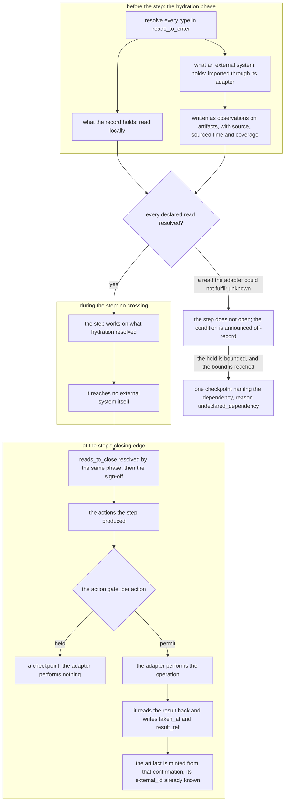

# Adapters: how external systems reach the work model, and how it reaches them

**Keyed document:** read when a webhook receiver, a mail, chat, calendar, or payment daemon, the
notification path, the GitHub pipeline, or this document changes (`conformance.md`). **Kind:** foundation;
states the design and never the state of a checkout. **Derived from:** `work_model.md` (artifacts, intake,
the four execution mechanisms), `gates_and_workflows.md` (one engine sequences from the entities; actions
and the action gate), `authority_model.md` (credentials bind to principals; approval), `workflows.md` (the
steps whose effects leave the system), PR #745 operator review (2026-09-04, the adapter decision), and the
operator's 2026-09-05 review (the inbound-delivery question and the adapter-packaging lean, both recorded
below as open; and revision 18: when an artifact comes into existence, and what holds an effect before
it has an external id), and the operator's 2026-09-05 review of review relevance (revision 19: the `applies_when` condition on an optional step, and two terms retired in favour of `review step`), and the operator's request for visuals during review (revision 20: the inbound-outcome and step-boundary diagrams), and revision 21 (the per-system Gmail and Calendar documents, whose sections here become pointers), and the operator's 2026-09-05 question of whether the foundation anticipates the swarm's addition of adapters (revision 22: the admission contract, the adapter document contract, who admits an adapter, and the degrees of trust grants already express). What is built, and where the adapter and the engine are still one process, is `status.md`.

## Purpose

State how an external system (a code host, a mail system, a chat channel, a calendar, a payment rail) is
connected to the work model: through an adapter that translates in two directions via artifacts.
Inbound, an external event is a signal about an artifact, never an instruction to a workflow; the adapter
writes to the record, and the record drives the workflow. Outbound, a step's effect on an external system
is an action, taken through the action gate, whose result the adapter reads back and confirms on the
record. Table the mapping for each system; the three largest — the code host's, the mail system's, and
the calendar's — are their own documents (`github.md`, `gmail.md`, `calendar.md`), which this document
points to rather than restates.

## Scope

Every boundary between the record and a system the swarm does not own. In scope: the two invariants at
the boundary, what an inbound event may become in the record, what an outbound operation is, and the
identity, linkage, dedup, unknown, and provenance rules every adapter applies, what a new adapter must
demonstrate before the record trusts it and who admits one, and two questions marked
**open** rather than resolved to make the document complete: where inbound delivery comes from, and whether
adapters live in a repository of their own. Out of scope: the workflows themselves (`workflows.md`), the
gate's decision function (`gates_and_workflows.md`), what an adapter is granted
(`authority_model.md#grants`), the per-system mapping in full for the three systems that have their own
documents (`github.md`, `gmail.md`, `calendar.md`, each applying these rules to its system's whole
surface), and the per-instance binding
of a system to an operator, which is the `channel_config` and `vendor_binding` context entities, resolved
at runtime and never named here.

## The two invariants

### The workflow engine never reads an external system; it reads the record

One engine opens steps from the entities and reads the sign-offs
(`gates_and_workflows.md#declaration-batch-projection`). At the boundary that means: the engine's inputs
are batches, leases, sign-offs, actions, checkpoints, and artifacts, all in the record, and nothing else.
It does not call a code host to ask whether a pull request is approved, a mail system to ask whether a
reply arrived, or a rail to ask whether a transfer settled. Only the adapter touches the external system,
and what it learns there it writes to the record as a signal about an artifact, with provenance
(`data_model.md#record-conventions`). This is "one engine sequences from the entities" applied to the
boundary. Reason: an engine that reads an external system has a second source of truth for step state
(principle 9), one that is unreachable in a halt (`failure_posture.md#the-decision`), that cannot be read
back (principle 2), and whose values do not carry the record's `unknown` (principle 7). Read from the
other side: a step's state is derived from edges in the record and from nothing outside it, so a change
in the external system that nobody wrote to the record changes no step.

### No external event advances a step by itself

An inbound event is a signal about an artifact. It can yield exactly one of four things in the record:

1. **a sign-off by a named principal**: the event is that principal's verdict on a step the batch has
   open, and the principal is the step owner. A principal's approval on a checkpoint it is required on
   is the same outcome in its other form, a decision attributed to a named principal and authorized
   against the required approvers (`authority_model.md#approval`);
2. **an observation on an artifact**: what the record knows about the external record is updated;
3. **an action confirmation**: the observation on an action that its effect exists in the external
   system;
4. **a new task for intake**: with the external record it concerns attached as its artifact.

Nothing else. An event never opens, claims, or closes a step, never names a successor, and never advances
a batch; the sign-off it may yield does that, by the rules the step model already states. A verdict from
an account that binds to no principal, or to a principal who does not own the step, is an observation on
the artifact and never a sign-off: an automated account's approval never stands in for a review step's owner. A CI
result is a condition a step owner reads before signing, never a sign-off. This is
`work_model.md#artifacts-are-records-a-batch-leaves-never-its-subject` applied to events: the artifact is
the record an external system holds; what happens to it is information about the batch's tasks, not a
step taken on them.

The branch, with the identity question that decides the first outcome and the disposition every other
delivery reaches:

The adapter never invents a binding and never resolves an unrecognized credential to the operator, so the
left branch is entered only on a binding that already exists.

### The adapter runs before and after a step, never during it

The two invariants say the engine reads only the record and that no event advances a step. This says when
the adapter runs relative to a step, which is the other half of the same boundary.

An adapter reaches an external system at two moments in a step's lifecycle, and at no moment in between.
**Before** a step, in the hydration phase the step's declared reads drive
(`gates_and_workflows.md#declaration-batch-projection`): the phase resolves every type in `reads_to_enter`,
reading from the record what the record holds and importing through the adapter what an external system
holds — creating or updating the artifact for the external record, as observations with sourcing and
coverage. **After** a step, or rather at its closing edge, taking the actions the step produced and writing
their confirmations back (below). **During** a step, nothing: the step works on what hydration resolved, and
reaches no external system itself.

The reason is the first invariant applied in time rather than in structure. A step that calls out
mid-execution has a second source of truth for its own inputs, one that can answer differently at two
points in the same step, so what the step decided on stops being reconstructable from the record. Hydrating
first makes the inputs a fixed, recorded set: what the step read is what the record holds, with provenance,
at a point a reader can name.

The two moments, and the span between them where the boundary is not crossed at all:

An unconfirmed effect leaves an action reading `unknown` and no artifact at all, which is why the last
step of the outbound path is a read and not a write.

**The declaration is what the adapter is asked for.** The adapter is not told to fetch what it thinks
useful; the step's declaration states the types and, for adapter-sourced types, the freshness required, and
the hydration phase asks the adapter for exactly that. An import that satisfies no declared read is not
part of hydration.

**A read the adapter cannot fulfil fails the phase, and therefore the step.** The adapter does not return an
empty result standing in for a system it could not reach — that is the permissive synthesis
`gates_and_workflows.md#declaration-batch-projection` forbids. It returns `unknown`, the hydration phase
does not proceed, and the step does not open (or, for `reads_to_close`, the sign-off is not written). What
happens next is the rule that section already states — **hold, bounded, then escalate**: the condition is
announced off-record while it may be transient, and the bound raises one checkpoint naming the dependency
the step could not read. No separate failure path is defined here, because a step held on an unreachable
external system and one held on an unreadable local type are one condition.

**Retrying the read is `failure_posture.md` rule 8, which covers it.** A failed read left no effect, so it
is retried with backoff, or deferred to the reset time the system stated where it states one. Rule 8 states
there why backoff is mandatory at this boundary in particular — the system being retried belongs to someone
else, and an adapter that re-requests on every failure batters it — and that the schedule is per external
system rather than per waiting step. It is cited rather than restated so one retry classification serves the
runner and the adapter both (principle 6).

### Where inbound delivery comes from is an open decision, and the record's own subscriptions are not it

Every inbound rule above assumes deliveries arrive somewhere. What builds and runs that somewhere the
design does not settle, and the thing a reader most often reaches for as the answer is the wrong one, so
both halves are stated here rather than left to be re-derived.

**The record's subscription machinery watches the record, not external systems.** The record offers
subscriptions over its own entity changes — a watch on entity types, entity ids, or change kinds, delivered
by webhook to a URL or by a stream a consumer holds open. What such a subscription can tell a consumer is
that an entity in the record was created, updated, or corrected. It cannot tell anyone that a message
arrived at a mail system, that a review was submitted at a code host, or that a transfer settled at a rail,
because it has no visibility into any of them. So the record's subscriptions are a mechanism for **waking a
consumer on a write the record already holds** — the shape `gates_and_workflows.md` names when a runner
subscribes to a checkpoint and re-claims its task on resolution — and they are downstream of an adapter,
never a substitute for one. Reading them as an inbound receiver inverts the boundary: it would make the
record the source of events about systems it cannot see.

**Open decision 16: whether the swarm builds its inbound receivers or rides a shared one.** What is
undecided is where an external system's delivery lands before it becomes a write: a receiver the swarm
builds per system, one receiver the swarm builds and every adapter shares, or a third-party delivery
service the swarm consumes. Nothing in this document depends on the answer — the two invariants, the four
outcomes, and the five rules hold whichever it is, because each is stated about what the adapter does with
a delivery and not about how the delivery reached it. What the answer does decide is where signature
verification, redelivery, and the delivery id the dedup rule keys on live, and those are the terms the
decision should be taken on. Until it is taken, an adapter's receiver is its own, which is the state a
reader should assume and not the design's ruling. This is a sibling of open decision 15 below: how adapters
are packaged and where their deliveries land are the same question asked of code and of traffic.

## What the adapter does with every event

The four outcomes above are the adapter's whole vocabulary. Five rules decide among them.

**Identity.** The actor of an external event is a credential (a login, an address, a chat id), never a
principal; the adapter resolves it through the credential binding (`authority_model.md#principals`).
Resolved to the step owner of an open step: the event may be that step owner's sign-off. Resolved to a
required approver on an open checkpoint: the event may be that approval. Resolved to a principal in
neither role, or to no principal: the event is an observation. The adapter never invents a binding, and
it never resolves an unrecognized credential to the operator, which is the fallthrough the claim
predicate forbids (`work_model.md#pull-is-the-only-delivery-assignment-constrains-eligibility`). This is
also the path by which a human principal signs: an agent step owner writes its sign-off to the record
directly and needs no event, while a principal whose only interface is the host signs through the host,
and the adapter carries the verdict in.

**Linkage.** An event names an external record; the adapter finds the artifact for it by `system` and
`external_id` (`data_model.md#concepts`) — the pair that identifies every artifact, because an artifact
is by definition a record in an external system reached through an adapter, and never a thing the swarm
produced into the record (`work_model.md#artifacts-are-records-a-batch-leaves-never-its-subject`). An
adapter therefore never mints an artifact for something the record already holds: what the swarm writes
for itself is an entity, and only what the external system holds gets a `system` and an `external_id`. An artifact with no batch and no task is one the record does
not track: a new-record event on such a record (an issue opened, a message received) yields a task for
intake with the artifact attached; any other event on it is dropped with that reason, counted and
surfaced under the disposition rule below. The adapter never attaches an
artifact to a batch on its own guess: intake's `link` step and the implementer's `impl` sign-off do that
(`workflows.md#intake`, `workflows.md#feature`).

**Dedup.** Every inbound event carries the external system's delivery id as the idempotency key of the
write it produces, so a redelivered event lands once (`data_model.md#record-conventions`). Every outbound
action carries its `dedup_key`, and the adapter refuses to take an action whose key it has already
confirmed (`work_model.md#at-least-once-implies-effect-dedup`).

**Unknown, and every delivery's disposition.** An event the adapter cannot map (an unknown event type, a
payload missing the field the mapping keys on, an artifact it cannot resolve) is an observation that says
so; it is never coerced to the nearest outcome (principle 7). A CI state the adapter cannot read is
`unknown` on the artifact, and unknown holds the step
(`gates_and_workflows.md#an-unreadable-workflow-is-unknown-and-unknown-holds`).

**Every delivery resolves to one of the four outcomes or to `dropped` with a reason, and the disposition
is what is recorded — never receipt alone.** Receipt without disposition is indistinguishable from
handling, and an adapter discarding every delivery at a hidden log level is indistinguishable from one
with nothing to do, which is the signature failure `failure_posture.md` rule 2 names. So there is no
silent branch: an event outside the adapter's mapping, an event on an artifact the record does not track
and that is not a new-record event, a command the adapter refuses, and an outbound operation it cannot
take for want of a credential each resolve to `dropped` with the reason that decided it. Drops are counted
per window and surfaced on the same off-record announcement path as a halt, aggregated rather than one
message per drop. This is what makes a refusal distinguishable from a delivery that never arrived, which
from the external system's side look identical: where the refusal concerns a request a person made on the
external system, the reason goes back to that system as an observation the person can see, because a log
the operator does not read is not feedback.

**Provenance and read-back.** Every write names the adapter, the external system, and the delivery id;
every write that carries a decision (a sign-off, a resolution, a confirmation) is read back before the
adapter acknowledges the event (principle 2). During a halt the adapter writes nothing, acknowledges
nothing, and lets the external system redeliver; a signal the record cannot hold is not a signal the
engine may act on (`failure_posture.md#the-rules`).

**Sourcing, coverage, and freshness.** The record already holds, for every observation, where it came
from, when, and through which interpretation, so an adapter records its sourcing through that mechanism
and never builds freshness bookkeeping of its own
(`data_model.md#record-conventions`). Concretely, every observation an adapter
writes carries three things: its **source**, the external system and the adapter that read it; the time it
was **sourced** from that system, which is the system's own time for the event and not the time the write
landed; and the **coverage** of the read that produced it — the window or page the adapter asked the
system for and what it actually returned. Coverage is the part an adapter is most tempted to omit and the
part that matters most: without it a truncated page, a request the system rate-limited into a partial
answer, and a system with genuinely nothing to report all produce the same record, so the gap is
undetectable until something downstream has already relied on it. With it, an incomplete read is readable
as incomplete and can be asked for again. Freshness — how current the record's picture of a system is,
and whether any interval was ever completely read — is then **derived** by reading provenance across an
artifact's observations, never a `last_synced_at` field the adapter maintains: a maintained field needs a
process to keep it true, which is what principle 11 forbids, and it fails in the worst direction, going
stale into a confident-looking value at exactly the moment the adapter stops reading the system.

### An artifact exists only once its external record does, and the interval before that belongs to the action

The linkage rule keys every artifact on `system` and `external_id`, which raises the obvious question of
what holds a thing the swarm has composed but not yet put into an external system — a drafted message
before the send, a release before the tag, a payment before the submission. The answer follows from the
definition rather than qualifying it, and it is stated here because a reader who does not work it through
reaches for the wrong one: an artifact with a null `external_id`, minted early and filled in later.

**A thing with no external id is not an artifact; it is an entity, and the design already has somewhere to
put it.** An artifact is a record living in an external system, and before the send there is no such
record — not an incomplete one, none. What exists is the swarm's own composition, which lives in the
record and is read by retrieval, and by the test `work_model.md` already states that makes it an entity of
its own type. The drafted message is a draft in the record, which is what
`workflows.md#outreach` means by "the design's staging is the draft in the record": the `draft` step
closes on a draft existing here, `review` judges that, and `consent` carries that. None of the three
touches an external system, and none of them needs an artifact, so nothing in the workflow is waiting on
an id that does not exist yet.

**What spans the interval is the action, not a proto-artifact.** The moment that matters is not
composition but the attempt: the effect is submitted and, until the adapter reads the system back, nobody
knows whether an external record now exists. That interval is exactly what the `action` entity is for. The
action is created when the effect becomes known, carries its own `dedup_key`, and carries `taken_at` and
`result_ref` once confirmed (`gates_and_workflows.md#actions-are-entities-only-actions-are-taken`). The
artifact is minted by the adapter from the confirmation — the send read back by its message id, the
transfer read back at its terminal status — and it is minted with its `external_id` already known, because
the read-back is where that id comes from. So the artifact is never in a state of having no id; it comes
into existence with one.

**This is why dedup does not depend on the artifact, and would break if it did.** `dedup_key` lives on the
action and is keyed on the intended effect, never on the record the effect leaves
(`work_model.md#at-least-once-implies-effect-dedup`). That placement is load-bearing precisely here: the
question dedup must answer is "did this effect already land", asked at the moment a re-claimed task is
about to take the action again — which is the moment when, by construction, the external id may not be
known. A dedup rule keyed on the artifact could not answer it, because the case it exists to catch is the
one where the effect landed and the confirmation did not come back. Keyed on the action, the answer is a
read of the record the swarm holds: the adapter refuses an action whose key it has already confirmed, and
where the key is present but unconfirmed the adapter reconciles by reading the external system for that
key before submitting again. Which is `failure_posture.md` rule 6's shape — a refusal on an existing key
is stronger evidence of a prior commit than a success response is of the present one — applied at the
boundary.

**So nothing in the linkage rule needs weakening, and an unconfirmed effect is `unknown`, never a
provisional artifact.** An adapter that submitted an effect and could not read the result back has an
action with no confirmation, and that reads as `unknown` (principle 7): distinct from confirmed, distinct
from failed, and holding whatever step declared the read (above). It does not mint a placeholder artifact
to stand where the real one will go. A placeholder would be maintained state of the worst kind — a row
whose correctness depends on a later process arriving to fill it in (principle 11) — and it would be
indistinguishable, to every reader downstream, from an artifact for a record that genuinely exists.

## What the record supplies, and what an adapter therefore never builds

The rules above lean on the record having certain capabilities. They are named here abstractly — what the
capability is and what it is for — because an adapter author's most common error is rebuilding one of them
beside the record, and a rebuilt one is the maintained state principle 11 forbids. Which calls express them
is the client's business and not the design's.

**An entity carries the external system and host it came from.** An artifact is identified by `system` and
`external_id`, and every observation on it carries the source that produced it: the external system, the
host or instance within it where several exist, and the adapter that read it. So "which system does this
record live in, and which instance of it" is a property of the record, not a configuration file the adapter
consults — which is what lets two instances of one system be told apart in the record rather than only in
whatever process happened to read them.

**Provenance links an observation to the source it was interpreted from.** The record's provenance is not
only a stamp naming a writer; it links an observation to a **source** — the raw thing that was read — and,
where the value was extracted rather than transcribed, to the **interpretation** that produced it from that
source. That is the chain sourcing and coverage ride on, and it is what makes an adapter's write auditable
back to what the external system actually returned rather than only to the adapter's summary of it.

**Reconstruction as of a time, in two senses that must not be conflated.** The record reconstructs an
entity's state as it stood at a past moment, and it does so along two distinct time axes. One is **event
time**: the state implied by what had *happened* by time T, ordered by the time each source states for its
own observation. The other is **ingestion time**: the state the swarm could actually *have read* at time T,
ordered by when each observation arrived in the record — which excludes observations that describe an
earlier moment but landed later. The two differ exactly where a backfill or a late delivery exists, and the
second is the one that answers "what did this step know when it signed", because reading an entity's
history along event time alone lets a fact that arrived afterwards appear to have been available.

Three things in this design need that, and none of them can be answered by reading current state:

- **Freshness.** Whether an interval was ever completely read is a question about observations over time,
  and it is asked against ingestion time. This is why freshness is derived and never stored: the derivation
  has a real answer, where a stored field has only its last value.
- **What a sign-off judged.** A sign-off is pinned to the artifact state it judged
  (`data_model.md#record-conventions`), and reconstructing that state means reconstructing what the record
  held when the verdict was written — as it was readable then, not as it reads now. A verdict reviewed
  later, against a state that includes observations that arrived after it, is judged on information its
  step owner never had.
- **A drop or a hold, reconstructed after the fact.** An adapter that dropped a delivery, or a step that
  held on a read, is diagnosed by asking what the record held at that moment. Current state cannot answer
  it, because the condition has usually resolved by the time anyone asks.

**So an adapter never keeps history of its own.** No sync log, no last-seen cursor table standing in for
coverage, no local cache of what an artifact looked like at some earlier point. Each is a second copy of
something the record already reconstructs, needing a process to keep it true, and diverging silently the
moment that process stops.

## Outbound: steps produce actions, adapters take them

Some steps close on an effect in an external system: `impl` closes on a pull request existing, `merge` on
the merge taken, `send` on the message sent, `pay` on the transfer taken. Each such effect is an `action`,
created when it becomes known, carrying its class, evaluated at the action gate at the moment it would be
taken (`gates_and_workflows.md#actions-are-entities-only-actions-are-taken`). The adapter is the
principal's hands at the boundary: on permit it performs the operation, reads the result back from the
external system, and writes the confirmation on the action (`taken_at`, `result_ref`); the record the
effect left is an artifact `PRODUCES` from the batch. On a checkpoint it performs nothing. The class is
resolved under the project's `action_policy`; a class in neither set resolves to `NEVER`
(`gates_and_workflows.md#confidence-and-three-blast-tiers`), so a policy that wants a low-blast comment
lists the class the comment carries. The class names in the tables below are the policy's data, not a
closed set: `open_issue` and `notify_operator` are this document's, beside the classes the workflows
already name.

**A recovery is an outbound operation like any other.** `failure_posture.md` names, per action class, what
undoes an effect already taken, and every one of those is an operation an adapter performs at the same
boundary the original effect crossed: a revert, a deprecate-and-supersede, a delete-and-retag, a rollback.
Each is its own `action`, of its own class, evaluated at the action gate at the moment it would be taken —
there is no privileged undo path that reaches the external system around the gate, and none that an
adapter takes on its own initiative because it judged the first effect wrong. The adapter reads the
recovery's result back and writes the confirmation exactly as it does for the effect being recovered, so a
recovered action and its recovery are both readable, in order, rather than the record showing only the
corrected end state. Where a class's recovery is forward-only, the adapter performs the forward operation
and the superseded record stays where it is; it does not simulate a reversal the external system does not
offer. The `publish` class is the clearest such case: unpublishing is barred once a window has passed, so
its recovery is `deprecate_publication` — the superseding version is published and the earlier one marked
superseded, read back at both — and the adapter never deletes the published surface to make the record
look clean.

## GitHub

The code host holds three kinds of artifact the work model names: `issue`, `pull_request`, and `release`;
the check runs on a pull request are read as a field of that artifact. Security advisories, dependency and
secret-scanning alerts are artifacts of their own kinds, and they carry a disclosure constraint no other
system's do.

**The GitHub adapter is `github.md`, in full.** That document enumerates every event the host can deliver
— not only what the swarm subscribes to today — with each row marked handled, deliberately ignored, or
unhandled, and it tables the outbound operation, action class, and confirmation for every step that
reaches the host. It applies the rules above and does not restate them; the rules stay here, and the
per-event mapping lives there (principle 9, one home). Two things it settles that a reader of this section
would otherwise look for here: what the adapter withholds from an inbound security advisory, and why a
derived condition such as mergeability is an observation from a read rather than a fifth outcome.

The two rules of this section that a reader should carry into it, because they are what the host most
often erodes: a review's `APPROVE` becomes a sign-off only through identity — the same verdict from the
same login is a sign-off when the login binds to the step owner of an open step and an observation
otherwise, and nothing in the payload changes that. And every host state that looks like step state (a
label, a review decision, a check, a closed pull request) reaches the step only through a principal who
reads it and signs.

**An artifact with no batch never receives retroactive step state.** No step of any workflow is opened on
an artifact that no batch addresses, and neither an adapter nor the workflow engine may initialize a step
on its behalf — not as `not_required`, not as `not_applicable`, not as clear, not as anything. Step state
is derived from a batch, a lease, and a sign-off (`gates_and_workflows.md#declaration-batch-projection`);
where there is no batch there is nothing to derive it from, and a value written in place of that
derivation is a fabricated verdict on work no principal judged. A pull request opened before any task
exists for it is therefore an artifact with no batch, and it yields a task for intake like any other
untracked record. The batch that later addresses that task opens its own steps, from the beginning of its
workflow, and its `impl` sign-off cites the existing pull request in `artifact_refs[]` — the earlier
existence of the artifact buys the batch nothing and skips nothing. A companion rule of the same kind: a
pull request whose shipped change exceeds the scope a review step signed does not inherit that narrower sign-off,
because a sign-off is pinned to the artifact state it judged (`data_model.md#record-conventions`).

## Gmail

The mail system holds artifacts of kind `thread`, `message`, and `attachment`; a mail-system `draft` is an
artifact the design deliberately does not depend on, and a `label` is read but is never step state.

**The Gmail adapter is `gmail.md`, in full.** That document enumerates every signal the mail system can
deliver or that a read can discover — with each row marked handled, deliberately ignored, or unhandled —
and it tables the outbound operation, action class, `dedup_key`, and confirmation for every step that
reaches the mail system. It applies the rules above and does not restate them (principle 9, one home).
Three things it settles that a reader of this section would otherwise look for here: why the mail system's
notification is a wake-up rather than an event, so that nearly everything the adapter knows comes from a
**read** whose coverage is what makes it checkable; why a staged draft is never updated in place, the
update operation being able to send; and why the `send_external_comms` class has **no recovery row at all**
at this system, a sent message having no undo, no revert, and no supersession — which is why the outreach
workflow spends three steps before the send and why the class is ordinarily a checkpoint.

Two rules of this section a reader should carry into it, because the mail system erodes them hardest: a
label is never step state, and a mailbox's labels read as status to a human eye precisely because they are
the operator's own working vocabulary. And identity resolves an **address**, not an account — so a message
from the operator's address resolves to the operator principal only where the binding matches and the
message's authentication carries the sending domain's authorization, an unreadable value there failing
closed to an observation (principle 5).

## Telegram

The chat channel holds artifacts of kind `message`. It is a channel the operator-facing agent carries
checkpoints and operator-only tasks through, where the `channel_config` entity names it.

| External event | What it is a signal about | Outcome in the record |
|---|---|---|
| message from a chat id bound to the operator principal, answering nothing the record awaits | a new ask | a task with the message as its artifact, entering intake |
| message from that chat id, answering a checkpoint the operator-facing agent carried | the operator's decision | resolution of that checkpoint by the operator principal (`authority_model.md#approval`), read back on the checkpoint |
| message from that chat id, reporting an operator-only action taken | the outcome of `await` | an observation on the task's artifact that the `record` step owner reads and signs on (`workflows.md#operator-only`) |
| message from a chat id bound to no principal | noise | dropped, or an observation where a tracked artifact is named; never a task, never a resolution |

| Step | Operation | Action class | What the adapter confirms |
|---|---|---|---|
| `present`, `operator_preview`, `consent` | send the checkpoint or the task to the operator's chat | `notify_operator` | the message id, read back; the checkpoint stays open until resolved on the record, whatever the delivery status |
| `deliver` | send a digest or a result | `notify_operator` | the message id, read back |

A notification is an action with a class of its own so that a policy may keep it low-blast. Its delivery
is never the checkpoint's resolution, and a checkpoint nobody answers times out into its terminal state on
the record (`gates_and_workflows.md#the-checkpoint`).

## Calendar

The calendar holds artifacts of kind `event`, and a `calendar` the adapter reads but never writes. A person
on an event is a `contact` entity in the record, never an artifact of its own.

**The calendar adapter is `calendar.md`, in full.** That document enumerates every signal the calendar can
deliver or that a read can discover, with the same three-way marking, and tables the outbound operation,
action class, `dedup_key`, and confirmation per step. It applies the rules above and does not restate them.
Three things it settles: that an event's **beginning and ending are delivered by nothing** and are derived
from a stored time against a clock, so a step depending on a meeting having happened declares a read with a
stated freshness rather than trusting a time the record has held for a week; that an operation's action
class **depends on the attendees** — the same write is `external_api_write` on a solo event and
`send_external_comms` on one with attendees, because it mails them — and that an unreadable attendee set
therefore takes the higher class (principle 5); and **open decision 24**, whether a recurring series is one
artifact or many, which it opens rather than resolves and which should be decided together with
`gmail.md`'s decision 23, both being the same question about a thing with internal multiplicity.

## Payments

The rail holds artifacts of kind `transfer` and `receipt`. The separation of duties the payment workflow
names applies to the adapter as to any principal: the adapter that takes a `pay` action never writes the
`reconcile` sign-off (`workflows.md#payment`).

| External event | What it is a signal about | Outcome in the record |
|---|---|---|
| transfer reaches a terminal state at the rail | the effect of the `pay` action | an action confirmation on the `payment`-class action whose `dedup_key` matches; the transfer record is an artifact `PRODUCES` from the batch; the `reconcile` step owner reads it and signs, and the `transaction` entity is that step's write, not the adapter's |
| transfer fails, or is returned by the rail | the same | an action confirmation with the failing result; `reconcile`'s `on_fail` opens `pay` again through the gate, never a second submission by the adapter |
| incoming payment received | money that arrived | an observation on the artifact for the obligation it settles, where one is tracked; otherwise a task for intake with the transfer as its artifact |
| balance or rate changed | the rail's state | an observation, where a tracked artifact depends on it; otherwise dropped |

| Step | Operation | Action class | What the adapter confirms |
|---|---|---|---|
| `pay` | submit the transfer | `payment`, or `transfer` where the policy distinguishes them | the transfer read back from the rail by its id at its terminal status, never the submission's return |

## What an adapter never does

It never reads a workflow to decide what an event means: the four outcomes are decided by identity,
linkage, and the artifact, and the engine decides the rest from the record. It never opens, claims, or
closes a step, and never writes a task's status or a batch's successor. It never takes an action that has
not passed the gate, and never repeats one on its own. It never resolves an unrecognized credential to a
principal. It never holds step state of its own: an adapter that keeps a per-artifact map of which steps
are satisfied has become a second engine (`gates_and_workflows.md#declaration-batch-projection`). And it
never performs an operation and reports success without reading the external system back.

## Admitting a new adapter

Every rule above is written for an adapter that already exists. This section is the other direction: what
a sixth adapter must satisfy before the record trusts what it writes, who admits it, and what admission
is a decision *about*. The rules are the same rules; what is stated here is how each becomes a thing that
**fails** rather than a thing an author claims (principle 1), because a checklist nobody verifies is
precisely the reporting-without-binding defect this foundation exists to name.

The framing matters, because the obvious one is wrong. Admitting an adapter looks like a build task — write
the mapping, get the credential, deploy the daemon — and treating it that way is what makes it dangerous.
An adapter is the only component that touches a system the swarm does not own; it holds a credential; its
writes are what every downstream step reads as fact; and its identity rule decides whether a stranger's
comment becomes a sign-off. So admission is a **governance decision about what the record will believe**,
and the build is what follows it.

### The admission contract

Six obligations. Each names what must be true, and — the part that makes it a control — **what fails when
it is not**. An obligation with no failing artefact is not on this list, and two candidates were removed
for exactly that reason (below).

| # | What the adapter must demonstrate | What checks it, rather than the author asserting it |
|---|---|---|
| 1 | **Every delivery it can receive resolves to one of the four outcomes or to `dropped` with a reason.** Its document enumerates the external system's own event list, not the subset the swarm subscribes to, each row marked handled, deliberately ignored, or unhandled | The disposition rule itself, which is a **counter**, not a promise: an event outside the mapping resolves to `dropped` with reason `unmapped`, is counted per window and announced off-record. Coverage is therefore a number that should be zero and rises on its own when the enumeration is wrong (`github.md#the-property-that-makes-this-a-control-and-not-a-list`). An adapter whose drop counter is not wired has not satisfied this obligation, because nothing then distinguishes it from an adapter with nothing to do |
| 2 | **Its identity rule resolves actors through the credential binding and nowhere else**, and it can produce, for its system, the enumeration of which credential kind binds to a principal | A negative test the adapter must fail on: a verdict-shaped delivery from a credential that binds to no principal, and one from a principal who does not own the open step, each yield an **observation** and never a sign-off (`authority_model.md#principals`). The check is that the test exists and goes red when the fallthrough is reintroduced — principle 4's revert test, applied to the one rule whose failure fabricates authority |
| 3 | **Its dedup key is the external system's own delivery id inbound, and the action's `dedup_key` outbound** | A redelivery of one captured delivery produces exactly one write, asserted by reading the record back; and an outbound action whose key is already confirmed is refused. Both are read-backs of the record, not of the adapter's return codes (principle 2). Where the system issues no stable delivery id, that is a finding stated in the document, not a key the adapter invents |
| 4 | **Every observation it writes carries source, sourced time, and coverage**, and it maintains no freshness field of its own | The absence check runs in the other direction and is the sharper one: the adapter holds **no** sync log, no last-seen cursor table, no local artifact cache (**What the record supplies**, above). A schema or a table that would need a process to stay true is the failure, caught in the pull request that introduces it, because principle 11 makes it reviewable by inspection rather than by intuition |
| 5 | **Every write carrying a decision is read back before the delivery is acknowledged**, and during a halt it writes nothing, acknowledges nothing, and lets the system redeliver | Exercised against an unreachable record: the adapter must leave the delivery unacknowledged rather than acknowledge and drop it (`failure_posture.md`, rules 1 and 4). An adapter that acknowledges what it could not write turns an outage into silent data loss, which is the one failure the redelivery mechanism exists to prevent and the one this test catches |
| 6 | **Its outbound operations name their action class, and every class it can produce is listed in an `action_policy`** | The gate: a class in neither policy set resolves to `NEVER` (`gates_and_workflows.md#confidence-and-three-blast-tiers`). This is checked by the gate at the moment the action would be taken and needs nothing added — an unlisted class does not fail at admission review, it fails at the first attempt to act, which is the stronger place for it to fail |

Two things this list deliberately does **not** contain, named so their absence reads as a decision rather
than an oversight. There is no "the adapter is tested against the live system" obligation: what would fail
is nothing the record can read, and an integration test's passing says nothing about the next delivery.
And there is no sign-off by an adapter review board; the checks above are the review, and a second
approving body would be the second gate principle 6 forbids.

### The obligations are the five rules, restated as failures

The contract adds no rule. Obligations 1 through 5 are the five rules — identity, linkage, dedup, unknown
and disposition, provenance and read-back — each with its failing artefact named, and obligation 6 is the
outbound path's existing gate. The reason for restating them in this form is that the five rules are
written as **what an adapter does**, which a new adapter's author reads as a description to conform to,
and conformance to a description is asserted. Written as **what fails**, the same five rules are checked.
Linkage is the one that does not get its own row, because its failure is obligation 1's counter: an
adapter that cannot resolve an artifact drops the delivery with that reason, and the drop is counted.

### What an adapter's document must contain

`github.md` is the one full example, and the structure below is derived from it and from the six obligations
rather than from what it happens to contain. Every adapter's document — the ones being written for the
mail, chat, calendar, and payment systems, and the sixth that follows them — carries these, and an
adapter whose system is small enough to sit as a section of this document carries them as a section.

| Required part | What it states | Which obligation it discharges |
|---|---|---|
| **Scope, and the enumeration's boundary** | which of the system's surfaces the document covers, and which are named as one class with one disposition rather than omitted | 1 — an omission that is not written down cannot be told from a gap |
| **The inbound table** | every event and action the system can deliver, with its status (handled, deliberately ignored, unhandled) and its outcome or its drop reason | 1 |
| **The identity section** | which credential kinds this system presents, which bind to principals, and what a verdict from an unbound credential becomes | 2 |
| **The linkage section** | what `system` and `external_id` are for this system's artifact kinds, and what happens when an identifier moves | 1, 3 |
| **The outbound table** | per step, the operation, the action class, and **what confirms it landed**, read back from the system and never from a return code | 6, 5 |
| **Recoveries** | per action class, what undoes an effect already taken, or that the class is forward-only | 6 — a recovery is an outbound operation like any other |
| **What this adapter never does, at this system specifically** | the host-specific erosions: the operation that would grant the system a permit the gate did not issue | 2, 6 |
| **What the document does not decide** | the general rules it cites rather than restates, and the rows whose built state is `status.md`'s | principle 9 |

Two structural rules govern the set. **The general rules stay here and are cited, never restated** — a
per-system document that re-explains the identity rule creates a second home for it, and the two drift
(principle 9). And **a row marked unhandled is a named gap, not a silence**: it costs something readable,
because until it is built those deliveries resolve to `dropped` and are counted.

### Who may admit an adapter, and through what

An adapter reaches an external system with a credential and can take irreversible outward effects, so
admitting one is a governance change and not a deployment. The question this section must answer, under
principle 6, is whether a mechanism already covers it. **Three do, and no new one is needed** — but they
cover it only once one thing is stated, and stating it is this section's whole contribution.

**It is a task, and it goes through a workflow, because there is no other way.** The general rule is
`work_model.md#changing-the-swarm-is-work-and-it-goes-through-a-workflow-like-any-other`: a change to the
swarm's own operation is a task like any other, it enters intake, and it is executed inside a batch going
through a declared workflow, because the no-side-door rule is written about tasks and is conditioned on
neither the origin of the work nor its being infrastructural. Adding an adapter is such a change, so it
inherits that answer entire and this section adds nothing to it. Two of that section's consequences are
worth carrying here because a reader arriving at adapters will look for them: an adapter admission task
proposed by the swarm and one the operator asked for are the same object under the rule, and the
capability an adapter is to be granted cannot be written by the principal that would use it, because that
write is itself a governance write to `agent_grant`. Adapter admission also does not wait on open decision
17, whose open question is the sequencing between a batch and an institutionalization task it created
mid-flight; an adapter admission task is not created that way.

**Its credential is a grant, which is where authority actually attaches.** The adapter acts as a principal
and its capabilities are an `agent_grant`, scoped and time-bounded, matched on the credential
(`authority_model.md#grants`). So "who may add an adapter" resolves to "who may write that grant", and
that is already answered: a write to `agent_grant` is a **governance write**, which is an action evaluated
at the action gate (`gates_and_workflows.md#two-policies-workflow-policy-and-action-policy`). The operator
resolves the checkpoint the gate raises. Nothing here needs a new approver class, and adding one would be
the second gate. Whether that governance class is *reserved* to the operator by default or merely held at
a high tier is **open decision 18**
(`work_model.md#changing-the-swarm-is-work-and-it-goes-through-a-workflow-like-any-other`), and adapter
admission does not need it ruled: a project with no policy value for the class is the unclassified case,
which fails closed to `NEVER`, so an adapter cannot be granted its credential by default under either
candidate. The decision changes how a project that has written a policy admits its second adapter, not
whether the first one is held.

**Its outbound classes are `action_policy` data, and that write is governance too.** An adapter that can
send mail or move money produces actions of classes the policy must list, and a class in neither set
resolves to `NEVER`. So an adapter admitted without its policy write is not a dangerous adapter; it is an
**inert** one, which is the correct failure direction (principle 5). Fitting the pieces together: the
grant says what the adapter may reach, the policy says what it may do there, and the gate holds each
outward class until a principal permits it.

**What is genuinely missing is smaller than it looks, and it is a declaration.** The three mechanisms
above govern the adapter's *authority*; none of them governs whether its *mapping* is fit to be believed.
A grant can be written, a policy listed, and a gate satisfied by an adapter whose identity rule is wrong —
and the six obligations are what stand between that adapter and a fabricated sign-off. What closes the gap
is not a fourth mechanism but making the obligations reviewable at the moment the grant is written: the
admission task's specification states its design basis against this section, and the arch review step
checks the six obligations against the adapter's document before the grant's governance write is permitted
(`conformance.md#design-basis`). That is the existing design-basis check, applied to a class of change that
had no section to cite; the reason it was uncheckable before is that this section did not exist.

### Degrees of trust: the design distinguishes, and grants already express it

Not every adapter carries the same risk. One that only ever writes observations about a calendar and one
that can move money are different propositions, and a design that trusted them equally would be either
too slow for the first or too loose for the second. So the design distinguishes — and the distinction is
**already expressed**, twice over, which is why nothing is added here:

- **What an adapter may reach** is its `agent_grant`: capabilities as operation × entity types ×
  repositories, with parameter constraints and an expiry (`authority_model.md#grants`). A read-only
  adapter is one whose grant confers reads. This is scope, and it is per adapter.
- **What an adapter may do outward** is the action class under the `action_policy`, resolved to a blast
  tier at the moment the action would be taken. `send_external_comms`, `payment`, and `publish` sit high;
  `notify_operator` is a class of its own so a policy may keep it low. This is risk, and it is per action
  rather than per adapter — which is the finer instrument, because one adapter commonly produces effects
  of several classes and a per-adapter trust level would have to be set at its most dangerous one.

Together those two are the degrees of trust, and they are better than a trust *level* would be: a level is
a field on the adapter that some process must keep true as the adapter's capabilities change (principle
11), where a grant and a policy are read at the moment they are enforced.

**What differs by degree is not the contract but the review.** All six obligations bind every adapter,
including a read-only one — an adapter that only writes observations can still mis-resolve identity, and
obligation 2 is precisely the one that matters most for it. What scales with risk is the scrutiny the arch
review step applies and the blast tier the gate resolves, both of which are graduated already. So the
answer to "is every adapter equally trusted" is: equally **obliged**, and unequally **granted**.

### When an adapter is wrong

An adapter that mis-resolves identity could turn a stranger's comment into a sign-off. That is the worst
case and it is worth stating plainly, because what limits it is not one guard but the structure the design
already has. `failure_posture.md` covers the case where the adapter *cannot* write; this is the case where
it writes something wrong, and the two are different failures.

Four properties bound the blast radius, and each is stated elsewhere:

- **The adapter's reach is four outcomes, and one of them is the only dangerous one.** An adapter cannot
  open, claim, or close a step, name a successor, or advance a batch. Three of the four outcomes are
  informational; only a sign-off carries a decision, and only where identity resolved to the step owner of
  an open step. So a mis-mapped delivery is overwhelmingly a wrong observation, which is a bad fact, not a
  false verdict.
- **A wrong verdict is attributed, and attribution is what makes it recoverable.** Every write names the
  adapter, the system, and the delivery id; a sign-off names the principal it is attributed to. So a
  sign-off no principal actually made is *findable* — by reading the provenance of the writes an adapter
  made in a window — rather than indistinguishable from a real one. An unattributed record could not be
  audited at all, which is why attribution is an authority-model requirement and not a convenience.
- **A sign-off is pinned to the artifact state it judged.** A false sign-off does not silently cover later
  work: the head moves and the pinned sign-off reads as stale by a derived read
  (`data_model.md#record-conventions`). The damage does not grow after the fact.
- **The outward effects are gated separately.** A false sign-off closes a step; it does not take an action.
  Every effect that leaves the swarm passes the action gate on its own class at the moment it would be
  taken, so the worst inbound failure still meets the outbound gate before anything irreversible happens.
  This is why the gate is per action and evaluated late rather than per task and evaluated early.

**And the recovery is the ordinary one.** A sign-off written on a false identity is corrected the way any
wrong write is: it is not deleted to make the record look clean. A verdict is terminal and a new judgement
is a new sign-off (`gates_and_workflows.md#findings-verdicts-and-what-a-blocking-finding-obliges`), and an
effect already taken is undone by a recovery action of its own class through the same gate
(`failure_posture.md#the-operator-invoked-halt-and-what-undoes-an-action-already-taken`). Both the wrong
verdict and its correction stay readable, which is the property that lets the adapter's defect be diagnosed
rather than only its symptom repaired.

**Withdrawal is revocation, and its reach is already stated.** An adapter found to be wrong is stopped by
withdrawing its credential, which withdraws every capability every grant conferred on it, across every
entity type and repository those grants named (`authority_model.md#grants`). It takes effect where the
grant is read, which is at every enforcement point rather than from a cache. Nothing new is needed to turn
an adapter off, and the reach of doing so is a reason to keep an adapter's grant narrow at admission —
which is obligation 6's other half, read from the far end.

### The relationship to open decision 15, which this section does not resolve

Open decision 15 asks **where an adapter's code lives** — bundled beside the engine, or a shared adapter
repository this system consumes. This section asks **what an adapter must satisfy to be trusted, and who
admits it**. They are adjacent and they are not the same question, and the distinction is worth being
precise about because a reader can easily take one for an answer to the other.

The contract above is unaffected by 15 either way: the six obligations are about what an adapter does with
a delivery and what fails when it does it wrong, and none of them mentions a repository. What decision 15
*would* change is where the obligations are checked — a bundled adapter's document is reviewed in the pull
request that adds it, under this repository's design-basis check, while a shared repository's adapter is
reviewed under whatever that repository's own review is, across two release cadences. That is a real cost
of separating, and it belongs on decision 15's ledger beside the ones already recorded there; it is not a
reason to rule 15 here, and this section rules nothing about it. The same holds for open decision 16
(where inbound delivery lands): the obligations hold whichever receiver an adapter's deliveries arrive
through.

## The adapter and the engine are two roles

Whether one process hosts both is an implementation choice; the design's requirement is that they meet
only in the record. An adapter is a daemon in the sense of `work_model.md#the-four-execution-mechanisms`:
it self-triggers on the external system's events, produces writes to the record, and receives no task.
The engine opens steps from the entities. The two are separable because the only thing that passes
between them is what the adapter wrote and the engine read, with provenance on every write; a process
that lets an event drive a step without a write in between has merged them, and where that is the case
on a checkout is `status.md`.

**Open decision 15: whether adapters live in a repository of their own.** The roles being separable raises
the packaging question, and it is not settled here. The options are the two obvious ones — adapters bundled
inside this system beside the engine, or a shared adapter repository this system consumes as a dependency
and other consumers could too. The operator's stated lean, recorded as a lean and not as a ruling, is
**toward separating them**, on the reasoning that a boundary the design already draws between two roles is
cleaner expressed as two artefacts than as two directories. What would decide it: whether a second consumer
for these adapters actually exists, and what separating them costs at the seam where an adapter's writes
must stay conformant to the record's conventions (`data_model.md#record-conventions`) across two release
cadences. The design is unaffected either way — every rule in this document is about what an adapter does
and none about where its code lives — which is why the question can stay open without anything downstream
waiting on it.

## Prior art

The anti-corruption layer (Evans) is the shape: a translation layer at the boundary, so that the external
system's model never becomes the domain's. Kafka Connect's source and sink connectors are the two
directions as separate roles with the log between them; here the record is the log. GitHub's webhook
delivery id as the dedup key, and its distinction between a review's state and a branch protection rule's
required approvals, are the identity and CI rules above, stated by the host itself.

## Beyond the sources

The four-outcome rule, the five adapter rules, and the tables are this document's, consolidating the
operator's decision on PR #745; the prior art named above is cited from general knowledge, not from the
prior-art entity the other documents cite. Open decisions 15 and 16, and the statement of what the record's
own subscriptions can and cannot tell a consumer, are this document's, from the operator's 2026-09-05
review; the lean recorded under decision 15 is the operator's own and is marked as a lean rather than
written up as a ruling.

**Admitting a new adapter** is this document's, from the operator's 2026-09-05 question of whether the
foundation anticipates the swarm's addition of adapters. It states no new rule: the six obligations are
the five rules and the outbound gate with their failing artefacts named, the document contract is derived
from `github.md`'s structure and from the obligations, and the admission mechanism is the three that
already exist — intake and a workflow, the `agent_grant` governance write, and the `action_policy` class —
identified rather than invented (principle 6). The one addition is that the arch review step checks the six
obligations before the grant's governance write is permitted, which is the existing design-basis check
applied to a class of change that previously had no section to cite. The degrees-of-trust answer is a
reading of `authority_model.md#grants` and the action classes, not a new axis.
