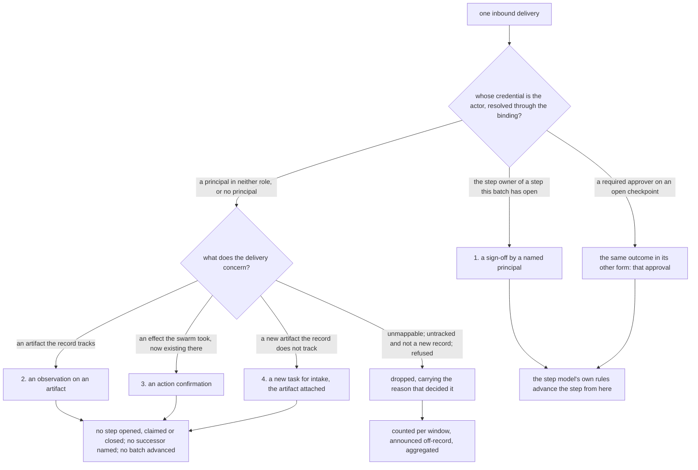
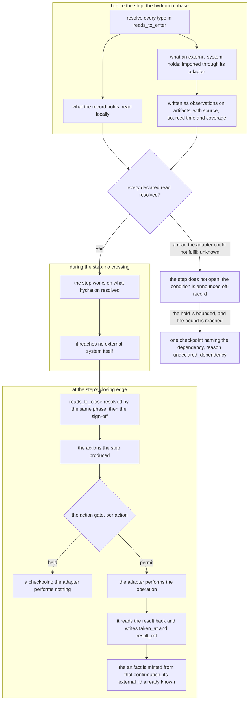

# Adapters: how external systems reach the work model, and how it reaches them

**Keyed document:** read when a webhook receiver, a mail, chat, calendar, or payment daemon, the
notification path, the engine, or this document changes (`conformance.md`). **Kind:** foundation;
states the design and never the state of a checkout. **Derived from:** `work_model.md` (artifacts, intake,
the four execution mechanisms), `gates_and_workflows.md` (one engine sequences from the entities; actions
and the action gate), `authority_model.md` (credentials bind to principals; approval), `workflows.md` (the
steps whose effects leave the system), PR #745 operator review (2026-09-04, the adapter decision), and the
operator's 2026-09-05 review (the inbound-delivery question and the adapter-packaging lean, both recorded
below as open; and revision 18: when an artifact comes into existence, and what holds an effect before
it has an external id), and the operator's 2026-09-05 review of review relevance (revision 19: the `applies_when` condition on an optional step, and two terms retired in favour of `review step`), and the operator's request for visuals during review (revision 20: the inbound-outcome and step-boundary diagrams), and revision 21 (the per-system Gmail and Calendar documents, whose sections here become pointers), and the operator's 2026-09-05 question of whether the foundation anticipates the swarm's addition of adapters (revision 22: the admission contract, the adapter document contract, who admits an adapter, and the degrees of trust grants already express), and revision 24 (the per-system Telegram and Payments documents, whose sections here become pointers), and PR #745 operator review (2026-09-05, rulings 13–14, 16–18, 23–29: decision 16 ruled here; the two-level artifact rule stated under linkage), and the operator's 2026-09-05 ruling of decision 15 (revision 27: adapters bundled in this repository until a second consumer of them exists), and the operator's 2026-09-05 22:02–22:13 memos on how tasks come into existence (revision 30, 2026-09-06: continual inbound named as the inbound side, and the record's subscriptions as what an intake rule evaluates through). What is built, and where the adapter and the engine are still one process, is `status.md`. Revised by the simplification pass of 2026-09-05 (revision 29: open decision 35). Revised by the memo-gap pass of 2026-09-06 (revision 31: the source is kept, not only named). Revised by the workflow-format pass of 2026-09-06 (revision 34: a system whose delivery surface is a local filesystem is admitted through the same contract; open decision 45 — whether the host a daemon runs on is an external system). Revised by the second workflow-format pass of 2026-09-06 (revision 36: a merchant is a system of its own and a purchase its class, under *Admitting a new adapter*; open decision 55, whether a second instance of the record is an external system). Revised by the testability pass of 2026-09-06 (revision 37: the window declared on the binding and the per-window observation on the adapter's `agent_session`; a credential-less outbound operation is a denial, never a drop; the linkage section states what a sign-off pins per kind). Revised by the rulings pass of 2026-09-06 (revision 38: decision 35 ruled as settled by the conformance suite — one binding type per external system, routing a field of it, the name and the substitution deferred to a vocabulary pass; decision 45 ruled — the host a daemon runs on is an external system). Revised by the event/signal/delivery pass of 2026-09-06 (revision 49: `vocabulary.md#event` cited where this document already used the word; one stray `gmail.md` anchor updated to the renamed section). Revised by the peering pass of 2026-09-06 (revision 56, rebased onto the checker-mechanism and self-awareness passes: decision 55 ruled — a peer instance is the record, extended by replication, not an external system; the interim `operator_only` rule retired for eligibility, replaced by `sync_peers`; a pointer added to the governance-write question decision 55 does not settle). Revised by the rendered-interface pass of 2026-09-06 (revision 61: a system reached only through a rendered interface — no event API, no stable record identifier — admitted under *Admitting a new adapter*; identity and linkage answered by obligation 3, extended from the dedup key to `external_id`; coverage answered by revision 34's filesystem finding, transferred without change; read-back argued as real but partial, naming what it cannot establish; freshness needing no new mechanism; a read-time planted-positive instrument named for the case a delivery-based drop counter cannot catch, a layout change that returns zero rows and reports nothing; the outbound default left to the existing fail-closed rule rather than special-cased; no decision opened). Revised by the host-configuration pass of 2026-09-06 (revision 65: a seventh obligation for an external system's own configuration considered and rejected — the contract judges the mapping, and configuration extends obligations 1 and 6 instead, read at the admission task's arch review step; the case carried through in full is `github.md`'s required host state). Revised by the agent-identity pass of 2026-09-06 (revision 66, **derived from** the operator's 2026-09-06 14:44 memo on agent identities across external systems: the general rule that an agent's identity lives in the record and an external system holds at most a credential that binds to it; the asymmetry between a system that issues a per-agent credential and one that does not; the outbound mark required where attribution cannot be external; decision 69 opened and ruled — a per-agent credential is an obligation where the system issues one; the binding declared on the `vendor_binding` on decision 42's pattern; AAuth established from the corpus as one of the credential kinds `authority_model.md#principals` already enumerates, not a second identity system).

## Purpose

State how an external system (a code host, a mail system, a chat channel, a calendar, a payment rail) is
connected to the work model: through an adapter that translates in two directions via artifacts.
Inbound, an external event is a signal about an artifact, never an instruction to a workflow; the adapter
writes to the record, and the record drives the workflow. Outbound, a step's effect on an external system
is an action, taken through the action gate, whose result the adapter reads back and confirms on the
record. Table the mapping for each system; the three largest — the code host's, the mail system's, and
the calendar's — are their own documents (`github.md`, `gmail.md`, `calendar.md`), which this document
points to rather than restates.

## Scope

Every boundary between the record and a system the swarm does not own. In scope: the two invariants at
the boundary, what an inbound event may become in the record, what an outbound operation is, and the
identity, linkage, dedup, unknown, and provenance rules every adapter applies, what a new adapter must
demonstrate before the record trusts it and who admits one, where inbound delivery lands and which part of
receiving it is the adapter's, and one question marked **open** rather than resolved to make the document
complete: whether adapters live in a repository of their own. Out of scope: the workflows themselves (`workflows.md`), the
gate's decision function (`gates_and_workflows.md`), what an adapter is granted
(`authority_model.md#grants`), the per-system mapping in full for the three systems that have their own
documents (`github.md`, `gmail.md`, `calendar.md`, each applying these rules to its system's whole
surface), and the per-instance binding
of a system to an operator, which is one binding context entity per instance — carried in these documents
under two names, `channel_config` and `vendor_binding`, that decision 35 rules one type
(`#whether-one-binding-type-or-two-names-an-external-systems-instance`) — resolved at runtime and never
named here.

## The two invariants

### The workflow engine never reads an external system; it reads the record

One engine opens steps from the entities and reads the sign-offs
(`gates_and_workflows.md#declaration-batch-projection`). At the boundary that means: the engine's inputs
are batches, leases, sign-offs, actions, checkpoints, and artifacts, all in the record, and nothing else.
It does not call a code host to ask whether a pull request is approved, a mail system to ask whether a
reply arrived, or a rail to ask whether a transfer settled. Only the adapter touches the external system,
and what it learns there it writes to the record as a signal about an artifact, with provenance
(`data_model.md#record-conventions`). This is "one engine sequences from the entities" applied to the
boundary. Reason: an engine that reads an external system has a second source of truth for step state
(principle 9), one that is unreachable in a halt (`failure_posture.md#the-decision`), that cannot be read
back (principle 2), and whose values do not carry the record's `unknown` (principle 7). Read from the
other side: a step's state is derived from edges in the record and from nothing outside it, so a change
in the external system that nobody wrote to the record changes no step.

### No external event advances a step by itself

An inbound event is a signal about an artifact. It can yield exactly one of four things in the record:

1. **a sign-off by a named principal**: the event is that principal's verdict on a step the batch has
   open, and the principal is the step owner. A principal's approval on a checkpoint it is required on
   is the same outcome in its other form, a decision attributed to a named principal and authorized
   against the required approvers (`authority_model.md#approval`);
2. **an observation on an artifact**: what the record knows about the artifact is updated;
3. **an action confirmation**: the observation on an action that its effect exists in the external
   system;
4. **a new task for intake**: with the artifact it concerns attached to it.

Nothing else. An event never opens, claims, or closes a step, never names a successor, and never advances
a batch; the sign-off it may yield does that, by the rules the step model already states. A verdict from
a credential that binds to no principal, or to a principal who does not own the step, is an observation on
the artifact and never a sign-off: an automated credential's approval never stands in for a review step's owner. A CI
result is a condition a step owner reads before signing, never a sign-off. This is
`work_model.md#artifacts-are-records-a-batch-leaves-never-its-subject` applied to events: the artifact is
the entry an external system holds; what happens to it is information about the batch's tasks, not a
step taken on them.

The branch, with the identity question that decides the first outcome and the disposition every other
delivery reaches:

The adapter never invents a binding and never resolves an unrecognized credential to the operator, so the
left branch is entered only on a binding that already exists.

### The adapter runs before and after a step, never during it

The two invariants say the engine reads only the record and that no event advances a step. This says when
the adapter runs relative to a step, which is the other half of the same boundary.

An adapter reaches an external system at two moments in a step's lifecycle, and at no moment in between.
**Before** a step, in the hydration phase the step's declared reads drive
(`gates_and_workflows.md#declaration-batch-projection`): the phase resolves every type in `reads_to_enter`,
reading from the record what the record holds and importing through the adapter what an external system
holds — creating or updating the artifact, as observations with sourcing and
coverage. **After** a step, or rather at its closing edge, taking the actions the step produced and writing
their confirmations back (below). **During** a step, nothing: the step works on what hydration resolved, and
reaches no external system itself.

The reason is the first invariant applied in time rather than in structure. A step that calls out
mid-execution has a second source of truth for its own inputs, one that can answer differently at two
points in the same step, so what the step decided on stops being reconstructable from the record. Hydrating
first makes the inputs a fixed, recorded set: what the step read is what the record holds, with provenance,
at a point a reader can name.

The two moments, and the span between them where the boundary is not crossed at all:

An unconfirmed effect leaves an action reading `unknown` and no artifact at all, which is why the last
step of the outbound path is a read and not a write.

**The declaration is what the adapter is asked for.** The adapter is not told to fetch what it thinks
useful; the step's declaration states the types and, for adapter-sourced types, the freshness required, and
the hydration phase asks the adapter for exactly that. An import that satisfies no declared read is not
part of hydration.

**A read the adapter cannot fulfil fails the phase, and therefore the step.** The adapter does not return an
empty result standing in for a system it could not reach — that is the permissive synthesis
`gates_and_workflows.md#declaration-batch-projection` forbids. It returns `unknown`, the hydration phase
does not proceed, and the step does not open (or, for `reads_to_close`, the sign-off is not written). What
happens next is the rule that section already states — **hold, bounded, then escalate**: the condition is
announced off-record while it may be transient, and the bound raises one checkpoint naming the dependency
the step could not read. No separate failure path is defined here, because a step held on an unreachable
external system and one held on an unreadable local type are one condition.

**Retrying the read is `failure_posture.md` rule 8, which covers it.** A failed read left no effect, so it
is retried with backoff, or deferred to the reset time the system stated where it states one. Rule 8 states
there why backoff is mandatory at this boundary in particular — the system being retried belongs to someone
else, and an adapter that re-requests on every failure batters it — and that the schedule is per external
system rather than per waiting step. It is cited rather than restated so one retry classification serves the
runner and the adapter both (principle 6).

### Where inbound delivery lands: the adapter verifies and identifies it, and the record's own subscriptions are not it

Every inbound rule above assumes deliveries arrive somewhere. Two things are stated here: what that
somewhere may and may not do, which is ruled, and what the thing a reader most often reaches for as the answer
actually is, which is the wrong one.

**The record's subscription machinery watches the record, not external systems.** The record offers
subscriptions over its own entity changes — a watch on entity types, entity ids, or change kinds, delivered
by webhook to a URL or by a stream a consumer holds open. What such a subscription can tell a consumer is
that an entity in the record was created, updated, or corrected. It cannot tell anyone that a message
arrived at a mail system, that a review was submitted at a code host, or that a transfer settled at a rail,
because it has no visibility into any of them. So the record's subscriptions are a mechanism for **waking a
consumer on a write the record already holds** — the shape `gates_and_workflows.md` names when a runner
subscribes to a checkpoint and re-claims its task on resolution — and they are downstream of an adapter,
never a substitute for one. Reading them as an inbound receiver inverts the boundary: it would make the
record the source of events about systems it cannot see.

**Ruled (decision 16, 2026-09-05): the adapter owns signature verification and delivery-id extraction; the
transport listener may be shared plumbing.** Registered in
`conformance.md#the-register-of-open-design-decisions`. The question was where an external system's delivery
lands before it becomes a write — a receiver per system, one receiver every adapter shares, or a third
party's delivery service — and it was to be taken on where signature verification, redelivery, and the
delivery id the dedup rule keys on live. Those three are the adapter's, per system, without exception. The
listening socket, the process that holds it open, the endpoint the external system is pointed at, and the
long-poll loop that asks a system for its updates carry no per-system semantics and **may be one process for
every adapter**, built by the swarm or consumed from a third party. What it hands the adapter is the delivery
as the external system sent it — headers and body intact, unparsed, unverified, unacknowledged — and what it
does with it after that is what the adapter tells it to do.

**Reason.** Verification and the delivery id are per-system by nature, and a generic receiver would do them
generically wrong. One code host signs the body with a keyed hash over a shared secret and names the delivery
in a header; a chat platform offers no signature at all, only a secret token the swarm set and the platform
returns in a header, and names the delivery by an update identifier that is sequential but not permanently
monotonic (`telegram.md#delivery-webhooks-long-polling-and-what-the-dedup-rule-keys-on`); a mail system
delivers a mailbox history marker through a publish-subscribe topic whose envelope is the thing to verify and
whose payload carries no event at all (`gmail.md#what-arrives-and-what-must-be-asked-for`); a bank rail signs
against a published key under a scheme that varies between rails (`payments.md`); a chain has no delivery and
no signature, only a source the swarm chose to trust. A receiver that verified generically would either
accept what it could not check — the fail-open shape principle 5 forbids at the one field, authenticity, that
decides whether a delivery is the external system's at all — or refuse every system whose scheme it did not
know, which is the same receiver with the failure moved. And the delivery id is the idempotency key of the
write the delivery produces (dedup, below), so extracting it wrongly is a dedup rule keyed on the wrong thing:
one adapter's key is a per-delivery identifier, another's a position in a log, another's a transaction
identifier with a height, and this document can state the rule once only because each adapter applies it to
its own system. The listener, by contrast, has nothing per-system in it: a socket is a socket, and two
processes each holding one open is a cost with no benefit.

**What the listener therefore may not do, stated because a shared component drifts toward doing it.** It may
not verify on the adapter's behalf, because then the adapter's identity rule rests on a check it cannot read.
It may not deduplicate, because it does not know the key. It may not **acknowledge** on the adapter's behalf:
the acknowledgement to the external system — the success status a webhook returns, the later offset a long
poll asks from — follows the adapter's confirmed write and never precedes it (provenance and read-back,
below; `telegram.md`), so a listener that acknowledges on receipt and queues the delivery for the adapter has
turned every outage into silent loss, which is obligation 5 of the admission contract failing
(`#the-admission-contract`). The listener answers the external system with what the adapter decided, and
during a halt that is nothing. And it may not parse: a listener that turns the body into an event the adapter
then reads has become the adapter's first half, and its parse is where a payload missing the field the
mapping keys on becomes a wrong outcome instead of `unknown`. What it may do is what a socket does — receive
bytes, hand them on, and return the answer it is given. **Redelivery is the adapter's too**, because
redelivery is a property of the acknowledgement, and the acknowledgement is the adapter's: what the external
system re-sends is what was not acknowledged, and the adapter is the only component that knows which
deliveries were not written.

**The cost accepted** is that each adapter carries its own verification code — five schemes today, a sixth
with the sixth adapter — and that a defect in one is fixed in one, where a shared verifier would be fixed
once. Accepted, because the once would be a fix to a component that has to know every scheme, which is five
adapters' worth of knowledge in a sixth place (principle 9). The admission contract already asks a new
adapter to demonstrate its identity rule and its dedup key against its own system (obligations 2 and 3), so
the per-adapter code is reviewed where it is written. **What would reopen it:** two adapters' verification
logic converging to the point that sharing it would not be a generic abstraction — two hosts adopting one
signature scheme, say — at which point the shared piece is a library both adapters call, still under each
adapter's own obligation, and not a receiver that verifies for them.

**This is a sibling of decision 15 below**, how adapters are packaged, and it was ruled without ruling
that one: the adapter's verification code lives wherever the adapter's code lives — in this repository, under
decision 15's ruling — and a shared listener is plumbing wherever it lives.

### Continual inbound is the inbound side, and an intake rule evaluates downstream of it

The operator's 2026-09-05 22:02 memo asked whether adapters should bring artifacts into the record
continually — by webhook, by subscription, by polling — in addition to the hydration a step declares, so
that artifacts are on hand when a step needs them and so that their arrival can be motive for work: to keep
the record an up-to-date system of record for the swarm's operations even when what changes is in an
external system. Three things are stated here, and the first is that the design already has this under
another name.

**Continual inbound is what the inbound side is.** An adapter self-triggers on the external system's events
and receives no task (`#the-adapter-and-the-engine-are-two-roles`); every delivery it receives resolves to
one of the four outcomes or to `dropped` (`#no-external-event-advances-a-step-by-itself`), and obligation 1
makes that a counter (`#the-admission-contract`). So a tracked artifact is kept current by every event the
system delivers about it — outcome 2 — whether or not any step is waiting, and a new record the swarm does
not track reaches intake — outcome 4 — whether or not anyone asked. That is the continual side. Hydration is
the other one, and the vocabulary already keeps them apart: hydration resolves what a step **declared**,
before the step, and is not for an adapter's own scheduled polling, which produces signals and answers to
no step's declaration (`vocabulary.md#hydration`). The two meet in the record: where inbound has already
written what a step declares, hydration is a local read that finds it fresh enough; where it has not,
hydration asks the adapter. Nothing is added for the memo's first half, because both halves of it exist and
are already distinguished (principle 6).

**What is kept current, and at what cadence, is the inbound table intersected with the binding — and
freshness is never a policy.** Which kinds of record an adapter keeps current is the per-system inbound
table, every row marked handled, which is design, PR-reviewed, in the adapter's document. Which
**instances** it keeps current — which mailboxes, repositories, calendars, chats, accounts — is the
per-instance binding the direction-of-truth table names
(`conformance.md#direction-of-truth-per-class-of-record`): a message to a mailbox the binding does not name
is `dropped`, reason `untracked_mailbox` (`gmail.md#every-inbound-event-and-what-it-becomes`), and that is
the scope rule for every system. The cadence is the external system's where it delivers — a webhook, a
watch — and, where a system must be asked, the interval is a value of the binding, per instance, never a
constant of the design, carried by the one binding type decision 35 rules
(`#whether-one-binding-type-or-two-names-an-external-systems-instance`). And there is no freshness policy
beside these: how current the record's picture is remains a derived read over sourcing and coverage
(`#what-the-adapter-does-with-every-event`), and the only place a **requirement** on freshness is stated is
a step's declaration (`gates_and_workflows.md#declaration-batch-projection`). An adapter that read a system
on a schedule to satisfy a freshness target no step declared would be maintaining state principle 11
forbids, to answer a question nobody asked.

**The record's subscriptions are what the memo's second half evaluates through, and this is the positive
form of a negative already stated.** The section above found that the record's subscriptions watch the
record and cannot receive an external system's events. The same fact answers the operator's 22:10 memo —
that a listener should fire on changes to entities in general, the swarm's own included, and not only on
artifacts. A subscription over the record's entity changes is precisely a watch that does not care whether
the changed entity is an artifact an adapter wrote or an entity a batch wrote; it cares that the record
changed. So the mechanism the memo asks for sits **downstream of the adapter**, fed by the record: the
adapter writes the observation (outcome 2) or mints the artifact (outcome 4), the record's subscription
wakes the evaluator, and the evaluator applies the intake rules. The rule itself — what it may key on, what
it produces, who writes it, and how it is bounded — is
`work_model.md#an-intake-rule-turns-a-described-change-in-the-record-into-a-task-and-nothing-else`, stated
once there. Two consequences at this boundary are worth carrying. The adapter's contract is unchanged: it
still decides the four outcomes by identity, linkage, and the artifact, reads no rule, and is never told
that a change it wrote was work — a rule that reached into the adapter would put "what this change means
for work" into the component the design keeps out of that question (`#what-an-adapter-never-does`). And
outcome 4 is not a rule and is not configurable by one: an untracked new record reaches intake by the
adapter's mapping, and a rule adds routes above that floor, for changes to entities the record already
holds.

## What the adapter does with every event

The four outcomes above are the adapter's whole vocabulary. Five rules decide among them.

**Identity.** The actor of an external event is a credential (a login, an address, a chat id), never a
principal; the adapter resolves it through the credential binding (`authority_model.md#principals`).
Resolved to the step owner of an open step: the event may be that step owner's sign-off. Resolved to a
required approver on an open checkpoint: the event may be that approval. Resolved to a principal in
neither role, or to no principal: the event is an observation. The adapter never invents a binding, and
it never resolves an unrecognized credential to the operator, which is the fallthrough the claim
predicate forbids (`work_model.md#pull-is-the-only-delivery-assignment-constrains-eligibility`). This is
also the path by which a human principal signs: an agent step owner writes its sign-off to the record
directly and needs no event, while a principal whose only interface is the host signs through the host,
and the adapter carries the verdict in.

**Linkage.** An event names an artifact; the adapter finds the artifact for it by `system` and
`external_id` (`data_model.md#concepts`) — the pair that identifies every artifact, because an artifact
is by definition an entry an external system holds, reached through an adapter, and never a thing the swarm
produced into the record (`work_model.md#artifacts-are-records-a-batch-leaves-never-its-subject`). An
adapter therefore never mints an artifact for something the record already holds: what the swarm writes
for itself is an entity, and only what the external system holds gets a `system` and an `external_id`. **Where the
external system gives ids to two levels of one thing** — a thread and the messages in it, a recurring series
and its occurrences, a pull request and its review threads — **each level is an artifact**, because each has a
`system` and an `external_id`, and the contained one is `PART_OF` the containing one
(`data_model.md#relationships`). An inbound event links to the artifact whose id it carries, and the
containing artifact is reachable by the edge; an outbound action refers to the unit whose id its operation
needs; a task refers to whichever unit it names. A system that gives an id to only one level has only that
level as an artifact, which the rule already implies. The mail system's and the calendar's forms of this are
ruled where those systems are tabled (decisions 23 and 24;
`gmail.md#a-thread-and-its-messages-are-each-artifacts-related-by-part_of`,
`calendar.md#a-series-and-its-occurrences-are-each-artifacts-related-by-part_of`). An artifact with no batch and no task is one the record does
not track: a new-record event on such a record (an issue opened, a message received) yields a task for
intake with the artifact attached; any other event on it is dropped with that reason, counted and
surfaced under the disposition rule below. The adapter never attaches an
artifact to a batch on its own guess: intake's `link` step and the implementer's `impl` sign-off do that
(`workflows.md#intake`, `workflows.md#feature`).

**Dedup.** Every inbound event carries the external system's delivery id as the idempotency key of the
write it produces, so a redelivered event lands once (`data_model.md#record-conventions`). Every outbound
action carries its `dedup_key`, and the adapter refuses to take an action whose key it has already
confirmed (`work_model.md#at-least-once-implies-effect-dedup`).

**Unknown, and every delivery's disposition.** An event the adapter cannot map (an unknown event type, a
payload missing the field the mapping keys on, an artifact it cannot resolve) is an observation that says
so; it is never coerced to the nearest outcome (principle 7). A CI state the adapter cannot read is
`unknown` on the artifact, and unknown holds the step
(`gates_and_workflows.md#an-unreadable-workflow-is-unknown-and-unknown-holds`).

**Every delivery resolves to one of the four outcomes or to `dropped` with a reason, and the disposition
is what is recorded — never receipt alone.** Receipt without disposition is indistinguishable from
handling, and an adapter discarding every delivery at a hidden log level is indistinguishable from one
with nothing to do, which is the signature failure `failure_posture.md` rule 2 names. So there is no
silent branch: an event outside the adapter's mapping, an event on an artifact the record does not track
and that is not a new-record event, and a command the adapter refuses each resolve to `dropped` with the
reason that decided it. An outbound operation the adapter cannot take for want of a credential is not a
drop: nothing was delivered, a denial precedes the effect, and the action stays untaken while the principal
raises `capability_denied` on the task (`authority_model.md#grants`) — `dropped` is a delivery's disposition
(`vocabulary.md#dropped`), and an outbound action is not a delivery. Drops are counted per window — the
window declared on the binding that names the announcement path (`channel_config`), never a default the
adapter supplies — and surfaced on the same off-record announcement path as a halt, aggregated rather than
one message per drop. **The count does not live only in the announcement.** While the record is reachable,
the adapter writes one observation per window on its own `agent_session` (`data_model.md#concepts`),
carrying the window, the coverage of the deliveries and polls it made in it, and the dispositions counted —
every outcome, and every drop by reason — and a window in which nothing arrived writes the same observation
with zeros. That is the write a successful empty poll makes (`data_model.md#write-contract`), and it is what
makes a daemon silent past its window a derived read rather than an absence indistinguishable from idleness
(`failure_posture.md#the-rules`, rule 2); "a number that should be zero" is then a read of the record and
not a message. This is what makes a refusal distinguishable from a delivery that never arrived, which
from the external system's side look identical: where the refusal concerns a request a person made on the
external system, the reason goes back to that system as an observation the person can see, because a log
the operator does not read is not feedback.

**Provenance and read-back.** Every write names the adapter, the external system, and the delivery id;
every write that carries a decision (a sign-off, a resolution, a confirmation) is read back before the
adapter acknowledges the event (principle 2). During a halt the adapter writes nothing, acknowledges
nothing, and lets the external system redeliver; a signal the record cannot hold is not a signal the
engine may act on (`failure_posture.md#the-rules`).

**Sourcing, coverage, and freshness.** The record already holds, for every observation, where it came
from, when, and through which interpretation, so an adapter records its sourcing through that mechanism
and never builds freshness bookkeeping of its own
(`data_model.md#record-conventions`). Concretely, every observation an adapter
writes carries three things: its **source**, the external system and the adapter that read it; the time it
was **sourced** from that system, which is the system's own time for the event and not the time the write
landed; and the **coverage** of the read that produced it — the window or page the adapter asked the
system for and what it actually returned. Coverage is the part an adapter is most tempted to omit and the
part that matters most: without it a truncated page, a request the system rate-limited into a partial
answer, and a system with genuinely nothing to report all produce the same record, so the gap is
undetectable until something downstream has already relied on it. With it, an incomplete read is readable
as incomplete and can be asked for again. Freshness — how current the record's picture of a system is,
and whether any interval was ever completely read — is then **derived** by reading provenance across an
artifact's observations, never a `last_synced_at` field the adapter maintains: a maintained field needs a
process to keep it true, which is what principle 11 forbids, and it fails in the worst direction, going
stale into a confident-looking value at exactly the moment the adapter stops reading the system.

### An artifact exists only once its external system's entry does, and the interval before that belongs to the action

The linkage rule keys every artifact on `system` and `external_id`, which raises the obvious question of
what holds a thing the swarm has composed but not yet put into an external system — a drafted message
before the send, a release before the tag, a payment before the submission. The answer follows from the
definition rather than qualifying it, and it is stated here because a reader who does not work it through
reaches for the wrong one: an artifact with a null `external_id`, minted early and filled in later.

**A thing with no external id is not an artifact; it is an entity, and the design already has somewhere to
put it.** An artifact is an entry an external system holds, and before the send there is no such
entry — not an incomplete one, none. What exists is the swarm's own composition, which lives in the
record and is read by retrieval, and by the test `work_model.md` already states that makes it an entity of
its own type. The drafted message is a draft in the record, which is what
`workflows.md#outreach` means by "the design's staging is the draft in the record": the `draft` step
closes on a draft existing here, `review` judges that, and `consent` carries that. None of the three
touches an external system, and none of them needs an artifact, so nothing in the workflow is waiting on
an id that does not exist yet.

**What spans the interval is the action, not a proto-artifact.** The moment that matters is not
composition but the attempt: the effect is submitted and, until the adapter reads the system back, nobody
knows whether an artifact now exists. That interval is exactly what the `action` entity is for. The
action is created when the effect becomes known, carries its own `dedup_key`, and carries `taken_at` and
`result_ref` once confirmed (`gates_and_workflows.md#actions-are-entities-only-actions-are-taken`). The
artifact is minted by the adapter from the confirmation — the send read back by its message id, the
transfer read back at its terminal status — and it is minted with its `external_id` already known, because
the read-back is where that id comes from. So the artifact is never in a state of having no id; it comes
into existence with one.

**This is why dedup does not depend on the artifact, and would break if it did.** `dedup_key` lives on the
action and is keyed on the intended effect, never on the record the effect leaves
(`work_model.md#at-least-once-implies-effect-dedup`). That placement is load-bearing precisely here: the
question dedup must answer is "did this effect already land", asked at the moment a re-claimed task is
about to take the action again — which is the moment when, by construction, the external id may not be
known. A dedup rule keyed on the artifact could not answer it, because the case it exists to catch is the
one where the effect landed and the confirmation did not come back. Keyed on the action, the answer is a
read of the record the swarm holds: the adapter refuses an action whose key it has already confirmed, and
where the key is present but unconfirmed the adapter reconciles by reading the external system for that
key before submitting again. Which is `failure_posture.md` rule 6's shape — a refusal on an existing key
is stronger evidence of a prior commit than a success response is of the present one — applied at the
boundary.

**So nothing in the linkage rule needs weakening, and an unconfirmed effect is `unknown`, never a
provisional artifact.** An adapter that submitted an effect and could not read the result back has an
action with no confirmation, and that reads as `unknown` (principle 7): distinct from confirmed, distinct
from failed, and holding whatever step declared the read (above). It does not mint a placeholder artifact
to stand where the real one will go. A placeholder would be maintained state of the worst kind — a row
whose correctness depends on a later process arriving to fill it in (principle 11) — and it would be
indistinguishable, to every reader downstream, from an artifact for a record that genuinely exists.

## What the record supplies, and what an adapter therefore never builds

The rules above lean on the record having certain capabilities. They are named here abstractly — what the
capability is and what it is for — because an adapter author's most common error is rebuilding one of them
beside the record, and a rebuilt one is the maintained state principle 11 forbids. Which calls express them
is the client's business and not the design's.

**An entity carries the external system and host it came from.** An artifact is identified by `system` and
`external_id`, and every observation on it carries the source that produced it: the external system, the
host or instance within it where several exist, and the adapter that read it. So "which system does this
record live in, and which instance of it" is a property of the record, not a configuration file the adapter
consults — which is what lets two instances of one system be told apart in the record rather than only in
whatever process happened to read them.

**Provenance links an observation to the source it was interpreted from.** The record's provenance is not
only a stamp naming a writer; it links an observation to a **source** — the raw thing that was read — and,
where the value was extracted rather than transcribed, to the **interpretation** that produced it from that
source. That is the chain sourcing and coverage ride on, and it is what makes an adapter's write auditable
back to what the external system actually returned rather than only to the adapter's summary of it.

**The source is kept, not only named, and the raw thing is what is kept.** A source in the record is the
raw thing an adapter read — the delivery payload, the page a poll returned, the file a transcript came from
— stored as itself, identified by the delivery id or by the read's coverage, with the observations
interpreted from it linking back to it. Three things follow, and each is a reason an adapter never keeps a
payload cache or a raw table of its own. An observation can be **re-interpreted**: a mapping corrected
after the fact is applied to the source already held, producing new observations whose event time is the
source's and whose ingestion time is now, so the correction is readable as a correction and the original
reading stays; without the source, a wrong mapping is unrecoverable except by asking the external system
again, which may no longer hold what it returned. A write is **auditable to what was returned**, not to the
adapter's summary of it (principle 2): a reader who doubts an observation reads the source it names, which
is the read-back the record can still give after the external system has moved on. And the source is what
**as-of** reconstruction (below) bottoms out on: an entity's state at time T along ingestion time is the
observations readable then, each linking to the source read then, so a past state is traceable to the raw
things the swarm had actually read at that moment, and a step's sign-off, judged on those, is traceable
through them to the external system's own words. What the source is not is a second copy of the external
record's current state: it is the record of one read, at one time, with the coverage that read had, and the
artifact's current state is the observations over all of them.

**Reconstruction as of a time, in two senses that must not be conflated.** The record reconstructs an
entity's state as it stood at a past moment, and it does so along two distinct time axes. One is **event
time**: the state implied by what had *happened* by time T, ordered by the time each source states for its
own observation. The other is **ingestion time**: the state the swarm could actually *have read* at time T,
ordered by when each observation arrived in the record — which excludes observations that describe an
earlier moment but landed later. The two differ exactly where a backfill or a late delivery exists, and the
second is the one that answers "what did this step know when it signed", because reading an entity's
history along event time alone lets a fact that arrived afterwards appear to have been available.

Three things in this design need that, and none of them can be answered by reading current state:

- **Freshness.** Whether an interval was ever completely read is a question about observations over time,
  and it is asked against ingestion time. This is why freshness is derived and never stored: the derivation
  has a real answer, where a stored field has only its last value.
- **What a sign-off judged.** A sign-off is pinned to the artifact state it judged
  (`data_model.md#record-conventions`), and reconstructing that state means reconstructing what the record
  held when the verdict was written — as it was readable then, not as it reads now. A verdict reviewed
  later, against a state that includes observations that arrived after it, is judged on information its
  step owner never had.
- **A drop or a hold, reconstructed after the fact.** An adapter that dropped a delivery, or a step that
  held on a read, is diagnosed by asking what the record held at that moment. Current state cannot answer
  it, because the condition has usually resolved by the time anyone asks.

**So an adapter never keeps history of its own.** No sync log, no last-seen cursor table standing in for
coverage, no local cache of what an artifact looked like at some earlier point. Each is a second copy of
something the record already reconstructs, needing a process to keep it true, and diverging silently the
moment that process stops.

## Outbound: steps produce actions, adapters take them

Some steps close on an effect in an external system: `impl` closes on a pull request existing, `merge` on
the merge taken, `send` on the message sent, `pay` on the transfer taken. Each such effect is an `action`,
created when it becomes known, carrying its class, evaluated at the action gate at the moment it would be
taken (`gates_and_workflows.md#actions-are-entities-only-actions-are-taken`). The adapter is the
principal's hands at the boundary: on permit it performs the operation, reads the result back from the
external system, and writes the confirmation on the action (`taken_at`, `result_ref`); the record the
effect left is an artifact `PRODUCES` from the batch. On a checkpoint it performs nothing. The class is
resolved under the project's `action_policy`; a class in neither set resolves to `NEVER`
(`gates_and_workflows.md#confidence-and-three-blast-tiers`), so a policy that wants a low-blast comment
lists the class the comment carries. The class names in the tables below are the policy's data, not a
closed set: `open_issue` and `notify_operator` are this document's, beside the classes the workflows
already name.

**A recovery is an outbound operation like any other.** `failure_posture.md` names, per action class, what
undoes an effect already taken, and every one of those is an operation an adapter performs at the same
boundary the original effect crossed: a revert, a deprecate-and-supersede, a delete-and-retag, a rollback.
Each is its own `action`, of its own class, evaluated at the action gate at the moment it would be taken —
there is no privileged undo path that reaches the external system around the gate, and none that an
adapter takes on its own initiative because it judged the first effect wrong. The adapter reads the
recovery's result back and writes the confirmation exactly as it does for the effect being recovered, so a
recovered action and its recovery are both readable, in order, rather than the record showing only the
corrected end state. Where a class's recovery is forward-only, the adapter performs the forward operation
and the superseded record stays where it is; it does not simulate a reversal the external system does not
offer. The `publish` class is the clearest such case: unpublishing is barred once a window has passed, so
its recovery is `deprecate_publication` — the superseding version is published and the earlier one marked
superseded, read back at both — and the adapter never deletes the published surface to make the record
look clean.

## GitHub

The code host holds three kinds of artifact the work model names: `issue`, `pull_request`, and `release`;
the check runs on a pull request are read as a field of that artifact. Security advisories, dependency and
secret-scanning alerts are artifacts of their own kinds, and they carry a disclosure constraint no other
system's do.

**The GitHub adapter is `github.md`, in full.** That document enumerates every event the host can deliver
— not only what the swarm subscribes to today — with each row marked handled, deliberately ignored, or
unhandled, and it tables the outbound operation, action class, and confirmation for every step that
reaches the host. It applies the rules above and does not restate them; the rules stay here, and the
per-event mapping lives there (principle 9, one home). Two things it settles that a reader of this section
would otherwise look for here: what the adapter withholds from an inbound security advisory, and why a
derived condition such as mergeability is an observation from a read rather than a fifth outcome.

The two rules of this section that a reader should carry into it, because they are what the host most
often erodes: a review's `APPROVE` becomes a sign-off only through identity — the same verdict from the
same login is a sign-off when the login binds to the step owner of an open step and an observation
otherwise, and nothing in the payload changes that. And every host state that looks like step state (a
label, a review decision, a check, a closed pull request) reaches the step only through a principal who
reads it and signs.

**An artifact with no batch never receives retroactive step state.** No step of any workflow is opened on
an artifact that no batch addresses, and neither an adapter nor the workflow engine may initialize a step
on its behalf — not as `not_required`, not as `not_applicable`, not as clear, not as anything. Step state
is derived from a batch, a lease, and a sign-off (`gates_and_workflows.md#declaration-batch-projection`);
where there is no batch there is nothing to derive it from, and a value written in place of that
derivation is a fabricated verdict on work no principal judged. A pull request opened before any task
exists for it is therefore an artifact with no batch, and it yields a task for intake like any other
untracked record. The batch that later addresses that task opens its own steps, from the beginning of its
workflow, and its `impl` sign-off cites the existing pull request in `artifact_refs[]` — the earlier
existence of the artifact buys the batch nothing and skips nothing. A companion rule of the same kind: a
pull request whose shipped change exceeds the scope a review step signed does not inherit that narrower sign-off,
because a sign-off is pinned to the artifact state it judged (`data_model.md#record-conventions`).

## Gmail

The mail system holds artifacts of kind `thread`, `message`, and `attachment`; a mail-system `draft` is an
artifact the design deliberately does not depend on, and a `label` is read but is never step state.

**The Gmail adapter is `gmail.md`, in full.** That document enumerates every signal the mail system can
deliver or that a read can discover — with each row marked handled, deliberately ignored, or unhandled —
and it tables the outbound operation, action class, `dedup_key`, and confirmation for every step that
reaches the mail system. It applies the rules above and does not restate them (principle 9, one home).
Three things it settles that a reader of this section would otherwise look for here: why the mail system's
notification is a wake-up rather than an event, so that nearly everything the adapter knows comes from a
**read** whose coverage is what makes it checkable; why a staged draft is never updated in place, the
update operation being able to send; and why the `send_external_comms` class has **no recovery row at all**
at this system, a sent message having no undo, no revert, and no supersession — which is why the outreach
workflow spends three steps before the send and why the class is ordinarily a checkpoint.

Two rules of this section a reader should carry into it, because the mail system erodes them hardest: a
label is never step state, and a mailbox's labels read as status to a human eye precisely because they are
the operator's own working vocabulary. And identity resolves an **address**, not an account — so a message
from the operator's address resolves to the operator principal only where the binding matches and the
message's authentication carries the sending domain's authorization, an unreadable value there failing
closed to an observation (principle 5).

## Telegram

The chat channel holds artifacts of kind `message`, identified by the chat's identifier together with the
message's identifier within it. It is the channel the operator-facing agent carries checkpoints and
operator-only tasks through, where the `channel_config` entity names it.

**The Telegram adapter is `telegram.md`, in full.** That document enumerates every kind of update the
channel can deliver — with each row marked handled, deliberately ignored, or unhandled — and it tables the
outbound operation, action class, and confirmation for every step that reaches the channel. It applies the
rules above and does not restate them (principle 9, one home). Three things it settles that a reader of
this section would otherwise look for here: how an operator's chat reply becomes an approval on a
checkpoint and how it never becomes anything else; why an inline-keyboard callback carries a materially
different trust posture from free text, and the narrow thing that difference licenses; and why the channel
offering no read receipt is a property the design would decline to use even if it existed.

Two rules of this section a reader should carry into it, because a chat erodes them hardest. **A chat
message is not an instruction** — the general rule that an inbound event is a signal about an artifact is
under more pressure here than anywhere else, because a human typing into a chat is using a medium built for
telling someone what to do, and the design's answer is that an ask becomes a task for intake like any
other. And identity resolves a **chat id**, not a person — so a reply resolves a checkpoint only where the
credential binds to a principal who is a required approver on that checkpoint, and a reply that resolves to
neither is an observation, whatever it says.

## Calendar

The calendar holds artifacts of kind `event`, and a `calendar` the adapter reads but never writes. A person
on an event is a `contact` entity in the record, never an artifact of its own.

**The calendar adapter is `calendar.md`, in full.** That document enumerates every signal the calendar can
deliver or that a read can discover, with the same three-way marking, and tables the outbound operation,
action class, `dedup_key`, and confirmation per step. It applies the rules above and does not restate them.
Three things it settles: that an event's **beginning and ending are delivered by nothing** and are derived
from a stored time against a clock, so a step depending on a meeting having happened declares a read with a
stated freshness rather than trusting a time the record has held for a week; that an operation's action
class **depends on the attendees** — the same write is `external_api_write` on a solo event and
`send_external_comms` on one with attendees, because it mails them — and that an unreadable attendee set
therefore takes the higher class (principle 5); and **decision 24**, ruled with `gmail.md`'s decision 23: a
recurring series and each occurrence the record holds are each artifacts, the occurrence `PART_OF` the
series, which is the two-level rule under linkage above applied to a thing with internal multiplicity.

## Payments

The rails hold artifacts of kind `transfer`, and a `receipt` where the rail issues one. A balance is **not**
an artifact; it is an observation on the account's artifact, carrying the point it was read at. The
separation of duties the payment workflow names applies to the adapter as to any principal: the adapter that
takes a `pay` action never writes the `reconcile` sign-off (`workflows.md#payment`).

**The payment adapter is `payments.md`, in full.** That document maps every signal the rail classes can
produce, tables the outbound operations with their action classes and confirmations, and answers at length
the question this boundary turns on. It applies the rules above and does not restate them (principle 9, one
home). Three things it settles that a reader of this section would otherwise look for here: what
`dedup_key` is keyed on and **what the design does when a submitted transfer's confirmation never returns**,
which is the hardest dedup case in the design because the effect may or may not have landed; why a payment
needs no second gate, the action gate's never-set composing with the checkpoint and the workflow's disjoint
verifier into something already stronger than any one of them; and why a policy must be able to suppress a
payment's metadata entirely, that metadata being visible to third parties and, on one rail class,
permanently public.

Two rules of this section a reader should carry into it. **A payment is the least reversible action in the
system**, and it is the one class whose recovery is a request the receiving side may refuse or does not
exist at all — so the design's weight sits before the boundary rather than after it. And the terminal state
a confirmation is read at is **declared, not assumed**: a rail's own released state is not a credited
state, and a confirmation can later be undone, which makes a reversal an observation and a defect to
surface rather than a silent correction.

## What an adapter never does

It never reads a workflow to decide what an event means: the four outcomes are decided by identity,
linkage, and the artifact, and the engine decides the rest from the record. It never opens, claims, or
closes a step, and never writes a task's status or a batch's successor. It never takes an action that has
not passed the gate, and never repeats one on its own. It never resolves an unrecognized credential to a
principal. It never holds step state of its own: an adapter that keeps a per-artifact map of which steps
are satisfied has become a second engine (`gates_and_workflows.md#declaration-batch-projection`). And it
never performs an operation and reports success without reading the external system back.

## Admitting a new adapter

Every rule above is written for an adapter that already exists. This section is the other direction: what
a sixth adapter must satisfy before the record trusts what it writes, who admits it, and what admission
is a decision *about*. The rules are the same rules; what is stated here is how each becomes a thing that
**fails** rather than a thing an author claims (principle 1), because a checklist nobody verifies is
precisely the reporting-without-binding defect this foundation exists to name.

The framing matters, because the obvious one is wrong. Admitting an adapter looks like a build task — write
the mapping, get the credential, deploy the daemon — and treating it that way is what makes it dangerous.
An adapter is the only component that touches a system the swarm does not own; it holds a credential; its
writes are what every downstream step reads as fact; and its identity rule decides whether a stranger's
comment becomes a sign-off. So admission is a **governance decision about what the record will believe**,
and the build is what follows it.

**A system whose delivery surface is a local filesystem is admitted the same way, and the contract already
reads for it.** The recording a capture application writes to a directory, the export a person saves from an
address book or a bank, the transcript a local model leaves beside its source: each is an entry a system
the swarm does not own holds, arriving on a surface the adapter polls rather than a socket it is delivered to, and
a poll is a read the rules already provide for — the page a poll returned is a source the record keeps
(`#what-the-record-supplies-and-what-an-adapter-therefore-never-builds`). So the capture application, or
the exporting system, is the external system; the file is the artifact, with `system` naming that application and
`external_id` its own identifier for the recording, or the path where it has none; and each obligation has
its failing artefact as it does for every other system. Coverage is the listing — the directory, the window,
and what the listing returned — so a poll that read half a directory is readable as half (obligation 4). The
sourced time is the time the file's system states for it, its modification time, and not the poll's. Where
the system issues no delivery id — most do not — that is the finding obligation 3 requires the document to
state, and the adapter invents none. And a file still being written is not a special case but two
observations: the artifact's size, sourced twice across the interval the document declares, and a step whose
close condition requires the size to be stable reads that from the record
(`#what-the-adapter-does-with-every-event`), as a `settle` step in a recording workflow would. What such an
adapter never does is the analogue of every other's host-specific erosion: it never treats the file's
presence as a completed capture, and it never moves or deletes the file to mark it read — the mark is the
observation, and the file stays where its system put it.

**A merchant is a system of its own, and a purchase or a booking is that system's class, never the rail's.**
A one-off order at a checkout, a repair booked with a deposit, a claim filed with an insurer: money moves,
but not on a boundary the swarm stands at. `payments.md` covers the two rail classes, where the swarm submits
a transfer to a payee a `payment_profile` names and reads the rail back at its declared terminal state. A
merchant's checkout is a different system — the swarm does not own it, the effect is an entry the merchant holds of
an order, and the merchant's own confirmation is what reads it back — so the effect is an action on **that**
system, its class is declared with its adapter under obligation 6, and its tier is the `action_policy`'s to
set, the set of classes being data tabled per adapter document (`#the-admission-contract`). It is not
`payment` or `transfer`: those presume a rail and a profile, and the payment workflow's entry condition
excludes an inline payee by design and correctly (`workflows.md#payment`). What does carry across from the
rails is the hazard's shape, stated in `payments.md`: the recovery of a purchase — a cancellation, a return, a
dispute — is a request the merchant may refuse, so the design's weight sits before the take, and an admitting
document for a class that moves the operator's money must show its confirmation (obligation 3: the merchant's
order record, by the merchant's identifier), never the submission's return. Until a merchant has an adapter,
the effect is `operator_only`, and its shape is
`gates_and_workflows.md#an-operator_only-action-is-taken-by-the-operator-and-the-step-that-carries-it-closes-on-the-confirmation-never-on-the-resolution`: the step carries the checkpoint, the operator places the order, and the confirmation
is the artifact that arrives through the mail system.

### A system reached only through a rendered interface is admitted the same way, and three of its five rules were already answered by the filesystem case

Some external systems expose no event API and no stable record identifier at all: the only way in or out
is a rendered interface a person would otherwise read and click through, and an adapter for one drives it
and reads what it renders. This is a third concrete shape the filesystem case above did not fully cover —
the filesystem still gives a `system` and a per-file identifier; a rendered interface commonly gives
neither — so it is argued through here rather than assumed to fall out of the same paragraph.

**Identity and linkage: no stable id is a finding, not a gap to synthesize past.** The available handle is
a rendered timestamp, a sender, and content, and none of the three is the system's own identifier for the
thing — a person may edit a message in place, and the interface then renders the same conversational slot
with different content and no marker that anything changed. Obligation 3 already states the general
answer for a system that issues no stable delivery id: that absence is a finding the adapter's document
states, and the adapter invents no key to paper over it (`#the-admission-contract`). Linkage is the same
rule read for `external_id` rather than for the dedup key, and it resolves the same way: the composite of
timestamp, sender, and content is not synthesized into a durable identifier, because a value the adapter
manufactures to satisfy the schema is not the external system's id and would misrepresent under obligation
3 exactly what it is being used to avoid admitting. The composite is used as the best available `external_id`
for **first sight** of a rendered item, stated in the document as what it is — an adapter-computed proxy, not
an identifier the system issues — and its named cost is carried rather than hidden: an edit that changes the
content changes the composite, so it reads as a new artifact and the old one is never retracted, because no
adapter unsigns anything and nothing here is a delivery that could resolve to an outcome (`github.md#what-the-outcomes-are-and-the-rule-against-a-fifth`).
That is a bounded, stated cost — a duplicate observation on what a person experiences as one edited
message — never a silent dedup failure, because the document names it as the price of admission rather than
asserting a guarantee the system cannot back. A system that later adds a stable id to the same surface is
the ordinary identifier-moves case the linkage section already provides for.

**Coverage: the rendered page is the listing, and revision 34's filesystem finding transfers without
change.** A poll of the interface has no deliveries to enumerate against a mapping; it has a rendered view,
and *what a read of it never captures is indistinguishable from what does not exist* — the same shape
`status.md` revision 34 named for a capture application's directory, where "the listing is the coverage."
The transfer is exact and not merely analogous: coverage is defined as what an adapter asked the external
system for and what it actually got back (`vocabulary.md#coverage`), and a rendered interface is asked for
one thing — render the current view — and gives back exactly what it rendered. So the read's coverage is
the extent of that render: the range of the scroll or the page reached, stated in the observation the same
way a directory listing's window is. This needed no new rule, only the recognition that a rendered view is
a poll's return like any other, which is why it is stated as a transfer rather than as a fresh finding.

**Read-back: honest, and honestly partial.** An outbound action here is confirmed by reading the interface
back and finding the sent content rendered in the conversation — the read-back principle 2 requires
(`principles.md#2-a-write-that-reports-success-has-not-necessarily-happened-read-it-back`), applied at this
boundary. It is weaker than an API response carrying an id: there is no id to carry, and the observation is
built from the same unstable composite handle as inbound identity. But it is not the "response code" principle
2 exists to reject, either — a 2xx or `success: true` is a claim about the request, never about the world
(`principles.md#2-a-write-that-reports-success-has-not-necessarily-happened-read-it-back`), while seeing
one's own content rendered back is a read of the same state a recipient would see, taken after the write and
independent of what the send call returned. That makes it a real observation of system state, stronger than
a return code, and weaker than an API confirmation because of what it still cannot show: that the render
reached the recipient's device, that they saw it, or that a delivery marker existed and was read correctly —
none of which a screen the operator's own side renders can establish. The document for such an adapter states
this plainly as what the read-back proves (content accepted and rendered on the sending side) and what it
does not (delivery, receipt, or read by the other party), rather than letting "confirmed" imply the stronger
claim by omission.

**Freshness needs no new mechanism, because there is no `since` to have one.** A rendered interface has no
query parameter for what changed after a point in time; every read re-renders the same live view, current
as of the moment it was asked for. That is exactly what `freshness` already is in this design — a derived
read over an artifact's sourcing and coverage, never a stored field (`vocabulary.md#freshness`) — so "as of"
for this class of adapter is the sourced time on the observation the last read produced, the same as for
every other adapter, and no cursor table is introduced for it (the ban `vocabulary.md#freshness` already
states). The no-maintained-freshness rule was not tested by this case; it was already written for it.

**Fragility is where this case adds something the other two did not need: an interface can go silent
without an error to hold it accountable for.** A file that is deleted or a channel that is closed is
itself an event a filesystem poll or a socket close reports; a rendered interface that has changed its
layout reports nothing — the read succeeds, returns a page, and the page simply no longer contains what
the mapping looks for. **A read that always returns zero items is not distinguishable, by outcome alone,
from a conversation that has genuinely had nothing new since the last read**, and that ambiguity is the
reporting-without-binding defect (principle 1) in a shape the disposition rule's drop counter cannot catch,
because a drop counter counts deliveries the adapter received and failed to place, and here nothing was
ever delivered for it to receive. The counter that exists for every other adapter is silent for the reason
it exists: there is nothing to count.

The failing artefact this obliges is a second one, alongside the drop counter, and it is a read-time
instrument rather than a delivery-time one: **the read asserts a known-positive element on every poll**
— something the current rendered view is expected to contain regardless of whether anything new arrived,
stated in the adapter's document per surface it reads (a fixed heading, the operator's own prior message
still rendered, a count the interface itself displays). Finding it present says only that the interface
still renders in the shape the mapping expects; finding it absent is not silence but a **failed read**,
carrying a reason (`interface_changed` or the equivalent the document names) distinct from and counted
separately from an empty result that found the known-positive element and nothing else — the same
distinction invariant 3 already draws between a zero that is evidence and a zero that is a claim about the
instrument (`principles.md#3-validate-the-instrument-before-believing-the-measurement`). This is the
planted-positive discipline invariant 3 already requires of every instrument, applied to the read a
rendered-interface adapter performs in place of a delivery: proven non-zero on a known-positive case before
its zero is believed, and reported through the same per-window observation and off-record announcement
every adapter's coverage already uses (`#what-the-adapter-does-with-every-event`) — so a layout change is a
number that should stay zero and rises on its own, exactly as an unmapped event type does for a delivery-based
adapter, and never a fact the operator learns only when a task that should have arrived does not.

**Whether such an adapter takes outbound actions at all is a per-class question the action gate already
answers, at a default this case argues for rather than overrides.** Nothing about a rendered interface
changes the gate: every outbound operation still names its action class, and a class in neither policy set
resolves to `NEVER` (obligation 6). What this case adds is a reason to expect that default rather than a
reason to special-case it — a send through a rendered interface carries the weaker read-back argued above,
and `operator_only` is reserved by default for a governance class with no policy value (decision 18); an
`action_policy` that leaves a rendered-interface send unclassified already gets `NEVER` by the existing
fail-closed rule (invariant 5), and one that wants the swarm sending through such a surface at all sets the
class's tier explicitly, informed by the read-back's limits stated above — this document does not set that
tier itself, because the tier is `action_policy` data belonging to the instance, never a constant of the
design (`#what-is-kept-current-and-at-what-cadence`). A read-only binding — a `channel_config` or
equivalent that grants the adapter no send capability — is the narrower and simpler case, and needs nothing
beyond an ordinary grant that confers no outbound capability (`#degrees-of-trust-the-design-distinguishes-and-grants-already-express-it`).

### The admission contract

Six obligations. Each names what must be true, and — the part that makes it a control — **what fails when
it is not**. An obligation with no failing artefact is not on this list, and two candidates were removed
for exactly that reason (below).

| # | What the adapter must demonstrate | What checks it, rather than the author asserting it |
|---|---|---|
| 1 | **Every delivery it can receive resolves to one of the four outcomes or to `dropped` with a reason.** Its document enumerates the external system's own event list, not the subset the swarm subscribes to, each row marked handled, deliberately ignored, or unhandled | The disposition rule itself, which is a **counter**, not a promise: an event outside the mapping resolves to `dropped` with reason `unmapped`, is counted per window and announced off-record. Coverage is therefore a number that should be zero and rises on its own when the enumeration is wrong (`github.md#the-property-that-makes-this-a-control-and-not-a-list`). An adapter whose drop counter is not wired has not satisfied this obligation, because nothing then distinguishes it from an adapter with nothing to do |
| 2 | **Its identity rule resolves actors through the credential binding and nowhere else**, and it can produce, for its system, the enumeration of which credential kind binds to a principal | A negative test the adapter must fail on: a verdict-shaped delivery from a credential that binds to no principal, and one from a principal who does not own the open step, each yield an **observation** and never a sign-off (`authority_model.md#principals`). The check is that the test exists and goes red when the fallthrough is reintroduced — principle 4's revert test, applied to the one rule whose failure fabricates authority |
| 3 | **Its dedup key is the external system's own delivery id inbound, and the action's `dedup_key` outbound** | A redelivery of one captured delivery produces exactly one write, asserted by reading the record back; and an outbound action whose key is already confirmed is refused. Both are read-backs of the record, not of the adapter's return codes (principle 2). Where the system issues no stable delivery id, that is a finding stated in the document, not a key the adapter invents |
| 4 | **Every observation it writes carries source, sourced time, and coverage**, and it maintains no freshness field of its own | The absence check runs in the other direction and is the sharper one: the adapter holds **no** sync log, no last-seen cursor table, no local artifact cache (**What the record supplies**, above). A schema or a table that would need a process to stay true is the failure, caught in the pull request that introduces it, because principle 11 makes it reviewable by inspection rather than by intuition |
| 5 | **Every write carrying a decision is read back before the delivery is acknowledged**, and during a halt it writes nothing, acknowledges nothing, and lets the system redeliver | Exercised against an unreachable record: the adapter must leave the delivery unacknowledged rather than acknowledge and drop it (`failure_posture.md`, rules 1 and 4). An adapter that acknowledges what it could not write turns an outage into silent data loss, which is the one failure the redelivery mechanism exists to prevent and the one this test catches |
| 6 | **Its outbound operations name their action class, and every class it can produce is listed in an `action_policy`** | The gate: a class in neither policy set resolves to `NEVER` (`gates_and_workflows.md#confidence-and-three-blast-tiers`). This is checked by the gate at the moment the action would be taken and needs nothing added — an unlisted class does not fail at admission review, it fails at the first attempt to act, which is the stronger place for it to fail |

**A seventh obligation was considered and rejected, and where it went instead.** The candidate was the
external system's own *configuration*: a code host that permits an unreviewed merge, or a mail system with
no sender verification, looks like a system whose adapter reports guarantees the system does not enforce.
The contract does not take it, because the contract judges whether an adapter's **mapping** is fit to be
believed, and a mapping is fit or unfit on its own terms — a host with no branch protection still yields
sign-offs that are the step owners' own and merges that are still actions, because the identity rule
resolves through the credential binding and never through the host's own approval count. What a system's
configuration genuinely governs is two things the contract already owns: whether the enumeration the
mapping declares is the enumeration the system will actually deliver, which extends **obligation 1** with a
check its drop counter structurally cannot perform (a delivery never sent is never dropped, so the counter
never moves); and whether the outbound gate is the only path by which the system takes the effects the
mapping claims it gates, which extends **obligation 6**, whose failing artefact — an effect arriving with no
action entity for it — already exists. Both are read at the admission task's arch review step against the
required state the adapter's document states, and a difference is a finding on that step. The case carried
through in full is `github.md#what-the-host-must-be-configured-to-be-for-this-mapping-to-mean-what-it-says`, which states
the required host state row by row, each row naming the claim it serves.

Two other things this list deliberately does **not** contain, named so their absence reads as a decision rather
than an oversight. There is no "the adapter is tested against the live system" obligation: what would fail
is nothing the record can read, and an integration test's passing says nothing about the next delivery.
And there is no sign-off by an adapter review board; the checks above are the review, and a second
approving body would be the second gate principle 6 forbids.

### The obligations are the five rules, restated as failures

The contract adds no rule. Obligations 1 through 5 are the five rules — identity, linkage, dedup, unknown
and disposition, provenance and read-back — each with its failing artefact named, and obligation 6 is the
outbound path's existing gate. The reason for restating them in this form is that the five rules are
written as **what an adapter does**, which a new adapter's author reads as a description to conform to,
and conformance to a description is asserted. Written as **what fails**, the same five rules are checked.
Linkage is the one that does not get its own row, because its failure is obligation 1's counter: an
adapter that cannot resolve an artifact drops the delivery with that reason, and the drop is counted.

### What an adapter's document must contain

`github.md` is the one full example, and the structure below is derived from it and from the six obligations
rather than from what it happens to contain. Every adapter's document — the ones being written for the
mail, chat, calendar, and payment systems, and the sixth that follows them — carries these, and an
adapter whose system is small enough to sit as a section of this document carries them as a section.

| Required part | What it states | Which obligation it discharges |
|---|---|---|
| **Scope, and the enumeration's boundary** | which of the system's surfaces the document covers, and which are named as one class with one disposition rather than omitted | 1 — an omission that is not written down cannot be told from a gap |
| **The inbound table** | every event and action the system can deliver, with its status (handled, deliberately ignored, unhandled) and its outcome or its drop reason | 1 |
| **The identity section** | which credential kinds this system presents, which bind to principals, and what a verdict from an unbound credential becomes | 2 |
| **The linkage section** | what `system` and `external_id` are for this system's artifact kinds, what a sign-off pins for each kind (`data_model.md#record-conventions`), and what happens when an identifier moves | 1, 3 |
| **The outbound table** | per step, the operation, the action class, and **what confirms it landed**, read back from the system and never from a return code | 6, 5 |
| **Recoveries** | per action class, what undoes an effect already taken, or that the class is forward-only | 6 — a recovery is an outbound operation like any other |
| **What this adapter never does, at this system specifically** | the host-specific erosions: the operation that would grant the system a permit the gate did not issue | 2, 6 |
| **What the document does not decide** | the general rules it cites rather than restates, and the rows whose built state is `status.md`'s | principle 9 |

Two structural rules govern the set. **The general rules stay here and are cited, never restated** — a
per-system document that re-explains the identity rule creates a second home for it, and the two drift
(principle 9). And **a row marked unhandled is a named gap, not a silence**: it costs something readable,
because until it is built those deliveries resolve to `dropped` and are counted.

### Who may admit an adapter, and through what

An adapter reaches an external system with a credential and can take irreversible outward effects, so
admitting one is a governance change and not a deployment. The question this section must answer, under
principle 6, is whether a mechanism already covers it. **Three do, and no new one is needed** — but they
cover it only once one thing is stated, and stating it is this section's whole contribution.

**It is a task, and it goes through a workflow, because there is no other way.** The general rule is
`work_model.md#changing-the-swarm-is-work-and-it-goes-through-a-workflow-like-any-other`: a change to the
swarm's own operation is a task like any other, it enters intake, and it is executed inside a batch going
through a declared workflow, because the no-side-door rule is written about tasks and is conditioned on
neither the origin of the work nor its being infrastructural. Adding an adapter is such a change, so it
inherits that answer entire and this section adds nothing to it. Two of that section's consequences are
worth carrying here because a reader arriving at adapters will look for them: an adapter admission task
proposed by the swarm and one the operator asked for are the same object under the rule, and the
capability an adapter is to be granted cannot be written by the principal that would use it, because that
write is itself a governance write to `agent_grant`. Adapter admission also does not turn on decision
17, which ruled the sequencing between a batch and an institutionalization task it created mid-flight; an
adapter admission task is not created that way.

**Its credential is a grant, which is where authority actually attaches.** The adapter acts as a principal
and its capabilities are an `agent_grant`, scoped and time-bounded, matched on the credential
(`authority_model.md#grants`). So "who may add an adapter" resolves to "who may write that grant", and
that is already answered: a write to `agent_grant` is a **governance write**, which is an action evaluated
at the action gate (`gates_and_workflows.md#two-questions-who-may-claim-a-step-and-whether-an-action-may-be-taken`). The operator
resolves the checkpoint the gate raises. Nothing here needs a new approver class, and adding one would be
the second gate. That governance class is *reserved* to the operator by default (**decision 18**, ruled:
`work_model.md#changing-the-swarm-is-work-and-it-goes-through-a-workflow-like-any-other`): a project with no
policy value for the class resolves it to `NEVER`, so an adapter is never granted its credential by default,
and a project that wants the swarm to admit its second adapter under a checkpoint grants the class explicitly
first. The first adapter's grant is the operator's own write in every case.

**Its outbound classes are `action_policy` data, and that write is governance too.** An adapter that can
send mail or move money produces actions of classes the policy must list, and a class in neither set
resolves to `NEVER`. So an adapter admitted without its policy write is not a dangerous adapter; it is an
**inert** one, which is the correct failure direction (principle 5). Fitting the pieces together: the
grant says what the adapter may reach, the policy says what it may do there, and the gate holds each
outward class until a principal permits it.

**What is genuinely missing is smaller than it looks, and it is a declaration.** The three mechanisms
above govern the adapter's *authority*; none of them governs whether its *mapping* is fit to be believed.
A grant can be written, a policy listed, and a gate satisfied by an adapter whose identity rule is wrong —
and the six obligations are what stand between that adapter and a fabricated sign-off. What closes the gap
is not a fourth mechanism but making the obligations reviewable at the moment the grant is written: the
admission task's specification states its design basis against this section, and the arch review step
checks the six obligations against the adapter's document before the grant's governance write is permitted
(`conformance.md#design-basis`). That is the existing design-basis check, applied to a class of change that
had no section to cite; the reason it was uncheckable before is that this section did not exist.

### Degrees of trust: the design distinguishes, and grants already express it

Not every adapter carries the same risk. One that only ever writes observations about a calendar and one
that can move money are different propositions, and a design that trusted them equally would be either
too slow for the first or too loose for the second. So the design distinguishes — and the distinction is
**already expressed**, twice over, which is why nothing is added here:

- **What an adapter may reach** is its `agent_grant`: capabilities as operation × entity types ×
  repositories, with parameter constraints and an expiry (`authority_model.md#grants`). A read-only
  adapter is one whose grant confers reads. This is [permission scope](vocabulary.md#permission-scope), and
  it is per adapter.
- **What an adapter may do outward** is the action class under the `action_policy`, resolved to a blast
  tier at the moment the action would be taken. `send_external_comms`, `payment`, and `publish` sit high;
  `notify_operator` is a class of its own so a policy may keep it low. This is risk, and it is per action
  rather than per adapter — which is the finer instrument, because one adapter commonly produces effects
  of several classes and a per-adapter trust level would have to be set at its most dangerous one.

Together those two are the degrees of trust, and they are better than a trust *level* would be: a level is
a field on the adapter that some process must keep true as the adapter's capabilities change (principle
11), where a grant and a policy are read at the moment they are enforced.

**What differs by degree is not the contract but the review.** All six obligations bind every adapter,
including a read-only one — an adapter that only writes observations can still mis-resolve identity, and
obligation 2 is precisely the one that matters most for it. What scales with risk is the scrutiny the arch
review step applies and the blast tier the gate resolves, both of which are graduated already. So the
answer to "is every adapter equally trusted" is: equally **obliged**, and unequally **granted**.

### Per-agent credentials where the system issues them, a shared credential where it does not

The credential rule above answers most of the question a reader arrives with. The actor of an inbound
event is a credential resolved through the binding, never a principal (`#what-the-adapter-does-with-every-event`);
a credential binds to a principal many-to-one and is never the principal itself
(`authority_model.md#principals`); for a structural check an agent counts as its bound principal and for
attribution is recorded as itself (`authority_model.md#the-counting-rule-an-agent-counts-as-its-bound-principal`).
So an agent's identity is not something an external system holds. **An agent's identity lives in the
record, and an external system holds at most a credential that binds to it.** Nothing about an agent's
standing, its grants, its ownership edges, or what it may be attributed with depends on whether a code
host will issue it an account.

What differs between systems is not the identity but the **cardinality of the binding**, and it splits two
ways.

**Where the system issues a per-agent credential** — a code host account, a signing key, a per-agent token
— the binding is one-to-one, and the external system's own record of who acted resolves back to exactly
one principal. Attribution is then **externally visible**: a reader outside the record can see which agent
took the action, from the host's own audit surface, without the record. This is the case the operator's
GitHub question is about, and the evidence for its value is on this repository — an agent account
squash-merged a pull request to the default branch, and that action is attributable *because* the account
was that agent's and nobody else's.

**Where the system issues no per-agent credential** — a chat channel whose messages leave under the
operator's own account, a payment rail with no concept of an agent, a mail account with one address — the
binding is many-to-one over the swarm, and the credential is **shared**. Outbound, the consequence is
sharp: an action taken through a shared credential is externally **indistinguishable from the operator's
own**. The external reader sees the operator's account, the operator's address, the operator's chat, and
has no surface on which the difference is recorded. Attribution still exists — every write names the agent
that made it and the principal it acted for (`authority_model.md#attribution`) — but it exists **only in
the record**, which the external reader does not have.

**The cost of each case, stated so neither reads as free.** A per-agent credential buys external
attribution and narrows revocation to one agent; it costs N secrets to provision, rotate, and audit, and
each is a rotation that must be staged rather than switched (`authority_model.md#grants`). A shared
credential costs external attribution outright and widens revocation to the whole swarm — withdrawing it
withdraws every capability every grant conferred through it, so one revocation stops every agent using it;
it costs one secret to hold.

#### When attribution cannot be external, the record does not suffice on its own

**The record's attribution is enough for audit and not enough for the reader.** Those are two different
obligations, and the design already separates them. For diagnosis and recovery the record is authoritative:
a wrong write is findable by reading the provenance of the writes an adapter made in a window, which is why
attribution is an authority-model requirement (`#when-an-adapter-is-wrong`). No new mechanism is needed
there. But the person receiving a message under the operator's address, or reading a payment under the
operator's name, is not an auditor with the record in hand; they are being told, by the absence of any
mark, that a human wrote it. That is a claim the design cannot prove, made silently, to a party who cannot
check it.

**So an outbound effect taken under a shared credential carries a mark in the artifact itself.** Where the
external system holds no field that records which agent acted, the disclosure rides in the content the
adapter sends — the thing the external reader actually reads — and it is not the adapter's judgement
whether to include it: an outbound operation under a shared credential without the mark is an operation
the adapter refuses, on the same footing as the credential-less operation it already refuses
(`#what-the-adapter-does-with-every-event`). What the mark says, in what words, and whether a class is
exempt, are the operator's values written as policy, not the design's to fix; the design fixes only that
the mark is present, that its absence is a refusal, and that its presence is a property of the artifact
rather than of a log.

**Why this is a rule and not a preference.** The design's honesty rules already forbid implying more than
it can prove, in every place the question has come up. An adapter never resolves an unrecognized credential
to the operator, because that fallthrough fabricates authority. A verdict from an automated credential is
never a sign-off, because an automated account standing in for a review step's owner is authority the
design did not confer (`github.md#outbound-the-operations-the-code-workflows-take-on-the-host`). A payment
adapter refuses to supply identity material to a rail, because that is *an agent acting as the operator's
identity to a financial institution* (`payments.md#what-the-adapter-refuses-and-why`). An unmarked outbound
effect under a shared credential is the same failure at the far end: the swarm presenting an agent's act as
the operator's, to a reader with no way to tell. The three refusals are one rule read in three places, and
this is its outbound form.

**Cost accepted.** Every outbound artifact under a shared credential is marked, including ones an operator
would rather send unmarked, and a policy that wants a class exempt writes that exemption where a reviewer
can read it rather than leaving the adapter silent by default.

#### A per-agent credential is an obligation where the system issues one

**Ruled (decision 69, 2026-09-06): where an external system can issue a per-agent credential, each agent
that acts on that system holds its own; a shared credential there is a defect, not a configuration
choice.** Registered as ruled in `conformance.md#the-register-of-open-design-decisions`. Where the system
cannot, the shared credential is admitted with the mark the previous subsection requires.

**Why an obligation rather than a preference.** Two arguments, and they point the same way. **Attribution:**
where the system *can* record which agent acted and the swarm declines to let it, the design has thrown
away an external check on its own record for no gain — and the record's attribution is exactly the thing an
external reader cannot verify, so the one surface on which it could have been corroborated is gone.
**Blast radius:** a shared credential makes revocation all-or-nothing. Withdrawing it withdraws every
capability every grant conferred through it, across every agent using it
(`authority_model.md#grants`), so stopping one misbehaving agent stops the swarm — and the design's own
statement that *reach is a reason to keep credentials narrow* is that argument already made, one level up.
Per-agent credentials are the narrow case of the rule the authority model states.

**What fails when it is absent, concretely.** A merge, a comment, or a branch update from a shared host account
resolves through the binding to no single agent, so the four outcomes the adapter decides among lose their
identity input: a verdict-shaped delivery from that credential binds to a principal the swarm cannot
narrow, and the honest disposition is an **observation** rather than a sign-off — which means the shared
credential does not merely weaken attribution, it makes the host unable to carry a sign-off at all
(`#what-the-adapter-does-with-every-event`). Revocation stops every agent. And the graduated-trust argument
collapses: what an adapter may reach is its grant, matched on the credential (`sub`, `iss`), so two agents
on one credential cannot hold different grants on that system — the finer instrument the design chose
becomes unavailable exactly where it was wanted.

**Cost accepted.** N secrets per system that supports them, each provisioned, staged through a dual-admit
rotation, and audited; and the provisioning is operator-only and out of band, so an agent that needs a
credential it does not have raises `capability_denied` and waits rather than borrowing one
(`authority_model.md#grants`).

**What would reopen it.** An external system that issues per-agent credentials but whose issuance is rate-
limited or priced per identity such that one credential per agent is not obtainable — which would argue for
admitting a shared credential there under the mark, and not for making the obligation a preference
everywhere.

#### Where the binding is declared: no new home is needed

**The declaration is `vendor_binding` for the system's instance, and the credential itself is the
`agent_grant`'s match.** Both already exist and neither is extended for this.

The per-instance binding of an external system is a `vendor_binding` (decision 35, one binding type per
system, routing a field of it — `#whether-one-binding-type-or-two-names-an-external-systems-instance`),
and *which credential this instance presents for this role* is a capability slot of exactly the kind
decision 42 already put there for a harness preference and a model tier
(`migration.md#where-a-skills-harness-mechanics-live`). The pattern transfers without alteration: it is a
per-instance, per-role binding to a vendor's identity, resolved at runtime, never a rule of the design.
What the credential then *permits* is not on the binding at all — a grant is matched on the credential and
lists the capabilities (`authority_model.md#grants`), which is where authority attaches and where
revocation reaches. And the credential's **value** is in neither: it is a secret held wherever the custody
rule puts it, by revocability (`authority_model.md#grants`), and the binding names it rather than carrying
it, on the reference-never-value rule the record applies to every secret.

**Why not the other candidates.** Not a new grant dimension: a grant is matched *on* the credential, so a
credential named as a dimension *of* the grant inverts the direction the checker reads. Not `swarm_roster`,
which resolves which principal fills a role (`authority_model.md#approval`) and is per swarm rather than
per external system — a roster entry would have to grow a column per system, which is the per-vendor
dimension `vendor_binding` exists to hold. Not a field on the `agent`, for the reason decision 42 gave: a
public, generic prompt entity carrying instance-specific values is what the public-prompt constraint
forbids. Principle 6 settles it — the mechanism that already generalizes is extended, and no parallel one
is built.

#### AAuth is the internal credential, not a second identity system

**AAuth is not a concept this design introduces or needs to reconcile at the level the question implies:
it is already one of the credential kinds the binding resolves, named in the credential rule's own
enumeration.** `authority_model.md#principals` lists it in the same breath as the others — "the store's
`user_id`, an AAuth `sub`, a GitHub login, an email address, a chat id" — and states its binding precisely:
the `sub` **is an agent's credential; it binds to the `agent` that presented it, and reaches the human
principal only through that agent's `principal_binding`**. Grants are matched on `(sub, iss)`
(`authority_model.md#grants`). So the AAuth `sub` is the swarm's *own* per-agent credential, issued for the
record and the swarm's internal surfaces, exactly parallel to a code host account issued for that host.

**Consistency with host-based identities therefore needs no new mechanism, and the vocabulary already
reconciles them.** Both are credentials; both bind many-to-one to a principal; both are matched by grants;
both are revoked the same way with the same reach. There is no AAuth *identity* to keep compatible with a
GitHub *identity*, because neither is an identity — the identity is the `agent` entity both resolve to, and
that is what makes them consistent by construction rather than by a mapping someone maintains. An agent
with an AAuth `sub` and a host account has two credentials and one identity, and the swarm roster's
statement of which `sub` a role carries is a roster fact, not a second identity register.

**Where a genuine gap would be, and this is not it.** A second identity system would be one whose actor
resolved to something *other* than a principal in the record, or one whose grants were matched somewhere
else — and AAuth is neither. What the checkout does differently from this design is `status.md`'s to
report, not this document's.

### When an adapter is wrong

An adapter that mis-resolves identity could turn a stranger's comment into a sign-off. That is the worst
case and it is worth stating plainly, because what limits it is not one guard but the structure the design
already has. `failure_posture.md` covers the case where the adapter *cannot* write; this is the case where
it writes something wrong, and the two are different failures.

Four properties bound the blast radius, and each is stated elsewhere:

- **The adapter's reach is four outcomes, and one of them is the only dangerous one.** An adapter cannot
  open, claim, or close a step, name a successor, or advance a batch. Three of the four outcomes are
  informational; only a sign-off carries a decision, and only where identity resolved to the step owner of
  an open step. So a mis-mapped delivery is overwhelmingly a wrong observation, which is a bad fact, not a
  false verdict.
- **A wrong verdict is attributed, and attribution is what makes it recoverable.** Every write names the
  adapter, the system, and the delivery id; a sign-off names the principal it is attributed to. So a
  sign-off no principal actually made is *findable* — by reading the provenance of the writes an adapter
  made in a window — rather than indistinguishable from a real one. An unattributed record could not be
  audited at all, which is why attribution is an authority-model requirement and not a convenience.
- **A sign-off is pinned to the artifact state it judged.** A false sign-off does not silently cover later
  work: the head moves and the pinned sign-off reads as stale by a derived read
  (`data_model.md#record-conventions`). The damage does not grow after the fact.
- **The outward effects are gated separately.** A false sign-off closes a step; it does not take an action.
  Every effect that leaves the swarm passes the action gate on its own class at the moment it would be
  taken, so the worst inbound failure still meets the outbound gate before anything irreversible happens.
  This is why the gate is per action and evaluated late rather than per task and evaluated early.

**And the recovery is the ordinary one.** A sign-off written on a false identity is corrected the way any
wrong write is: it is not deleted to make the record look clean. A verdict is terminal and a new judgement
is a new sign-off (`gates_and_workflows.md#findings-verdicts-and-what-a-blocking-finding-obliges`), and an
effect already taken is undone by a recovery action of its own class through the same gate
(`failure_posture.md#the-operator-invoked-halt-and-what-undoes-an-action-already-taken`). Both the wrong
verdict and its correction stay readable, which is the property that lets the adapter's defect be diagnosed
rather than only its symptom repaired.

**Withdrawal is revocation, and its reach is already stated.** An adapter found to be wrong is stopped by
withdrawing its credential, which withdraws every capability every grant conferred on it, across every
entity type and repository those grants named (`authority_model.md#grants`). It takes effect where the
grant is read, which is at every enforcement point rather than from a cache. Nothing new is needed to turn
an adapter off, and the reach of doing so is a reason to keep an adapter's grant narrow at admission —
which is obligation 6's other half, read from the far end.

### The relationship to decision 15, which this section did not resolve

Decision 15 asked **where an adapter's code lives** — bundled beside the engine, or a shared adapter
repository this system consumes. This section asks **what an adapter must satisfy to be trusted, and who
admits it**. They are adjacent and they are not the same question, and the distinction is worth being
precise about because a reader can easily take one for an answer to the other.

The contract above is unaffected by 15 either way: the six obligations are about what an adapter does with
a delivery and what fails when it does it wrong, and none of them mentions a repository. What decision 15
*does* change is where the obligations are checked — a bundled adapter's document is reviewed in the pull
request that adds it, under this repository's design-basis check, while a shared repository's adapter is
reviewed under whatever that repository's own review is, across two release cadences. That cost is the
one the ruling below turns on: it is stated here because this is where the obligations are, and the
ruling cites it from `#the-adapter-and-the-engine-are-two-roles` rather than restating it (principle 9).
The same holds for decision 16 (where inbound delivery lands, ruled above): the obligations hold
whichever listener an adapter's deliveries arrive through, because verification and the delivery id are the
adapter's wherever the socket is.

## The adapter and the engine are two roles

Whether one process hosts both is an implementation choice; the design's requirement is that they meet
only in the record. An adapter is a daemon in the sense of `work_model.md#the-four-execution-mechanisms`:
it self-triggers on the external system's events, produces writes to the record, and receives no task.
The engine opens steps from the entities. The two are separable because the only thing that passes
between them is what the adapter wrote and the engine read, with provenance on every write; a process
that lets an event drive a step without a write in between has merged them, and where that is the case
on a checkout is `status.md`.

**Decision 15, ruled: adapters live in this repository, and separation is deferred until a second
consumer of them exists.** Registered as ruled in `conformance.md#the-register-of-open-design-decisions`
(2026-09-05). The roles being separable raised the packaging question, and the two options were the
obvious ones — adapters bundled inside this system beside the engine, or a shared adapter repository this
system consumes as a dependency and other consumers could too. The ruling is the first, for now, and the
reason is where the admission contract is checked. The six obligations an adapter must satisfy
(`#the-admission-contract`) are each checked by a mechanism that lives in this repository: the drop
counter that makes coverage a number, the negative test that fails when the identity fallthrough is
reintroduced, the read-back of a redelivery, the absence check on sync state, the unacknowledged delivery
under an unreachable record, and the action gate that resolves an unlisted class to `NEVER`. Separating
the adapters would split the review of those obligations across two release cadences — the adapter's
document in one repository's pull request, the mechanism that checks it in another's — before there is a
second consumer to justify carrying that cost. A boundary the design draws between two roles is real
whether or not it is expressed as two artefacts; what is not real yet is anyone on the other side of it.

**The lean toward separating is recorded as the intended end state, not discarded.** The operator's
earlier lean was toward two artefacts, on the reasoning that a boundary the design already draws is
cleaner expressed as two repositories than as two directories, and that reasoning still holds as a
description of where this should end up. What the ruling settles is the trigger: separation is revisited
when a **second consumer of the adapters exists**, not in anticipation of one. Anticipation is the wrong
trigger because it moves the review split forward to a moment when nothing is gained by it, and because
a second consumer, when it appears, will have its own conventions at the seam — the writes an adapter
makes must stay conformant to the record's conventions (`data_model.md#record-conventions`) across both
consumers — and those conventions cannot be designed for a consumer that does not yet exist.

**The cost of the ruling is stated so it reads as accepted rather than overlooked.** A fork of the swarm
carries the adapters whether it uses them or not: an operator who forks this repository to run the engine
against their own systems ships the mail, chat, calendar, code-host, and payment adapters in their
checkout, and the adapters' daemons, tests, and documents are in their tree even where their
`channel_config` and `vendor_binding` entities bind none of them. That is dead weight and not a hazard —
an adapter with no binding receives nothing and writes nothing, and the action gate stands in front of
anything it could take — but it is weight, and it is the price of the review staying in one place until
a second consumer makes the separation pay for itself. The design is otherwise unaffected either way: every
rule in this document is about what an adapter does and none about where its code lives.

### Whether one binding type or two names an external system's instance

**Ruled (decision 35, 2026-09-06): one binding type per external system, with routing as a field of it —
closed as settled by revision 33, the conformance suite.** Registered as ruled in
`conformance.md#the-register-of-open-design-decisions`. The name the one type takes, and the substitution of
it for the two names across the documents and the schema, are a vocabulary pass's under invariant 12; until that pass lands
the two names stand in the text as two names for one type.

**The question.** The per-instance binding of a system to an operator is named in
this document's scope as two context entity types, `channel_config` and `vendor_binding`, and the
per-system documents use them by system: the mail system, the chat channel, and the calendar bind through
`channel_config`; the code host and the rails through `vendor_binding`. Nothing in the foundation states
what separates a channel from a vendor, and the documents lean on the division for one thing: routing — which
chat receives which class of message — which the chat document reads from `channel_config`
(`telegram.md#chats-groups-and-who-can-see-what`). Two types for one role — which instance of an external
system is this operator's, and under what settings — is the two-names signature (principle 9) unless the
division carries a rule.

**The options.** One binding type per external system, with routing as a field of it. Or two, with the
distinguishing rule stated here. Or the two types as they stand, undistinguished.

**Why proposed rather than applied.** Both are context entities the design retrieves by type and never
defines, so their shape is the record's, and merging them is a schema change with a migration of its own
(`migration.md`) rather than a substitution in prose. **What would decide it,** as the question was opened: whether any rule ever
reads the two differently; if none does, they are one type under two names. Opened by the simplification pass of 2026-09-05 without the conformance matrix, which had not landed; the proof above rested on principles 6 and 9 alone.

**Why it is settled, and by what.** The deciding test was stated when the decision was opened, and revision
33 ran it over every row of the matrix and reported the result
(`conformance_suite.md#the-simplification-pass-verified-against-the-matrix`): "Four rows read a binding —
TG-6, CA-6, PY-3a, and the bootstrap's step 13 — and every one reads it as the binding entity, with no
observable that differs by type. The matrix finds no rule that reads `channel_config` and `vendor_binding`
differently, which is the condition the pass named as deciding it." A decision whose deciding fact has been
supplied is settled, and this ruling records that rather than re-arguing it. Principle 9 supplies the rest:
two type names for one role is the two-names signature, and the one thing the division was leaned on for —
which chat receives which class of message — is a field of the binding, as
`telegram.md#chats-groups-and-who-can-see-what` already reads it. Ruled decisions 29 and 37 name the two
types by name in their text; under this ruling those become a consistency edit when the name is chosen, not
a reversal.

**Cost accepted.** A schema change to two context types with a record migration of its own
(`migration.md`), and a substitution across every document that names either type — deferred, not avoided,
and the cost grows with every binding added under two names: decision 45 below adds a per-host binding of
the same role, and decision 55 would add another. A vocabulary pass under invariant 12 takes the name and the substitution
together because the choice is one of wording across every document at once, which is that pass's subject.

**What would reopen it.** A rule that reads a channel binding and a vendor binding differently — a class of
message only a channel can carry, or a terminal depth only a rail can declare, stated as a rule rather than
as a field's value. The matrix found none; one written later would be the distinguishing rule the second
option asked for, and the type would split on it.

**Matrix.** AD-35 closes; TG-6, CA-6, and PY-3a are unchanged.

### Whether the host a daemon runs on is an external system

**Ruled (decision 45, 2026-09-06): the host a daemon runs on is an external system.** Registered as ruled
in `conformance.md#the-register-of-open-design-decisions`. Its processes and checkouts are artifacts with a
`system` and an `external_id`; a restart, a redeploy, and a checkout update are action classes of the host's
adapter, listed in the `action_policy` under obligation 6; a reset that discards commits is `operator_only`;
and the six obligations bind that adapter as they bind every adapter. Nothing is built until a declaration
reads host state: the interim the decision was opened with — no declaration reads the host, and a
process-control effect is `operator_only` — is already the fail-closed posture, and it stands as the default
until a workflow declares the read.

**The question.** Two of the
workflows the declaration format was tested against read state that is neither the record's nor a tabled
external system's: which checkout a daemon runs from, the environment of its process, the size of its
log, whether a rendered mirror on disk equals what the record renders. Their remedies write to the same place
— restart or redeploy a process, update a checkout. `reads_to_enter` names entity types, and the design has
none for this; the runner's own `agent_session` carries host, checkout, branch, and head
(`data_model.md#concepts`), but that is the runner's account of itself, and the case that needs the read is
the one where that account is silent or wrong.

**The options.** The host is an external system: the swarm is the engine, the agents, the adapters, and the
record (`gates_and_workflows.md#actions-are-entities-only-actions-are-taken`), and the machine the swarm's
processes run on is none of those and is not owned by the swarm — so it sits on the far side of the one
boundary, is read only through an adapter, and its processes and checkouts are artifacts with a `system` and
an `external_id`; restart, redeploy, and checkout update are that adapter's outbound classes, listed in the
`action_policy` under obligation 6, with a reset that discards commits `operator_only`; and the six
obligations bind it as they bind every adapter, the read-only one included. Or the host is inside the
boundary: the `agent_session` is the only record of a runner, a read of the host is diagnostic capture under
`failure_posture.md#the-rules` rule 1 — written to local disk, asserting nothing about the record — and
process control is an operator act, out of band, as the first declaration is
(`work_model.md#changing-the-swarm-is-work-and-it-goes-through-a-workflow-like-any-other`).

**Where the design leaned, and why this was opened rather than settled.** The boundary definition settles the
first half by its own words: the host is not on the list of what the swarm is, so it is outside, and the only
component that reads outside is an adapter. What it did not settle was whether the design *wants* an adapter
here, and that was left to the operator on cost. The first option gives a daemon incident a declared read — the host's
account beside the runner's, a disagreement between them being the finding — and puts process control under
the gate, which is where an approved redeploy that would have reverted a live guard should have been held.
Its cost is an adapter for a system with no event API and no credential in the usual sense, a per-host
binding (`#whether-one-binding-type-or-two-names-an-external-systems-instance`), and a document whose inbound
table enumerates a poll's differences as the system's events. The second keeps the boundary short and costs
the record the ability to say which checkout a daemon was on when it signed — the gap the runner's
self-report leaves whenever the runner is the thing that has stopped. **What would decide it,** as the question
was opened: whether a step's sign-off is ever judged on host state — if a daemon-incident `verify` step must
attest that the fixed version is what the process itself reports, that read is a declared read, and a declared
read of the host is an adapter's.

**Why external, and why now.** The boundary is drawn by ownership and stated once: the swarm is the engine,
the agents, the adapters, and the record, and outside is "every system the swarm does not own"
(`gates_and_workflows.md#actions-are-entities-only-actions-are-taken`). The machine the swarm's processes run
on is not on that list and is not owned by the swarm — the operator owns it, or a hosting vendor does — so
it is outside by the definition's own words, which the question conceded when it was opened. The failure
posture makes process control an action already: "Whatever detects does not remediate … Remediation is an
action, taken by a principal through the gate" (`failure_posture.md#checkpoints-on-tasks-one-queue-one-protocol`),
and an action on a system the swarm does not own is an adapter's to take. Principles 8 and 10 supply the
reason the design wants the read at all, which was the half left to the operator: "a merged PR is not
evidence it is fixed until the deployed checkout moves", so the deployed checkout's state is evidence the
design already demands, and the deciding test is met by every daemon-incident `verify` step that must attest
the fixed version is what the process itself reports. A read a sign-off is judged on is a declared read, and a
declared read of a system outside the boundary is an adapter's. The second option would have left the
runner's account of itself as the only record of the runner in exactly the case that needs the read — the one
where the runner has stopped.

**Cost accepted.** An adapter for a system with no event API and no credential in the usual sense: a poll
whose differences are the events, an inbound table that enumerates them, a per-host binding of the one type
decision 35 rules, and a document under `#what-an-adapters-document-must-contain`. The cost is deferred by
the interim — nothing is built until a declaration reads the host — so ruling costs nothing today and settles
what the first such declaration builds. The want-question had been left to the operator on cost; it is ruled
here because the cost was already deferred, the classification was already the boundary's, and the ruling
adds no obligation that a declaration does not.

**What would reopen it.** A redefinition of the boundary — the swarm coming to own its host in the sense the
boundary means — which would have to be stated once, in the action's home section, and would move the host
inside for every rule at once.

**Matrix.** A sixth adapter's admission rows (AD-21 to AD-26) apply to the host's adapter when it is
declared, and its action classes take their gate rows with it. Decision 55, beside this one, stays open: it
shares this boundary reasoning and differs on the record's peering, which is the operator's.

### Whether a second instance of the record is an external system

**Ruled (decision 55, 2026-09-06): a peer instance is the record, extended by replication — not an
external system, and a synced entity is not an artifact.** Registered in
`conformance.md#the-register-of-open-design-decisions`. Two of the workflows the declaration format was
tested against read and write an instance of the record's own software that another party owns: a shared
contact graph several contributors pool into, groomed with the consent of the principal accountable for it;
a sweep enumerating what an exposure reached on a shared instance. `reads_to_enter` names entity types, and
`contact` is one — but the record's `contact` rows and the shared instance's are not the same rows, and
nothing in a declaration says which record a read is of.

**Why, from the design's own definitions.** An `#artifact` is an entry an external system holds, reached
only through that system's adapter and always identified by its `system` and `external_id`. A row a peered
instance contributes has neither: it carries no `external_id` because it was never minted by an adapter's
read-back, and it is reached the same way any local row is — retrieved from the record, not fetched through
a system's own client. It enters through the same machinery an `#observation` already names: "one
append-only, timestamped, provenance-bearing write to an entity in the record", with the peer that produced
it on `source_peer_id` exactly as an adapter's write carries the host or instance it came from. The boundary
the design draws is the record versus what an adapter must reach — the record's own peering does its
reaching at the substrate, below the work model, so nothing on the far side of an adapter is created by a
sync write, and the second option in the prior framing is simply what the record's own replication surface
already does: carry entities across with the producing peer on their provenance, read by a step as it reads
any entity.

**The interim rule was right in spirit and wrong in mechanism.** The prior text held a write to a second
instance to `operator_only` until this was ruled. That was the correct caution — no declaration should read
or write a second instance uncontrolled — but it located the control on an **action class**, and there is no
action here to hold: a synced write is an internal write the peering carries out, not an effect on an
external system a step takes. What actually controls whether an entity crosses at all is `sync_scope:
"tagged"` and the `sync_peers` array on the entity's own snapshot — eligibility chosen by the writer, per
entity, at the substrate the record's own peer-sync subsystem provides — and what controls whether a synced
write takes effect once it lands is the reducer's provenance-ranking and, for a governance type, the
admission and action-gate rules stated below (`#a-synced-observation-on-a-governance-type-is-recorded-and-never-takes-effect`).
The `operator_only` mechanism is retired for this case; the tag and the two rules it names replace it.

**What follows for reads and writes.** A read of a peered entity is a read like any other, dated by its own
`observed_at` and attributable through `source_peer_id` exactly as an intake rule's `provenance_predicate`
already keys on the host or instance a local adapter names — nothing new is built for this half. A step's
freshness requirement over such an entity is the same `freshness` coverage value any entity's staleness is
judged against, not a second freshness concept for peered rows. `authority_model.md#approval`'s requirement
that the principal accountable for a shared instance's data approve a write to it is unaffected for the
one case that remains a genuine outward act — provisioning the peering itself, `add_peer`, which is a
governance-adjacent configuration write an operator makes once, not a per-entity gate on every synced row.

**What would reopen it.** A redefinition of the boundary — the swarm coming to own a peer's instance in the
sense the boundary means, or a peer relationship the operator wants gated per write rather than per tag —
which would have to be stated once, in this section, and would move every peered read and write behind an
action at once.

**Source.** The evidence is the record's own peer-sync subsystem: an append-only replication surface between
explicit, operator-configured instances, with no discovery, no external ids, and a documented default that
ranks a replicated row below a local one when the two conflict — read from the product's own subsystem
documentation, cited generically and without naming any peer or instance.

**What this does not settle.** A peer's write can land on a type this design reserves as governance —
`agent_policy`, `workflow`, `intake_rule`, and the rest of the closed list
(`gates_and_workflows.md#two-questions-who-may-claim-a-step-and-whether-an-action-may-be-taken`).
None of the ruling above turns on the type a synced row names, because eligibility (`sync_peers`) and
provenance ranking are the same mechanism whatever type crosses. Whether such a row *takes effect* is a
question of admission and the action gate, not of this decision, and is settled at
`gates_and_workflows.md#a-synced-observation-on-a-governance-type-is-recorded-and-never-takes-effect`.

## Prior art

The anti-corruption layer (Evans) is the shape: a translation layer at the boundary, so that the external
system's model never becomes the domain's. Kafka Connect's source and sink connectors are the two
directions as separate roles with the log between them; here the record is the log. GitHub's webhook
delivery id as the dedup key, and its distinction between a review's state and a branch protection rule's
required approvals, are the identity and CI rules above, stated by the host itself.

## Beyond the sources

The four-outcome rule, the five adapter rules, and the tables are this document's, consolidating the
operator's decision on PR #745; the prior art named above is cited from general knowledge, not from the
prior-art entity the other documents cite. The ruling of decision 16 and the statement of what the record's
own subscriptions can and cannot tell a consumer are this document's, from the operator's 2026-09-05
review. The ruling of decision 15 is the operator's own, given the same day in that review's follow-up; the
lean toward separating that this document had recorded before it is kept as the intended end state, and
naming a second consumer as the trigger for revisiting is the ruling's, not this document's. The two-level artifact rule under linkage is this document's, consolidating the
rulings of decisions 23 and 24 into the one place the linkage rule is stated.

**Admitting a new adapter** is this document's, from the operator's 2026-09-05 question of whether the
foundation anticipates the swarm's addition of adapters. It states no new rule: the six obligations are
the five rules and the outbound gate with their failing artefacts named, the document contract is derived
from `github.md`'s structure and from the obligations, and the admission mechanism is the three that
already exist — intake and a workflow, the `agent_grant` governance write, and the `action_policy` class —
identified rather than invented (principle 6). The one addition is that the arch review step checks the six
obligations before the grant's governance write is permitted, which is the existing design-basis check
applied to a class of change that previously had no section to cite. The degrees-of-trust answer is a
reading of `authority_model.md#grants` and the action classes, not a new axis.
