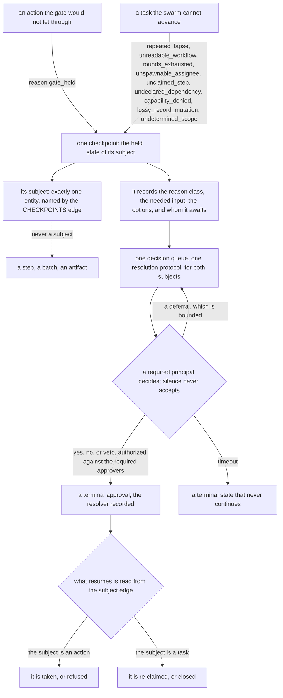

# Gates and workflows: the workflow's steps, the batch, the sign-off, the projection, and the gate that decides

**Kernel document:** read on every review (`conformance.md`). **Kind:** foundation; states the design and
never the state of a checkout. **Derived from:** synthesis `ent_b0ce322f768e4fc676b73139` (PR-04 to PR-08,
PR-20, PR-21, C3 to C6, C11), prior art `ent_08460968e6f49dac21510f4a`, gate-state plan
`ent_4222e5d52edd9bdba7b78cc1` (decisions cited inline), architecture plan `ent_99ace4dd6673aa36ed08b1fe`
decisions `operator_only_is_never_auto_executable_not_merely_high_blast`,
`unclassified_action_type_fails_closed_and_loudly`, `gate_advisory_and_enforcing_paths_must_agree`,
`gating_vocabulary_order_is_load_bearing`, throughput plan `ent_18b902cf72822373f9da8ced` decision
`gate_machinery_is_already_pr_independent`, PR #745 operator review (2026-09-04), and the operator
memos of 2026-09-05 12:48 and 12:52 (operator input as a standing finding), and the operator's 2026-09-05 terminology review (revision 17: the one boundary and the term `external system`, the `action series` rename, `subject` defined, and the two-part `checkpoint`), and the operator's 2026-09-05 review (revision 18: batch formation, stated in `work_model.md` and cross-referenced here), and the operator's 2026-09-05 review of review relevance (revision 19: the `applies_when` condition on an optional step, and two terms retired in favour of `review step`), and the operator's request for visuals during review (revision 20: the checkpoint diagram), and the operator's 2026-09-05 12:52 memo (revision 21: the general claim about self-modification, stated in `work_model.md` and cross-referenced from decision 17). Supersedes
`docs/archive/swarm_orchestration.md` and `docs/archive/swarm_hitl_checkpoints_design.md`. What is built
is `status.md`; how each concept is recorded is `data_model.md`.

## Purpose

State the step and gate model: `workflow` declares; a batch is the tasks going through it and the record
of that; step state is derived from edges and closed by a `sign-off`; `step_status` projects; one step
set; sequencing is data (`successors` + `FOLLOWS`); `gate` names the action gate only; actions are
entities and only actions are taken; two policies; the checkpoint.

## Scope

Workflow engines, the action gate, and the concepts `workflow`, batch, `sign-off`, `action`,
`checkpoint`, `action_policy`. Checkpoint resolution and approval attribution: `authority_model.md`.
Unreadable workflow and the checkpoints the swarm raises on tasks: `failure_posture.md`. Tasks in
batches, artifacts: `work_model.md`. Per-workflow step lists: `workflows.md` (authored companion; binds
via the `workflow` entity + `render_workflow_docs.py --check`, not the review prompt). External systems,
and the adapters that reach them: `adapters.md`.

## The invariants

### Declaration, batch, projection

`workflow` declares one entity per (project, workflow type): ordered `steps[]` (`phase`, `step_name`,
`owner_role`, `parallel_group`, `join_step`, `required`, `applies_when` — the condition that decides
whether an optional step opens at all, below — and `on_fail` — the earlier step a failing sign-off
opens again — plus `reads_to_enter`, `reads_to_close`, and `freshness`, the read dependencies below), plus
`fast_paths` and `successors`. `owner_role` holds a **role**, never an agent name: the
roster resolves it to a principal when the step is claimed (`vocabulary.md#step-owner`), so one
declaration serves every project and a renamed agent leaves no stale name in it. Step names are data: a workflow may declare steps
beyond the review sequence (a draft step, a deterministic lint, an operator preview). A contiguous named
group of steps is a stage.

A batch is one or more tasks going through a workflow, and the record of that (`work_model.md`). Its
subject is tasks; issues and pull requests are artifacts by edge, never the thing a step is taken on.

A step has no entity of its own. Derived state: batch + step → **open**; lease from step owner →
**claimed**; `sign-off` → **signed**. Opening a step publishes claimable step work; the step owner claims it
with the same lease primitive as a task (`work_model.md`). A `sign-off` is the terminal write that closes
a step (verdict, timestamps, agent, artifact refs, pinned `agent` version); a rejected write is
an error, never swallowed. This is principle 11 applied to steps: a per-step status row would need a
process to keep it true, and the three edges are read.

**A step declares what it must be able to read, to enter and to close.** The posture is not a judgement
each author makes at each call site: **the swarm does not advance a batch, or continue within a step, when
data the step depends on cannot be read.** What makes that enforceable rather than exhortative is the
declaration. Each step names `reads_to_enter` — the entity types it must read before it opens — and
`reads_to_close` — the types it must read before its sign-off is written. A step that cannot read a type it
declared does not proceed; a step that reads a type it did not declare is a **declaration error**, caught
the way an undeclared action class is, in the pull request that introduced it. That is the point of putting
the dependency in the declaration rather than in the code: an undeclared dependency is visibly missing,
where an unstated one is invisible until a read fails silently and something proceeds on the gap.

**For adapter-sourced types the declaration also states the freshness it requires.** `freshness` is read
the way `adapters.md` defines it — derived from an artifact's sourcing and coverage across its
observations, never a stored `last_synced_at` field a process would have to keep true (principle 11). So
this half adds a requirement, not a mechanism: what the adapter asked the external system for, against what
it actually got back, is already readable, and the step states what it needs of it. A read that returned
successfully but partially — scoped short, truncated, paged and not followed — is neither a failed read nor
an empty result, and coverage is what tells the three apart.

**The declared reads are resolved in a hydration phase before the step, and never during it.** The
declaration says what must be readable; hydration is when it is made so. Before a step opens, one phase
resolves every type in `reads_to_enter`: what the record already holds is read locally, and what an
external system holds is imported through that system's adapter, which writes it to the record as
observations on artifacts (`adapters.md#the-adapter-runs-before-and-after-a-step-never-during-it`). Both
halves resolve against the same declaration, and the step does not begin until they do. The same phase runs
again for `reads_to_close` before the sign-off is written. Nothing hydrates *during* a step: a step that
reaches an external system mid-execution reintroduces the second source of truth the boundary rules exist
to remove, and its inputs stop being a fixed set any reader can name. So a step's inputs are resolved,
recorded, and readable before it runs, and what the step then works on is the record.

**A hydration failure is the step's failure, and it takes the path a failed read already takes.** An
adapter that cannot fulfil a read it was asked for does not return an empty result: the read is `unknown`,
and the phase does not proceed to the step. That is the rule below, not a second one — the hold is bounded,
the condition is announced off-record, and the bound raises one checkpoint naming the dependency. The point
of routing it here rather than into a hydration-specific error path is that a step blocked on an external
import and a step blocked on an unreadable local type are the same condition to every reader of the record.

**A required read that returns `unknown` holds the step, bounded, then escalates.** The step does not open,
or does not close, and the condition is announced on the off-record path (`failure_posture.md` rule 2)
along with every other blocked claim in the window — cheap and correct while the cause is transient. The
hold is **bounded**: when the bound is reached, the step raises one checkpoint naming the dependency it
could not read, reason `undeclared_dependency`, so a permanently unreadable dependency stops being
indistinguishable from a slow one. This is rule 5's existing shape — deferral is bounded, exhaustion
escalates — applied to a read rather than to a task, which is why it extends a mechanism instead of
building a second one (principle 6).

**A degraded read never synthesizes a permissive value.** This holds however the declaration is written,
and it is the one shape that is dangerous under every posture. A failed read that returns a value *more*
permissive than success would have returned inverts the direction of authority: a stub granting a wildcard
capability set, an empty finding list standing in for a check that never ran, a missing policy read as no
restriction. Principle 5 forbids it in general terms and `authority_model.md#grants` states it for the
grant read; it is stated here because a step's declared reads are where it most often arises.

**`unknown` must be representable distinctly from empty at every read.** This is principle 7 stated where
it bites, and it is the precondition for everything above: until a failed read is distinguishable from a
legitimately empty result, no declaration can be enforced and no posture has anything true to act on. A
reader that collapses the two — an exception handler returning an empty list, a lookup returning the zero
value — has destroyed the distinction before any rule can apply to it. The recorded shape of `unknown` is
`data_model.md`.

**A required step is closed only by a sign-off, and no principal signs for another.** The step owner named
on the step is the only principal whose sign-off closes it; a second principal cannot supply the verdict,
and a step with no sign-off is open however long it has been open and however clear its outcome looks. The
one way an unsigned required step is closed by someone other than its owner is the operator closing it,
and that is not an exception to the rule but an instance of it: **the operator's close is a sign-off,
attributed to the operator principal, with verdict `waived`, carrying the reason.** There is no waiver
primitive, no override flag, and no field a principal sets on itself — a self-settable clearance re-states
"probably fine" in one boolean, which is the shape this model exists to remove. Because the close is a
sign-off, step state stays derived from edges (principle 11), the audit trail names who cleared the step
and why, and a waived step is visible as waived in `step_status` rather than indistinguishable from a
signed one. The action gate is unaffected: a waived workflow step does not permit an action, which is
evaluated on its own (below).

**Only the operator principal may waive, and a waiver is scoped to one batch's unsigned required steps,
written as one `waived` sign-off per step.** The right is not delegable: a step owner able to write
`waived` on its own step is the self-settable clearance this model exists to remove, restated in a verdict
value instead of a boolean. The scope is the batch — one invocation from the operator clears the unsigned
required steps of one batch, which is the shape in use and costs the operator nothing — but the **record**
is per step: one `waived` sign-off for each step cleared, each attributed to the operator principal, each
naming its step and carrying the reason. That keeps step state derived from sign-offs rather than from a
batch-level flag (principle 11), and it makes a waived step queryable as waived: how often, which steps,
and why, rather than a comment on an artifact that no reader reads. A clearance recorded only as prose on
an artifact is an observation and never a sign-off (`failure_posture.md` rule 4).

**An optional step is relevant or not, and what decides that is a declared condition on the step, not a
judgement made at the moment.** `required` has a false branch, and until this revision the design named
the field and stated nothing about it: every step table carries steps marked `no` (`legal` on feature,
`ux` and `legal` on copy) and no rule said who decides such a step is skipped, on what, or where that
decision is recorded. That silence is the hole. An optional step whose skip nobody declares is skipped
by whoever notices, on grounds no reader can name, which is the self-settable clearance the waiver rule
above exists to remove, restated one level up — at the step's existence rather than at its verdict.

So a step declares `applies_when`: a condition, evaluated against **what the batch's tasks are and what
their change touches**, that decides whether the step opens at all. It is data on the declaration, judged
once when the workflow is written and readable by anyone who reads the declaration. Three values, and the
third is principle 7: the condition holds and the step opens; it does not hold and the step is **declared
inapplicable**, recorded as such on the batch with the condition that ruled it out; it cannot be evaluated
— the input needed to judge it could not be read — and the step **opens**, because an unevaluable
relevance test fails toward review and never toward skipping it (principle 5). A step with no
`applies_when` always opens, which is what every step marked `required: yes` is.

**A declared-inapplicable step is not a signed one, and the two never read the same.** The batch records
which steps did not open and why, the same way it records which were waived; a reader asking what judged
this change gets three answers — signed, waived, inapplicable — and never one that hides the difference.
"The arch step found nothing wrong" and "no arch step ever opened" are different claims about a change,
and a projection that renders both as an absent blocking verdict has destroyed the distinction the same
way an empty result destroys `unknown`.

**A condition may read what the change touches, and this is the one place in the design where it may.**
Elsewhere a workflow's conditionals key on a property of the task set fixed at intake — `fast_paths` does,
and keeps doing so (`workflows.md`). `applies_when` is different in kind because the question it answers is
different: a fast path asks *how much of this workflow this class of task needs*, which intake knows; an
applicability condition asks *which perspectives this particular change warrants*, which intake cannot know,
because at intake the change does not exist. The design already accepts that the content of a change
conditions what a reviewer does: `conformance.md#read-when-these-paths-changed` selects which foundation
documents a reviewer loads by matching regexes against the changed paths. Conditioning which reviewer
opens at all is the same mechanism one level out, and refusing it while keeping the reading table would be
inconsistent rather than conservative.

Two limits keep this from becoming the label-on-an-artifact rule it must not become. First, the condition
is **declared on the workflow and never written on the artifact**: nothing a pull request's author says
about itself — a label, a title token, a body line, a checkbox — seats or unseats a reviewer, because that
is the reviewed party choosing its reviewers. The condition is authored where changing it is itself a
governance write through a workflow (**A change to what produced a finding**, above). Second, the
condition is evaluated **once, when the step would open**, against the batch's artifacts at that moment,
and the result is recorded with the head it was evaluated against; a later head that would have seated a
step it did not seat is the invalidation case `github.md` already names, and it reopens the question rather
than being answered by a stale evaluation.

**What an `applies_when` condition may read is declared, like every other read.** It names its inputs
through the same `reads_to_enter` mechanism as the step it guards, so a condition that reaches for
something the step never declared is a declaration error caught in the pull request that introduced it,
and a condition whose inputs are unreadable resolves to the third value above rather than to a skip.

And the negative, restated here because this is where a reader will look for it: **no step is closed by
elapsed time.** A waiver is an operator's deliberate act, not a timer; the answer to a step nobody has
claimed is a checkpoint against its owner role (`failure_posture.md`), never an automatic clearance. A gate
that expires into a pass is a gate that fails open on a timer.

**Scope amendment versus scope creep.** A batch carries acceptance criteria, and implementation regularly
turns up work that was not in view when they were written. A scope boundary is a decision record, not a
rule that outranks evidence gathered after it was written — so the addition **amends** the criterion when
three conditions hold together: it is disclosed rather than absorbed, it is escalated to the step owner
whose sign off the change touches, and it is defended against an acceptance criterion the batch already
carries. On all three the criterion is amended by that owner's ruling and the batch continues with the
work inside it. Absent any one of them the addition is scope creep, and the unrelated work is split into
its own batch, from the first step of its workflow
(`work_model.md#a-task-is-in-at-most-one-batch-at-a-time`). What separates the two is not the size of the
addition but whether the step owner ruled on it: undisclosed bundling is refused however small, and a
large amendment the owner ruled on is legitimate. Scope moving silently is the failure — a batch whose
shipped change exceeds what any principal judged carries sign offs pinned to an artifact state that no
longer describes it (`data_model.md#record-conventions`).

`step_status` on the task is the hot-path projection of the batch's sign-offs, so "all required steps
signed?" fails closed in one read. A reconciler proves it agrees with the sign-offs; neither is deleted,
neither is a second source of truth (`gate_status_map_should_remain`, under its former name). No
transition event type; history is the record's observations (`no_gate_transition_event_type`). One engine
opens steps from the entities and reads the sign-offs; a second engine that sequences from a code literal
and cannot see the first is the defect this model removes (`real_defect_is_two_blind_engines`).

### Findings, verdicts, and what a blocking finding obliges

A step owner judging a batch records **findings** (`vocabulary.md#finding`): one defect or objection each,
each carrying its own severity. The sign off carries a **verdict** (`vocabulary.md#verdict`), the summary
token that closes the step and states whether the step's **condition** (`vocabulary.md#condition`) is met.
**The findings bind, and a verdict that contradicts its own findings is rejected, not swallowed.** The
severity of the findings, not the summary token, is what blocks. A sign-off carrying a blocking finding
under a non-blocking verdict is a contradiction in one write, and the write is **refused at submission** —
which is not a new rule but the existing one applied, since a rejected sign-off write is an error, never
swallowed (above). The step owner is told its verdict contradicts its own finding and re-submits; the step
does not close in the meantime. Severity in the envelope is the only version an authoring mistake cannot
defeat: where only the summary token is read, a step owner who files a blocker in the wrong envelope has
blocked nothing, and the sole trace is prose no reader reads.

**The design's verdict values are three, and a host's review tokens are the adapter's inbound mapping.**
A verdict is `signed`, a blocking value, or `waived`, and nothing else. Where an external code host has its
own review vocabulary — approve, request changes, comment — those are **signals** the adapter maps inbound
to the record's three values, exactly as it maps every other inbound signal (`adapters.md`), and they are
never the record's vocabulary. A projection fed tokens the design does not define is a projection whose
meaning is per-author, which is how one step set comes to speak two languages onto one field.

**A verdict is terminal, and never revised in place.** A sign-off is the terminal write that closes a step.
A step owner that reaches a different judgement writes a **new sign-off**, and the latest per step owner
per artifact head is the one that stands; the superseded verdict stays readable, which the append-only
record gives for free. Rewriting a verdict in place is forbidden for the reason a sign-off is pinned to the
head it judged: a re-pointed verdict shows one approval of work its author never read, and destroys exactly
the reading the pinning exists to give. The cost is more rows and a read rule, and both are cheap against
an audit trail that silently misreports what was judged.

**A verdict carries no condition.** A verdict states whether the step's condition is met; it may not close
its step while binding what a later step must do. A conditional block hands the verdict to the party being
blocked — a step owner blocking "provided the fix lands" has delegated its own judgement to the
implementer, and the guarantee that a closed step was judged unconditionally is gone. A requirement that
must hold later has two homes that already exist: a task, or an acceptance criterion the batch already
carries. Neither is a clause in a verdict.

**A blocking finding is one of two kinds, and the kind decides what may be done about it.** An
**implementation-only** finding names a determinate defect with a determinate fix: the work is inside the
swarm's reach, so it may be routed to an implementer like any other task, and the step opens again on the
result. A **decision or attestation** finding needs a judgement or a statement of fact that only a
principal can make — that a trade-off is acceptable, that a risk was considered, that something is true of
the world — and it is not routable at all, because routing it would ask an implementer to supply the
judgement the finding exists to demand. In both kinds the step owner keeps the terminal sign off:
**routing the remedy never transfers the verdict.** An implementer that fixes the named defect produces
an artifact the step owner then judges; it does not close the step by having done the work.

**A blocking verdict names its evidence.** A blocking finding cites an executed command and the output it
produced — the check that was run and what it actually said. A verdict may rest on evidence another
mechanism executed, a CI run or a deterministic lint, provided the sign off names that mechanism as its
evidence and the result it read. What a blocking verdict may never do is present unexecuted reasoning as
an executed finding: a step owner that could not run the check files a **non-blocking** finding stating what it
could not verify, and says so plainly, rather than blocking on a defect it inferred. Reasoning about a
defect is a reason to look; it is not a reason to block, because a block asserts that the defect is there
and a principal downstream will act on that assertion without re-deriving it. This is principle 2 at the
verdict: a claim that was never read back is not evidence.

### A finding is one-off or standing, and a standing one obliges a change to what produced it

The rules above decide what a finding obliges **of this batch**. A second question is asked of the same
finding and answered separately: whether the defect it names is particular to the work in front of it, or
is a property of how that work gets made. A **one-off** finding is discharged when the batch's work is
corrected. A **standing** finding is not: the same defect will be produced again by the next batch of the
same kind, because nothing about the producing agent, workflow, or step changed. **Correcting the work a
standing finding names, and stopping there, is not discharging it** — the correction is owed to the batch,
and a change to what produced it is owed besides. A swarm that only ever repairs its output re-learns every
lesson once per batch, which is the shape principle 1 names: nothing binds, so nothing stops recurring.

**The operator's input on reviewed work is a finding, and it is judged on both axes.** An operator
reviewing a batch — at `operator_preview`, at `consent`, at `present`, or on any work the record already
holds — records findings the way any step owner does (`vocabulary.md#finding`), and they carry severity
and bind the same way. Nothing about the operator's input needs a second intake path, a second queue, or a
feedback entity beside the finding: the existing primitive already carries a judgement from a principal
about a batch, with provenance, and extending it is what principle 6 requires. What the operator's input
does raise more often than a review step's is the standing axis, because the operator is judging output against a
standard the swarm has not been told, and a standard nobody wrote down produces the same defect
indefinitely.

**Where a standing finding lands is decided by the specificity of the finding, not by who filed it.** A
finding whose defect would recur in every batch an agent handles is standing **on the agent**, and the
change is to that agent's `agent` prompt or the `agent_policy` it renders from
(`conformance.md#direction-of-truth-per-class-of-record`). A finding whose defect is a property of a
workflow — a step's condition too weak, a step missing, a `reads_to_enter` unstated — is standing **on the
workflow**, and the change is to the `workflow` declaration for that (project, workflow type). A finding
whose defect belongs to one step of one workflow is standing **on that step**, and the change is scoped to
it. The three are ordered narrowest-first: a defect statable about a step is not written into an agent's
prompt, where it would bind that agent across every workflow it handles and thereby assert more than the
finding supports. Widening the scope of a lesson is the same failure as narrowing it — one produces a rule
that fires where it does not belong, the other a rule that does not fire where it does.

**Where the scope is uncertain, the swarm asks rather than choosing.** A finding whose right scope is not
determinable from the finding itself is neither guessed nor silently dropped: the ambiguity is put to the
operator as a checkpoint, reason `undetermined_scope`, naming the finding, the candidate scopes, and what
each would bind. This is principle 7 at the classification — "we cannot tell which scope" is a third value
beside "agent" and "workflow", and coercing it to either is the failure. It is also why the standing axis
does not become an inference engine: the swarm proposes a scope it can defend and escalates the rest.

**A change to what produced a finding is a change like any other, and reaches the record the same way.**
Writes to `agent`, to `agent_policy`, and to a `workflow` declaration are governance writes, which are
actions evaluated at the action gate (**Two policies**, below); a proposed change is a proposal until the
gate lets it through, and never a mutation an agent makes to itself on its own finding. That is not extra
ceremony for this case, it is the rule those two classes already carry: a write that changes what a
principal is, or what a workflow requires, is the question the gate exists to ask, whoever proposed it and
however good the reason. So a standing finding produces a **proposed** change with provenance back to the
finding that raised it, and a principal with the authority to make that change takes it as an action.

**Open decision 17: whether institutionalizing a standing finding is itself a workflow.** The operator's
stated position is that it should be — that a standing finding produces tasks, that those tasks are
institutionalization tasks, and that they go through a workflow built for them, so that the swarm's changes
to itself are governed by the same machinery as its outward work. That reading is consistent with
everything above and with `work_model.md#a-task-is-executed-only-through-a-workflow`, which admits no side
door: a task that changes an agent or a workflow is executed through a workflow like any other, and its
governance writes reach the gate at their step. What is **not** settled, and is not settled here, is the
sequencing: whether the batch that raised the standing finding waits on the institutionalization task it
created, or closes and leaves that task to its own intake. Deciding that requires ruling whether a
workflow may hold on a condition discovered mid-flight, and whether a batch may depend on a task it
created — both of which are open and neither of which this revision rules. Until they are ruled, a
standing finding's proposed change is filed as a task entering intake on its own
(`work_model.md#intake-is-every-tasks-first-workflow`), and the batch that raised it closes on its own
steps; that is the state a reader should assume and not the design's ruling. The wider question the
operator's position implies — whether workflows are the general mechanism for changing the swarm's own
operation, and not only for doing its outward work — is answered *yes*, and it is stated as a rule of the
work model rather than here, because it is true of every change to the swarm and not only of the ones a
standing finding raises (`work_model.md#changing-the-swarm-is-work-and-it-goes-through-a-workflow-like-any-other`).
What that section leaves to the operator is the default posture for a governance write (open decision 18);
what stays open here is the sequencing between the batch that raised the finding and the task it created,
which that section does not rule and does not depend on.

### One step set, defined once, tested for parity

The step sequence has one home. Unavoidable copies are derived at import or held equal by a parity test;
a comment is not parity (principle 9). A data-sourced list may add steps and never remove one, as a
correctness rule, not an availability fallback (C5). Migration is incremental, never a flag day
(`migration_is_incremental_no_flag_day`).

### Sequencing is data: successors and the chain

`workflow.successors` names the workflows a closing batch's tasks may enter next. The last step is singular
(never a parallel group); its sign-off is the batch's closing sign-off and selects exactly one successor
from the list, or none. None is the normal close of a task that needs no further workflow. One: the tasks
enter the successor, a new batch record opens for them, and it carries a `FOLLOWS` edge to the closed one.
A task's chain is the batches read along `FOLLOWS` from its live batch back to intake — derived, never
stored. No entity above the batches holds a sequence of workflows: a stored sequence would need a
process to keep it true against the batches (principle 11). Parallel successors are forbidden; a batch
names one or none, and work that needs two workflows at once is split into child tasks
(`work_model.md#a-task-is-in-at-most-one-batch-at-a-time`). Intake is the universal entry
(`work_model.md#intake-is-every-tasks-first-workflow`), so every chain begins with an intake batch, and a
`successors` list that names intake is a declaration error. Core designs: `workflows.md`.
What this sequencing means for a batch's formation — that a closing sign-off naming a successor is the
only thing that opens a batch, which tasks it carries, and that the workflow is fixed at open and never
switched — is `work_model.md#how-a-batch-is-formed-and-what-chooses-its-workflow`, stated once there
(principle 9).

### Two policies: workflow policy and action policy

Two questions, two policies. Workflow policy answers which principals may claim which steps of which
workflows: the workflow's declared step owners together with the `agent_grant`s in force
(`authority_model.md`). Action policy answers which actions may be taken and under what gate: the
`action_policy` entity, the policy a principal evaluates the action gate against. A step owner's right to
sign off a step is workflow policy; whether the merge that follows may be taken is action policy. Neither
policy governs internal operational writes to Neotoma, which are not actions — **except for two named
classes, which are.**

**Governance writes are actions.** A write to `agent`, `action_policy`, `agent_grant`, `swarm_roster`, or
the schema registry is an action, evaluated at the action gate under the project's `action_policy`. These
five types define what the swarm may do: a write to a grant changes which capabilities a principal holds,
and a write to an agent changes what a principal is. That is the same question the gate exists to ask,
arriving through a door the gate cannot see while the rule is "where the write goes". The list is closed
and short, so the rule is checkable by inspection rather than judged per write.

**Lossy record mutations are actions.** A write that can destroy what the record already holds is an
action: merging entities, splitting one into several, migrating a field, and **any write whose blast
exceeds a declared entity count**. The count is declared in the `action_policy`, so what counts as bulk is a policy value
rather than each author's estimate. A held one carries the reason class `lossy_record_mutation`
(`vocabulary.md#checkpoint`). A single-field correction is not in this class; a template applied across
every agent's capability set is.

Everything else stays an internal operational write and reaches no gate. The line these two classes draw is
**what the write can destroy**, not where it goes — which is the distinction that separates the writes
worth holding from the routine ones — and both use the gate and the checkpoint queue that already exist
rather than a second path for record writes (principle 6).

### Actions are entities; only actions are taken

An `action` is one intended effect on a system the swarm does not own (a send, a publish, a merge, a
payment, a release), related to the task it serves (`PRODUCES` from the task; `REFERS_TO` where the action
cites the artifact it acts on). Created when the effect becomes known — possibly mid-workflow: a task may
produce many actions, most unknown at creation. Tasks are executed (claimed, done, completed); actions are
taken; "take" is never said of a task. The action gate is evaluated per action, at the moment it would be
taken, so an effect discovered late is gated no differently from one declared at creation. The dedup key
lives on the action (`work_model.md`).

**Which boundary "outside" names, stated once here.** There is one boundary in this design, and the record
is on the inside of it. The swarm is the engine, the agents, the adapters, and the record they all read and
write; outside is every system the swarm does not own — a code host, a mail system, a chat channel, a
calendar, a payment rail. Neotoma is not a second system on the far side of that line: it *is* the record,
and reaching it is how the swarm holds its own state (principle 9, `data_model.md`). So an internal
operational write to the record crosses nothing and is not an action, which is the same rule the two named
exceptions above bend on purpose — a governance write and a lossy record mutation are actions not because
of where they go, but because of what they can destroy. The word for the far side is **external**, and
`adapters.md` owns everything about crossing to it; the only component that does is an adapter.

### The action gate is PR-independent

A principal evaluating the action gate supplies the action's class, confidence, the policy, and
successful recurrences — no PR, issue, or repository. The checkpoint the gate writes keys on the action
and its task. The consent gate for outbound non-code work is this gate: a policy lists
`send_external_comms` and `publish` as high blast, the content agents' actions carry those classes, the
runner subscribes to the checkpoint, and the task is re-claimed on resolution. Do not build a second
gate (principle 6). PR-shaped review machinery (`step_status`, review verdicts, the steward's merge
action) is a separate mechanism layered on GitHub; the PR is an artifact of the batch.

### Confidence and three blast tiers

`operator_only` is `NEVER`; unclassified fails closed and loudly. The order is load-bearing
(`gating_vocabulary_order_is_load_bearing`): a task declares at creation, as its `action_type`, the
classes of action it expects to produce, from what the task does and never from which agent would handle
it; that declaration serves early eligibility and claim decisions. Each `action` carries its own class;
blast resolves from that class under the `action_policy` at the moment the action would be taken;
confidence is scored by the proposing agent. The gate decides on confidence and blast together. The
never-set (`operator_only`) wins ahead of both policy sets, so a policy cannot demote it; a declared
class in neither set logs a warning naming the value and resolves to `NEVER`, never to the policy default;
an absent class keeps the policy default ("nothing declared" stays distinct from "declared and
unclassified"). `NEVER` is a third tier: `HIGH` is still taken without a checkpoint once a recurring
series clears its count; `NEVER` short-circuits ahead of the confidence axis and the recurrence path. The
advisory path (`route_task`) and the enforcing path resolve identically, and a parity test holds the
duplicated never-set equal across the two modules. An unreachable policy source is a halt
(`failure_posture.md`), not a fallback policy with an empty low-blast set.

### An unreadable workflow is unknown, and unknown holds

Never proceed on an empty sequence. An unreadable `workflow` is a distinct state: no step of it is opened
or claimed, the batch's tasks are escalated with one checkpoint (reason `unreadable_workflow`), and no
exception is swallowed into an empty tuple. The same holds for an unreadable issue and an unreadable CI
state (principle 7).

### Non-code deliverables go through the same gate

A post, an outreach mail, a release, or a payment is an action with a class and a blast radius, and it
reaches approval through the action gate on the task path, as a merge does. What non-code agents lack
is delivery of the task (`work_model.md`), not a gate.

### External systems are reached only through adapters

Two invariants hold at the boundary; `adapters.md` states them in full and tables the mapping per
system. First, the workflow engine never reads an external system; it reads the record (batches, leases,
sign-offs, actions, checkpoints, artifacts), and only an adapter touches the external system, writing
what it learns there as a signal about an artifact, with provenance. This is "one engine sequences from
the entities" applied to the boundary. Second, no external event advances a step by itself: an event can
yield only a sign-off by a named principal, an observation on an artifact, an action confirmation, or a
new task for intake, and an automated account's approval never stands in for a review step's owner. Outbound, a step's
effect on an external system is an action through this gate, which the adapter takes on permit and
confirms by reading the system back.

### The checkpoint

A `checkpoint` is the held state of its **subject** awaiting a principal's decision. The subject is the one
entity the checkpoint holds, named by its `CHECKPOINTS` edge (`data_model.md`), and it is one of exactly
two things: an action the gate would not let through (reason `gate_hold`), or a task the swarm cannot
advance (`failure_posture.md`). Nothing else is ever a subject — not a step, not a batch, not an artifact —
because those are the only two kinds of thing the swarm can be stopped in the middle of doing.

**Why one term covers both, rather than two terms.** A held action and a held task are the same thing at
the level this document defines: work that has stopped short of a decision only a principal can make, and
that resumes on that decision or ends on it. What differs is only what resumes — the action is taken or
refused, the task is re-claimed or closed (`data_model.md`) — and that difference is already carried by the
subject edge's target and by the reason class. Splitting the term would give the same queue two names, two
presentation paths, and two resolution protocols for one protocol's worth of meaning, which is the second
gate principle 6 forbids. So: one term, one queue, and the subject says which case a reader is looking at.

It is interrupted, not terminal (A2A's `input-required`). It records its reason class, the needed input, the
options, whom it awaits, and who resolved it, and it ends in a terminal approval; a deferral is bounded
and a timeout is a terminal state that never continues
(`deferral_must_be_bounded_and_escalate_off_neotoma`). Its subject is linked by edge, never named in a
free-text field, so the queue is read from the record. The raiser and the resolver are distinct roles on
the object; whether the same principal may hold both is `authority_model.md`. One decision queue, one
resolution protocol: a checkpoint on a task is presented and resolved exactly as a checkpoint on an
action is (principle 6).

Two subjects entering one queue, and the subject edge deciding what resumes:

The halt is not on this diagram and is not a checkpoint: a checkpoint is written to the record, and the
halt is the state in which nothing can be (`failure_posture.md#what-a-checkpoint-does-not-absorb`).

## Contradictions this document settles

**C3.** Four copies of the step set → one home, parity where a copy is unavoidable. **C5.** The gate-state
plan body argues for a hardcoded step list as a floor the data may add to; its decisions map retracts that
(`hardcoded_floor_proposal_is_retired`); resolved for the retraction, `failure_posture.md` states why.
**C6.** Merge is an action whose class the `action_policy` governs, and the stored policy is the source
of truth for whether it is operator-gated; a runtime flag that disagrees is a configuration defect whose
resolution is the operator's (policy to flag, or flag to policy); live values are `status.md`. **C11.**
The gate decides on confidence × blast by design; a confidence input that is not produced degrades the
gate to blast alone — a gap in the proposing agents, not a design change. **C4.** A renamed or retired
agent leaves no stale mirror, in code and in design entities alike; the data correction is the gate-state
plan's, and whether it has been made is `status.md`.

**The names `workflow`, batch, `sign-off`, `checkpoint`.** This reverses the recorded decision
`keep_the_name_workflow_definition` in the gate-state plan `ent_4222e5d52edd9bdba7b78cc1`. Reason:
"definition", "record", and "brief" are redundant qualifiers when every entity in the store is a
definition, a record, or a description of something; `workflow` declares, a batch is the tasks going
through it and the record of that, a `sign-off` is what a step owner writes to close a step on it, and a
`checkpoint` is the held state itself; `participation_record` and `checkpoint_brief`, both retired, named
the weakest of these. No entity carries `run` in its name: `run` collided with the retired liveness
vocabulary, and a step's state is derived from edges rather than held in a per-step record.
`gate` is withdrawn from the step vocabulary so that the word names exactly one thing, the action gate.
The correction to that plan is a request to its maintainer; the decision keys cited above keep their
recorded names.

## Prior art

GitHub environment protection rules are the nearest declarative model of a step with a required sign-off;
Ateles shares the declarative definition and pre-step approval, not per-environment routing or the 1-of-n
rule, since blast radius selects the gate. Cedar's rule (zero permits is deny; any forbid wins) is the
semantics the advisory and enforcing paths share. A2A's `input-required` and `auth-required` are the
interrupted states a checkpoint is; Ateles does not share A2A's agent-asserted `working`, which has no
claimant and no expiry. Sources: `ent_08460968e6f49dac21510f4a`.
