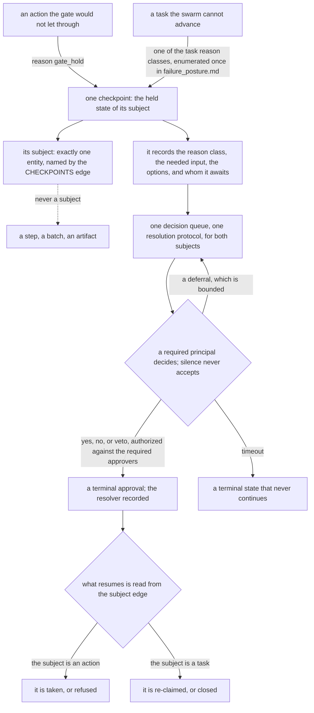

# Gates and workflows: the workflow's steps, the batch, the sign-off, the projection, and the gate that decides

**Kernel document:** read on every review (`conformance.md`). **Kind:** foundation; states the design and
never the state of a checkout. **Derived from:** synthesis `ent_b0ce322f768e4fc676b73139` (PR-04 to PR-08,
PR-20, PR-21, C3 to C6, C11), prior art `ent_08460968e6f49dac21510f4a`, gate-state plan
`ent_4222e5d52edd9bdba7b78cc1` (decisions cited inline), architecture plan `ent_99ace4dd6673aa36ed08b1fe`
decisions `operator_only_is_never_auto_executable_not_merely_high_blast`,
`unclassified_action_type_fails_closed_and_loudly`, `gate_advisory_and_enforcing_paths_must_agree`,
`gating_vocabulary_order_is_load_bearing`, throughput plan `ent_18b902cf72822373f9da8ced` decision
`gate_machinery_is_already_pr_independent`, PR #745 operator review (2026-09-04), and the operator
memos of 2026-09-05 12:48 and 12:52 (operator input as a standing finding), and the operator's 2026-09-05 terminology review (revision 17: the one boundary and the term `external system`, the `action series` rename, `subject` defined, and the two-part `checkpoint`), and the operator's 2026-09-05 review (revision 18: batch formation, stated in `work_model.md` and cross-referenced here), and the operator's 2026-09-05 review of review relevance (revision 19: the `applies_when` condition on an optional step, and two terms retired in favour of `review step`), and the operator's request for visuals during review (revision 20: the checkpoint diagram), and the operator's 2026-09-05 12:52 memo (revision 21: the general claim about self-modification, stated in `work_model.md` and cross-referenced from decision 17), and PR #745 operator review (2026-09-05, rulings 13–14, 16–18, 23–29: decision 17 ruled here; the `dependency_cycle` reason class), and the operator's 2026-09-05 proposal on recurring tasks (revision 27, decision 30: the next instance is a created task and not a successor), and the operator's 2026-09-05 22:02–22:13 memos on how tasks come into existence (revision 30, 2026-09-06: `intake_rule` joins the governance list). Supersedes
`docs/archive/swarm_orchestration.md` and `docs/archive/swarm_hitl_checkpoints_design.md`. What is built
is `status.md`; how each concept is recorded is `data_model.md`. Revised by the simplification pass of 2026-09-05 (revision 29: `workflow policy` retired and its section renamed; `hot path` retired; the reason classes cited from their one home; open decision 32). Revised by the memo-gap pass of 2026-09-06 (revision 31: decisions 37, 38, and 40 ruled here — work reviewed on the record, closed work redone through intake, and what a step leaves at close; the governance types stated as one list in one home; the finding's `unknown` classification; the `task_policy` home for an operator-specific standing finding). Revised by the workflow-format pass of 2026-09-06 (revision 34: two declared intervals on every step, `unclaimed_after` and `hold_bound`; a planned wait as a step's own close condition held under decision 13; required coverage as the value of `freshness`; consent over several like actions as one presentation of several checkpoints; the governance class with no policy value named among what resolves to `NEVER`).consistency pass of 2026-09-06 (revision 35: when the checkpoint a `consent` step carries is written, and what the gate evaluates at the take; the merge action's class named `merge_pr`). Revised by the second workflow-format pass of 2026-09-06 (revision 36: a step's bound may be declared as the task's `due_date`; an `operator_only` action inside a workflow is taken by the operator and its step closes on the confirmation, never on the resolution; a read dependency on a special-category type carries no marker of its own). Revised by the testability pass of 2026-09-06 (revision 37: the finding as an entity the rules bind on; `rounds_cap`; the recorded amendment; an optional step's condition reads what exists; `none_permitted`; the floor-list sentence retired; open decision 56 — where the enforcement point for a governance write sits). Revised by the rulings pass of 2026-09-06 (revision 38: decision 32 ruled — the `verdict` stays a stored field, the sign-off's own projection of its findings and its author, reconciled at the write). Revised by the second rulings pass of 2026-09-06 (revision 39: decision 56 ruled here — the sole-writer grant, the engine acting for the gate; the checkpoint's raiser and resolver never one principal save the operator's marked self-resolution, decision 47; the finding-as-entity settlement marked reviewed and upheld).

## Purpose

State the step and gate model: `workflow` declares; a batch is the tasks going through it and the record
of that; step state is derived from edges and closed by a `sign-off`; `step_status` projects; one step
set; sequencing is data (`successors` + `FOLLOWS`); `gate` names the action gate only; actions are
entities and only actions are taken; two policies; the checkpoint.

## Scope

Workflow engines, the action gate, and the concepts `workflow`, batch, `sign-off`, `action`,
`checkpoint`, `action_policy`. Checkpoint resolution and approval attribution: `authority_model.md`.
Unreadable workflow and the checkpoints the swarm raises on tasks: `failure_posture.md`. Tasks in
batches, artifacts: `work_model.md`. Per-workflow step lists: `workflows.md` (authored companion; binds
via the `workflow` entity + `render_workflow_docs.py --check`, not the review prompt). External systems,
and the adapters that reach them: `adapters.md`.

## The invariants

### Declaration, batch, projection

`workflow` declares one entity per (project, workflow type): ordered `steps[]` (`phase`, `step_name`,
`owner_role`, `parallel_group`, `join_step`, `required`, `applies_when` — the condition that decides
whether an optional step opens at all, below — and `on_fail` — the earlier step a failing sign-off
opens again, with `rounds_cap`, the rounds that loop may take, below — plus `reads_to_enter`, `reads_to_close`, and `freshness`, the read dependencies below, and
`unclaimed_after` and `hold_bound`, the two intervals below), plus `fast_paths` and `successors`, with
`none_permitted` (`#sequencing-is-data-successors-and-the-chain`). `owner_role` holds a **role**, never an agent name: the
roster resolves it to a principal when the step is claimed (`vocabulary.md#step-owner`), so one
declaration serves every project and a renamed agent leaves no stale name in it. Step names are data: a workflow may declare steps
beyond the review sequence (a draft step, a deterministic lint, an operator preview). A contiguous named
group of steps is a stage.

A batch is one or more tasks going through a workflow, and the record of that (`work_model.md`). Its
subject is tasks; issues and pull requests are artifacts by edge, never the thing a step is taken on.

A step has no entity of its own. Derived state: batch + step → **open**; lease from step owner →
**claimed**; `sign-off` → **signed**. Opening a step publishes claimable step work; the step owner claims it
with the same lease primitive as a task (`work_model.md`). A `sign-off` is the terminal write that closes
a step (verdict, timestamps, agent, artifact refs, pinned `agent` version); a rejected write is
an error, never swallowed. This is principle 11 applied to steps: a per-step status row would need a
process to keep it true, and the three edges are read.

**A step declares what it must be able to read, to enter and to close.** The posture is not a judgement
each author makes at each call site: **the swarm does not advance a batch, or continue within a step, when
data the step depends on cannot be read.** What makes that enforceable rather than exhortative is the
declaration. Each step names `reads_to_enter` — the entity types it must read before it opens — and
`reads_to_close` — the types it must read before its sign-off is written. A step that cannot read a type it
declared does not proceed; a step that reads a type it did not declare is a **declaration error**, caught
the way an undeclared action class is, in the pull request that introduced it. That is the point of putting
the dependency in the declaration rather than in the code: an undeclared dependency is visibly missing,
where an unstated one is invisible until a read fails silently and something proceeds on the gap.

**For adapter-sourced types the declaration also states the freshness it requires.** `freshness` is read
the way `adapters.md` defines it — derived from an artifact's sourcing and coverage across its
observations, never a stored `last_synced_at` field a process would have to keep true (principle 11). So
this half adds a requirement, not a mechanism: what the adapter asked the external system for, against what
it actually got back, is already readable, and the step states what it needs of it. A read that returned
successfully but partially — scoped short, truncated, paged and not followed — is neither a failed read nor
an empty result, and coverage is what tells the three apart. So the value of `freshness` is the coverage the
step requires — the window, or the set, the read must have returned in full, and whether a read that fell
short of it may satisfy the step at all — and a read whose coverage falls short of what the step declared is
`unknown` for that step, never a smaller success: the step holds on it as on any read it could not make
(below). That is what keeps a partial sweep from reading as a complete one — a mailbox window cut short by a
page not followed, a listing truncated, a long source read in part — because the shortfall is measured
against the declaration rather than noticed by whoever reads the result.

**The declared reads are resolved in a hydration phase before the step, and never during it.** The
declaration says what must be readable; hydration is when it is made so. Before a step opens, one phase
resolves every type in `reads_to_enter`: what the record already holds is read locally, and what an
external system holds is imported through that system's adapter, which writes it to the record as
observations on artifacts (`adapters.md#the-adapter-runs-before-and-after-a-step-never-during-it`). Both
halves resolve against the same declaration, and the step does not begin until they do. The same phase runs
again for `reads_to_close` before the sign-off is written. Nothing hydrates *during* a step: a step that
reaches an external system mid-execution reintroduces the second source of truth the boundary rules exist
to remove, and its inputs stop being a fixed set any reader can name. So a step's inputs are resolved,
recorded, and readable before it runs, and what the step then works on is the record.

**A read dependency on a type marked special-category is declared like any other and carries no marker of
its own.** Health data and the other categories the people-data rule names are bounded differently from a
contact — in who may be granted the type, in what may be copied out of it, in what a writer persists — but
every one of those differences is a property of the **type**, whatever step reads it and whoever the subject
is, so the mark sits on the registered type and the mechanisms that read it are stated once
(`data_model.md#record-conventions`). A marker on the read would be a second place to say the same thing, and
one that a declaration could omit.

**A hydration failure is the step's failure, and it takes the path a failed read already takes.** An
adapter that cannot fulfil a read it was asked for does not return an empty result: the read is `unknown`,
and the phase does not proceed to the step. That is the rule below, not a second one — the hold is bounded,
the condition is announced off-record, and the bound raises one checkpoint naming the dependency. The point
of routing it here rather than into a hydration-specific error path is that a step blocked on an external
import and a step blocked on an unreadable local type are the same condition to every reader of the record.

**A required read that returns `unknown` holds the step, bounded, then escalates.** The step does not open,
or does not close, and the condition is announced on the off-record path (`failure_posture.md` rule 2)
along with every other blocked claim in the window — cheap and correct while the cause is transient. The
hold is **bounded**: when the bound is reached, the step raises one checkpoint naming the dependency it
could not read, reason `undeclared_dependency`, so a permanently unreadable dependency stops being
indistinguishable from a slow one. This is rule 5's existing shape — deferral is bounded, exhaustion
escalates — applied to a read rather than to a task, which is why it extends a mechanism instead of
building a second one (principle 6).

**A degraded read never synthesizes a permissive value.** This holds however the declaration is written,
and it is the one shape that is dangerous under every posture. A failed read that returns a value *more*
permissive than success would have returned inverts the direction of authority: a stub granting a wildcard
capability set, an empty finding list standing in for a check that never ran, a missing policy read as no
restriction. Principle 5 forbids it in general terms and `authority_model.md#grants` states it for the
grant read; it is stated here because a step's declared reads are where it most often arises.

**`unknown` must be representable distinctly from empty at every read.** This is principle 7 stated where
it bites, and it is the precondition for everything above: until a failed read is distinguishable from a
legitimately empty result, no declaration can be enforced and no posture has anything true to act on. A
reader that collapses the two — an exception handler returning an empty list, a lookup returning the zero
value — has destroyed the distinction before any rule can apply to it. The recorded shape of `unknown` is
`data_model.md`.

**A required step is closed only by a sign-off, and no principal signs for another.** The step owner named
on the step is the only principal whose sign-off closes it; a second principal cannot supply the verdict,
and a step with no sign-off is open however long it has been open and however clear its outcome looks. The
one way an unsigned required step is closed by someone other than its owner is the operator closing it,
and that is not an exception to the rule but an instance of it: **the operator's close is a sign-off,
attributed to the operator principal, with verdict `waived`, carrying the reason.** There is no waiver
primitive, no override flag, and no field a principal sets on itself — a self-settable clearance re-states
"probably fine" in one boolean, which is the shape this model exists to remove. Because the close is a
sign-off, step state stays derived from edges (principle 11), the audit trail names who cleared the step
and why, and a waived step is visible as waived in `step_status` rather than indistinguishable from a
signed one. The action gate is unaffected: a waived workflow step does not permit an action, which is
evaluated on its own (below).

**Only the operator principal may waive, and a waiver is scoped to one batch's unsigned required steps,
written as one `waived` sign-off per step.** The right is not delegable: a step owner able to write
`waived` on its own step is the self-settable clearance this model exists to remove, restated in a verdict
value instead of a boolean. The scope is the batch — one invocation from the operator clears the unsigned
required steps of one batch, which is the shape in use and costs the operator nothing — but the **record**
is per step: one `waived` sign-off for each step cleared, each attributed to the operator principal, each
naming its step and carrying the reason. That keeps step state derived from sign-offs rather than from a
batch-level flag (principle 11), and it makes a waived step queryable as waived: how often, which steps,
and why, rather than a comment on an artifact that no reader reads. A clearance recorded only as prose on
an artifact is an observation and never a sign-off (`failure_posture.md` rule 4).

**An optional step is relevant or not, and what decides that is a declared condition on the step, not a
judgement made at the moment.** `required` has a false branch, and until this revision the design named
the field and stated nothing about it: every step table carries steps marked `no` (`legal` on feature,
`ux` and `legal` on copy) and no rule said who decides such a step is skipped, on what, or where that
decision is recorded. That silence is the hole. An optional step whose skip nobody declares is skipped
by whoever notices, on grounds no reader can name, which is the self-settable clearance the waiver rule
above exists to remove, restated one level up — at the step's existence rather than at its verdict.

So a step declares `applies_when`: a condition, evaluated against **what the batch's tasks are and what
their change touches**, that decides whether the step opens at all. It is data on the declaration, judged
once when the workflow is written and readable by anyone who reads the declaration. Three values, and the
third is principle 7: the condition holds and the step opens; it does not hold and the step is **declared
inapplicable**, recorded as such on the batch with the condition that ruled it out; it cannot be evaluated
— the input needed to judge it could not be read — and the step **opens**, because an unevaluable
relevance test fails toward review and never toward skipping it (principle 5). A step with no
`applies_when` always opens, which is what every step marked `required: yes` is.

**A declared-inapplicable step is not a signed one, and the two never read the same.** The batch records
which steps did not open and why, the same way it records which were waived; a reader asking what judged
this change gets three answers — signed, waived, inapplicable — and never one that hides the difference.
"The arch step found nothing wrong" and "no arch step ever opened" are different claims about a change,
and a projection that renders both as an absent blocking verdict has destroyed the distinction the same
way an empty result destroys `unknown`.

**A condition may read what the change touches, and this is the one place in the design where it may.**
Elsewhere a workflow's conditionals key on a property of the task set fixed at intake — `fast_paths` does,
and keeps doing so (`workflows.md`). `applies_when` is different in kind because the question it answers is
different: a fast path asks *how much of this workflow this class of task needs*, which intake knows; an
applicability condition asks *which perspectives this particular change warrants*, which intake cannot know,
because at intake the change does not exist. The design already accepts that the content of a change
conditions what a reviewer does: `conformance.md#read-when-these-paths-changed` selects which foundation
documents a reviewer loads by matching regexes against the changed paths. Conditioning which reviewer
opens at all is the same mechanism one level out, and refusing it while keeping the reading table would be
inconsistent rather than conservative.

Two limits keep this from becoming the label-on-an-artifact rule it must not become. First, the condition
is **declared on the workflow and never written on the artifact**: nothing a pull request's author says
about itself — a label, a title token, a body line, a checkbox — seats or unseats a reviewer, because that
is the reviewed party choosing its reviewers. The condition is authored where changing it is itself a
governance write through a workflow (**A change to what produced a finding**, above). Second, the
condition is evaluated **once, when the step would open**, against the batch's artifacts at that moment,
and the result is recorded with the head it was evaluated against; a later head that would have seated a
step it did not seat is the invalidation case `github.md` already names, and it reopens the question rather
than being answered by a stale evaluation.

**What an `applies_when` condition may read is declared, like every other read.** It names its inputs
through the same `reads_to_enter` mechanism as the step it guards, so a condition that reaches for
something the step never declared is a declaration error caught in the pull request that introduced it,
and a condition whose inputs are unreadable resolves to the third value above rather than to a skip.

**An optional step's condition reads what exists when the step would open.** `applies_when` is evaluated
against what the batch's tasks are and what their change touches, and which of the two it may read follows
from where the step sits. A step placed after the step that produces the change — `legal` after `impl` —
may read the change. A step placed before any artifact exists — `ux` on `copy`, ahead of `impl` — has no
change to read and declares its condition over the task set alone, as a fast path does: what the tasks name
and the surface they concern. The declaration check enforces the placement: a condition whose declared
inputs name an artifact type that no earlier step's `reads_to_close` names could never be evaluated, would
always take the third value, and would open every time — an optional step in name only — and that
declaration is refused when it is written, as one naming a role no roster resolves is
(`failure_posture.md#checkpoints-on-tasks-one-queue-one-protocol`). So an optional step is optional in
fact, and a test can make it inapplicable.

And the negative, restated here because this is where a reader will look for it: **no step is closed by
elapsed time.** A waiver is an operator's deliberate act, not a timer; the answer to a step nobody has
claimed is a checkpoint against its owner role (`failure_posture.md`), never an automatic clearance. A gate
that expires into a pass is a gate that fails open on a timer.

**A step declares two intervals, and each is a bound on how long the record may show nothing before a
checkpoint says so.** `unclaimed_after` is the interval an open step may stay unclaimed before one checkpoint
is raised against the role declared on it, reason `unclaimed_step`
(`failure_posture.md#checkpoints-on-tasks-one-queue-one-protocol`); the rule there says the interval is
declared and never inferred, and this is the field it is declared in. It is on the step rather than on the
workflow because the checkpoint is routed against the role the step declares, and the roles differ in what an
absence means: a lint runner that has not claimed in an hour is absent, and an operator-facing agent that has
not claimed a `consent` step in an hour is not. `hold_bound` is the interval a claimed step may hold on a
condition — its step owner renewing the lease with a finding naming what it cannot yet judge
(`work_model.md#a-batch-may-hold-on-a-condition-discovered-mid-flight`, decision 13) — before the bound is
reached; it is the ceiling rule 5 requires of every deferral (`failure_posture.md#the-rules`), stated per
step so that a reader, or a test, knows when the checkpoint is due rather than inferring it from a policy the
step does not name. An undeclared interval is treated as the unclaimed-step rule already treats its own:
nothing is raised, and the absence is visible in the declaration — a defect caught in the pull request that
introduced it, never a default supplied at runtime, since a supplied interval would be a default that fails
open (principle 5). Neither interval closes anything: both end in a checkpoint, and the paragraph above
holds — no step is closed by elapsed time.

**A wait the workflow knows of when it is declared is a step's own condition, held under decision 13, and
bounded by `hold_bound`.** Some workflows know at declaration that a step will depend on something arriving
from outside the swarm — a reply to a message sent, a counterparty's confirmation of a proposed time, a
recipient's response to a page shared, the operator's own decision on an operator-only task. That is not a
case for `applies_when`, which is evaluated once when the step would open and would rule the step
inapplicable for want of a reply that has not yet arrived; and it is not a new field, because decision 13
already states that a declared condition and a discovered one differ only in when they are recorded
(`work_model.md#a-batch-may-hold-on-a-condition-discovered-mid-flight`). So a planned wait is written where
every step's condition is written — in the step's close condition, which names the arrival — and the
step owner that has claimed it holds: lease renewed, a finding naming what is awaited, no sign-off. What
`hold_bound` adds is the end. Where the close condition declares an alternative close — `outreach`'s
`follow_up` closes on a reply linked, or on the interval passed and one follow-up sent, or on the operator
ending it (`workflows.md#outreach`) — reaching the bound is the step owner's cue to sign on that alternative,
and the hold ends in a sign-off, which is decision 13's first end. Where the close condition declares none —
the step cannot honestly close without the arrival — reaching the bound is rule 5's ceiling, and the hold
ends in one checkpoint, reason `rounds_exhausted`, carrying the finding, which is decision 13's third end.
Which of the two a step has is readable from its declaration, and in neither does the bound itself close the
step.

**A bound may be declared as a date the task carries, and reaching it takes the path an interval's end
takes.** Some steps are bounded by a date fixed outside the swarm and known when the task is formed — a
statutory response window, a notification duty's clock, an agency's filing date — and an interval from the
claim cannot say it: the date does not move because the step was claimed late. The date is the task's, not
the declaration's. `due_date` is its field (`data_model.md#concepts`), written at creation or corrected by the
step that reads the notice and establishes it, and a deadline that work sets for later work is a task with a
`due_date` of its own (`workflows.md#intake`, source 5 of `work_model.md#where-tasks-come-from-every-source-indexed`).
So what the declaration states is not the date but that the step's bound **is** that date: `hold_bound`, or
`unclaimed_after`, may be declared as the task's `due_date` in place of an interval, and for a batch of several
tasks the earliest is the bound. Nothing else changes. Reaching a date-declared bound is reaching the bound —
the step signs on its declared alternative close where it has one, or raises one checkpoint, reason
`rounds_exhausted`, where it has none, and the checkpoint names the date that passed. What the date does
**not** do is close the step, in either direction. A step closed as failed because a date passed is a verdict
no principal made — the same shape as a gate that expires into a pass, with the sign read the other way — and
it would open the `on_fail` step by a clock, which is sequencing by a timer rather than by a verdict. A
deadline missed is a fact the operator decides on — file late, contest, let it go — and the checkpoint is
where that decision is made; the step owner then signs the verdict that follows from it.

**A step with an `on_fail` target declares `rounds_cap`, the number of rounds its loop may take.** A
failing sign-off opens the earlier step `on_fail` names, and the loop between the two is a deferral like
every other, so rule 5 gives it a ceiling (`failure_posture.md#the-rules`): at the cap, one checkpoint on
a task of the batch, reason `rounds_exhausted`, carrying the last blocking finding. The cap is declared on
the step, beside the target, because a loop's tolerable length is a property of what the two steps judge
and not of the project; an undeclared cap is treated as an undeclared interval is — nothing is raised, and
the absence is visible in the declaration, a defect caught in the pull request that introduced it and never
a default supplied at runtime. The cap does not close anything: a step in a loop is closed by a sign-off
or it is open, and the checkpoint at the cap changes no verdict.

**Scope amendment versus scope creep.** A batch carries acceptance criteria — the `acceptance_criteria[]`
its tasks carry, stated on each task at `pm` (`data_model.md#concepts`; `workflows.md#feature`) — and
implementation regularly turns up work that was not in view when they were written. A scope boundary is a
decision record, not a rule that outranks evidence gathered after it was written — so the addition
**amends** the criterion when three conditions hold together: it is disclosed rather than absorbed, it is
escalated to the step owner whose sign off the change touches, and it is defended against an acceptance
criterion the batch already carries. On all three the criterion is amended by that owner's ruling and the
batch continues with the work inside it. Absent any one of them the addition is scope creep, and the
unrelated work is split into its own batch, from the first step of its workflow
(`work_model.md#a-task-is-in-at-most-one-batch-at-a-time`). What separates the two is not the size of the
addition but whether the step owner ruled on it: undisclosed bundling is refused however small, and a
large amendment the owner ruled on is legitimate. Scope moving silently is the failure — a batch whose
shipped change exceeds what any principal judged carries sign offs pinned to an artifact state that no
longer describes it (`data_model.md#record-conventions`).

**An amendment is recorded, or it is creep.** The three conditions leave a trace only if the ruling is a
write, so the ruling is two writes the record already has: the step owner records a finding, non-blocking,
naming the addition and the criterion it is defended against; and it corrects the task's
`acceptance_criteria[]` with a correction whose idempotency key names that finding — a correction names its
intent in its key (`data_model.md#record-conventions`), and here the intent is the finding. Disclosed is the
finding; escalated is the correction's attribution to the step owner whose sign off the change touches;
defended is the criterion the finding names. A correction to the criteria attributed to anyone but a step
owner of the batch, or naming no finding, is refused at the write. Whether a shipped change exceeds the
criteria stays the review step's judgement, and this section does not pretend otherwise; that it exceeded
them with no amendment on the record is a read, and it is the failing artefact.

`step_status` on the task is the projection of the batch's sign-offs, so "all required steps
signed?" fails closed in one read. A reconciler proves it agrees with the sign-offs; neither is deleted,
neither is a second source of truth (`gate_status_map_should_remain`, under its former name). No
transition event type; history is the record's observations (`no_gate_transition_event_type`). One engine
opens steps from the entities and reads the sign-offs; a second engine that sequences from a code literal
and cannot see the first is the defect this model removes (`real_defect_is_two_blind_engines`).

### What a step leaves at close: what it produced, and a reference to what it read

**Ruled (decision 40, 2026-09-06): a step's close records what the step produced and names what it read;
it copies nothing it read and stores no account of its own reasoning.** Registered in
`conformance.md#the-register-of-open-design-decisions`. The operator asked that the session a step ran in,
and everything that session saw, be stored when the step completes, so that later work — a later step of
the same batch, or any other work — can use it. The design agrees with the aim and states precisely what is
stored, because the three things a session "saw" have three different fates.

**What it produced is written, as the entities it is.** The sign-off with its findings; the observations its
work made; the entities its work created — an analysis, a draft, a `meeting_analysis`, a task for intake;
and the `REFERS_TO` edges from the task to the record entities the step discovered the task concerns
(`workflows.md#what-link-attaches-and-what-it-leaves-to-hydration`). These are the write contract's rows
(`data_model.md#what-each-actor-reads-and-writes`), and each is read back. They are what a later step reads
first — the sign-offs already on the batch are in every step's retrieval — and they are how context found
part-way through a batch reaches the next step without the next step finding it again.

**What it read is named, not copied.** The sign-off refers to what the step judged on: every artifact, with
the `head` it was observed at (`artifact_refs[]`), and every record entity it read, by reference
(`REFERS_TO` sign-off → entity; `data_model.md#relationships`). The state of each at the moment of the
verdict is not stored a second time, because the record already holds it and can return it: an as-of read
along ingestion time at the sign-off's `signed_at` returns what was readable then and excludes what arrived
later (`adapters.md#what-the-record-supplies-and-what-an-adapter-therefore-never-builds`), and the
hydration phase wrote every external read as observations with provenance before the step began
(`#declaration-batch-projection`). So "what did this step see" is a read: the references on the sign-off,
resolved as of its time. A copy would be the parallel log the record conventions forbid, and a copy that is
also read is a second source of truth for what the step knew — the two answers diverge the first time an
observation is corrected. **This is the check the ruling rests on:** reads are reproducible only if every
read was either an observation in the record before the step ran or is named on the sign-off with a time,
and both halves are already rules. Where a step read something it neither hydrated nor named, its reads are
not reproducible, and that is a declaration error of the kind an undeclared read already is.

**Its reasoning is not written to the record.** The turns of the session, the drafts it discarded, the paths
it considered are not an entity the design has, and the retrieval contract states the consequence from the
reader's side: another step owner's in-progress reasoning is not read, because there is none in the record
— only sign-offs (`data_model.md#what-each-actor-reads-and-writes`). That is deliberate. A step is judged by
its sign-off and findings, which are the claims a principal stands behind, pinned to what they judged;
reasoning stored beside them would be read as a further kind of evidence with no author standing behind it,
and a later step that read it would be reasoning from another principal's unfinished reasoning rather than
from the record. What of a session **is** an entity is the `agent_session`: the identity half a runner's
observations lack — host, checkout, branch, head — and its liveness, related to the task
(`data_model.md#concepts`). It stays that and gains no transcript field. Where a session's transcript is
itself the input to work, it is the source a task refers to, as session digestion already treats it
(`workflows.md#session-digestion`), and not a property of the step whose session it was.

**The cost accepted** is that a step owner cannot read how a previous step owner arrived at a verdict, only
the verdict, the findings, and what they were made on. That is the cost the retrieval contract already
chose, and the design's own view is that it is not one: a verdict whose grounds are not in its findings is a
verdict that named too little evidence, and the remedy is a finding, not a transcript. **What would reopen
it:** a reader in practice that needs a step's intermediate products — a draft rejected, a source read and
set aside — and finds them in no entity; the remedy would be an entity for that product with an author,
written by the step that made it, not a store of the session.

### Findings, verdicts, and what a blocking finding obliges

A step owner judging a batch records **findings** (`vocabulary.md#finding`): one defect or objection each,
each carrying its own severity. The sign off carries a **verdict** (`vocabulary.md#verdict`), the summary
token that closes the step and states whether the step's **condition** (`vocabulary.md#condition`) is met.
**The findings bind, and a verdict that contradicts its own findings is rejected, not swallowed.** The
severity of the findings, not the summary token, is what blocks. A sign-off carrying a blocking finding
under a non-blocking verdict is a contradiction in one write, and the write is **refused at submission** —
which is not a new rule but the existing one applied, since a rejected sign-off write is an error, never
swallowed (above). The step owner is told its verdict contradicts its own finding and re-submits; the step
does not close in the meantime. Severity in the envelope is the only version an authoring mistake cannot
defeat: where only the summary token is read, a step owner who files a blocker in the wrong envelope has
blocked nothing, and the sole trace is prose no reader reads.

**The design's verdict values are three, and a host's review tokens are the adapter's inbound mapping.**
A verdict is `signed`, a blocking value, or `waived`, and nothing else. Where an external code host has its
own review vocabulary — approve, request changes, comment — those are **signals** the adapter maps inbound
to the record's three values, exactly as it maps every other inbound signal (`adapters.md`), and they are
never the record's vocabulary. A projection fed tokens the design does not define is a projection whose
meaning is per-author, which is how one step set comes to speak two languages onto one field.

**A verdict is terminal, and never revised in place.** A sign-off is the terminal write that closes a step.
A step owner that reaches a different judgement writes a **new sign-off**, and the latest per step owner
per artifact head is the one that stands; the superseded verdict stays readable, which the append-only
record gives for free. Rewriting a verdict in place is forbidden for the reason a sign-off is pinned to the
head it judged: a re-pointed verdict shows one approval of work its author never read, and destroys exactly
the reading the pinning exists to give. The cost is more rows and a read rule, and both are cheap against
an audit trail that silently misreports what was judged.

**A verdict carries no condition.** A verdict states whether the step's condition is met; it may not close
its step while binding what a later step must do. A conditional block hands the verdict to the party being
blocked — a step owner blocking "provided the fix lands" has delegated its own judgement to the
implementer, and the guarantee that a closed step was judged unconditionally is gone. A requirement that
must hold later has two homes that already exist: a task, or an acceptance criterion the batch already
carries. Neither is a clause in a verdict. The rule has a mechanical half and a reviewed half, and says which is
which: neither `sign_off` nor `finding` declares a field a condition could be written in
(`data_model.md#concepts`), so none can be written as one, and what a finding obliges of later work is a
task that refers to it or an amendment to the acceptance criteria (above), each readable; a condition
written as prose inside a finding's text is what the review step that reads the finding refuses, and that
half stays a review and is recorded as one.

**A blocking finding is one of two kinds, and the kind decides what may be done about it.** An
**implementation-only** finding names a determinate defect with a determinate fix: the work is inside the
swarm's reach, so it may be routed to an implementer like any other task, and the step opens again on the
result. A **decision or attestation** finding needs a judgement or a statement of fact that only a
principal can make — that a trade-off is acceptable, that a risk was considered, that something is true of
the world — and it is not routable at all, because routing it would ask an implementer to supply the
judgement the finding exists to demand. In both kinds the step owner keeps the terminal sign off:
**routing the remedy never transfers the verdict.** An implementer that fixes the named defect produces
an artifact the step owner then judges; it does not close the step by having done the work.

**A blocking verdict names its evidence.** A blocking finding cites an executed command and the output it
produced — the check that was run and what it actually said. A verdict may rest on evidence another
mechanism executed, a CI run or a deterministic lint, provided the sign off names that mechanism as its
evidence and the result it read. What a blocking verdict may never do is present unexecuted reasoning as
an executed finding: a step owner that could not run the check files a **non-blocking** finding stating what it
could not verify, and says so plainly, rather than blocking on a defect it inferred. Reasoning about a
defect is a reason to look; it is not a reason to block, because a block asserts that the defect is there
and a principal downstream will act on that assertion without re-deriving it. This is principle 2 at the
verdict: a claim that was never read back is not evidence.

**A finding is an entity, and the rules above bind on its fields** (settled by the testability pass; reviewed
and upheld by the operator 2026-09-06). A finding is recorded as a `finding`
(`data_model.md#concepts`), carried by the sign-off that judges the batch — `PART_OF` it — and referring to
the batch it judges; a hold's finding stands with no sign-off for as long as the hold does
(`work_model.md#a-batch-may-hold-on-a-condition-discovered-mid-flight`), and the operator's finding on
closed work has none either (`#closed-work-is-reviewed-on-the-record-and-redone-through-intake-never-reopened`).
Its `severity` is what blocks: the refusal at submission compares the verdict to the severities of the
findings the sign-off carries, and nothing else. Its `kind` is what decides routability. Its `evidence` is
required where it blocks, and a blocking finding written with none is refused at the write rather than read
as a block on inferred reasoning. Its `scope` is the standing axis below. Nothing about the shape is
restated here (principle 9): the row is the data model's, and this section says only which rule reads
which field.

### Whether the verdict is a stored field or a read over the findings and the author

**Ruled (decision 32, 2026-09-06): the `verdict` stays a stored field, as the sign-off's own projection of
its findings and its author, reconciled at the write.** Registered as ruled in
`conformance.md#the-register-of-open-design-decisions`. The field is not retired.

**The question.** A sign-off stores a `verdict` — `signed`, a blocking value, or
`waived` — and the rules above make it agree with what else the sign-off carries: the findings bind, a
verdict contradicting them is refused at submission, and `waived` is the one value only the operator
principal may write, on a step it does not own. Everything the field states is therefore derivable from
the sign-off's other contents: a sign-off carrying a blocking finding blocks; one carrying none is
`signed`; one written by the operator principal on a step whose owner it is not is `waived`, carrying its
reason. A stored value held equal to a derivation by a check at the write is the shape
`data_model.md#concepts` names a projection, and principle 11 asks of every stored state whether a process
is needed to keep it true — here the refusal at submission is that process.

**The options.** Keep the field as the record's own projection, on the ground that "is this step signed"
is the one-read question `step_status` exists for and the verdict is what `step_status` is built from. Or
retire it: a sign-off carries its findings and its author, the three values become derived reads, and the
refusal-at-submission rule disappears because the contradiction it refuses can no longer be written.

**What shifts, and why this is proposed rather than applied.** The guarantee that a verdict agrees with
its findings is kept either way, but by construction instead of by a refusal, which is a shift in what
covers it and not an exact preservation; the adapters' inbound mapping of a host's review tokens onto the
three values (`github.md#reviews-review-comments-and-threads`) would map onto a sign-off with or without
a blocking finding instead; and the design's finding, which had no row in `data_model.md` when this was
opened (`migration.md`, gap G15), now has one — so a derived verdict would rest on a type the record
declares, and the blocker the conformance matrix named for this decision is gone. What remained was the
question itself. **What would decide it,** as the question was opened:
whether any reader needs the three values faster than a read over the findings gives them — if
`step_status` already serves that reader, the field is a second projection of one source. Opened by the simplification pass of 2026-09-05 without the conformance matrix, which had not landed; the proof above rested on principles 6 and 9 alone.

**Why the field stays.** Principle 11 forbids stored state that needs a process to stay true, and names one
exception — "a projection is the one exception, and it is reconciled" (`data_model.md#concepts`). The verdict is
that exception in its cleanest form, because the reconciler runs at the only moment the field can change: a
sign-off is a terminal write that supplies every field, the findings it carries are the `finding` entities
written `PART_OF` it in that write, and a verdict is never revised in place — so the refusal at submission
compares the verdict to the severities of exactly the findings the sign-off will ever carry, and nothing
afterwards can make them disagree. A finding written later on the same work is the operator's finding on closed
work (`#closed-work-is-reviewed-on-the-record-and-redone-through-intake-never-reopened`) or a hold's
(`work_model.md#a-batch-may-hold-on-a-condition-discovered-mid-flight`), and neither is `PART_OF` a sign-off.
`step_status` is the same shape one level up — proved equal to the sign-offs by a reconciler, neither a second
source of truth (`#declaration-batch-projection`) — and the verdict is what `step_status` is built from. So the
deciding test is answered the other way round from the way it was posed: `step_status` does not serve the
reader instead of the verdict, it is served *by* the verdict, and retiring the field would move the
projection's source from a stated judgement to the absence of one.

That absence is the reason of principle, and it is principle 5's. Under derivation a sign-off carrying no
finding is `signed`: silence is approval, and a step owner who recorded nothing has closed a step by omission.
Under the field the step owner states `signed`, and a sign-off with no verdict is a rejected write, an error
never swallowed — the fail-closed branch. The verdict is the step owner's stated judgement; the findings are its
evidence; the design asks for both because a claim never made cannot be read back (principle 2), and the
refusal at submission is precisely the read-back of the one against the other. The rulings of revision 12 that
the findings bind and a contradicting verdict is refused, and that a verdict is terminal and unconditional, are
written against a stated verdict and lose their mechanic without one: the retirement case above says the
refusal "disappears because the contradiction it refuses can no longer be written", and what disappears with
it is the statement the contradiction was measured against. Retirement would have bought one field fewer; it
would have cost a step closing on evidence nobody summarized.

**What the blocker was, and that it is gone.** The conformance matrix found this decision blocked on the
finding having no recorded shape (U-6; `migration.md`, G15). The testability pass (revision 37) gave the
`finding` its row, which is what made a ruling writable against a declared type; the shape did not decide the
question — it made a derived verdict possible, and the ruling above is that it is not the right one.

**Cost accepted.** One stored value a derivation could reproduce, plus the reconciler at the write, which is
the refusal the design already had. The inbound mapping of a host's review tokens onto the three values
(`github.md#reviews-review-comments-and-threads`) stands as written.

**What would reopen it.** A finding that may be attached to a sign-off after its write — which would make the
reconciler a process rather than a moment, and the field the stored state principle 11 forbids. The design has
no such write, and admitting one would reopen more than this decision.

**Matrix.** GW-19, GW-20, and GW-21 stand as mechanical rows; GW-51 closes (`conformance_suite.md`).

### A finding is one-off or standing, and a standing one obliges a change to what produced it

The rules above decide what a finding obliges **of this batch**. A second question is asked of the same
finding and answered separately: whether the defect it names is particular to the work in front of it, or
is a property of how that work gets made. A **one-off** finding is discharged when the batch's work is
corrected. A **standing** finding is not: the same defect will be produced again by the next batch of the
same kind, because nothing about the producing agent, workflow, or step changed. **Correcting the work a
standing finding names, and stopping there, is not discharging it** — the correction is owed to the batch,
and a change to what produced it is owed besides. A swarm that only ever repairs its output re-learns every
lesson once per batch, which is the shape principle 1 names: nothing binds, so nothing stops recurring.

**The operator's input on reviewed work is a finding, and it is judged on both axes.** An operator
reviewing a batch — at `consent`, at `present`, or on any work the record already
holds — records findings the way any step owner does (`vocabulary.md#finding`), and they carry severity
and bind the same way. Nothing about the operator's input needs a second intake path, a second queue, or a
feedback entity beside the finding: the existing primitive already carries a judgement from a principal
about a batch, with provenance, and extending it is what principle 6 requires. What the operator's input
does raise more often than a review step's is the standing axis, because the operator is judging output against a
standard the swarm has not been told, and a standard nobody wrote down produces the same defect
indefinitely.

**Where a standing finding lands is decided by the specificity of the finding, not by who filed it.** A
finding whose defect would recur in every batch an agent handles is standing **on the agent**, and the
change is to that agent's `agent` prompt or the `agent_policy` it renders from
(`conformance.md#direction-of-truth-per-class-of-record`) — unless what the finding names is
operator-specific. A prompt and an `agent_policy` are public and generic, describing a role and never an
operator, so a standing finding whose content is a preference, a name, a figure, a locale, or anything else
particular to this operator lands in a `task_policy` entity, the home that table names for operator
preferences, which the agent reads by type through its `context_entity_types`; the prompt gains at most the
instruction to read the type, and the write to the `task_policy` is an internal operational write, not a
governance one. A finding whose defect is a property of a
workflow — a step's condition too weak, a step missing, a `reads_to_enter` unstated — is standing **on the
workflow**, and the change is to the `workflow` declaration for that (project, workflow type). A finding
whose defect belongs to one step of one workflow is standing **on that step**, and the change is scoped to
it. The three are ordered narrowest-first: a defect statable about a step is not written into an agent's
prompt, where it would bind that agent across every workflow it handles and thereby assert more than the
finding supports. Widening the scope of a lesson is the same failure as narrowing it — one produces a rule
that fires where it does not belong, the other a rule that does not fire where it does. The scope chosen is
recorded as the finding's `scope` (`data_model.md#concepts`), and the proposed change is a task that
`REFERS_TO` the finding, so the scope a change was made at is attributable to the finding that argued it and
checkable against it: a write to an `agent` from a finding whose scope is `step` is the widening this
paragraph forbids, made readable, and a finding whose scope is `unknown` produces no change until the
checkpoint below is resolved.

**Where the classification is uncertain — on either axis — the swarm asks rather than choosing.** The
scopes a finding can land on are ordered narrowest-first, and the narrowest is **this batch**: a one-off
finding is a finding whose scope is the batch it was recorded on, and the standing scopes — step, workflow,
agent — widen from there. So "does this generalize at all" and "to which scope" are one question with four
candidate answers, and the classifier has a fifth value, `unknown`, for the case it cannot decide. That
value is never coerced to the narrowest scope: a finding classified one-off by default is a lesson silently
dropped, which is the permissive default principle 7 forbids and the one no reader can see, because a
one-off finding is discharged with the batch and raises nothing afterwards. A finding whose scope is not
determinable from the finding itself — whether between one-off and standing, or among the standing scopes
— is neither guessed nor silently dropped: it is put to the operator as a checkpoint, reason
`undetermined_scope`, naming the finding, the candidate scopes including the batch alone, and what each
would bind. This is principle 7 at the classification — "we cannot tell" is a value beside the four scopes,
and coercing it to any of them is the failure. It is also why the standing axis does not become an
inference engine: the swarm proposes a scope it can defend and escalates the rest. One reason class serves
both axes because they are one question; a second class for "one-off or standing" would be a second name
for the same escalation (principle 9).

**A change to what produced a finding is a change like any other, and reaches the record the same way.**
A write to an `agent`, to an `agent_policy`, or to a `workflow` declaration is a governance write — the
closed list of governance types is stated once, in
`#two-questions-who-may-claim-a-step-and-whether-an-action-may-be-taken`, and not restated here — which is
an action evaluated at the action gate; a proposed change is a proposal until the
gate lets it through, and never a mutation an agent makes to itself on its own finding. That is not extra
ceremony for this case, it is the rule those two classes already carry: a write that changes what a
principal is, or what a workflow requires, is the question the gate exists to ask, whoever proposed it and
however good the reason. So a standing finding produces a **proposed** change with provenance back to the
finding that raised it, and a principal with the authority to make that change takes it as an action.

**Ruled (decision 17, 2026-09-05): institutionalizing a standing finding is a workflow, and the batch that
raised the finding does not wait for it.** Registered in `conformance.md#the-register-of-open-design-decisions`.
Both halves. The first was the operator's stated position and follows from the work model's general rule: a
standing finding produces a task, the task is an institutionalization task — one whose work is a change to
the agent, the workflow, or the step that produced the finding — and it is executed like every other task,
entering intake and going through the workflow intake names for it, with its governance writes reaching the
action gate at their step (`work_model.md#changing-the-swarm-is-work-and-it-goes-through-a-workflow-like-any-other`).
There is no side door for the swarm's changes to itself, and this is the case where the rule does the most
work. The second half is the sequencing: **the raising batch closes on its own steps, and the
institutionalization task enters intake independently.** The batch records no dependency on it —
`work_model.md#a-batch-may-depend-on-a-task-it-created` permits one, and this ruling declines it for this
class of task — and the link between the two is the provenance the task already carries back to the finding
that raised it. What this revision's predecessor stated as the interim reading is now the rule.

**Reason.** The operator's own framing of a finding separated two purposes — apply the input to the work in
front of the swarm, *and* improve the swarm — and the standing axis exists to keep them separately recorded:
the correction is owed to the batch, the change to what produced it is owed besides, and neither discharges
the other. Coupling them at the sequencing would undo that separation. Every batch that produced a learning
would hold, lease renewed, until the swarm had finished learning — until the institutionalization task had
gone through intake, been prioritized against everything else, gone through its workflow, and had its
governance writes permitted at the gate, which under the reserved default
(`work_model.md#changing-the-swarm-is-work-and-it-goes-through-a-workflow-like-any-other`, decision 18) is
a change the operator makes by hand. Outward work whose review surfaced a lesson would be the slowest work in
the swarm, and the more the swarm learned the less it would ship — an inversion of priority that buys nothing,
because the correction the finding owes the batch is made in the batch, and the change to the agent or the
workflow cannot reach *this* batch anyway: it changes how the next batch of the kind is executed. The crux the
open question named — whether a review step that judged a workflow wrong can honestly sign that the
workflow's step was satisfied — resolves the same way. They are two claims, and the design records them as
two: the verdict states whether the step's condition is met for this batch's work, and the finding's standing
axis states that what produced the work will produce the defect again. A step owner that corrected the work
and filed the finding as standing has signed nothing false; a step owner that signed without filing it has,
and that is the failure the standing axis catches, not one that sequencing would.

**What decision 14 permits and this ruling declines.** A batch may hold on a task it created where its
sign-off would be a lie without it. An institutionalization task is not such a case, by the reasoning above,
so a step owner does not record a `DEPENDS_ON` edge to one, and a batch whose step owner believes its work
cannot close until the swarm has changed has misclassified the finding — the defect in the work is one-off
and is corrected in the batch; the defect in the producer is standing and is the task's. Where a step owner
genuinely cannot tell, the question goes to the operator as `undetermined_scope` (above), and the batch holds
on that checkpoint, not on the task.

**The cost accepted** is that the raising batch closes while its lesson is still a proposal, and the next
batch of the same kind may be produced by the unchanged agent or workflow before the institutionalization
task lands. That is the state the swarm is in for every lesson it has not yet institutionalized, and it is
bounded by the task's own priority — a standing finding whose recurrence is costly is prioritized accordingly
at its own intake. **What would reopen it:** a class of standing finding for which even one recurrence is
not tolerable — where the producer must change *before* any further batch of the kind is executed. The
remedy there is not to hold the raising batch, which changes nothing about the next one, but a declaration:
a workflow whose entry condition or `applies_when` reads an open institutionalization task against its own
type and holds the entry or seats the step; that is a change to a declaration and would be argued where
declarations are (`workflows.md`).

### Work is reviewed on the record, and a channel carries only what awaits the operator or cannot wait

**Ruled (decision 37, 2026-09-06): the operator's view of work is a read of the record, and a channel
carries a declared subset of it.** Registered in `conformance.md#the-register-of-open-design-decisions`. An
operator wanting to see the results of all work — what is open, what is held, what closed and with which
verdicts — reads the record: the batches and their chains, the sign-offs and the findings they carry, the
checkpoints and who resolved them, the artifacts by edge. A dashboard is that read rendered for a
principal, and it is nothing more than that read: it is made under the operator's credential and grant like
every other read (`authority_model.md#grants`); it crosses no boundary, because the record is on the inside
of the one boundary this design has (`#actions-are-entities-only-actions-are-taken`), so it is not an
adapter and needs none; and it has no write contract of its own, because whatever the operator writes
through it is one of the writes the design already attributes to the operator principal — a checkpoint's
resolution, a finding on a batch (above), a `waived` sign-off, a task. The read is the review surface, not
a copy of it: a client that kept a picture of the queue beside the record would be a second source of truth
for the operator's decisions, and stale in the direction that matters (principle 11).

**What a channel carries is the exception, and it is declared, not judged per message.** Three things
reach a chat, a mailbox, or any other channel the `channel_config` binding names, and nothing else does by
default. A **checkpoint awaiting the operator** is carried, because a decision nobody has seen is work
stopped, and a queue nothing consumes is a report (principle 1); the operator-facing agent carries it
(`workflows.md#operator-only`, `telegram.md#outbound-the-operations-a-step-takes-on-the-channel`). The
**announcement path** carries what cannot wait for a read and may have no record to be read from — a halt
entering and leaving, the window's aggregated drops and blocked claims (`failure_posture.md#the-rules`,
rule 2). And a **delivery a workflow declared** — a `deliver` step whose brief named a channel
(`workflows.md#research-and-analysis`) — carries the one thing its brief asked to be carried. Completed
work is not on that list: a batch closing, a step signing, a finding filed, a task created reach no
channel, because each is readable on the record the moment it is written, and the operator reads it there.
Which reason classes and which deliveries a given operator wants carried, and to which chat, is data on the
binding that names the channel, so the selectivity is the operator's to set and never the carrier's to
infer — the carrier reads what the binding declares, and a message it cannot map to a declared class is
not sent.

**Reason.** The two surfaces answer different questions, and the design should not make one imitate the
other. The record answers "what is the state of the work", which is a read over everything and is wrong the
moment it is a copy; a channel answers "what needs me now", which is a small set the operator must not have
to look for. Carrying everything to a channel makes the channel the review surface, and a channel is the
wrong shape for it: it holds a message, not a chain; the message is a copy that is not corrected when the
record is; and a channel that carries every completion is a channel the operator mutes, at which point the
checkpoints it also carries are muted with it — the muted-announcement failure `telegram.md` names, arrived
at from the other direction. Carrying nothing makes the decision queue a report. The declared subset is the
shape that keeps the queue a control and the record the truth.

**What this does not change.** The one decision queue is still read from the record, not from the channel:
a checkpoint is open until resolved on the record whatever its delivery status, and a reply on a channel
resolves one only by correlation to a checkpoint the record holds
(`telegram.md#a-chat-message-is-not-an-instruction`). The operator's input on work they read, held or
closed, is a finding and takes the standing axis (above; the next section for closed work). And nothing
here adds an actor: the dashboard is the operator reading, and the operator is already a principal with a
grant.

**The cost accepted** is that a completion the operator would have wanted to hear of is not carried unless
a workflow declares its delivery or the binding lists it, so an operator who does not read the record does
not learn of closed work. Accepted: the alternative — a channel that carries completions by default — is the
muted channel above, and an operator who wants a completion carried has two declared ways to say so. **What
would reopen it:** a class of completion in practice that the operator needs carried and cannot declare
through either — a delivery step or the binding — which would be a gap in what the binding can name, not in
the rule.

### Closed work is reviewed on the record and redone through intake, never reopened

**Ruled (decision 38, 2026-09-06): a closed batch is never reopened; the operator's input on it is a
finding, and the redo it calls for is a new task entering intake, referring to the closed batch's
artifacts.** Registered in `conformance.md#the-register-of-open-design-decisions`. The operator may review
any work the record holds, including work that closed without ever awaiting them, and record findings on it
as on a held batch (above). What differs on a closed batch is only where the one-off half of a finding
lands. On an open batch the correction is owed to the batch and made in it. On a closed batch there is no
step to make it in: its sign-offs are written, its chain has ended, and its tasks are terminal. So the
correction is a **task** — created with provenance back to the finding, referring by `REFERS_TO` to the
artifacts the closed batch left and to the entities it produced, and entering intake like every created
task (`work_model.md#intake-is-every-tasks-first-workflow`). Intake routes it to whichever workflow the redo
needs, which may not be the workflow the original went through: a merged change is redone through a code
workflow as a further change, a sent message through outreach as a follow-up, a published page through the
copy workflow as a superseding version. The standing half of the finding is unchanged by the batch being
closed: it produces an institutionalization task as decision 17 already rules.

**Why not reopen.** Three rules the design already keeps decide it, and each would be broken by a reopen.
*There is no task lifecycle* (`work_model.md#there-is-no-task-lifecycle-there-are-batches`): a terminal
task returning to open is a status mutation a process would have to perform, and the `task` row already
lists a reopened status among the things that are deliberately not a field (`data_model.md#concepts`).
*Sequencing is data* (`#sequencing-is-data-successors-and-the-chain`): a batch is opened only by a closing
sign-off naming a successor, or at intake for a created task, and a closed batch has no sign-off left to
write, so reopening one would open a batch by a mechanism formation does not have. *A sign-off is terminal
and pinned* (`data_model.md#record-conventions`): the closed batch's verdicts were made against the artifact
heads they name and stay true as the account of what was judged then; a redo that wrote new sign-offs into
the old batch would put verdicts on one batch that judged two different states of the work. The new task's
batch is judged on its own, against the redone artifact's head, and the two accounts stand side by side,
which is what an append-only record is for.

**What the operator sees.** The chain of the redo begins at the new task's intake batch, and its relation
to the closed work is read from edges rather than from a shared batch: the new task refers to the same
artifacts; the finding that raised it names the batch it was recorded on; and the redone artifact carries
its own history in the external system, which the adapter writes as observations. Nothing in the closed
batch changes, and nothing needs to — "this was redone" is a read over the finding and the task, not a flag
on the batch (principle 11). The code host's own reopen event already takes this path: `issues.reopened`
is an observation, and further work is a new task through intake (`github.md#issues`).

**The cost accepted** is a second batch, with its own intake, for work the operator sees as one thing.
Accepted, because the batches are two: one judged the work as it was, the other judges it as redone, and a
reader asking what was judged when gets both answers. **What would reopen it:** nothing about closed work
in particular; it would reopen only if the design admitted a task lifecycle, which is C1 and is closed.

### One step set, defined once, tested for parity

The step sequence has one home, the declaration. Unavoidable copies are derived from it or held equal to it
by a parity test; a comment is not parity (principle 9). There is no floor list in code that the data adds
to: the sentence that once stood here — a data-sourced list may add steps and never remove one — presupposed
a base list in code, and under the hard dependency there is none. An unreadable declaration opens nothing
(`#an-unreadable-workflow-is-unknown-and-unknown-holds`; C5, `failure_posture.md#contradictions-this-document-settles`),
and a copy that adds or removes a step against the declaration fails the parity test, which is the whole of
the rule. Migration is incremental, never a flag day (`migration_is_incremental_no_flag_day`).

### Sequencing is data: successors and the chain

`workflow.successors` names the workflows a closing batch's tasks may enter next, and `none_permitted` says
whether the closing sign-off may name none. The last step is singular (never a parallel group); its sign-off
is the batch's closing sign-off and selects exactly one successor from the list, or none where the
declaration permits it. None is the normal close of a task that needs no further workflow, and a
declaration that permits it says so reviewably: a closing sign-off naming none under a declaration that does
not permit it is refused at the write, so a security batch cannot end unreleased (`workflows.md#security`),
and a feature declaration permits none only for a project that deploys its default branch on its own
cadence (`workflows.md#feature`) — which is what makes "landed" a derived read over the chain and not a
status (`work_model.md#a-task-is-executed-only-through-a-workflow`). One: the tasks
enter the successor, a new batch record opens for them, and it carries a `FOLLOWS` edge to the closed one.
A task's chain is the batches read along `FOLLOWS` from its live batch back to intake — derived, never
stored. No entity above the batches holds a sequence of workflows: a stored sequence would need a
process to keep it true against the batches (principle 11). Parallel successors are forbidden; a batch
names one or none, and work that needs two workflows at once is split into child tasks
(`work_model.md#a-task-is-in-at-most-one-batch-at-a-time`). Intake is the universal entry
(`work_model.md#intake-is-every-tasks-first-workflow`), so every chain begins with an intake batch, and a
`successors` list that names intake is a declaration error. A recurring task's closing sign-off names none
and **creates** the next instance — a new task whose own intake batch opens on its creation — which is a
task creation and not a successor; the instances are linked `FOLLOWS` task to task, and the rule is stated
once in `work_model.md#a-recurring-task-is-one-live-instance-and-its-completion-creates-the-next`. Core designs: `workflows.md`.
What this sequencing means for a batch's formation — that a closing sign-off naming a successor is the
only thing that opens a batch, which tasks it carries, and that the workflow is fixed at open and never
switched — is `work_model.md#how-a-batch-is-formed-and-what-chooses-its-workflow`, stated once there
(principle 9).

### Two questions: who may claim a step, and whether an action may be taken

Two questions, two answers, and only the second has a policy entity. Which principals may claim which
steps of which workflows is decided by the workflow's declared step owners together with the
`agent_grant`s in force (`authority_model.md`); the declaration and the grants are that answer, and no
rule set stands beside them under a name of its own. Which actions may be taken and under what gate is the
`action_policy` entity, the policy a principal evaluates the action gate against. A step owner's right to
sign off a step comes from its declared role and its grant; whether the `merge_pr` action that follows may
be taken is the action policy's. Neither the declaration, the grants, nor the policy governs internal operational
writes to Neotoma, which are not actions — **except for two named classes, which are.**

**Governance writes are actions, and the governance types are one closed list, stated here and nowhere
else.** A write to any of these eight is an action, evaluated at the action gate under the project's
`action_policy`: `agent` (what a principal is), `agent_policy` (the behavioural rule an agent's prompt
renders from), a `workflow` declaration (how every future batch of its type is executed), `action_policy`
(which actions may be taken, and under what gate), `agent_grant` (which capabilities a principal holds),
`swarm_roster` (which principal fills a role), the schema registry (what the record can hold), and an
`intake_rule` (which changes in the record become work —
`work_model.md#an-intake-rule-turns-a-described-change-in-the-record-into-a-task-and-nothing-else`). The test
that admits a type is what a write to it changes: each of the eight defines what the swarm may do, what a
principal is, or how work reaches the swarm, so a write to one asks the question the gate exists to ask,
arriving through a door the gate cannot see while the rule is "where the write goes". A type a step reads as
an input — a `task_policy`, a `channel_config`, a `priority_rubric` — is not on the list: a write to it
changes what the swarm knows, not what it may do, and reaches the gate only where it is lossy (below). The
list is closed and short, so the rule is checkable by inspection rather than judged per write, and it has one
home: every other document cites this section and none restates the members. It was found stated three ways
with two memberships — the types named here, and three in the work model and in the standing-finding section
— and a closed list in three places is not closed (principle 9); the eight above are the union, each admitted
by the test.

**Lossy record mutations are actions.** A write that can destroy what the record already holds is an
action: merging entities, splitting one into several, migrating a field, and **any write whose blast
exceeds a declared entity count**. The count is declared in the `action_policy`, so what counts as bulk is a policy value
rather than each author's estimate. A held one carries the reason class `lossy_record_mutation`
(`vocabulary.md#checkpoint`). A single-field correction is not in this class; a template applied across
every agent's capability set is.

Everything else stays an internal operational write and reaches no gate. The line these two classes draw is
**what the write can destroy**, not where it goes — which is the distinction that separates the writes
worth holding from the routine ones — and both use the gate and the checkpoint queue that already exist
rather than a second path for record writes (principle 6).

### Where the enforcement point for a governance write sits

**Ruled (decision 56, 2026-09-06, with 43): an admitted governance write is tied to a permitted action by a
sole-writer grant — for each governance type, exactly one principal holds the write capability, the engine
acting for the gate, and it writes only on a permit; every other principal's write to a governance type is
refused at the record's admission under decision 41.** Registered as ruled in
`conformance.md#the-register-of-open-design-decisions`. Two controls stand on a governance write — admission by
grant, and the write being an action taken on a permit — and this ruling gives the second the enforcement
point the first already has: the grant, read at the write. No step owner's grant admits a governance type; the
one grant that does is held by the component that evaluates the action gate and makes the write as the
action's effect (the engine, in the sense `#the-action-gate-is-pr-independent` and `adapters.md` use the
word; its definition is decision 34's), so a governance write that lands is one the gate let through, and one
with no permitted action behind it cannot land, because the only credential that could write it is the one
that writes on nothing else.

**Why.** Principle 6 — the question was which existing mechanism to extend, and the grant is the one the
design already has for who may write what. The record's admission check reading the action would ask the
record's project to evaluate a permit, a dependency of the kind `migration.md` counts as G25 and a feature the
record does not have; a proxy in front of the record would be a second gate on the write path to the swarm's
own record, which principle 6 forbids by name; the grant is enforced at the write already, by the record, with
no new feature on either side. Principle 1 places the check at the write, and this is the one option where the
check at the write and the check on the permit are a single read. Decision 43 is what makes it whole: the
operator's own governance write after bootstrap passes the same point
(`conformance_suite.md#what-the-bootstrap-set-is-and-whether-the-operators-later-governance-writes-are-gated`),
so the operator's path runs through the engine's grant and never around it — the operator's task produces
the action, the gate holds it, the operator resolves it as a marked self-resolution (decision 47,
`authority_model.md#the-raiser-of-a-checkpoint-does-not-resolve-it-and-the-operators-self-resolution-is-marked`),
and the engine writes. Had 43 gone the other way the operator's credential would hold a second grant over the
governance types, and the sole writer would not be sole.

**Cost accepted.** The engine is a single point: a governance write is possible only while the component
holding the grant is alive, and its credential is the one whose compromise reaches every governance type at
once — kept narrow and revocable under `authority_model.md#grants` (custody, rotation, and revocation's reach),
and mitigated by the ruling that makes it whole, since the operator's path is through it and not a standing
second key. The bootstrap set is written before the engine exists and is the enumerated exception (decision
43); a fourteenth write by the operator's bare credential is not provisioning and is refused at admission like
any other. For the migration, leg one grants the engine the governance types and grants the step-owner roles
the ordinary types their steps write (`migration.md#how-the-migration-is-governed`).

**What would reopen it.** A governance type that must be written by a principal the engine cannot act for —
a write the gate cannot hold because no action of any class carries it — which would first be a gap in the
closed list of classes, and would reopen that list before it reopened this. The cross-type cycle walk of
`work_model.md#a-batch-may-depend-on-a-task-it-created` keeps the shape this ruling names: the writer is its
enforcement point, and the writer walks before it writes.

**Matrix.** WM-22, GW-29, GW-33, GW-33a, WM-40b, AD-27, and MG-4 turn from audit to refusal: a governance
write by any credential but the engine's is refused at admission, and the engine's is one a permitted action
names (`conformance_suite.md`).

### Actions are entities; only actions are taken

An `action` is one intended effect on a system the swarm does not own (a send, a publish, a merge, a
payment, a release), related to the task it serves (`PRODUCES` from the task; `REFERS_TO` where the action
cites the artifact it acts on). Created when the effect becomes known — possibly mid-workflow: a task may
produce many actions, most unknown at creation. Tasks are executed (claimed, done, completed); actions are
taken; "take" is never said of a task. The action gate is evaluated per action, at the moment it would be
taken, so an effect discovered late is gated no differently from one declared at creation; where a
workflow declares a `consent` step, the gate's hold is obtained there, ahead of the take, and the take is
evaluated again on the standing resolution
(`#the-checkpoint-is-written-where-the-gate-first-holds-the-action-and-the-permit-is-decided-at-the-take`).
The dedup key lives on the action (`work_model.md`).

**Which boundary "outside" names, stated once here.** There is one boundary in this design, and the record
is on the inside of it. The swarm is the engine, the agents, the adapters, and the record they all read and
write; outside is every system the swarm does not own — a code host, a mail system, a chat channel, a
calendar, a payment rail. Neotoma is not a second system on the far side of that line: it *is* the record,
and reaching it is how the swarm holds its own state (principle 9, `data_model.md`). So an internal
operational write to the record crosses nothing and is not an action, which is the same rule the two named
exceptions above bend on purpose — a governance write and a lossy record mutation are actions not because
of where they go, but because of what they can destroy. The word for the far side is **external**, and
`adapters.md` owns everything about crossing to it; the only component that does is an adapter.

### The action gate is PR-independent

A principal evaluating the action gate supplies the action's class, confidence, the policy, and
successful recurrences — no PR, issue, or repository. The checkpoint the gate writes keys on the action
and its task. The consent gate for outbound non-code work is this gate: a policy lists
`send_external_comms` and `publish` as high blast, the content agents' actions carry those classes, the
runner subscribes to the checkpoint, and the task is re-claimed on resolution. Do not build a second
gate (principle 6). PR-shaped review machinery (`step_status`, review verdicts, the steward's merge
action) is a separate mechanism layered on GitHub; the PR is an artifact of the batch.

### The checkpoint is written where the gate first holds the action, and the permit is decided at the take

**A workflow that declares a `consent` step obtains the gate's hold ahead of the take, and the gate is
evaluated once more when the action is taken.** The gate is one decision function, asked whenever a
principal needs to know whether an action may be taken, and for an action whose workflow places `consent`
before `send`, `pay`, or `post` it is asked at two moments. The first is when the action becomes known and
the `consent` step opens — the drafts have passed `review`, or the `verify` sign-off has recorded the
figures: the gate is evaluated on the action's class, its confidence, the `action_policy`, and the class's
action series, and where it would hold, **the checkpoint is written then**, reason `gate_hold`. That is the
checkpoint the step carries to the operator and whose resolution it records (`workflows.md#outreach`,
`workflows.md#payment`, `workflows.md#social-content`). Where the gate would not hold — the class is low
blast at threshold, or its action series has graduated — no checkpoint is written and the step carries
nothing, which is what `workflows.md#payment` means by a graduation changing whether `consent` carries a
checkpoint and not whether the step exists. The second moment is the take: at `send`, `pay`, or `post`
the adapter asks the gate again, at the moment the action would be taken, as
`#actions-are-entities-only-actions-are-taken` says of every action.

**A hold may be decided early; a permit is decided only at the take.** This asymmetry is what makes the two
evaluations one gate rather than two (principle 6). The first evaluation can only stop the action or write
nothing: a hold decided before the take is safe, because nothing has been taken on it. It never permits,
because a permit issued at `consent` would be a decision about a take that has not happened, on parameters
and under a policy that may differ by the time it does. So the operator's resolution of the checkpoint is
**not the permit**. It is an input to the take-time evaluation, read from the record at that moment —
principle 2 at the gate: a resolution a runner has held in memory since `consent` is a report of a write,
and the write is what is read — and the gate permits the take when four things hold together:

1. the action's checkpoint carries a terminal resolution of `approved`, attributed to a principal the
   checkpoint awaited (`authority_model.md#approval`);
2. the parameters the action would be taken on equal those the checkpoint carried, within the class's
   `consent_tolerance`, zero where absent (decisions 27 and 28:
   `payments.md#a-payments-approver-is-shown-exactly-what-the-verifier-signed`,
   `payments.md#tolerance-is-an-action_policy-value-and-its-default-is-zero`);
3. the `action_policy`, as read at the take, still resolves the class as it did when the hold was written —
   a class the operator has since reserved resolves to `NEVER` whatever the resolution says, since the
   never-set wins ahead of any policy (`#confidence-and-three-blast-tiers`) and a standing approval is not
   a policy;
4. no confirmation exists for the action's `dedup_key`
   (`work_model.md#at-least-once-implies-effect-dedup`).

A difference on any of the four is never a stale permit re-used. The first two raise a new checkpoint — the
parameters case is decision 28's rule, and `consent`'s `on_fail` opens the earlier step on the new figures;
the third is a `NEVER` at the gate, which holds the action and awaits the operator like any other hold;
the fourth is an action already taken, which is confirmed by reading the external system back and is not
taken again.

**What the design does not supply is a clock.** The four inputs are everything that can make a standing
resolution stale, and none of them is elapsed time: an approval given on one day and taken on another, on
the same parameters under the same policy, is approval of the same thing, and the interval between
`consent` and the take is already bounded on the task path — the lease is renewed while the operator
decides, a lapse makes the step claimable again, and the re-claim takes the same action on the same key. A
time bound on a resolution would be a number the design invented, and the reasoning that made the tolerance
a policy value with a zero default (decision 28) applies to it unchanged: the shape is a per-class value on
the `action_policy`, and the number, where an operator wants one, is the operator's. Absent a value there
is no clock, because the four inputs already name every way a take can differ from what was consented to.

**Why the checkpoint is written at `consent` and not at the take.** The alternative reading — the gate
writes the checkpoint only at `send`, and `consent` is a step that shows the operator a draft — leaves
`consent` with nothing to carry and makes the take the step that waits on a human, which contradicts the
step tables that name `consent` as the step carrying the checkpoint and `send` as the step taking the
action (`workflows.md`). It also leaves the operator's decision off the record until the take: a preview
answered on a channel and acted on at `send` is a second approval surface beside the checkpoint queue,
which is the second gate principle 6 forbids and the shape `telegram.md#a-chat-message-is-not-an-instruction`
already refuses. Writing the hold where the step that carries it opens keeps the decision on the record
from the moment it is asked for, and evaluating again at the take keeps the permit where the action is.

### An `operator_only` action is taken by the operator, and the step that carries it closes on the confirmation, never on the resolution

**A step of any workflow whose action is `operator_only` is the operator-only workflow's three steps in
one, and it does not route there.** `workflows.md#operator-only` carries a whole task the swarm structurally
cannot complete: `present`, `await`, `record`. A single step of another workflow whose effect the operator
must take by hand — an order at a merchant with no adapter, a submission on a portal that admits no
automation, a booking a provider's site accepts from a person only — has the same shape, and every part of
it already exists. The action is created when the effect becomes known
(`#actions-are-entities-only-actions-are-taken`); the gate resolves `operator_only` to `NEVER` ahead of any
policy and writes the checkpoint, reason `gate_hold` (`#confidence-and-three-blast-tiers`); the step carries
the checkpoint to the operator as a `consent` step does; and it holds on the effect's arrival as a planned
wait under decision 13, bounded by its `hold_bound` (`#declaration-batch-projection`). Routing the task to
the operator-only workflow and back would be two successors for one step's work, on a task that is in one
batch at a time (`work_model.md#a-task-is-in-at-most-one-batch-at-a-time`). So the step stays where it is
declared, and the three names are what its life looks like from the batch: presented, awaiting, recorded.

**The resolution is the operator's decision and the confirmation is the fact; they are two writes, and the
step closes on the second.** The rule of the section above holds here with nothing to permit. A hold is
decided early and a permit at the take, and for an `operator_only` class the take-time evaluation never
permits, because the class resolves to `NEVER` whatever the resolution says (the third of its four
conditions). So resolving the checkpoint `approved` releases no action to an agent — none can take it — and
it does not record that the effect happened. It records that the operator decided the effect should happen
and will take it themselves. A resolution of `denied` is the ground of the step's failing verdict: the effect
is refused, and the step owner signs on the `on_fail` step or the declared alternative close. Principle 2
applies to the operator as to every principal: the operator saying the thing was done is a report of a
write, and the write is what is read. What the record then needs is the **confirmation** — the observation
that the effect landed — and it arrives in one of two ways, readable apart. Where the system the operator
acted on has an adapter, the confirmation is that adapter's read-back of the record the act left — the sent
message, the calendar event, the transfer at the rail — linked to the action by the step owner (`REFERS_TO`
action → artifact) and written as the action's confirmation as every confirmation is
(`adapters.md#outbound-steps-produce-actions-adapters-take-them`); the row the adapter documents already carry
for a record the swarm did not produce (`gmail.md#every-inbound-signal-and-what-it-becomes`, a sent message
matching no action) is the row this fills, since the held step's action is what it now matches. Where the
system has no adapter, the confirmation is an artifact that arrives through a system that has one — the
order confirmation in the mailbox, the acknowledgement the agency mails — which is the planned wait the step
already holds on; and where none will arrive, the step's declared close may name **the operator's report**:
an observation on the action attributed to the operator principal, stating what the effect left. It is
written as what it is — a report by the principal who acted, never a read-back — so that a reader asking what
confirmed this action sees which of the two it was, which is principle 7's distinction applied to a
confirmation's provenance. A declaration whose step may close on the report says so in its `Closes on`; a
step whose declaration does not holds for the artifact and reaches its bound like any other.

**What this adds is nothing, and what it removes is the hop.** No field and no type: the action, the
checkpoint, the planned wait, and the confirmation exist, and the report is an observation carrying the
attribution every write carries (`authority_model.md#attribution`). The operator-only workflow is unchanged
and keeps its case — a task whose whole work is the operator's; this section is the step-sized one.

### Confidence and three blast tiers

`operator_only` is `NEVER`; unclassified fails closed and loudly. The order is load-bearing
(`gating_vocabulary_order_is_load_bearing`): a task declares at creation, as its `action_type`, the
classes of action it expects to produce, from what the task does and never from which agent would handle
it; that declaration serves early eligibility and claim decisions. Each `action` carries its own class;
blast resolves from that class under the `action_policy` at the moment the action would be taken;
confidence is scored by the proposing agent. The gate decides on confidence and blast together. The
never-set (`operator_only`) wins ahead of both policy sets, so a policy cannot demote it; a declared
class in neither set logs a warning naming the value and resolves to `NEVER`, never to the policy default;
an absent class keeps the policy default ("nothing declared" stays distinct from "declared and
unclassified"); and a governance class with no policy value resolves to `NEVER` by rule and not by the
accident of absence (decision 18,
`work_model.md#changing-the-swarm-is-work-and-it-goes-through-a-workflow-like-any-other`) — "reserved" is
that resolution and not a fourth tier, so a step whose work is a governance write declares the class and its
checkpoint is `gate_hold` like any other held action's. `NEVER` is a third tier: `HIGH` is still taken without a checkpoint once a recurring
series clears its count; `NEVER` short-circuits ahead of the confidence axis and the recurrence path. The
advisory path (`route_task`) and the enforcing path resolve identically, and a parity test holds the
duplicated never-set equal across the two modules. An unreachable policy source is a halt
(`failure_posture.md`), not a fallback policy with an empty low-blast set.

### An unreadable workflow is unknown, and unknown holds

Never proceed on an empty sequence. An unreadable `workflow` is a distinct state: no step of it is opened
or claimed, the batch's tasks are escalated with one checkpoint (reason `unreadable_workflow`), and no
exception is swallowed into an empty tuple. The same holds for an unreadable issue and an unreadable CI
state (principle 7).

### Non-code deliverables go through the same gate

A post, an outreach mail, a release, or a payment is an action with a class and a blast radius, and it
reaches approval through the action gate on the task path, as a merge does. What non-code agents lack
is delivery of the task (`work_model.md`), not a gate.

### External systems are reached only through adapters

Two invariants hold at the boundary; `adapters.md` states them in full and tables the mapping per
system. First, the workflow engine never reads an external system; it reads the record (batches, leases,
sign-offs, actions, checkpoints, artifacts), and only an adapter touches the external system, writing
what it learns there as a signal about an artifact, with provenance. This is "one engine sequences from
the entities" applied to the boundary. Second, no external event advances a step by itself: an event can
yield only a sign-off by a named principal, an observation on an artifact, an action confirmation, or a
new task for intake, and an automated account's approval never stands in for a review step's owner. Outbound, a step's
effect on an external system is an action through this gate, which the adapter takes on permit and
confirms by reading the system back.

### The checkpoint

A `checkpoint` is the held state of its **subject** awaiting a principal's decision. The subject is the one
entity the checkpoint holds, named by its `CHECKPOINTS` edge (`data_model.md`), and it is one of exactly
two things: an action the gate would not let through (reason `gate_hold`), or a task the swarm cannot
advance (`failure_posture.md`). Nothing else is ever a subject — not a step, not a batch, not an artifact —
because those are the only two kinds of thing the swarm can be stopped in the middle of doing. A condition
that stops a whole batch is raised on one of its tasks, never on the batch
(`failure_posture.md#checkpoints-on-tasks-one-queue-one-protocol`).

**Why one term covers both, rather than two terms.** A held action and a held task are the same thing at
the level this document defines: work that has stopped short of a decision only a principal can make, and
that resumes on that decision or ends on it. What differs is only what resumes — the action is taken or
refused, the task is re-claimed or closed (`data_model.md`) — and that difference is already carried by the
subject edge's target and by the reason class. Splitting the term would give the same queue two names, two
presentation paths, and two resolution protocols for one protocol's worth of meaning, which is the second
gate principle 6 forbids. So: one term, one queue, and the subject says which case a reader is looking at.

It is interrupted, not terminal (A2A's `input-required`). It records its reason class, the needed input, the
options, whom it awaits, and who resolved it, and it ends in a terminal approval; a deferral is bounded
and a timeout is a terminal state that never continues
(`deferral_must_be_bounded_and_escalate_off_neotoma`). Its subject is linked by edge, never named in a
free-text field, so the queue is read from the record. The raiser and the resolver are distinct roles on
the object, and the same principal does not hold both, save the operator resolving a checkpoint the operator
raised, which is marked as a self-resolution (decision 47,
`authority_model.md#the-raiser-of-a-checkpoint-does-not-resolve-it-and-the-operators-self-resolution-is-marked`). One decision queue, one
resolution protocol: a checkpoint on a task is presented and resolved exactly as a checkpoint on an
action is (principle 6).

**Consent over several like actions is one presentation of several checkpoints, never one checkpoint over
several subjects.** A step that produces many actions of one class at once — archiving each thread a sweep
classified as needing no action, staging one draft per actionable thread — produces one `action` per effect,
because an action is one intended effect with its own `dedup_key` and its own confirmation read back
(`#actions-are-entities-only-actions-are-taken`; the mail system's adapter declines the batch operation for
the same reason, `gmail.md#what-the-design-uses-and-what-the-api-offers-that-it-does-not`), and the gate
holds each on its own. The operator is shown them together: the queue presents the open checkpoints that
share a batch, a step, and an action class as one set, and takes one decision over the set. What is recorded
is one resolution per checkpoint — each attributed, each authorized against its own required approvers
(`authority_model.md#approval`), each resuming its own action — so that a decision over forty archives is
forty rows any reader can count, and a refusal of one of them is a refusal of one. The grouping is a
presentation, declared where the operator's channel is declared
(`#work-is-reviewed-on-the-record-and-a-channel-carries-only-what-awaits-the-operator-or-cannot-wait`), and
it adds no subject kind: a checkpoint's subject stays exactly one action or one task, and a set is not a
subject.

Two subjects entering one queue, and the subject edge deciding what resumes:

The halt is not on this diagram and is not a checkpoint: a checkpoint is written to the record, and the
halt is the state in which nothing can be (`failure_posture.md#what-a-checkpoint-does-not-absorb`).

## Contradictions this document settles

**C3.** Four copies of the step set → one home, parity where a copy is unavoidable. **C5.** The gate-state
plan body argues for a hardcoded step list as a floor the data may add to; its decisions map retracts that
(`hardcoded_floor_proposal_is_retired`); resolved for the retraction, `failure_posture.md` states why.
**C6.** Merge is an action whose class, `merge_pr`, the `action_policy` governs, and the stored policy is the source
of truth for whether it is operator-gated; a runtime flag that disagrees is a configuration defect whose
resolution is the operator's (policy to flag, or flag to policy); live values are `status.md`. **C11.**
The gate decides on confidence × blast by design; a confidence input that is not produced degrades the
gate to blast alone — a gap in the proposing agents, not a design change. **C4.** A renamed or retired
agent leaves no stale mirror, in code and in design entities alike; the data correction is the gate-state
plan's, and whether it has been made is `status.md`.

**The names `workflow`, batch, `sign-off`, `checkpoint`.** This reverses the recorded decision
`keep_the_name_workflow_definition` in the gate-state plan `ent_4222e5d52edd9bdba7b78cc1`. Reason:
"definition", "record", and "brief" are redundant qualifiers when every entity in the store is a
definition, a record, or a description of something; `workflow` declares, a batch is the tasks going
through it and the record of that, a `sign-off` is what a step owner writes to close a step on it, and a
`checkpoint` is the held state itself; `participation_record` and `checkpoint_brief`, both retired, named
the weakest of these. No entity carries `run` in its name: `run` collided with the retired liveness
vocabulary, and a step's state is derived from edges rather than held in a per-step record.
`gate` is withdrawn from the step vocabulary so that the word names exactly one thing, the action gate.
The correction to that plan is a request to its maintainer; the decision keys cited above keep their
recorded names.

## Prior art

GitHub environment protection rules are the nearest declarative model of a step with a required sign-off;
Ateles shares the declarative definition and pre-step approval, not per-environment routing or the 1-of-n
rule, since blast radius selects the gate. Cedar's rule (zero permits is deny; any forbid wins) is the
semantics the advisory and enforcing paths share. A2A's `input-required` and `auth-required` are the
interrupted states a checkpoint is; Ateles does not share A2A's agent-asserted `working`, which has no
lease holder and no expiry. Sources: `ent_08460968e6f49dac21510f4a`.
