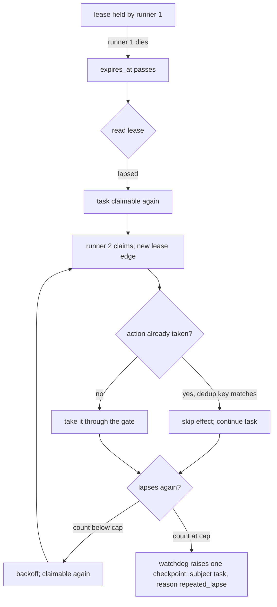
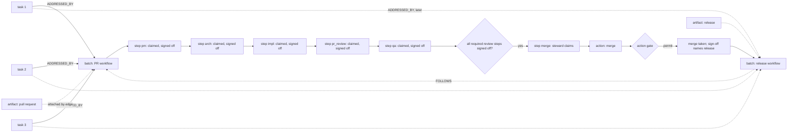

# Scenarios: the work model and the gate model, walked through

**Authored companion (not on the review reading list):** explanatory walkthroughs of the work and gate
models. Runtime claim/lifecycle/gating paths load the kernel instead (`conformance.md`). Further
scenarios (e)–(j) live in [`scenarios_extended.md`](scenarios_extended.md).

**Kind:** foundation; walks the design through concrete batches so the invariants can be read in motion,
and never states the state of a checkout. **Derived from:** `work_model.md`, `gates_and_workflows.md`,
`failure_posture.md`, `authority_model.md`, and PR #745 operator review (2026-09-04). Structure follows
Neotoma's `docs/subsystems/` flow documents: one paragraph, one diagram, the invariants exercised.

## Purpose

Show each invariant doing work. A reviewer who cannot say which scenario a change alters has not found the
change's design basis; a scenario that no invariant explains is a gap in the foundation, to be filed
against it.

## Scope

Four walkthroughs (a)–(d): the plain task life, a lapse and its checkpoint, assignment, and several
tasks going through a workflow as one batch. Further walkthroughs (e)–(j) are human reference in
`scenarios_extended.md`. Names of agents are placeholders for roles; no scenario names a checkout, a
count, or a date.

## (a) Create, claim, execute, return, complete

A task is created; publication is creation. An agent whose definition matches the task reads it as
claimable, writes a lease edge keyed on the task, and reads the edge back: it holds the task only if the
persisted lease names its own runner id. It executes the task, renewing `expires_at` as its heartbeat,
and its `agent_session` and observations make the lease read as `active`. On completion it writes the
task's terminal status, reads that back, and returns the lease. The task carries no lease field at any
point.

```mermaid
sequenceDiagram
    participant P as principal (creator)
    participant N as record
    participant A as agent runner
    P->>N: store task (status open, action_type declared)
    A->>N: read task; claimable?
    A->>N: write lease edge (agent → task, claimed_at, expires_at)
    A->>N: read lease back
    N-->>A: lease holder == my runner id
    loop while executing the task
        A->>N: observations, agent_session (task reads active)
        A->>N: renew expires_at (heartbeat)
    end
    A->>N: status = completed
    A->>N: read status back
    A->>N: lease returned
```

**Invariants:** [`work_model.md#the-claim-and-the-lease-are-one-primitive`](work_model.md#the-claim-and-the-lease-are-one-primitive),
[`#the-lease-is-a-relationship-not-a-set-of-task-fields`](work_model.md#the-lease-is-a-relationship-not-a-set-of-task-fields),
[`#liveness-is-derived-from-activity-at-read-time-never-declared`](work_model.md#liveness-is-derived-from-activity-at-read-time-never-declared),
[`#the-transition-vocabulary`](work_model.md#the-transition-vocabulary); `principles.md` invariants 2 and 11.

## (b) Lapse, re-claim, repeated lapse, checkpoint

The runner dies mid-task. Nothing clears anything: `expires_at` passes and the lease reads as `lapsed`, so
the task is claimable again. A second runner claims it; effect dedup means any action already taken is not
repeated. If the task keeps lapsing, the watchdog, which only counts, sees the count reach the cap and
escalates the task: one checkpoint, subject the task, reason `repeated_lapse`, carrying the count and the
last claimants, into the same decision queue the action gate's checkpoints use. No process ever returned a
lease, and the watchdog never chose a claimant.



**Invariants:** [`work_model.md#a-lapsed-lease-is-not-reaped-repeated-lapse-raises-a-checkpoint`](work_model.md#a-lapsed-lease-is-not-reaped-repeated-lapse-raises-a-checkpoint),
[`#at-least-once-implies-effect-dedup`](work_model.md#at-least-once-implies-effect-dedup),
[`failure_posture.md#repeated-lapse-raises-a-checkpoint`](failure_posture.md#repeated-lapse-raises-a-checkpoint),
[`#checkpoints-on-tasks-one-queue-one-protocol`](failure_posture.md#checkpoints-on-tasks-one-queue-one-protocol),
[`#refuse-resume-by-replay-where-actions-are-consent-gated`](failure_posture.md#refuse-resume-by-replay-where-actions-are-consent-gated).

## (c) Assignment, then the named principal claims

A principal writes `assigned_to` naming one agent, a field write like any other. Nothing was delivered:
the task is now eligible for that agent alone; it is not claimed, and no lease exists. Other agents read it
as not claimable for them. The named agent, on its own loop, reads it as claimable, claims it, and from
that point the scenario is (a). If the named agent never claims, the task is visible as
assigned-and-unclaimed, a fact about that agent rather than a lease left hanging. If `assigned_to` names a
principal nobody can run, the claim predicate escalates the task: one checkpoint, reason
`unspawnable_assignee`, and the task never falls through to inference.

```mermaid
sequenceDiagram
    participant P as principal
    participant N as record
    participant X as other agent
    participant Y as named agent
    P->>N: assigned_to = Y (no lease written)
    X->>N: read task; claimable for X?
    N-->>X: no (assigned to Y)
    Y->>N: read task; claimable for Y?
    N-->>Y: yes (assigned to Y, no held lease)
    Y->>N: write lease edge; read back
    Note over Y,N: from here, scenario (a)
```

**Invariants:** [`work_model.md#pull-is-the-only-delivery-assignment-constrains-eligibility`](work_model.md#pull-is-the-only-delivery-assignment-constrains-eligibility),
[`#assignment-restricts-eligibility-it-never-creates-a-lease`](work_model.md#assignment-restricts-eligibility-it-never-creates-a-lease),
[`#what-a-claim-predicate-treats-as-claimable`](work_model.md#what-a-claim-predicate-treats-as-claimable).

## (d) Several tasks enter one workflow as a batch, review through release

Three tasks belong in one change. They enter the project's `workflow` together: a batch record is opened
and each task gets an `ADDRESSED_BY` edge to it. The batch advances from step to step: each step opens,
its step owner claims it (a lease on the step), and closes it with a `sign-off`; `step_status` on each
task projects the same state for the hot path. The pull request that carries the change is an `artifact`
attached to the batch by edge; no step is taken on it. When every required review step is signed off,
the `merge` step opens and the steward claims it; the merge is an `action` the steward evaluates at the
action gate; on permit it is taken, the merged PR is the record it leaves, and the steward's sign-off
closes the batch naming `release` as its successor. The tasks leave the feature workflow and enter the
release workflow: a new batch record opens for them with a `FOLLOWS` edge to the closed one, and the
release is its artifact. The subject of every step was the tasks.



**Invariants:** [`work_model.md#what-goes-through-a-workflow-is-a-batch-of-tasks`](work_model.md#what-goes-through-a-workflow-is-a-batch-of-tasks),
[`#artifacts-are-records-a-batch-leaves-never-its-subject`](work_model.md#artifacts-are-records-a-batch-leaves-never-its-subject),
[`#a-task-is-in-at-most-one-batch-at-a-time`](work_model.md#a-task-is-in-at-most-one-batch-at-a-time),
[`gates_and_workflows.md#declaration-batch-projection`](gates_and_workflows.md#declaration-batch-projection),
[`#actions-are-entities-only-actions-are-taken`](gates_and_workflows.md#actions-are-entities-only-actions-are-taken),
[`#two-policies-workflow-policy-and-action-policy`](gates_and_workflows.md#two-policies-workflow-policy-and-action-policy),
[`#sequencing-is-data-successors-and-the-chain`](gates_and_workflows.md#sequencing-is-data-successors-and-the-chain);
[`workflows.md#feature`](workflows.md#feature).

## Further scenarios (human reference)

Scenarios (e)–(j) — a task detached from a batch, parent/child, operator-only claim, mid-workflow action
at NEVER/HIGH/LOW, halt on unreachable Neotoma, and intake→successor routing — live in
[`scenarios_extended.md`](scenarios_extended.md). Neither this file nor that companion is on the review
reading list; runtime paths load the kernel (and gates) instead (`conformance.md`).

## What the scenarios do not show

None of them shows a router choosing a claimant, work reaching an agent by any path but its own claim, a
process returning a lapsed lease, a pull request or an issue as the subject of a step, a per-step status
row, a parent task being claimed, an action taken outside the gate, a stored liveness flag, a gate
consulted on anything but an `action`, a task in any workflow but intake with no intake batch before it, a
batch naming two successors, a second queue for task-level failure beside the checkpoint queue, or an
entity above the batches holding a sequence of workflows. Each absence is an invariant; a change that
needs one of these to appear is a change to the foundation, made through a PR that says so
(`conformance.md`).
