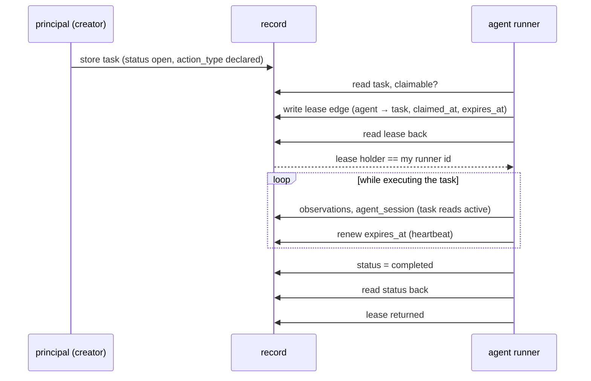
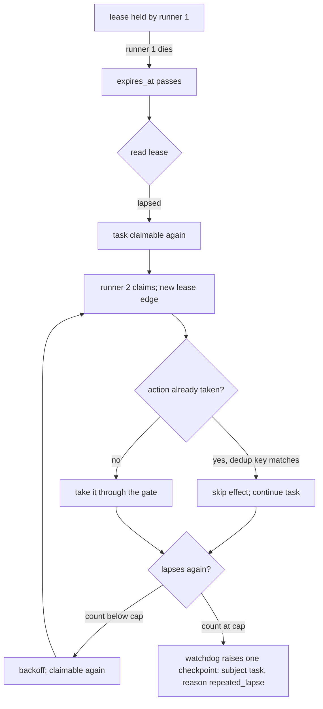
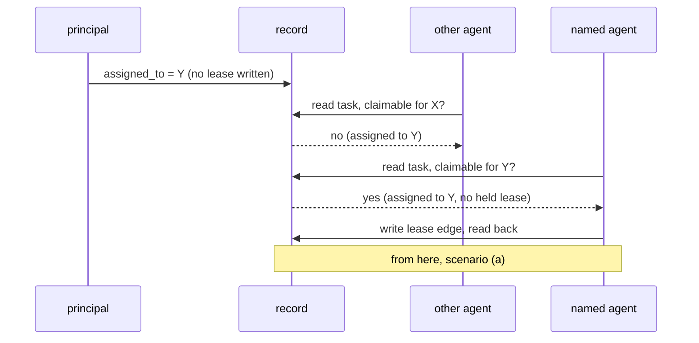
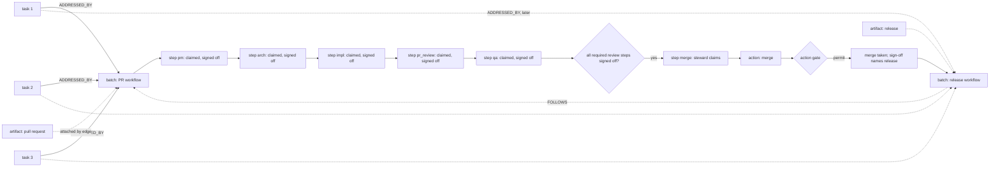
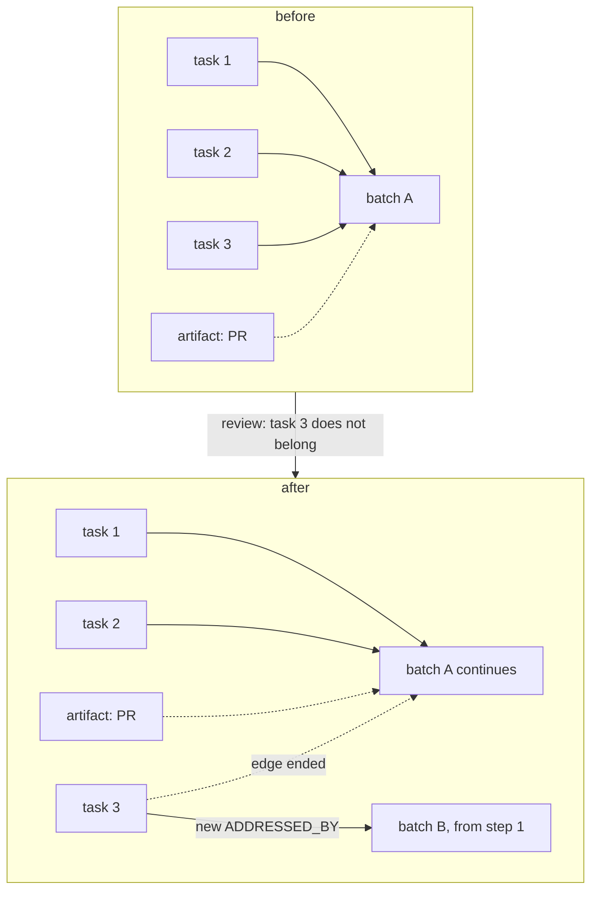
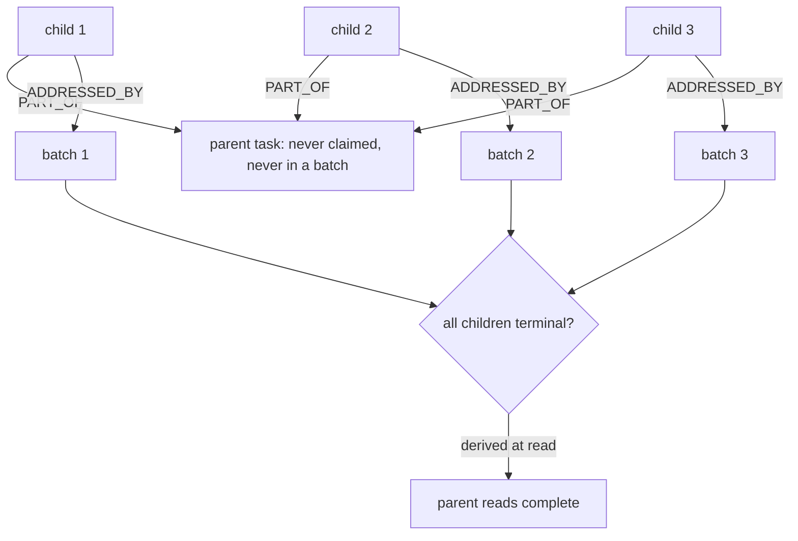
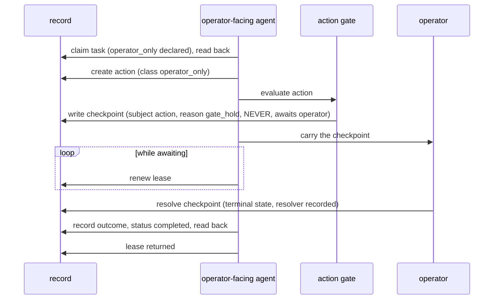
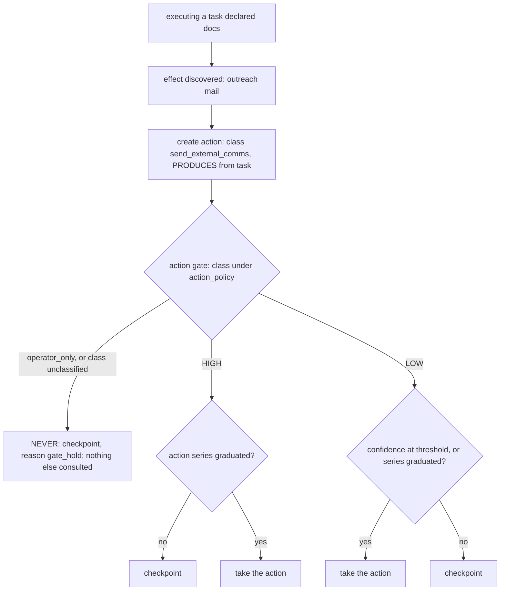
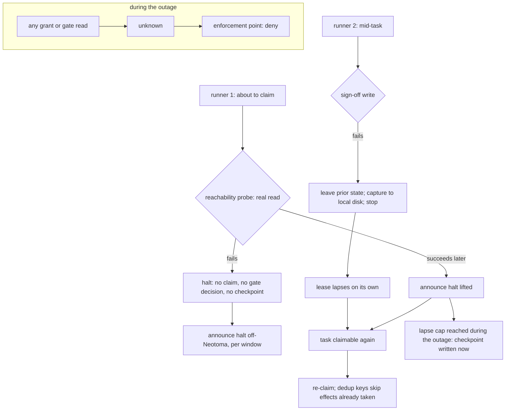
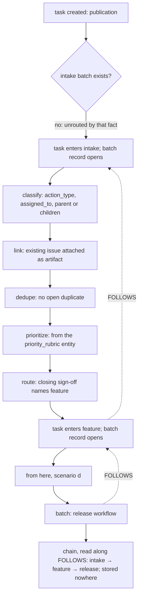

# Scenarios: the work model and the gate model, walked through

**Authored companion (not on the review reading list):** explanatory walkthroughs of the work and gate
models. Runtime claim/lifecycle/gating paths load the kernel instead (`conformance.md`).

**Kind:** foundation; walks the design through concrete batches so the invariants can be read in motion,
and never states the state of a checkout. **Derived from:** `work_model.md`, `gates_and_workflows.md`,
`failure_posture.md`, `authority_model.md`, and PR #745 operator review (2026-09-04). Structure follows
Neotoma's `docs/subsystems/` flow documents: one paragraph, one diagram, the invariants exercised. Revised by the simplification pass of 2026-09-05 (revision 29: walkthroughs (e)–(j) merged back from `scenarios_extended.md`, whose only reason to exist — a reading-block budget — no longer applied to a document that is not on the reading list). Revised by the consistency pass of 2026-09-06 (revision 35: scenario (j)'s garbled clause, left when `lens` was retired, repaired).

## Purpose

Show each invariant doing work. A reviewer who cannot say which scenario a change alters has not found the
change's design basis; a scenario that no invariant explains is a gap in the foundation, to be filed
against it.

## Scope

Ten walkthroughs. (a)–(d): the plain task life, a lapse and its checkpoint, assignment, and several
tasks going through a workflow as one batch. (e)–(j): a task detached from a batch, parent and child,
the operator-only claim, an action discovered mid-workflow at each blast tier, the halt on an
unreachable record, and a task routed by intake into its successor. Names of agents are placeholders
for roles; no scenario names a checkout, a count, or a date. Where a walkthrough and the document it
cites disagree, the owning document governs; nothing here is normative on its own.

## (a) Create, claim, execute, return, complete

A task is created; publication is creation. An agent whose definition matches the task reads it as
claimable, writes a lease edge keyed on the task, and reads the edge back: it holds the task only if the
persisted lease names its own runner id. It executes the task, renewing `expires_at` as its heartbeat,
and its `agent_session` and observations make the lease read as `active`. On completion it writes the
task's terminal status, reads that back, and returns the lease. The task carries no lease field at any
point.

**Invariants:** [`work_model.md#the-claim-and-the-lease-are-one-primitive`](work_model.md#the-claim-and-the-lease-are-one-primitive),
[`#the-lease-is-a-relationship-not-a-set-of-task-fields`](work_model.md#the-lease-is-a-relationship-not-a-set-of-task-fields),
[`#liveness-is-derived-from-activity-at-read-time-never-declared`](work_model.md#liveness-is-derived-from-activity-at-read-time-never-declared),
[`#the-transition-vocabulary`](work_model.md#the-transition-vocabulary); `principles.md` invariants 2 and 11.

## (b) Lapse, re-claim, repeated lapse, checkpoint

The runner dies mid-task. Nothing clears anything: `expires_at` passes and the lease reads as `lapsed`, so
the task is claimable again. A second runner claims it; effect dedup means any action already taken is not
repeated. If the task keeps lapsing, the watchdog, which only counts, sees the count reach the cap and
escalates the task: one checkpoint, subject the task, reason `repeated_lapse`, carrying the count and the
last lease holders, into the same decision queue the action gate's checkpoints use. No process ever returned a
lease, and the watchdog never chose a lease holder.

**Invariants:** [`work_model.md#a-lapsed-lease-is-not-reaped-repeated-lapse-raises-a-checkpoint`](work_model.md#a-lapsed-lease-is-not-reaped-repeated-lapse-raises-a-checkpoint),
[`#at-least-once-implies-effect-dedup`](work_model.md#at-least-once-implies-effect-dedup),
[`failure_posture.md#repeated-lapse-raises-a-checkpoint`](failure_posture.md#repeated-lapse-raises-a-checkpoint),
[`#checkpoints-on-tasks-one-queue-one-protocol`](failure_posture.md#checkpoints-on-tasks-one-queue-one-protocol),
[`#refuse-resume-by-replay-where-actions-are-consent-gated`](failure_posture.md#refuse-resume-by-replay-where-actions-are-consent-gated).

## (c) Assignment, then the named principal claims

A principal writes `assigned_to` naming one agent, a field write like any other. Nothing was delivered:
the task is now eligible for that agent alone; it is not claimed, and no lease exists. Other agents read it
as not claimable for them. The named agent, on its own loop, reads it as claimable, claims it, and from
that point the scenario is (a). If the named agent never claims, the task is visible as
assigned-and-unclaimed, a fact about that agent rather than a lease left hanging. If `assigned_to` names a
principal nobody can run, the claim predicate escalates the task: one checkpoint, reason
`unspawnable_assignee`, and the task never falls through to inference.

**Invariants:** [`work_model.md#pull-is-the-only-delivery-assignment-constrains-eligibility`](work_model.md#pull-is-the-only-delivery-assignment-constrains-eligibility),
[`#assignment-restricts-eligibility-it-never-creates-a-lease`](work_model.md#assignment-restricts-eligibility-it-never-creates-a-lease),
[`#what-a-claim-predicate-treats-as-claimable`](work_model.md#what-a-claim-predicate-treats-as-claimable).

## (d) Several tasks enter one workflow as a batch, review through release

Three tasks belong in one change. They enter the project's `workflow` together: a batch record is opened
and each task gets an `ADDRESSED_BY` edge to it. The batch advances from step to step: each step opens,
its step owner claims it (a lease on the step), and closes it with a `sign-off`; `step_status` on each
task projects the same state, so it is read in one retrieval. The pull request that carries the change is an `artifact`
attached to the batch by edge; no step is taken on it. When every required review step is signed off,
the `merge` step opens and the steward claims it; the merge is an `action` the steward evaluates at the
action gate; on permit it is taken, the merged PR is the record it leaves, and the steward's sign-off
closes the batch naming `release` as its successor. The tasks leave the feature workflow and enter the
release workflow: a new batch record opens for them with a `FOLLOWS` edge to the closed one, and the
release is its artifact. The subject of every step was the tasks.

**Invariants:** [`work_model.md#what-goes-through-a-workflow-is-a-batch-of-tasks`](work_model.md#what-goes-through-a-workflow-is-a-batch-of-tasks),
[`#artifacts-are-records-a-batch-leaves-never-its-subject`](work_model.md#artifacts-are-records-a-batch-leaves-never-its-subject),
[`#a-task-is-in-at-most-one-batch-at-a-time`](work_model.md#a-task-is-in-at-most-one-batch-at-a-time),
[`gates_and_workflows.md#declaration-batch-projection`](gates_and_workflows.md#declaration-batch-projection),
[`#actions-are-entities-only-actions-are-taken`](gates_and_workflows.md#actions-are-entities-only-actions-are-taken),
[`#two-questions-who-may-claim-a-step-and-whether-an-action-may-be-taken`](gates_and_workflows.md#two-questions-who-may-claim-a-step-and-whether-an-action-may-be-taken),
[`#sequencing-is-data-successors-and-the-chain`](gates_and_workflows.md#sequencing-is-data-successors-and-the-chain);
[`workflows.md#feature`](workflows.md#feature).

## (e) A task detached from a batch

Review finds that one of the three tasks does not belong in the change. The task is split out: its
`ADDRESSED_BY` edge to the batch is ended and it enters the workflow again as a new batch of one, from
the first step, with no sign-offs carried over. The original batch continues with the two tasks still
attached and loses no sign-off; its pull request stays attached to it as an artifact, and the new batch
will leave its own. Nothing on either task or either batch records the detachment as a field; the two
edges, one ended and one live, are the record.

**Invariants:** [`work_model.md#what-goes-through-a-workflow-is-a-batch-of-tasks`](work_model.md#what-goes-through-a-workflow-is-a-batch-of-tasks),
[`#artifacts-are-records-a-batch-leaves-never-its-subject`](work_model.md#artifacts-are-records-a-batch-leaves-never-its-subject),
[`#a-task-is-in-at-most-one-batch-at-a-time`](work_model.md#a-task-is-in-at-most-one-batch-at-a-time);
`principles.md` invariant 11.

## (f) A parent task with children in independent batches

A parent task is created as the grouping of a piece of work; three child tasks each carry a `PART_OF`
edge to it. Each child is claimed, executed, and goes through its own batch on its own schedule. The
parent is never claimed and never enters a workflow. When a reader asks whether the parent is complete,
the answer is derived from the children's terminal states at that moment and is stored nowhere.

**Invariants:** [`work_model.md#parent-and-child-tasks`](work_model.md#parent-and-child-tasks);
`principles.md` invariant 11.

## (g) An operator-only task, claimed by the operator-facing agent

A task is created with `operator_only` among its declared action classes. It is an ordinary task,
claimable by the operator-facing agent, which claims it and holds the lease; being operator-only raises
no checkpoint by itself. The one action the task needs is created and evaluated at the action gate,
which resolves `operator_only` to `NEVER` ahead of any policy and writes a checkpoint: subject the
action, reason `gate_hold`, awaiting the operator. The agent carries the checkpoint to the operator
through the configured channel and renews its lease while waiting. The operator resolves the checkpoint;
the agent records the outcome on the task, completes it, and returns the lease. No action was taken
without the operator, and the task path stayed pull.

**Invariants:** [`work_model.md#operator-only-tasks-are-claimed-by-the-operator-facing-agent`](work_model.md#operator-only-tasks-are-claimed-by-the-operator-facing-agent),
[`gates_and_workflows.md#confidence-and-three-blast-tiers`](gates_and_workflows.md#confidence-and-three-blast-tiers),
[`#the-checkpoint`](gates_and_workflows.md#the-checkpoint),
[`failure_posture.md#what-a-checkpoint-does-not-absorb`](failure_posture.md#what-a-checkpoint-does-not-absorb),
[`authority_model.md#approval`](authority_model.md#approval); `principles.md` invariant 5.

## (h) An action discovered mid-workflow, at NEVER, HIGH, and LOW

A task declared `docs` at creation. While executing it, the agent finds the change also needs an outreach
mail. That effect becomes an `action` the moment it is known, with class `send_external_comms`; the
declaration at creation is not amended, because it was a declaration of expectation, not a bound. The
principal about to take the action evaluates the gate with the action's class, its confidence, the
`action_policy`, and the class's recurrences. At `NEVER` the checkpoint is written (reason `gate_hold`)
and nothing else is consulted. At `HIGH` the checkpoint is written unless an action series has
graduated the class. At `LOW` the action is taken at or above the confidence threshold, or once the
series has graduated, and is checkpointed otherwise. A class in neither set logs the value and resolves
to `NEVER`.

**Invariants:** [`gates_and_workflows.md#actions-are-entities-only-actions-are-taken`](gates_and_workflows.md#actions-are-entities-only-actions-are-taken),
[`#confidence-and-three-blast-tiers`](gates_and_workflows.md#confidence-and-three-blast-tiers),
[`#the-action-gate-is-pr-independent`](gates_and_workflows.md#the-action-gate-is-pr-independent),
[`#non-code-deliverables-go-through-the-same-gate`](gates_and_workflows.md#non-code-deliverables-go-through-the-same-gate);
`principles.md` invariant 5.

## (i) Neotoma unreachable, halt

A runner about to claim a task performs the reachability probe, a real read of what the work will read.
The read fails. The runner claims nothing, evaluates no gate, writes no checkpoint (there is nothing to
write to), and announces the halt on the off-Neotoma path, aggregated per window. A second runner already
mid-task attempts its sign-off write, which fails; it leaves the task in its prior state, writes its
diagnostic capture to local disk, and stops. Its lease lapses on its own. When the probe succeeds again,
the halt is announced as lifted, the task is claimable, and a re-claim finds the effects already taken by
their dedup keys; a lapse count that reached its cap during the outage becomes a checkpoint now. Any grant
or gate read during the outage returned `unknown`, which every enforcement point treated as deny.

**Invariants:** [`failure_posture.md#the-decision`](failure_posture.md#the-decision),
[`#the-rules`](failure_posture.md#the-rules) (1 to 7),
[`#what-a-checkpoint-does-not-absorb`](failure_posture.md#what-a-checkpoint-does-not-absorb),
[`work_model.md#a-lapsed-lease-is-not-reaped-repeated-lapse-raises-a-checkpoint`](work_model.md#a-lapsed-lease-is-not-reaped-repeated-lapse-raises-a-checkpoint),
[`authority_model.md#the-tuple`](authority_model.md#the-tuple) (`Indeterminate` is deny); `principles.md`
invariants 2 and 7.

## (j) A task created, routed by intake, and entering its successor

A task is created; that is its publication. It has no intake batch, so it is unrouted by that fact, and
nothing else records it as such. The task enters intake: a batch record opens for it, and the `pm` step
owner claims each step in turn — a lease on the step, and a sign-off to close it: `classify` writes the
task's `action_type` and, where a named principal is the point, `assigned_to`; `link` attaches the issue
the task already concerns as an artifact; `dedupe` finds no open duplicate; `prioritize` sets the
priority from the `priority_rubric` entity; `route`'s sign-off, the closing sign-off of the batch, names
`feature` as the successor. The task leaves intake and enters the feature workflow: a new batch record
opens with a `FOLLOWS` edge to the intake batch, and from there the scenario is (d). At any moment the
task's chain is read along `FOLLOWS` from its live batch back to intake; nothing on the task records
which workflows it has gone through, and no router chose the successor: a step owner signed it.

**Invariants:** [`work_model.md#intake-is-every-tasks-first-workflow`](work_model.md#intake-is-every-tasks-first-workflow),
[`#there-is-no-task-lifecycle-there-are-batches`](work_model.md#there-is-no-task-lifecycle-there-are-batches),
[`#pull-is-the-only-delivery-assignment-constrains-eligibility`](work_model.md#pull-is-the-only-delivery-assignment-constrains-eligibility),
[`gates_and_workflows.md#sequencing-is-data-successors-and-the-chain`](gates_and_workflows.md#sequencing-is-data-successors-and-the-chain),
[`workflows.md#intake`](workflows.md#intake); `principles.md` invariant 11.

## What the scenarios do not show

None of them shows a router choosing a lease holder, work reaching an agent by any path but its own claim, a
process returning a lapsed lease, a pull request or an issue as the subject of a step, a per-step status
row, a parent task being claimed, an action taken outside the gate, a stored liveness flag, a gate
consulted on anything but an `action`, a task in any workflow but intake with no intake batch before it, a
batch naming two successors, a second queue for task-level failure beside the checkpoint queue, or an
entity above the batches holding a sequence of workflows. Each absence is an invariant; a change that
needs one of these to appear is a change to the foundation, made through a PR that says so
(`conformance.md`).
