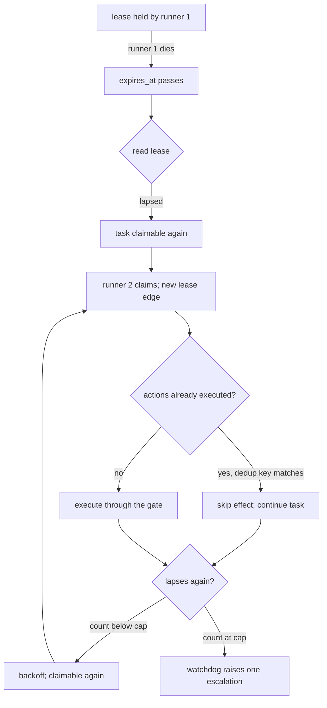
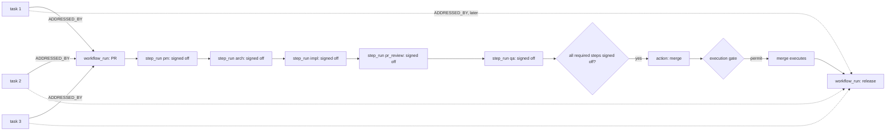
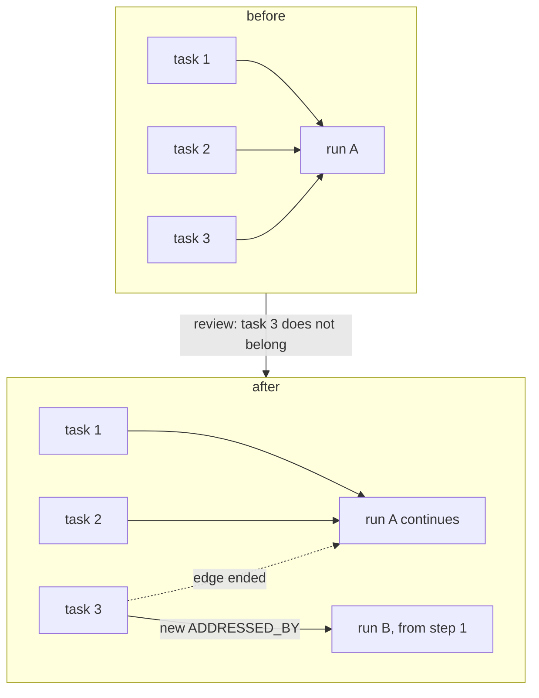
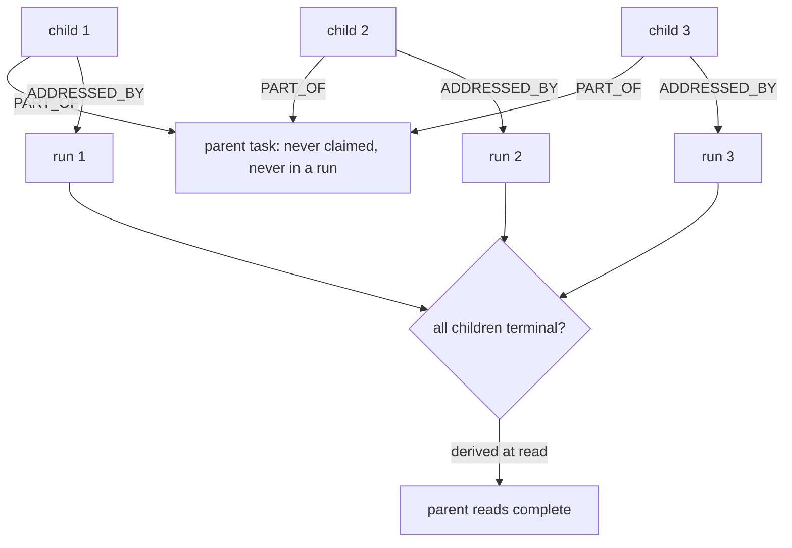
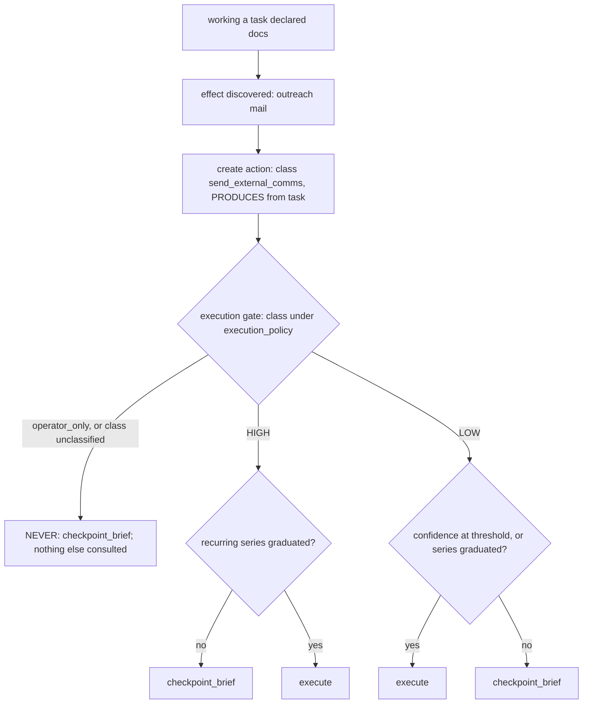
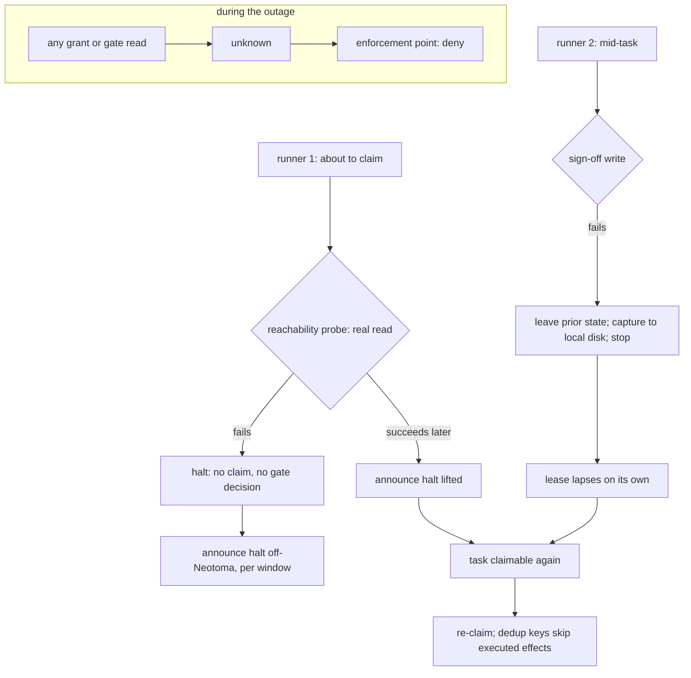

# Scenarios: the work model and the gate model, walked through

**Keyed document:** read when the claim, lease, watchdog, workflow-resolver, or gating paths change, or
when `docs/foundation/` changes (`conformance.md`). **Kind:** foundation; walks the design through
concrete passages so the invariants can be read in motion, and never states the state of a checkout.
**Derived from:** `work_model.md`, `gates_and_workflows.md`, `failure_posture.md`, `authority_model.md`,
and PR #745 operator review (2026-09-04), which asked for each scenario below. Structure follows Neotoma's
`docs/subsystems/` flow documents: one paragraph, one diagram, the invariants exercised.

## Purpose

Show each invariant doing work. A reviewer who cannot say which scenario a change alters has not found the
change's design basis; a scenario that no invariant explains is a gap in the foundation, to be filed
against it.

## Scope

Nine passages: the plain task life, a lapse and its escalation, assignment, aggregation through a workflow
run, a split, a parent with children, an operator-only task, an action discovered mid-workflow at each
blast tier, and a halt. Names of agents are placeholders for roles; no scenario names a checkout, a count,
or a date.

## (a) Create, claim, work, return, complete

A task is created; publication is creation. An agent whose definition matches the task reads it as
claimable, writes a lease edge keyed on the task, and reads the edge back: it holds the task only if the
persisted lease names its own runner id. It works the task, renewing `expires_at` as its heartbeat, and
its `agent_session` and observations make the lease read as `active`. On completion it writes the task's
terminal status, reads that back, and returns the lease. The task carries no claim field at any point.

```mermaid
sequenceDiagram
    participant P as principal (creator)
    participant N as record
    participant A as agent runner
    P->>N: store task (status open, action_type declared)
    A->>N: read task; claimable?
    A->>N: write lease edge (agent → task, claimed_at, expires_at)
    A->>N: read lease back
    N-->>A: lease holder == my runner id
    loop while working
        A->>N: observations, agent_session (task reads active)
        A->>N: renew expires_at (heartbeat)
    end
    A->>N: status = completed
    A->>N: read status back
    A->>N: lease returned
```

**Invariants:** [`work_model.md#the-claim-and-the-lease-are-one-primitive`](work_model.md#the-claim-and-the-lease-are-one-primitive),
[`#the-lease-is-a-relationship-not-a-set-of-task-fields`](work_model.md#the-lease-is-a-relationship-not-a-set-of-task-fields),
[`#liveness-is-derived-from-activity-at-read-time-never-declared`](work_model.md#liveness-is-derived-from-activity-at-read-time-never-declared),
[`#the-transition-vocabulary`](work_model.md#the-transition-vocabulary); `principles.md` invariants 2 and 11.

## (b) Lapse, re-claim, repeated lapse, escalation

The runner dies mid-task. Nothing clears anything: `expires_at` passes and the lease reads as `lapsed`, so
the task is claimable again. A second runner claims it; effect dedup means any action that already
executed is not repeated. If the task keeps lapsing, the watchdog, which only counts, sees the count reach
the cap and raises one `escalation` with the task, the count, and the last claimants. No process ever
returned a lease, and the watchdog never chose a claimant.



**Invariants:** [`work_model.md#a-lapsed-lease-is-not-reaped-repeated-lapse-escalates`](work_model.md#a-lapsed-lease-is-not-reaped-repeated-lapse-escalates),
[`#at-least-once-implies-effect-dedup`](work_model.md#at-least-once-implies-effect-dedup),
[`failure_posture.md#repeated-lapse-escalates`](failure_posture.md#repeated-lapse-escalates),
[`#refuse-resume-by-replay-where-actions-are-consent-gated`](failure_posture.md#refuse-resume-by-replay-where-actions-are-consent-gated).

## (c) Assignment, then the assignee claims

A principal writes `assigned_to` naming one agent. The task is now eligible for that agent alone; it is
not claimed, and no lease exists. Other agents read it as not claimable for them. The assignee, on its own
loop, reads it as claimable, claims it, and from that point the scenario is (a). If the assignee never
claims, the task is visible as assigned-and-unclaimed, a fact about the assignee rather than a stranded
lease. If `assigned_to` names a principal nobody can run, the task blocks visibly and never falls through
to inference.

```mermaid
sequenceDiagram
    participant P as principal
    participant N as record
    participant X as other agent
    participant Y as assignee
    P->>N: assigned_to = Y (no lease written)
    X->>N: read task; claimable for X?
    N-->>X: no (assigned to Y)
    Y->>N: read task; claimable for Y?
    N-->>Y: yes (assigned to Y, no held lease)
    Y->>N: write lease edge; read back
    Note over Y,N: from here, scenario (a)
```

**Invariants:** [`work_model.md#pull-over-push-assignment-is-the-only-push`](work_model.md#pull-over-push-assignment-is-the-only-push),
[`#assignment-restricts-eligibility-it-never-creates-a-lease`](work_model.md#assignment-restricts-eligibility-it-never-creates-a-lease),
[`#what-a-claim-predicate-treats-as-claimable`](work_model.md#what-a-claim-predicate-treats-as-claimable).

## (d) Several tasks aggregated into one workflow run, review through release

Three tasks are each addressed by one pull request. A `workflow_run` is created for the PR against the
project's `workflow`; each task gets an `ADDRESSED_BY` edge to the run. The run passes through the
workflow's steps: each step gets a `step_run`, closed by its step owner's sign-off, and `step_status` on
the issue projects the same state for the hot path. When every required step is signed off, the merge is
an `action` that the steward evaluates at the execution gate; on permit it executes. A second run, for
the release workflow, then addresses the same tasks sequentially. The tasks never entered a workflow
themselves.



**Invariants:** [`work_model.md#the-unit-that-enters-a-workflow-is-the-run-not-the-task`](work_model.md#the-unit-that-enters-a-workflow-is-the-run-not-the-task),
[`#a-task-is-in-at-most-one-workflow-run-at-a-time`](work_model.md#a-task-is-in-at-most-one-workflow-run-at-a-time),
[`gates_and_workflows.md#declaration-run-projection`](gates_and_workflows.md#declaration-run-projection),
[`#actions-are-entities-only-actions-execute`](gates_and_workflows.md#actions-are-entities-only-actions-execute),
[`#two-policies-workflow-policy-and-execution-policy`](gates_and_workflows.md#two-policies-workflow-policy-and-execution-policy).

## (e) A task split out of a run

Review finds that one of the three tasks does not belong in the pull request. Its `ADDRESSED_BY` edge to
the run is ended and a new `workflow_run` is started for it, with its own step runs from the first step.
The original run continues with the two tasks still attached and loses no sign-off. Nothing on either task
or either run records the split as a field; the two edges, one ended and one live, are the record.



**Invariants:** [`work_model.md#the-unit-that-enters-a-workflow-is-the-run-not-the-task`](work_model.md#the-unit-that-enters-a-workflow-is-the-run-not-the-task),
[`#a-task-is-in-at-most-one-workflow-run-at-a-time`](work_model.md#a-task-is-in-at-most-one-workflow-run-at-a-time);
`principles.md` invariant 11.

## (f) A parent task with children in independent runs

A parent task is created as the aggregate of a piece of work; three child tasks each carry a `PART_OF`
edge to it. Each child is claimed, worked, and addressed by its own workflow run on its own schedule. The
parent is never claimed and never enters a run. When a reader asks whether the parent is complete, the
answer is derived from the children's terminal states at that moment and is stored nowhere.



**Invariants:** [`work_model.md#parent-and-child-tasks`](work_model.md#parent-and-child-tasks);
`principles.md` invariant 11.

## (g) An operator-only task, claimed by the operator-facing agent

A task is created with `operator_only` among its declared action classes. It is claimable, by the
operator-facing agent, which claims it and holds the lease. The one action the task needs is created and
evaluated at the execution gate, which resolves `operator_only` to `NEVER` ahead of any policy and writes
a `checkpoint_brief` awaiting the operator. The agent carries the brief to the operator through the
configured channel and renews its lease while waiting. The operator resolves the brief; the agent records
the outcome on the task, completes it, and returns the lease. Nothing executed without the operator, and
the task path stayed pull.

```mermaid
sequenceDiagram
    participant N as record
    participant A as operator-facing agent
    participant G as execution gate
    participant O as operator
    A->>N: claim task (operator_only declared); read back
    A->>N: create action (class operator_only)
    A->>G: evaluate action
    G->>N: write checkpoint_brief (NEVER; awaits operator)
    A->>O: carry the brief
    loop while awaiting
        A->>N: renew lease
    end
    O->>N: resolve brief (terminal state, resolver recorded)
    A->>N: record outcome; status completed; read back
    A->>N: lease returned
```

**Invariants:** [`work_model.md#operator-only-tasks-are-claimed-by-the-operator-facing-agent`](work_model.md#operator-only-tasks-are-claimed-by-the-operator-facing-agent),
[`gates_and_workflows.md#confidence-and-three-blast-tiers`](gates_and_workflows.md#confidence-and-three-blast-tiers),
[`#the-approval-object`](gates_and_workflows.md#the-approval-object),
[`authority_model.md#approval`](authority_model.md#approval); `principles.md` invariant 5.

## (h) An action discovered mid-workflow, at NEVER, HIGH, and LOW

A task declared `docs` at creation. While working it, the agent finds the change also needs an outreach
mail. That effect becomes an `action` the moment it is known, with class `send_external_comms`; the
declaration at creation is not amended, because it was a declaration of expectation, not a bound. The
principal executing the action evaluates the gate with the action's class, its confidence, the
`execution_policy`, and the class's recurrences. At `NEVER` the brief is written and nothing else is
consulted. At `HIGH` the brief is written unless a recurring series has graduated the class. At `LOW` the
action executes at or above the confidence threshold, or once the series has graduated, and checkpoints
otherwise. A class in neither set logs the value and resolves to `NEVER`.



**Invariants:** [`gates_and_workflows.md#actions-are-entities-only-actions-execute`](gates_and_workflows.md#actions-are-entities-only-actions-execute),
[`#confidence-and-three-blast-tiers`](gates_and_workflows.md#confidence-and-three-blast-tiers),
[`#the-execution-gate-is-pr-independent`](gates_and_workflows.md#the-execution-gate-is-pr-independent),
[`#non-code-deliverables-pass-through-the-same-gate`](gates_and_workflows.md#non-code-deliverables-pass-through-the-same-gate);
`principles.md` invariant 5.

## (i) Neotoma unreachable, halt

A runner about to claim a task performs the reachability probe, a real read of what the work will read.
The read fails. The runner claims nothing, evaluates no gate, and announces the halt on the off-Neotoma
path, aggregated per window. A second runner already mid-task attempts its sign-off write, which fails; it
leaves the task in its prior state, writes its diagnostic capture to local disk, and stops. Its lease
lapses on its own. When the probe succeeds again, the halt is announced as lifted, the task is claimable,
and a re-claim finds the effects it already executed by their dedup keys. Any grant or gate read during
the outage returned `unknown`, which every enforcement point treated as deny.



**Invariants:** [`failure_posture.md#the-decision`](failure_posture.md#the-decision),
[`#the-rules`](failure_posture.md#the-rules) (1 to 7),
[`work_model.md#a-lapsed-lease-is-not-reaped-repeated-lapse-escalates`](work_model.md#a-lapsed-lease-is-not-reaped-repeated-lapse-escalates),
[`authority_model.md#the-tuple`](authority_model.md#the-tuple) (`Indeterminate` is deny); `principles.md`
invariants 2 and 7.

## What the scenarios do not show

None of them shows a router choosing a claimant, a process returning a lapsed lease, a task entering a
workflow directly, a parent task being claimed, a task being "executed", a stored liveness flag, or a
gate consulted on anything but an `action`. Each absence is an invariant; a change that needs one of
these to appear is a change to the foundation, made through a PR that says so (`conformance.md`).
