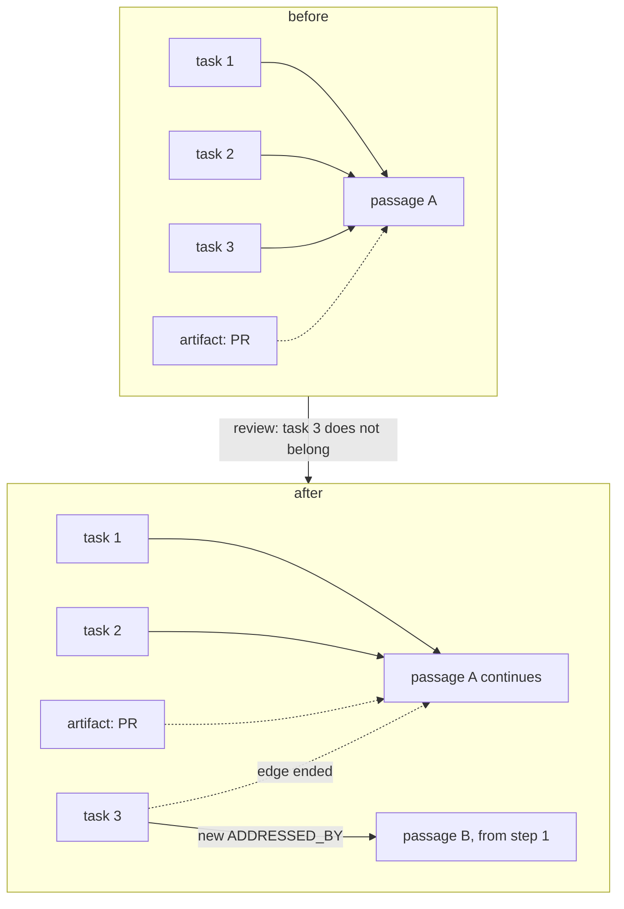
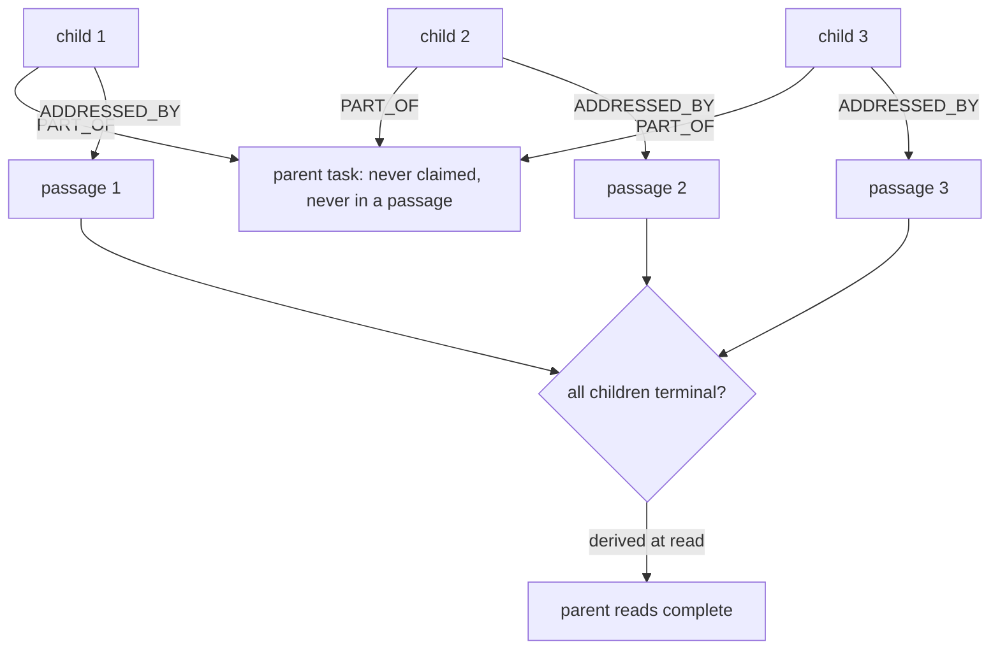
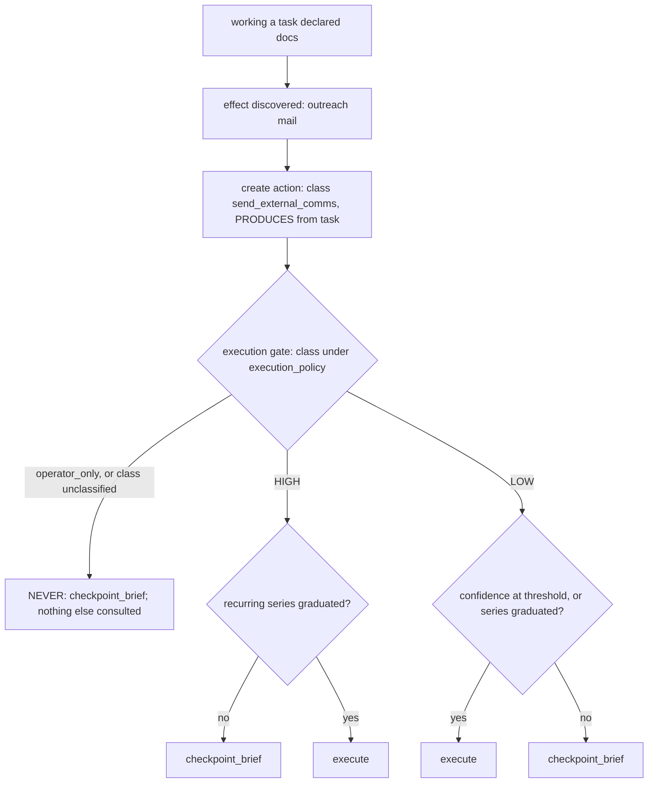
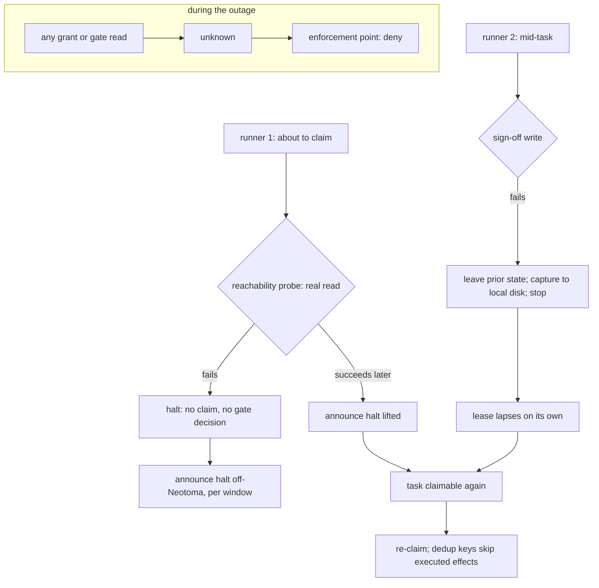
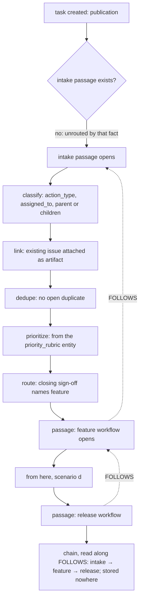

# Scenarios (extended): human-reference walkthroughs

**Not on the review reading list.** Companion to [`scenarios.md`](scenarios.md). Bindable walkthroughs
(a)–(d) stay in the keyed file; these (e)–(j) are human reference so the reading block stays under budget.

## (e) A task split out of a passage

Review finds that one of the three tasks does not belong in the change. Its `ADDRESSED_BY` edge to the
passage is ended and a new passage is started for it, from the first step, with no sign-offs carried
over. The original passage continues with the two tasks still attached and loses no sign-off; its pull
request stays attached to it as an artifact, and the new passage will leave its own. Nothing on either
task or either passage records the split as a field; the two edges, one ended and one live, are the
record.



**Invariants:** [`work_model.md#what-passes-through-a-workflow-is-a-passage-of-tasks`](work_model.md#what-passes-through-a-workflow-is-a-passage-of-tasks),
[`#artifacts-are-records-a-passage-leaves-never-its-subject`](work_model.md#artifacts-are-records-a-passage-leaves-never-its-subject),
[`#a-task-is-in-at-most-one-passage-at-a-time`](work_model.md#a-task-is-in-at-most-one-passage-at-a-time);
`principles.md` invariant 11.

## (f) A parent task with children in independent passages

A parent task is created as the aggregate of a piece of work; three child tasks each carry a `PART_OF`
edge to it. Each child is claimed, worked, and carried through its own passage on its own schedule. The
parent is never claimed, and no passage ever opens for it. When a reader asks whether the parent is complete, the
answer is derived from the children's terminal states at that moment and is stored nowhere.



**Invariants:** [`work_model.md#parent-and-child-tasks`](work_model.md#parent-and-child-tasks);
`principles.md` invariant 11.

## (g) An operator-only task, claimed by the operator-facing agent

A task is created with `operator_only` among its declared action classes. It is claimable, by the
operator-facing agent, which claims it and holds the lease. The one action the task needs is created and
evaluated at the execution gate, which resolves `operator_only` to `NEVER` ahead of any policy and writes
a `checkpoint_brief` awaiting the operator. The agent carries the brief to the operator through the
configured channel and renews its lease while waiting. The operator resolves the brief; the agent records
the outcome on the task, completes it, and returns the lease. Nothing executed without the operator, and
the task path stayed pull.

```mermaid
sequenceDiagram
    participant N as record
    participant A as operator-facing agent
    participant G as execution gate
    participant O as operator
    A->>N: claim task (operator_only declared); read back
    A->>N: create action (class operator_only)
    A->>G: evaluate action
    G->>N: write checkpoint_brief (NEVER; awaits operator)
    A->>O: carry the brief
    loop while awaiting
        A->>N: renew lease
    end
    O->>N: resolve brief (terminal state, resolver recorded)
    A->>N: record outcome; status completed; read back
    A->>N: lease returned
```

**Invariants:** [`work_model.md#operator-only-tasks-are-claimed-by-the-operator-facing-agent`](work_model.md#operator-only-tasks-are-claimed-by-the-operator-facing-agent),
[`gates_and_workflows.md#confidence-and-three-blast-tiers`](gates_and_workflows.md#confidence-and-three-blast-tiers),
[`#the-approval-object`](gates_and_workflows.md#the-approval-object),
[`authority_model.md#approval`](authority_model.md#approval); `principles.md` invariant 5.

## (h) An action discovered mid-workflow, at NEVER, HIGH, and LOW

A task declared `docs` at creation. While working it, the agent finds the change also needs an outreach
mail. That effect becomes an `action` the moment it is known, with class `send_external_comms`; the
declaration at creation is not amended, because it was a declaration of expectation, not a bound. The
principal executing the action evaluates the gate with the action's class, its confidence, the
`execution_policy`, and the class's recurrences. At `NEVER` the brief is written and nothing else is
consulted. At `HIGH` the brief is written unless a recurring series has graduated the class. At `LOW` the
action executes at or above the confidence threshold, or once the series has graduated, and checkpoints
otherwise. A class in neither set logs the value and resolves to `NEVER`.



**Invariants:** [`gates_and_workflows.md#actions-are-entities-only-actions-execute`](gates_and_workflows.md#actions-are-entities-only-actions-execute),
[`#confidence-and-three-blast-tiers`](gates_and_workflows.md#confidence-and-three-blast-tiers),
[`#the-execution-gate-is-pr-independent`](gates_and_workflows.md#the-execution-gate-is-pr-independent),
[`#non-code-deliverables-pass-through-the-same-gate`](gates_and_workflows.md#non-code-deliverables-pass-through-the-same-gate);
`principles.md` invariant 5.

## (i) Neotoma unreachable, halt

A runner about to claim a task performs the reachability probe, a real read of what the work will read.
The read fails. The runner claims nothing, evaluates no gate, and announces the halt on the off-Neotoma
path, aggregated per window. A second runner already mid-task attempts its sign-off write, which fails; it
leaves the task in its prior state, writes its diagnostic capture to local disk, and stops. Its lease
lapses on its own. When the probe succeeds again, the halt is announced as lifted, the task is claimable,
and a re-claim finds the effects it already executed by their dedup keys. Any grant or gate read during
the outage returned `unknown`, which every enforcement point treated as deny.



**Invariants:** [`failure_posture.md#the-decision`](failure_posture.md#the-decision),
[`#the-rules`](failure_posture.md#the-rules) (1 to 7),
[`work_model.md#a-lapsed-lease-is-not-reaped-repeated-lapse-escalates`](work_model.md#a-lapsed-lease-is-not-reaped-repeated-lapse-escalates),
[`authority_model.md#the-tuple`](authority_model.md#the-tuple) (`Indeterminate` is deny); `principles.md`
invariants 2 and 7.

## (j) A task created, routed by intake, and handed to its successor

A task is created; that is its publication. It has no intake passage, so it is unrouted by that fact, and
nothing else records it as such. An intake passage opens for it, and the product lens claims each step
in turn, a lease on the step and a sign-off to close it: `classify` writes the task's `action_type` and,
where a named principal is the point, `assigned_to`; `link` attaches the issue the task already concerns
as an artifact; `dedupe` finds no open duplicate; `prioritize` sets the priority from the
`priority_rubric` entity; `route`'s sign-off, the closing sign-off of the passage, names `feature` as the
successor. A passage of the feature workflow opens for the task with a `FOLLOWS` edge to the intake
passage, and from there the scenario is (d). At any moment the task's chain is read along `FOLLOWS` from
its live passage back to intake; nothing on the task records which workflows it has passed through, and
no router chose the successor: a step owner signed it.



**Invariants:** [`work_model.md#intake-is-every-tasks-first-passage`](work_model.md#intake-is-every-tasks-first-passage),
[`#there-is-no-task-lifecycle-there-are-passages`](work_model.md#there-is-no-task-lifecycle-there-are-passages),
[`#pull-is-the-only-delivery-assignment-constrains-eligibility`](work_model.md#pull-is-the-only-delivery-assignment-constrains-eligibility),
[`gates_and_workflows.md#sequencing-is-data-successors-and-the-chain`](gates_and_workflows.md#sequencing-is-data-successors-and-the-chain),
[`workflows.md#intake`](workflows.md#intake); `principles.md` invariant 11.

