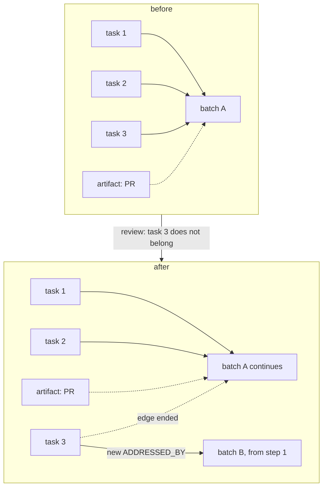
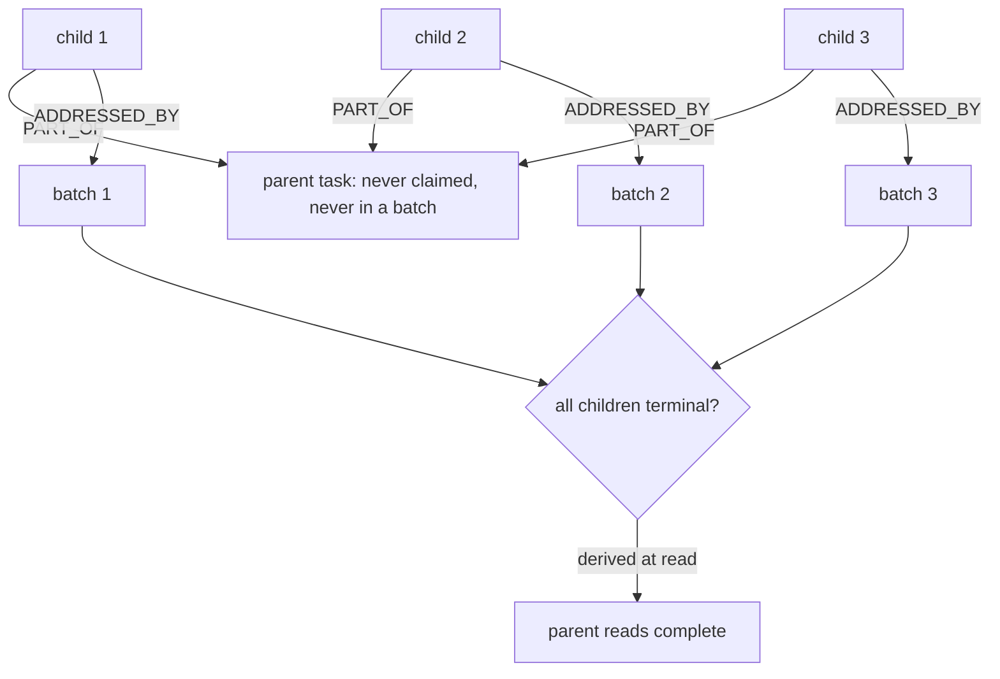
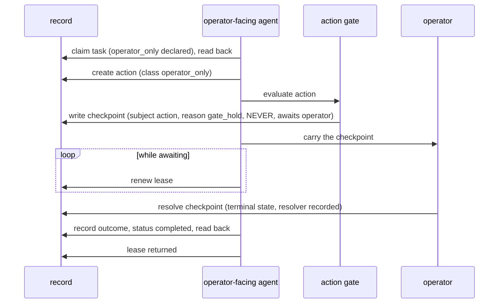
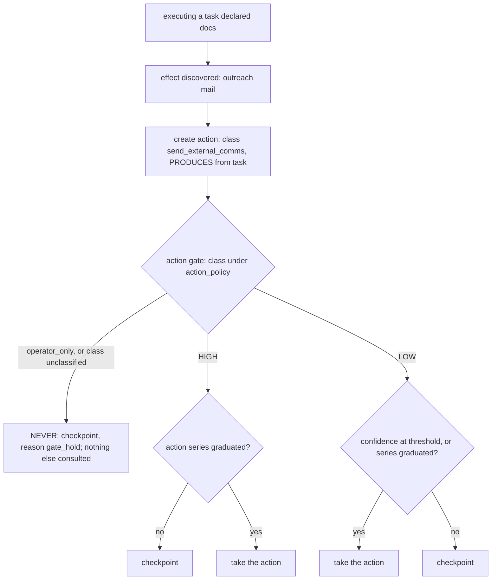
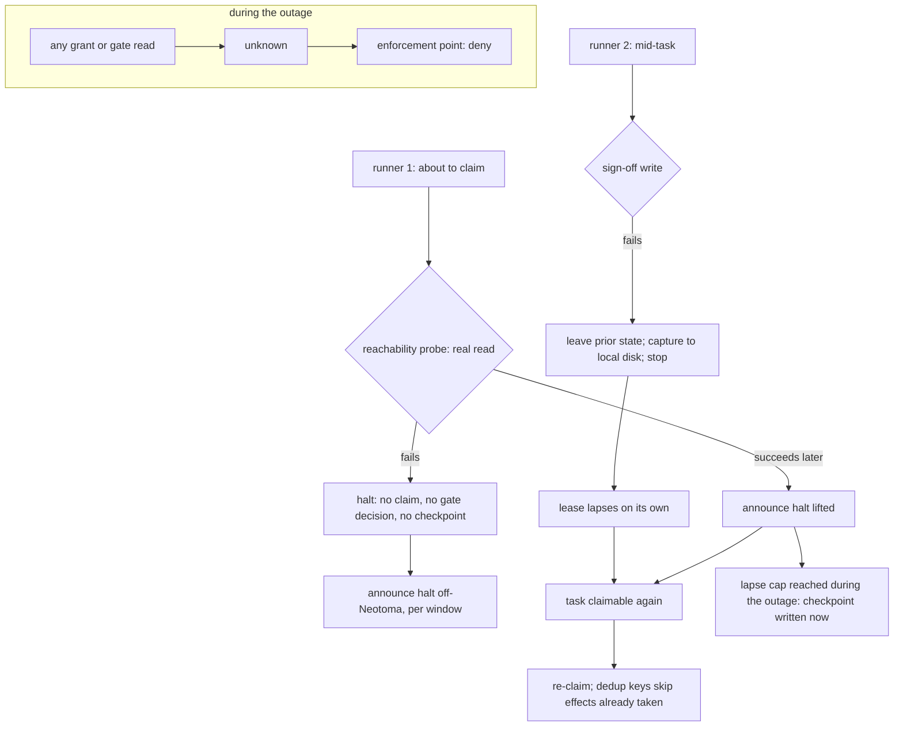
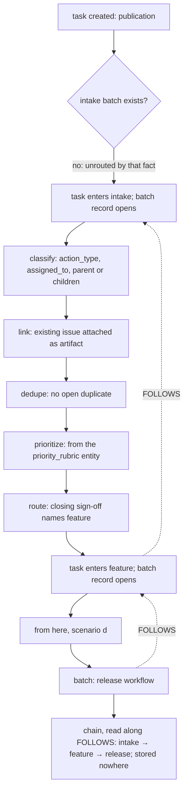

# Scenarios (extended): human-reference walkthroughs

**Not on the review reading list.** Companion to [`scenarios.md`](scenarios.md). Walkthroughs (a)–(d)
stay in that file; these (e)–(j) are human reference so the reading block stays under budget.

## Purpose

Carry the walkthroughs that do not fit [`scenarios.md`](scenarios.md)'s reading-block budget, in the
same form: one situation, the invariants it exercises, and what the record shows afterwards. Like its
companion, it walks the design through concrete cases and never states the state of a checkout.

## Scope

Scenarios (e)–(j) only. The design these walk is stated in `work_model.md`,
`gates_and_workflows.md`, `failure_posture.md`, and `authority_model.md`; where a walkthrough and one
of those disagree, the owning document governs. Nothing here is normative on its own.

## (e) A task detached from a batch

Review finds that one of the three tasks does not belong in the change. The task is split out: its
`ADDRESSED_BY` edge to the batch is ended and it enters the workflow again as a new batch of one, from
the first step, with no sign-offs carried over. The original batch continues with the two tasks still
attached and loses no sign-off; its pull request stays attached to it as an artifact, and the new batch
will leave its own. Nothing on either task or either batch records the detachment as a field; the two
edges, one ended and one live, are the record.

**Invariants:** [`work_model.md#what-goes-through-a-workflow-is-a-batch-of-tasks`](work_model.md#what-goes-through-a-workflow-is-a-batch-of-tasks),
[`#artifacts-are-records-a-batch-leaves-never-its-subject`](work_model.md#artifacts-are-records-a-batch-leaves-never-its-subject),
[`#a-task-is-in-at-most-one-batch-at-a-time`](work_model.md#a-task-is-in-at-most-one-batch-at-a-time);
`principles.md` invariant 11.

## (f) A parent task with children in independent batches

A parent task is created as the grouping of a piece of work; three child tasks each carry a `PART_OF`
edge to it. Each child is claimed, executed, and goes through its own batch on its own schedule. The
parent is never claimed and never enters a workflow. When a reader asks whether the parent is complete,
the answer is derived from the children's terminal states at that moment and is stored nowhere.

**Invariants:** [`work_model.md#parent-and-child-tasks`](work_model.md#parent-and-child-tasks);
`principles.md` invariant 11.

## (g) An operator-only task, claimed by the operator-facing agent

A task is created with `operator_only` among its declared action classes. It is an ordinary task,
claimable by the operator-facing agent, which claims it and holds the lease; being operator-only raises
no checkpoint by itself. The one action the task needs is created and evaluated at the action gate,
which resolves `operator_only` to `NEVER` ahead of any policy and writes a checkpoint: subject the
action, reason `gate_hold`, awaiting the operator. The agent carries the checkpoint to the operator
through the configured channel and renews its lease while waiting. The operator resolves the checkpoint;
the agent records the outcome on the task, completes it, and returns the lease. No action was taken
without the operator, and the task path stayed pull.

**Invariants:** [`work_model.md#operator-only-tasks-are-claimed-by-the-operator-facing-agent`](work_model.md#operator-only-tasks-are-claimed-by-the-operator-facing-agent),
[`gates_and_workflows.md#confidence-and-three-blast-tiers`](gates_and_workflows.md#confidence-and-three-blast-tiers),
[`#the-checkpoint`](gates_and_workflows.md#the-checkpoint),
[`failure_posture.md#what-a-checkpoint-does-not-absorb`](failure_posture.md#what-a-checkpoint-does-not-absorb),
[`authority_model.md#approval`](authority_model.md#approval); `principles.md` invariant 5.

## (h) An action discovered mid-workflow, at NEVER, HIGH, and LOW

A task declared `docs` at creation. While executing it, the agent finds the change also needs an outreach
mail. That effect becomes an `action` the moment it is known, with class `send_external_comms`; the
declaration at creation is not amended, because it was a declaration of expectation, not a bound. The
principal about to take the action evaluates the gate with the action's class, its confidence, the
`action_policy`, and the class's recurrences. At `NEVER` the checkpoint is written (reason `gate_hold`)
and nothing else is consulted. At `HIGH` the checkpoint is written unless an action series has
graduated the class. At `LOW` the action is taken at or above the confidence threshold, or once the
series has graduated, and is checkpointed otherwise. A class in neither set logs the value and resolves
to `NEVER`.

**Invariants:** [`gates_and_workflows.md#actions-are-entities-only-actions-are-taken`](gates_and_workflows.md#actions-are-entities-only-actions-are-taken),
[`#confidence-and-three-blast-tiers`](gates_and_workflows.md#confidence-and-three-blast-tiers),
[`#the-action-gate-is-pr-independent`](gates_and_workflows.md#the-action-gate-is-pr-independent),
[`#non-code-deliverables-go-through-the-same-gate`](gates_and_workflows.md#non-code-deliverables-go-through-the-same-gate);
`principles.md` invariant 5.

## (i) Neotoma unreachable, halt

A runner about to claim a task performs the reachability probe, a real read of what the work will read.
The read fails. The runner claims nothing, evaluates no gate, writes no checkpoint (there is nothing to
write to), and announces the halt on the off-Neotoma path, aggregated per window. A second runner already
mid-task attempts its sign-off write, which fails; it leaves the task in its prior state, writes its
diagnostic capture to local disk, and stops. Its lease lapses on its own. When the probe succeeds again,
the halt is announced as lifted, the task is claimable, and a re-claim finds the effects already taken by
their dedup keys; a lapse count that reached its cap during the outage becomes a checkpoint now. Any grant
or gate read during the outage returned `unknown`, which every enforcement point treated as deny.

**Invariants:** [`failure_posture.md#the-decision`](failure_posture.md#the-decision),
[`#the-rules`](failure_posture.md#the-rules) (1 to 7),
[`#what-a-checkpoint-does-not-absorb`](failure_posture.md#what-a-checkpoint-does-not-absorb),
[`work_model.md#a-lapsed-lease-is-not-reaped-repeated-lapse-raises-a-checkpoint`](work_model.md#a-lapsed-lease-is-not-reaped-repeated-lapse-raises-a-checkpoint),
[`authority_model.md#the-tuple`](authority_model.md#the-tuple) (`Indeterminate` is deny); `principles.md`
invariants 2 and 7.

## (j) A task created, routed by intake, and entering its successor

A task is created; that is its publication. It has no intake batch, so it is unrouted by that fact, and
nothing else records it as such. The task enters intake: a batch record opens for it, and the product
its step owner claims each step in turn, a lease on the step and a sign-off to close it: `classify` writes the
task's `action_type` and, where a named principal is the point, `assigned_to`; `link` attaches the issue
the task already concerns as an artifact; `dedupe` finds no open duplicate; `prioritize` sets the
priority from the `priority_rubric` entity; `route`'s sign-off, the closing sign-off of the batch, names
`feature` as the successor. The task leaves intake and enters the feature workflow: a new batch record
opens with a `FOLLOWS` edge to the intake batch, and from there the scenario is (d). At any moment the
task's chain is read along `FOLLOWS` from its live batch back to intake; nothing on the task records
which workflows it has gone through, and no router chose the successor: a step owner signed it.

**Invariants:** [`work_model.md#intake-is-every-tasks-first-workflow`](work_model.md#intake-is-every-tasks-first-workflow),
[`#there-is-no-task-lifecycle-there-are-batches`](work_model.md#there-is-no-task-lifecycle-there-are-batches),
[`#pull-is-the-only-delivery-assignment-constrains-eligibility`](work_model.md#pull-is-the-only-delivery-assignment-constrains-eligibility),
[`gates_and_workflows.md#sequencing-is-data-successors-and-the-chain`](gates_and_workflows.md#sequencing-is-data-successors-and-the-chain),
[`workflows.md#intake`](workflows.md#intake); `principles.md` invariant 11.
