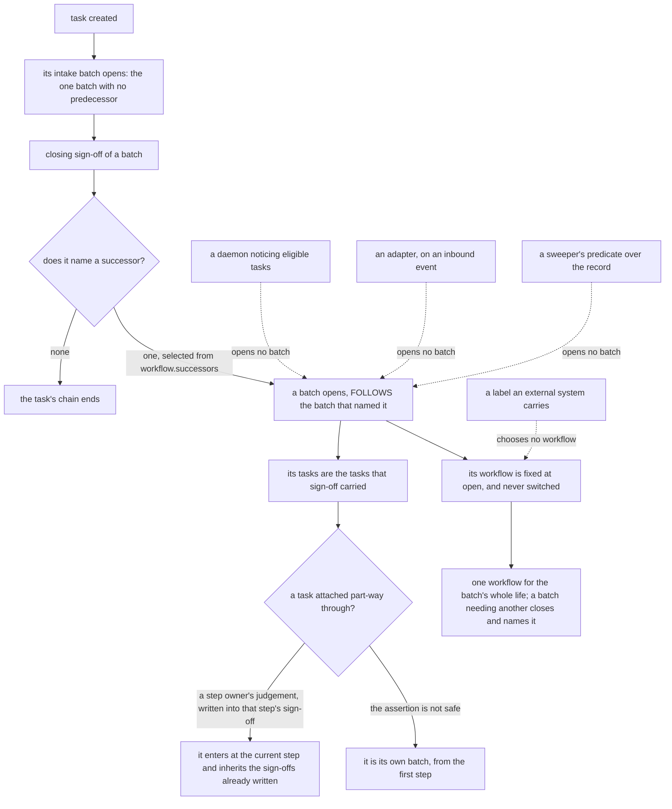

# Work model: how work is created, claimed, executed, and goes through workflows

**Kernel document:** read on every review (`conformance.md`). **Kind:** foundation; states the design and
never the state of a checkout. **Derived from:** synthesis `ent_b0ce322f768e4fc676b73139` (PR-01 to PR-03,
PR-05, C1, C2), prior art `ent_08460968e6f49dac21510f4a`, task `ent_da60df3beccb675ef8c8c0c5`, throughput
plan `ent_18b902cf72822373f9da8ced` decisions `pull_model_sequencing_build_the_claim_not_the_router`,
`non_github_execution_makes_pull_decisive`, `three_execution_mechanisms_not_one`, PR #745 operator
review (2026-09-04), and the operator's 2026-09-05 review (revision 18: how a batch is formed and what
chooses its workflow; revision 20: the batch-formation diagram, on the operator's request for visuals
during review), and the operator's 2026-09-05 12:52 memo (revision 21: workflows as the general mechanism
for changing the swarm's own operation), and PR #745 operator review (2026-09-05, rulings 13–14, 16–18,
23–29: a batch may hold and may depend on a task it created; governance writes are reserved by default),
and the operator's 2026-09-05 proposal on recurring tasks (revision 27, decision 30: one live instance,
completion creates the next, `FOLLOWS` task to task), and the operator's 2026-09-05 22:02–22:13 memos on how tasks come into existence (revision 30, 2026-09-06: the task-sources index, the intake rule, and open decision 36). Supersedes `docs/archive/task_execution_loop.md`. What is built
is `status.md`; how each concept is recorded is `data_model.md`. Revised by the simplification pass of 2026-09-05 (revision 29: `claimant` retired for lease holder; open decision 34). Revised by the memo-gap pass of 2026-09-06 (revision 31: the governance list cited from its one home rather than counted; pointers to the closed-work and intake-linkage rulings).

## Purpose

State how work is created, taken, executed, and returned: pull-only delivery; assignment as eligibility;
claim and lease as one primitive (lease as relationship); liveness derived at read time; no assignment
log; a task carries only status and edges; intake is every task's first workflow; tasks go through
workflows in batches, are attached to and detached from them, and nest under parents; a batch is opened
by a closing sign-off naming a successor and goes through exactly one workflow; a batch may hold on a
condition discovered mid-flight, and may depend on a task it created, under its held lease and with no held
state; a change to the swarm's own operation is a task like any other, governed by the action gate the
governance writes already reach, and reserved to the operator by default; artifacts are records a batch
leaves, never its subject; every source of tasks is indexed once, and an intake rule — a described change
in the record that is work — is the one source that turns a change into a task inside the record, bounded,
written through the gate, and never keyed on the work model's own records.

## Scope

The task path: a task claimed and executed by an agent. The other two execution mechanisms are named
below; steps and gates are `gates_and_workflows.md`; core workflows (including intake) are `workflows.md`
(authored companion, not inlined into review prompts); authority is `authority_model.md`; terms are
`vocabulary.md`; the record is `data_model.md`. Walkthroughs: `scenarios.md`.

## The invariants

### Pull is the only delivery; assignment constrains eligibility

Work reaches an agent only by claim. No router chooses lease holders; no principal delivers a task; a workflow
step is claimed by its step owner the same way (`gates_and_workflows.md`). Reason: the actor that judges fit
must be the actor that acts and answers for the outcome. A router's inference sits in an actor that
neither acts nor answers for a misroute, so a wrong guess reaches an executor with nobody accountable for
the choice. A claim is a 1:1 judgment, "is this mine", bounded by the `agent` of the principal making it,
which no central table encodes; routing is a 1:N choice with fallthrough, and fallthrough is where an
unknown principal is quietly resolved to somebody. A claim cannot fall through: the predicate reads
`assigned_to` directly, and an `assigned_to` naming a principal nobody can run raises a checkpoint
(reason `unspawnable_assignee`) instead of being resolved to someone else. Non-code agents are the first
consumers: their work has no file paths or closure keywords for a keyword matcher, and a claim bounded by
their own definition needs none. Subscriptions wake an agent; they never deliver work.

### Assignment restricts eligibility; it never creates a lease

`assigned_to` is eligibility: who may claim. It is not the holder. The principal the assignment names
still pulls by claiming; only a claim makes a lease holder. A task whose named principal never claims
is assigned-and-unclaimed, a fact about that principal, not a lease left hanging. Camunda's
`setAssignee()` (installs a holder with no check) is the operation this design does not have.

### The claim and the lease are one primitive

Two agents must not both take a task; a killed runner must not leave one held forever. The claim is keyed
on the task; the holder is read back after the write: an agent holds only if the persisted lease names
its runner id (principle 2). Atomicity is proven by the implementation, never assumed of the store: a
last-writer-wins snapshot and a name-collision policy that de-duplicates into one row do not raise.

### The lease is a relationship, not a set of task fields

The lease is an edge (principal ↔ task) with `claimed_at` and `expires_at`; renewal moves `expires_at`.
The task carries no lease fields. Derived at read: `held` while `expires_at` is future; `lapsed` once
past without an explicit end; `returned` when the lease holder ended it. Nothing transitions a lease to
`lapsed` — the clock does (principle 11).

### Liveness is derived from activity at read time, never declared

`active` = held lease plus activity (`agent_session` or observations) within the lease window. A stored
liveness flag fails when the process that would clear it died. The two liveness assertions of the archived
loop document are retired: `executing` / `running` are not states.

### No assignment log; history is the task's own observations

Every status change is an observation; every lease is an edge with timestamps. A parallel assignment or
claim-history entity would be a second source of truth (principle 9). The current lease answers what
history cannot: who holds this right now. `agent_session` carries the identity half observations lack
(host, checkout, branch, head), not a history of runners.

### The transition vocabulary

The task's vocabulary is `created` plus its status (`open` / `blocked` / terminal). The lease carries
`held` / `lapsed` / `returned`. `active` is a derived read, never a state. Each word names one thing: a
task whose lease holder died is a task with a lapsed lease, and a task its named principal has not taken is
assigned-and-unclaimed. Definitions: `vocabulary.md`.

### There is no task lifecycle; there are batches

A task carries status and edges only. Other state is a batch, lease, sign-off, or activity entity. A
task is never routed, executing, verified, or in review as a status; the batch it is in and that batch's
`FOLLOWS` chain say which of those is true (`gates_and_workflows.md`). This is C1: the states of the
archived loop document were facts about a batch, a lease, or a sign-off written onto the task, where a
process then had to keep them true (principle 11). The same rule holds at the end: a closed batch is never
reopened and a terminal task never returns to open; the operator's input on closed work is a finding, and
the redo it calls for is a new task through intake
(`gates_and_workflows.md#closed-work-is-reviewed-on-the-record-and-redone-through-intake-never-reopened`).

### Intake is every task's first workflow

Every task enters intake before any other workflow (`workflows.md#intake`): `classify`, `link`,
`dedupe`, `prioritize`, `route` (closing sign-off names one successor, none, or operator-only). An
unrouted task is a task with no intake batch — no separate unrouted state. `link` attaches what the task
names, a record in the record and an external one alike, and nothing on relevance alone; what a step needs
beyond that is hydration's, per step (`workflows.md#what-link-attaches-and-what-it-leaves-to-hydration`).
Tasks a batch creates
(children, detached tasks, tasks extracted from a meeting) enter intake themselves; a child may take
intake's declared fast path and never skips intake.

### What a claim predicate treats as claimable

Claimable: not terminal, not `blocked`, no held lease. A lapsed lease never blocks a claim. Unassigned
tasks are a shared pool; an assigned task is claimable only by the principal it names. The status
vocabulary in the record is what tasks actually carry, not what an enum in code declares: a predicate is
written against the record (principle 3), because a normalizer that fails to map a live value onto a
terminal one makes finished work claimable. Live status distribution: `status.md`.

### A lapsed lease is not reaped; repeated lapse raises a checkpoint

No process returns a lapsed lease — it already does not count. The reaper is retired. The watchdog
observes lapses and, past a per-task cap, escalates: it raises one checkpoint on the task with reason
`repeated_lapse` (`failure_posture.md`); it never chooses a new lease holder.

### At-least-once implies effect dedup

Lapse and re-claim is at-least-once. Every outbound effect is idempotent or deduplicated on its own key;
a re-claimed task is never replayed (`failure_posture.md`). The dedup key lives on the `action` entity
(`gates_and_workflows.md`).

### Operator-only tasks are claimed by the operator-facing agent

A task with `operator_only` actions is an ordinary task claimed by the `ateles` agent, which carries it to
the operator and holds the lease while the operator decides. It is not itself a checkpoint: it raises one
only when an action inside it reaches the action gate, which resolves `operator_only` to `NEVER`
(`gates_and_workflows.md`). The task path stays pull; only the action waits on a human.

### A task is executed only through a workflow

There is no path by which a task is executed outside a workflow. Every task enters intake, and intake's
closing sign off names the successor workflow it goes to, or none, or operator-only; whatever it does
after that, it does inside a batch going through a declared workflow, with that workflow's steps, step
owners, and sign offs. The design offers no side door: no status a principal sets that means "done
without a workflow", no direct-execution mode for small work, no class of task exempt because it is
urgent or trivial. Work small enough that most steps are unnecessary takes a declared fast path
(`gates_and_workflows.md`), which is a workflow saying which steps it skips — a decision recorded in the
declaration, judged once, and visible to every reader — rather than a task escaping the model.

**What this means for the self-triggering daemons.** A daemon produces tasks and takes actions, and it
receives no task itself (the four execution mechanisms, below); none of that is an exception to this
rule. Any task a daemon produces enters intake exactly like a task from any other source and is executed
through a workflow from there — the daemon that created it holds no privilege over it and does not
execute it outside the model. The daemon's own outbound effects are not task execution at all: they are
actions, and each passes the action gate on its own (`gates_and_workflows.md`, C2). So the daemon loop
sits beside the task path rather than around it, and the two meet where a daemon's output becomes a task
in intake.

### Changing the swarm is work, and it goes through a workflow like any other

A change to the swarm's own operation — a new workflow declaration, a step added to an existing one, a
step's owner role changed, a workflow retired, an agent's prompt or the `agent_policy` it renders from
rewritten — is **a task like any other**, and everything above applies to it unchanged. It is created,
it enters intake, it is classified and prioritized and routed, it is claimed by a principal that judged
it its own, it is executed inside a batch going through a declared workflow, and the writes it makes
reach the record through the gate those writes already pass. Nothing in the model has a clause that
distinguishes work aimed outward from work aimed at the swarm itself, and the reason is that the
distinction does not survive inspection: a change to a workflow declaration is a change to how every
future batch of that type is executed, which is a larger blast radius than most outward work carries,
not a smaller one. Exempting it would exempt the most consequential class of change in the design.

**The rule above already settles this, and it settles it for changes nobody asked for.** The no-side-door
rule is written about tasks, not about origins: it says there is no path by which *a task* is executed
outside a workflow, and it names the three shapes an exemption would take — a status meaning "done
without a workflow", a direct-execution mode for small work, a class of task exempt for being urgent or
trivial. None of the three is conditioned on who created the task or why. So a change the operator asked
for and a change the swarm proposed to itself are the same object under this rule, and the swarm's own
proposal is the case where the rule does the most work, because it is the case with no human in the loop
by default. A reading under which the rule covers only operator-initiated change would leave
self-initiated change ungoverned, which inverts the risk.

**A workflow may create a workflow, and a workflow may modify an agent.** Both follow from the two
sentences above and neither needs a new permission: the work is a task, the task goes through a
workflow, and the writes the work makes — to an `agent`, an `agent_policy`, a `workflow` declaration — are
**governance writes**, on the closed list
`gates_and_workflows.md#two-questions-who-may-claim-a-step-and-whether-an-action-may-be-taken` states once,
and already actions at the action gate. So a batch may declare a new workflow, add a step,
change a step's `owner_role`, or retire a declaration, and each such write is an action carrying its
class, scored for confidence, resolved to a blast tier under the project's `action_policy`, and held as a
checkpoint where the tier and the confidence say to hold it. The same holds for a change to what an agent
is. A workflow that changes a workflow is not a special kind of workflow; it is a workflow whose steps
produce governance writes.

**What prevents an ungoverned self-change is the action gate, and it is not a second mechanism.** Name it
precisely, because "a self-modifying system with a gate on self-modification" is worth being able to
point at: the governance types are a **closed and short list**, stated once
(`gates_and_workflows.md#two-questions-who-may-claim-a-step-and-whether-an-action-may-be-taken`), so the rule is checkable by
inspection rather than judged per write; every write to one of them is an action, so it is evaluated at
the moment it would be taken rather than at the moment it was proposed; `operator_only` resolves to
`NEVER` ahead of any policy, so a policy cannot demote a change the operator reserved; an unclassified
action type fails closed and loudly; and a proposed change is a proposal until the gate lets it through
and is **never a mutation an agent makes to itself on its own finding**
(`gates_and_workflows.md#a-finding-is-one-off-or-standing-and-a-standing-one-obliges-a-change-to-what-produced-it`).
Two more constraints hold without being added here. The principal making the change needs the capability
for it, read at the enforcement point on every check (`authority_model.md#grants`), so an agent cannot
widen its own grant by writing one — that write is itself a governance write to `agent_grant`, gated as
one. And a change proposed by a step owner is judged by a step owner: no principal signs for another, so
the batch that proposes a change to an agent does not also supply the sign-off that accepts it unless
the declaration puts both in one role, which is a property of the declaration a reader can see.

**Which class of change the swarm may never make to itself without the operator is a policy value, not a
new mechanism.** The question "what is off limits" is answered by the `action_policy`: a governance class
listed as `operator_only` resolves to `NEVER`, ahead of the confidence axis and ahead of the recurrence
path, and no accumulation of successful precedent graduates it. That is the existing expression of "never
without a human", and adding a second list of forbidden self-changes beside it would be the second gate
principle 6 forbids — two places to read before knowing whether a change may be taken, which is how the
two answers come to disagree. What the design therefore states is the *shape* of the answer and not its
content: the reservation is per action class, it lives in the policy, and it is the operator's to write.
Which classes belong there is not a design question this document can settle, because it is a judgement
about how much autonomy this operator wants, and the design's job is to make the judgement expressible
and enforceable rather than to make it.

**Ruled (decision 18, 2026-09-05): a governance write is reserved to the operator by default.** Registered
in `conformance.md#the-register-of-open-design-decisions`. Each governance class (the closed list in
`gates_and_workflows.md#two-questions-who-may-claim-a-step-and-whether-an-action-may-be-taken`) resolves to
`NEVER` until the operator has written a policy value for it: a class with no value in the project's
`action_policy` is not the policy default and not a high tier, it is `operator_only`, and no confidence and
no action series clears it. That is what the unclassified case already did — a declared class in neither set
resolves to `NEVER` (`gates_and_workflows.md#confidence-and-three-blast-tiers`) — promoted from the accident
of an absent value to the rule for this class of write, so that a reader no longer infers the posture from
the fail-closed default, and a project no longer behaves as reserved only until someone writes a policy that
forgets a class. The loosening is a **grant**, class by class: the operator lists the class in the policy
with the tier they want, and from then on the gate resolves it as any other class. The operator reserves it
again by removing the value.

**Reason.** Fail-closed is the posture everywhere else in this design (principle 5), and the two candidate
defaults are not symmetric in what they cost to undo. Reserved-then-loosened is reversible one class at a
time, each loosening a deliberate write with an author and a date, and each undone by deleting what was
written. Gated-then-reserved is not: a governance class held at a high tier is a class the swarm may change
once a checkpoint is approved, and by the time a project decides the tier should have been a reservation the
swarm may already have changed itself under it — a rewritten agent, a widened grant, a workflow with a step
removed — and undoing *those* is a set of recoveries through the gate, not a policy edit. The open question
proposed to decide this on whether the checkpoint queue is actually consumed, a measured property. That
measurement matters, and it decides something else: whether to **grant** a given class, for a project whose
operator has watched the queue and trusts it. It cannot decide the default, because a default is what a
project has before anyone has measured anything, and the safe direction to be unmeasured in is the reserved
one. The recursion is worth naming, because it is where the default does its work: `action_policy` is itself
one of the governance classes, so the write that grants any class is a governance write, and the class covering it
is reserved like the others. An operator therefore grants classes by writing the policy themselves, and the
class that would let the swarm write its own policy is the one to grant last, if ever — under this default
it is granted by no one's forgetting.

**The cost accepted** is friction, and it is the cost the open question named: the self-modification
machinery sits unused until the operator grants a class, and an unexercised path is one nobody has tested
(`failure_posture.md`). Accepted, because the alternative exercises the path by letting the swarm change
itself before anyone decided it should, and a path tested that way is tested on the operator's swarm. What
follows for a project that wants the swarm to institutionalize its own findings (decision 17,
`gates_and_workflows.md#a-finding-is-one-off-or-standing-and-a-standing-one-obliges-a-change-to-what-produced-it`)
is one explicit grant per governance class the institutionalization writes reach, before the first such
batch can take its action — which is the price of knowing, by reading the policy, exactly which classes of
self-change this operator has permitted. Until a class is granted, a batch whose step produces a write of
that class is a batch with an `operator_only` action: it is claimed by the operator-facing agent and the
operator makes the change by hand (`#operator-only-tasks-are-claimed-by-the-operator-facing-agent`).

**What would reopen it:** an operator finding that the grant friction on a specific class exceeds the value
of reserving it — and the remedy is a grant on that class, which the ruling already provides, not a change of
the default. The default itself would reopen only if the grants proved to be ceremony: if every project
wrote the same five grants on its first day, a default that everyone overrides identically is the wrong
default.

**The relationship to decision 17.** Decision 17 asked a narrower question about one path into this one:
whether institutionalizing a *standing finding* is itself a workflow, and whether the batch that raised the
finding waits on the institutionalization task it created. It is ruled in
`gates_and_workflows.md#a-finding-is-one-off-or-standing-and-a-standing-one-obliges-a-change-to-what-produced-it`:
it is a workflow, by this section's general rule, and the raising batch does not wait. This section states
that *a change to the swarm goes through a workflow*, whatever produced the change; that ruling states the
sequencing between two batches when one of them produced the other. Neither depends on the other, and ruling
both leaves the general rule here unchanged.

**Bootstrapping: the first workflow is not created by a workflow, and this is a stated limitation.** If
workflows are how workflows change, then the first declaration for a project has no workflow to come
through, and a workflow broken badly enough that no step of it opens cannot be repaired by a batch going
through it. The design does not resolve this, and inventing a mechanism for it would be inventing a side
door — a privileged path that creates or repairs a declaration outside the model is exactly the thing the
rule above forbids, and it would be available to every change and not only to the two cases that need it. So
the limitation is stated rather than mechanized, and what the design says about the two cases is what it
already says elsewhere. **The first declaration is an operator act**, of the same kind as issuing a
credential or widening a grant: provisioning is operator-only and out of band
(`authority_model.md#grants`), an agent neither performs it nor is empowered to have it performed by
raising a checkpoint. **A workflow too broken to open a step is an unreadable workflow**, which is a defined
state: no step of it is opened or claimed, its batch's tasks are escalated with one checkpoint (reason
`unreadable_workflow`), and nothing proceeds on an empty sequence
(`gates_and_workflows.md#an-unreadable-workflow-is-unknown-and-unknown-holds`). The repair then arrives
the way the first declaration did. Two consequences worth stating plainly. The swarm's ability to change
itself is bounded below by an operator who can write a declaration, and a swarm whose every workflow were
simultaneously unreadable could not recover on its own — that is a real limitation and not a gap in the
writing. And the failure is at least **loud**: an unreadable workflow halts rather than degrades, so the
condition presents as a checkpoint and an announcement rather than as work quietly not happening
(`failure_posture.md` rule 2), which is what makes an operator-only recovery viable at all.

### What goes through a workflow is a batch of tasks

Tasks go through a workflow in a batch: one or more tasks together, and the record of that. A single task
is a batch of one; there is no separate single-task path. When tasks enter a workflow a batch record is
opened if none exists, and each task is attached by an `ADDRESSED_BY` edge. Detaching a task ends its
edge; to split a task is to detach it and open a new batch for it, from the first step, while the original
batch continues with the tasks still attached. Attach and detach are edges, never fields (principle 11).

### How a batch is formed, and what chooses its workflow

The rule above says tasks go through a workflow in a batch and that a batch record is opened if none
exists. That leaves three questions a reader has to answer before they can build anything: what causes a
batch to come into existence, which tasks are in it, and which workflow it goes through. Each is answered
by a mechanism the model already has, and stating them together is what stops the answer being re-derived
differently at each call site.

**A batch comes into existence when a closing sign-off names a successor, and at no other moment.** There
is one cause, not several. Intake's `route` step closes on a sign-off naming one successor workflow, none,
or operator-only; every later batch closes the same way (`gates_and_workflows.md#sequencing-is-data-successors-and-the-chain`).
Where a successor is named, the batch for it opens and carries a `FOLLOWS` edge back to the batch that
named it. Where none is named, the task's chain ends. Nothing else opens a batch: no daemon opens one
because it noticed eligible tasks, no adapter opens one on an inbound event, and no scheduler sweeps for
work to group. The one batch with no predecessor is a task's intake batch, opened on the task's creation,
which is the universal entry (`#intake-is-every-tasks-first-workflow`, above) and the reason every chain
has a first link.

The consequence worth naming: a batch is always opened **by a principal's recorded verdict**, never by a
process acting on its own reading of the record. The sign-off names the successor, so the decision has an
author, a timestamp, and a reason, and a reader asking why these tasks are in this workflow is answered by
a verdict rather than by inferring what some sweeper's predicate must have matched.

**A batch's tasks are the tasks the closing sign-off carried, and grouping beyond that is a step's
judgement, recorded as one.** The default is the simple one: the tasks attached to the closing batch move
together into the successor, and a batch of one stays a batch of one. Two operations change a task set,
both already defined and both edges (principle 11): **detach**, which ends a task's `ADDRESSED_BY` edge and
opens a new batch for it from the first step of its workflow, and **attach**, which writes that edge. What
this section adds is who may do them and on what basis. Attaching a task to a batch that is already open,
part-way through its steps, is a step owner's judgement written into that step's sign-off, never an
adapter's guess and never a matcher's inference — the adapter rule already forbids the first
(`adapters.md#what-the-adapter-does-with-every-event`), and the second is the routing fallthrough the pull
rule forbids. A task attached part-way through enters at the batch's current step and inherits the
sign-offs already written on it, which is exactly why the judgement is a recorded one: those sign-offs were made
against a task set that did not include it, and a step owner who attaches is asserting that they still
hold. Where that assertion is not safe, the task is its own batch.

**The workflow is chosen once, by the sign-off that names the successor, from the declared list.** The
choice is not open-ended: `workflow.successors` names the workflows a closing batch's tasks may enter, and
the closing sign-off selects exactly one from that list or none. So the workflow for a batch is fixed
before the batch opens, by a named principal, bounded by a declaration that was reviewed when it was
written. There is no run-time selection inside the batch, no re-selection, and no workflow chosen by
matching a property of the tasks after the fact.

**A batch goes through exactly one workflow, for its whole life.** The workflow is a field of the batch
record (`data_model.md#concepts`), fixed at open. A batch that needed a different workflow does not switch:
it closes, and its closing sign-off names the one the tasks go to, which opens a new batch. This is what
makes the chain readable — each link is one workflow, entered by one verdict — and a batch that changed
workflow mid-flight would leave its earlier sign-offs pinned to steps that no longer exist in its
declaration.

**And a task is in one batch at a time but many over its life, which is the distinction to hold.** The
one-at-a-time rule is about simultaneity (above); the chain is the sequence. A task that went through
intake, then feature, then release has three batches, two closed and one live, and asking "which workflow
is this task in" is answered by its live batch alone.

The three questions and their one answer each, with the paths the rules above exclude drawn beside them:

Every arrow into a batch is a principal's recorded verdict; every dotted one is a path the rules above
close.

**What this deliberately does not do is let batch formation key on anything discovered later.** A
declaration's conditional may turn only on a property of the task set at intake, never on a label an
external system carries (`workflows.md`), and the rules above are the same constraint stated for
formation: the successor is named by a verdict at a close, from a list fixed in the declaration, on tasks
whose properties intake established. A formation rule that grouped tasks by a label an adapter wrote, or
that chose a workflow from an artifact's state, would put the choice back into an external system's hands
through the side door the boundary rules close.

Two questions about a batch's **lifetime** are downstream of this section rather than blocked by it —
formation and workflow choice are settled whichever way they go, because both concern what a batch may wait
on once it is already open: whether a batch may hold on a condition discovered mid-flight, and whether a
batch may depend on a task it created. Both are ruled below (decisions 13 and 14, 2026-09-05). Every
decision the foundation has opened or ruled is indexed in
`conformance.md#the-register-of-open-design-decisions`.

### A batch may hold on a condition discovered mid-flight

**Ruled (decision 13, 2026-09-05): yes — and the hold is not a state.** Registered in
`conformance.md#the-register-of-open-design-decisions`. A step owner who, part-way through a batch, meets a
condition that was not knowable when the batch was formed and that the step must satisfy before its verdict
can be written — a rail's quote has expired and a re-quote is pending, an external system is returning
`unknown` rather than an answer, a second batch is producing the artifact this one's next step reads —
neither signs nor fails. It **holds**: it records a finding naming the condition, it writes no sign-off, and
it keeps renewing its lease. Nothing else is written. The step stays open, the batch stays at that step, and
the lease's `expires_at` keeps moving, which is what every claimed step already does between its claim and
its sign-off.

**What the finding carries, and what it does not.** The finding names the condition (what the step is
waiting on), what would resolve it (a re-quote arriving, a read returning a value, a named task reaching a
terminal status), and when it was recorded; each renewal of the hold is a further observation on the same
finding, so the duration of a hold is readable from the record rather than reconstructed. It is a
**non-blocking** finding, because it asserts no defect in the work — a block says a defect is present, and a
hold says only that the step's condition cannot yet be judged
(`gates_and_workflows.md#findings-verdicts-and-what-a-blocking-finding-obliges`). It carries no verdict, and
no verdict is written until the condition resolves; the rule that a verdict is unconditional
(`vocabulary.md#condition`) is untouched, because a hold is the absence of a verdict, not a verdict with a
clause.

**There is no held state, no waiting value, and no field on the batch or the task.** A held step is read
from the record as every other claimed step is: a held lease on the step, a finding on it naming an unmet
condition, and no sign-off. That derivation is what principle 11 asks for — a stored hold would need a
process to clear it, and a step owner that died would leave it asserting a hold nobody holds, where the lease
lapses on its own and the step is claimable again with no process acting. It is also why a hold is not a
second waiting mechanism beside the checkpoint (principle 6), which was the cost the open question weighed:
the checkpoint is still the only mechanism by which a principal is asked for a decision, a hold asks nobody
anything, and a reader finding held steps uses the same read that finds any claimed step — there is no hold
queue to consume or to neglect (principle 1). The distinction between a declared condition and a discovered
one is only **when it is recorded**: `applies_when` is written on the declaration and evaluated when the step
would open (`gates_and_workflows.md#declaration-batch-projection`); a discovered condition is written on the
batch by the step owner at the moment it is met. Both are conditions on a step, and neither is a status.

**A hold is bounded, and it is bounded by mechanisms that already exist.** Three ends, no new one. Where the
condition **resolves** — the re-quote arrives, the read returns, the task completes — the step owner reads
that from the record and signs or blocks on its own judgement; the hold ends because the sign-off is written.
Where the condition **owes a principal a decision** — the re-quote is outside what was consented to, the
second batch's owner must be asked — the step owner raises a checkpoint on the task, which is the existing
protocol and already ends in a terminal approval or a terminal timeout
(`gates_and_workflows.md#the-checkpoint`), so no hold that needs a human is unbounded. And where the
condition **owes nobody a decision and does not resolve**, the hold is a deferral, and `failure_posture.md`
rule 5 already bounds every deferral: backoff between re-evaluations, a ceiling, and at the ceiling one
checkpoint on the task with reason `rounds_exhausted`, carrying the finding so the operator is told what the
step was waiting on rather than asked to diagnose it. A step owner that stops renewing lets the lease lapse,
the step is claimable again, and repeated lapse raises `repeated_lapse` — so a hold whose holder has died is
not a hold, it is a lapsed lease, and the design already knows what to do with one. **No hold ends by elapsed
time into a pass**: the ends above are a sign-off, a checkpoint, or a lapse, never a clearance
(`failure_posture.md#repeated-lapse-raises-a-checkpoint`).

**Why not the alternative.** The other answer was that a step owner who cannot sign either raises a
checkpoint or fails, the batch closes, and the work re-enters through a new batch when the condition has
changed. It discards what the batch already holds: every sign-off written on the earlier steps was made
against these tasks, and a new batch starts from the first step and asks every step owner to judge again
what they already judged. It contradicts a rule the design already keeps — *unknown holds the step*
(`gates_and_workflows.md#an-unreadable-workflow-is-unknown-and-unknown-holds`), stated for a declared read
and for an unreadable workflow, under which a step that cannot judge its condition stays open rather than
closing on a value it does not have. And the design already held, in three places, without naming it: a
declared read returning `unknown` holds the step, bounded, then escalates
(`gates_and_workflows.md#declaration-batch-projection`); a submitted transfer whose confirmation never
returned holds `reconcile` open, bounded, then escalates
(`payments.md#the-unknown-case-a-transfer-submitted-whose-confirmation-never-returned`); and the
operator-only workflow's `await` step holds the batch with the lease renewed throughout while the operator
decides (`workflows.md#operator-only`). Each of those is a hold on a condition discovered mid-flight. This
ruling names the general case they are instances of and adds no mechanism to them (principle 6). The
alternative's own interim reading also named a verdict the design does not have — a sign-off of `unknown` —
where the verdict values are `signed`, a blocking value, and `waived` (`vocabulary.md#verdict`); `unknown`
is what a read returns, and what a step does with a read that returns it is hold.

**The cost accepted** is a held lease: a step that holds is a claimed step for as long as it holds, its step
owner is occupied renewing it, and the batch's chain does not advance. That is the right cost, because the
alternative's saving is illusory — a batch that failed and re-entered has freed nothing; it has multiplied
batches for one piece of work and made the chain read as the history of a retry rather than of a task.
**What would reopen it:** holds in practice showing leases held for long periods with no progress and without
the bound clearing them — a step owner renewing indefinitely on a condition that never resolves and never
reaches the rule 5 ceiling. That would mean the ceiling is not being applied to holds, or that the finding's
renewal is being written without the deferral being counted, and the remedy is to the bound, not to the
ruling.

**Decides:** decision 14 below, which is the case of this rule where the condition is a task the batch
itself created; and, with it, the sequencing half of decision 17
(`gates_and_workflows.md#a-finding-is-one-off-or-standing-and-a-standing-one-obliges-a-change-to-what-produced-it`).

### A batch may depend on a task it created

**Ruled (decision 14, 2026-09-05): yes, as a case of the rule above — and the dependency is an edge, never a
field.** Registered in `conformance.md#the-register-of-open-design-decisions`. A batch that, part-way
through, creates a task and whose step owner judges that the step cannot honestly be signed until that task
is done, holds on it: the created task's completion is a condition read from the record, and the hold is the
one the rule above defines — a finding naming the condition, no sign-off, the lease renewed. What this
section adds is how the condition is recorded, because a dependency between two pieces of work is the one
condition whose shape the record should be able to see without reading prose.

**The dependency is a `DEPENDS_ON` edge from the batch to the task it waits on.** `DEPENDS_ON` is one of the
record's own relationship types — it exists for ordering work, beside `PART_OF` and `REFERS_TO`
(`data_model.md#relationships`) — so nothing is invented (principle 6). The edge is written by the step owner
when the hold begins, carries its `created_at`, and is ended explicitly (`ended_at`) when the step owner no
longer depends on the task — because the task reached a terminal status, or because the step owner withdrew
the dependency, which is a recorded act and not a silent one. The finding the hold records cites the edge. **A
field would not do**: a `blocked_by` on the batch, or a list of what it waits on, is exactly the maintained
state principle 11 forbids — it asserts a dependency that some process must clear when the task completes,
and it is invisible to a reader walking the record's edges — where a `DEPENDS_ON` edge is read from either
end: the batch's open dependencies, and every batch a task is holding up.

**What binds.** The sign-off on the step that recorded the dependency is refused at submission while any
`DEPENDS_ON` edge from the batch to a non-terminal task is unended — the same shape as a verdict
contradicting its own findings, which is refused rather than swallowed
(`gates_and_workflows.md#findings-verdicts-and-what-a-blocking-finding-obliges`). That is what makes the edge
a control rather than a report (principle 1): a step owner that recorded a dependency cannot sign around it
without first ending it, and ending it is written. When the task is terminal, the hold ends the way every
hold does — the step owner reads the outcome and signs on its own judgement, which may be a blocking verdict
if the task ended without doing what the batch needed.

**A cycle fails closed, at the write and after it.** The record refuses a `DEPENDS_ON` write that would
close a cycle — its hierarchical relationship types, `PART_OF` and `DEPENDS_ON`, are cycle-checked at write,
which is a property of the record the design relies on rather than rebuilds
(`adapters.md#what-the-record-supplies-and-what-an-adapter-therefore-never-builds`) — so an edge from batch
A to a task whose own batch already depends, directly or through further edges, on a task attached to A is
not written, and the step owner is told why. The walk is a read the writer makes before it writes — from the
target task to its live batch along `ADDRESSED_BY`, from that batch along its `DEPENDS_ON` edges, and on —
which is the bounded retrieval the record conventions already require before a write that creates a
relationship (`data_model.md#record-conventions`). A cycle can also arise **after** the writes, with no edge
refused: a task attached to a batch part-way through
(`#how-a-batch-is-formed-and-what-chooses-its-workflow`) can join two dependency chains into a loop, so the
same walk runs at attach, and an attach that would close a cycle is refused too. Where a cycle is nonetheless
found — by a reader, by the watchdog, by a step owner about to hold — each batch in it has its tasks
escalated with one checkpoint, reason `dependency_cycle`, naming the batches and edges in the loop, and every
step owner in the loop holds until a principal breaks it: by ending an edge, detaching a task, or closing a
batch on a blocking verdict. Nothing in the swarm chooses which; a cycle is two step owners each waiting on
the other, and which of them was wrong is a judgement only a principal can make.

**Why an edge, and not the readable-but-unenforced link.** The open question weighed a third answer: a link
from the created task back to the batch that created it, with nothing holding, so the relationship is
readable and no batch's lifetime changes. That link already exists — every task a batch creates carries
provenance back to the batch — and the question principle 1 asks of it is answered by the rule above: a link
nothing fails on is a report. The `DEPENDS_ON` edge is the same readability with one thing that fails, the
sign-off. And it is why the cycle risk the open question named is acceptable now where it was not before:
**with an edge, a deadlock is detectable by inspection** — a walk over `DEPENDS_ON` and `ADDRESSED_BY` finds
it, the record's write-time check prevents most of it, and the checkpoint names the rest — where with a field
it would be two batches quietly not advancing, indistinguishable from two batches that are slow.

**What this does not change.** The chain stays a sequence. `FOLLOWS` is the only edge the chain is read along
(`gates_and_workflows.md#sequencing-is-data-successors-and-the-chain`), `DEPENDS_ON` is not on it, and a
batch that held on a task it created still has one predecessor and one successor. The created task enters
intake on its own, goes through its own workflow, and is prioritized on its own — the dependency does not
lift its priority, and a batch that depends on a low-priority task is a batch whose step owner chose to wait
on one. A task is still in at most one batch at a time. And the default is unchanged: **most tasks a batch
creates are peers**, filed with provenance and left to their own intake, and a step owner records a
dependency only where its sign-off would be a lie without it. The standing finding's institutionalization
task is the named case where the design rules that the batch does **not** depend on it (decision 17,
`gates_and_workflows.md#a-finding-is-one-off-or-standing-and-a-standing-one-obliges-a-change-to-what-produced-it`).

**The cost accepted** is the one the rule above names, for longer: the raising batch's lease is held for the
created task's whole duration, through that task's intake and its workflow, and the step owner renews
throughout. **What would reopen it:** dependency chains in practice reaching a depth that lapse and
checkpoint timeout do not clear — batches holding on batches holding on batches, each within its bound, the
whole outlasting every bound. That would mean depth needs its own bound, which is a number for the policy and
not a change to the edge.

**Decides**, with decision 13, the sequencing half of decision 17.

### Artifacts are records a batch leaves, never its subject

An `artifact` is an external record (issue, PR, release, message) linked by edge. A step is signed off on
the batch's tasks; the PR is the record left behind. An action is the intended effect; the artifact is
what the effect leaves. Which system holds the artifact, and what that system calls it, is outside the
design; how that system's events and operations map onto the record is `adapters.md`.

**The word is bound, and it is not a catch-all for outputs.** An artifact is a record living in an
external system, reachable only through that system's adapter, and always identified by the pair `system`
and `external_id` — a thing the swarm can point at but does not hold. Anything the swarm produces that
lives in the record is an **entity**, not an artifact: a sign off, an analysis, a draft, a checkpoint, a
plan, a page the swarm rendered into the record. The test is where the thing lives and how it is reached,
never how output-shaped it feels: if reading it means asking an external system through an adapter, it is
an artifact; if reading it is a retrieval from the record, it is an entity. Keeping the word this narrow
is what lets every rule about artifacts hold at once — that they are found by `system` and `external_id`,
that only an adapter touches them, that they are never the subject of a step, and that what happens to
them reaches a step only through a principal who reads and signs. A word that also covered the swarm's
own outputs would break all four.

### A task is in at most one batch at a time

At most one `ADDRESSED_BY` edge to a non-terminal batch. Sequential batches are normal: a task that went
through a pull-request workflow and then a release workflow has two edges, one to a closed batch and one to
a live one. Work needing two workflows at once is split into child tasks, one per batch.

### Parent and child tasks

Children `PART_OF` a parent (at most one parent). Parent completion is derived from children's terminal
states. Children go through workflows independently. A parent never enters a workflow — it is a
grouping, and a batch carries tasks that are executed, which a parent never is.

### A recurring task is one live instance, and its completion creates the next

Some work is owed on a schedule rather than once: a report each period, a check each week, a payment
each month. The rules above have no clause for it, and the obvious way to add one — a task that is
completed, then reset to `open` with its `due_date` moved forward — is the mutate-a-field pattern this
document argues against everywhere else: a process has to perform the reset, the completed occurrence
leaves no record of itself once the fields are overwritten, and a series whose process stops looks
identical to a series that is up to date. This section states the design's answer.

**Ruled (decision 30, 2026-09-05): a recurring task is one task at a time, carrying its own recurrence
rule, and completing it creates the next one.** Registered in
`conformance.md#the-register-of-open-design-decisions`. The ruling is the operator's proposal — one
entity for each recurring obligation at a time, carrying the instruction to be duplicated when its
workflow completes — tested against the model above and taken as written; what follows is what the model
already says about it and the three hazards it has to survive.

**One live instance, never zero and never two.** A recurring task is an ordinary `task` that carries a
`recurrence` rule and a `due_date`. At any moment exactly one instance of it is non-terminal. When the
live instance's chain ends — its last batch closes with a closing sign-off naming no successor — the
step owner who writes that sign-off also creates the next instance: a new task, copying the completed
one's rule and description, entering intake as every created task does
(`#intake-is-every-tasks-first-workflow`). The completed instance is never reopened and never edited
into the next; it stays in the record as the immutable account of that occurrence, with its own batches,
sign-offs, and terminal status. So a recurring task has no more state than a task does
(`#there-is-no-task-lifecycle-there-are-batches`): each occurrence is a task, each task has a chain, and
the recurrence is a relationship between tasks rather than a state either of them holds.

**The instances are linked by `FOLLOWS`, task to task.** The next instance carries a `FOLLOWS` edge to
the one whose completion created it, and the history of the recurring task — every occurrence, its
lateness, and its outcome — is read along those edges from the live instance backwards, the way a task's
chain is read along `FOLLOWS` from its live batch back to intake
(`gates_and_workflows.md#sequencing-is-data-successors-and-the-chain`). The edge type is the one the data
model already has for succession, extended from batch → batch to task → task with the parallel meaning
(`data_model.md#relationships`): a batch follows the batch whose close opened it, and an instance follows
the instance whose close created it. The two other edges between tasks were considered and are not it:
`PART_OF` would make the instances children of something, and there is nothing above them (below); and
`DEPENDS_ON` records a hold (`#a-batch-may-depend-on-a-task-it-created`), where the completed instance
waits on nothing — its chain has ended, and the next instance is a peer, not a dependency. No series
entity sits above the instances, no instance carries a count or a series id, and nothing stores which
instance is live: the live one is the one that is not terminal, and there is only ever one (principle 11).

**Sequencing is unchanged, because the next instance is a created task and not a successor.** The
successor rule says a closing sign-off names one workflow from `workflow.successors` or none, and that a
list naming intake is a declaration error (`gates_and_workflows.md#sequencing-is-data-successors-and-the-chain`).
A recurring task's closing sign-off names **none** — the completed instance's chain ends — and creates a
task, which is a thing a batch may already do (`#intake-is-every-tasks-first-workflow`: children, detached
tasks, tasks extracted from a meeting all enter intake themselves). The created instance's intake batch
opens on its creation, as the one batch with no predecessor
(`#how-a-batch-is-formed-and-what-chooses-its-workflow`), and nothing about formation changes: the batch
is still opened by a principal's recorded verdict, since the creation is written by the sign-off that
closed the previous instance. The one sentence this adds to the model is that a closing sign-off on a
recurring task's last batch **creates the next instance as part of its close**, and that the creation is
an internal write to the record like every other write a step makes about tasks, not an action. Nor is
this the case decision 14 rules on: the creating batch does not hold on the task it created; it closes,
and the created instance is a peer with its own intake.

**Silent stop is the failure the design must survive, and it survives it by never being empty.** If
recurrence rides on completion, a series whose instance never completes never produces the next one, and
the question is whether that is loud. Two properties make it loud, and neither is a timer of this
section's own. The first is the one-live-instance rule itself: a stopped series is never *absent* from
the record, because the instance that did not complete is still there, non-terminal, with a `due_date`
in the past — a recurring task that has stopped presents as one overdue task, which every reader of the record can
see, and never as a gap where a task used to be. That is the difference from the reset pattern, whose
stopped process leaves a task whose `due_date` was last moved by a daemon and nothing that says the
daemon is gone. The second is that the instance's batch cannot quietly stop advancing, because every way a
batch can stop advancing already ends in the one decision queue. An open step nobody has claimed raises a
checkpoint after the interval the workflow declares (`failure_posture.md#checkpoints-on-tasks-one-queue-one-protocol`,
reason `unclaimed_step`). A claimed step whose owner keeps dying raises one on repeated lapse. And a step
that **holds** on a condition discovered mid-flight — which decision 13 permits
(`#a-batch-may-hold-on-a-condition-discovered-mid-flight`) — is bounded by mechanisms that already exist
and by nothing new: the hold ends in a sign-off when the condition resolves, in a checkpoint when the
condition owes a principal a decision, or, when it owes nobody a decision and does not resolve, in the
rule-5 deferral ceiling and one checkpoint with reason `rounds_exhausted` carrying the finding; a holder
that stops renewing is a lapsed lease, and repeated lapse raises its own. There is no held state that a
batch can rest in unobserved. So recurrence is safe *because* a batch that has stopped advancing reaches the checkpoint queue
rather than a state nobody consumes, and this section depends on decision 13's bound holding — which is
why it is stated as a dependency and not assumed.

Two conditions on that guarantee are worth stating rather than assuming, because each is a place where
the bound is declared or applied rather than automatic. The `unclaimed_step` checkpoint fires only where
the workflow **declares** its interval, and an undeclared interval raises nothing; a workflow that
recurring tasks are routed through therefore declares one, and a recurring task whose workflow does not
is a task whose silent stop the design has not closed — a defect in the declaration, visible in the pull
request that introduced it. And the deferral ceiling bounds a hold only if the hold's re-evaluations are
counted as deferrals, which is the condition decision 13 itself names as what would reopen it; a step
owner renewing a lease indefinitely on a condition that never resolves, without the count advancing, is
the one shape in which a recurring task's instance could sit overdue with nothing raised, and the remedy
is to the bound, as that ruling says, not to this one.

**Drift is prevented by dating the next instance from the schedule, never from the completion.** A
weekly task whose batch took two weeks would, if the next instance were dated from its completion, slip
a week for every slow occurrence and stop being weekly without anyone deciding that. So the next
instance is *created* at completion but its `due_date` is *computed from the rule*: the first point on
the schedule after the completed instance's `due_date`. The schedule is a fixed grid the rule defines,
and completion time is never an input to it. Three consequences follow, each of them the visible one. A
late instance is visibly late, because its `due_date` stayed where the schedule put it while its closing
sign-off's `signed_at` did not. There is never overlap and never a gap, because exactly one instance is
live and its date is the next owed point. And where an instance completes so late that the next point on
the grid has already passed, the next instance is created already late, because that occurrence was owed
and the record does not smooth over a missed one; a rule under which a missed occurrence is *not* owed —
a check that is pointless once its moment has gone — says so in the rule, and then the first grid point
after the close is taken instead. Both are points on the schedule; neither is the close plus an interval.

**The rule lives on the instance, not on a second entity.** The alternative to the instance carrying its
own recurrence is a declaration that stands apart from the instances and produces them — which in this
model is not a new type but the parent task, since a parent is exactly a task that never enters a
workflow and groups the tasks that do (`#parent-and-child-tasks`). It is not forbidden by principle 11:
a declaration is not derived state and needs no process to keep it true. It is rejected because it is a
second thing that supplies nothing the instance does not. Grouping, the parent's purpose, is already the
`FOLLOWS` history. The parent's one derived read, completion when every child is terminal, is meaningless
for a series that ends only by a decision. And propagation, the reason one usually wants a template — a
change to the rule reaching every future occurrence — is what duplication already does: the next
instance copies the live instance's rule, so correcting the rule on the live instance *is* the change to
every instance after it, and the completed ones keep the rule they were created under, which is the
history a reader wants. There are never two live copies to keep in sync (principle 9): the past
instances' copies are records of what the rule was, and only the live instance's copy is read as the rule.
Ending a series is the same edit — correct the live instance's rule to end, and its completion creates
nothing.

**The reschedule pattern is superseded for any task modelled this way.** A standing practice exists for
one class of recurring task: it is never completed, only rescheduled, by moving its `due_date` forward
when its occurrence has passed. That is the mutate-a-field pattern, adopted where completing the one
entity would have ended the series, and under this section it has nothing left to protect: completion no
longer ends anything, so an occurrence that happened closes the instance with a terminal status that says
so, an occurrence that definitively did not happen closes it with a terminal status that says *that*, and
either way the next instance is created and dated from the schedule. What remains legitimate is narrower
and is not the same thing: **postponing** a live instance by correcting its `due_date` is a correction to
a field on a task that has not completed, it creates no instance, and it is the ordinary way to say the
occurrence is expected later. Moving `due_date` *instead of* completing is what is retired. Which
occurrences close as done, which close as not done, and when a postponement is the right call for a given
class of task are operator preferences, and they are `task_policy` values
(`conformance.md#direction-of-truth-per-class-of-record`), not foundation rules: the foundation states
that an occurrence is an instance and an instance completes; what its terminal value should be is the
operator's to say.

**A recurring task and an action series are different things, and they meet only at the gate.** An
action series is a series of successfully taken actions of one *class* that graduates the class from
checkpointing (`gates_and_workflows.md#confidence-and-three-blast-tiers`); its members are actions,
whatever produced them. A recurring task is a series of *tasks*, each going through a workflow. The
relation is one-directional and simple: each instance's batch produces actions, each action carries its
class, and each successful one is a member of that class's series — so a recurring task feeds an action
series, but so does a daemon's self-triggered action of the same class, and the series counts the class
without regard to which task or daemon produced the member. Graduation changes exactly one thing, and it
is at the gate: whether the next action of that class is held at a checkpoint. It never changes whether
the task recurs, which workflow its instance enters, or which steps that workflow has — `workflows.md#payment`
states this for the case where it matters most, a recurring payment's `consent` step existing whether or
not its action class has graduated. The converse also holds: the recurrence of a *task* is never an
input to graduation, because a series is made of taken actions and an instance that completed without
taking one added nothing to any series. Nothing about this pair is open; the documents already implied
it, and this paragraph states it once.

**The cost accepted** is one task per occurrence: a recurring task that has run for years is hundreds of
task entities, each with an intake batch and a chain, where the reset pattern kept one. That is the right
cost, because the entities are the history — the alternative kept one entity by discarding every
occurrence but the current one — and because a read of the live instance costs the same whatever the
history's length; the history is read only when someone asks for it. **What would reopen it:** recurring
tasks in practice whose occurrences carry no information beyond having happened, at a cadence where the
per-occurrence intake batch is most of the work done — a daily check whose chain is intake and nothing
else. That would argue for a declared fast path through intake for a created instance, on the model of
the `inherits` path for a child (`workflows.md#intake`), and not for a return to the reset.

**What this section does not decide.** How a recurrence rule is spelled — the calendar grammar, the
field's registered shape, and the terminal values an occurrence may close with — is the schema's and the
`task_policy`'s, and is read from the registry and the policy rather than fixed here
(`data_model.md#record-conventions`). Whether a created instance may take a fast path through intake is
the workflow's declaration, judged like any other fast path on a property of the task at intake. And a
recurring task is the record's recurrence, not the calendar's: a recurring calendar event is an artifact
with occurrences of its own (decision 24, `calendar.md#a-series-and-its-occurrences-are-each-artifacts-related-by-part_of`),
a task whose `due_date` tracks one reads it at `prioritize` or at claim and never through the event
(`calendar.md#every-inbound-signal-and-what-it-becomes`), and how a recurring task shows on a calendar, if
it does, is an outbound action of the calendar adapter's and never the home of the rule.

### Where tasks come from: every source, indexed

The rules above say what happens to a task once it exists — it enters intake, it is claimed, it goes
through workflows in batches — and each way a task comes to exist is stated where the mechanism that
creates it is argued. That leaves a reader who asks "in how many ways can work enter this swarm" reading
eight documents. This section is the index, in the register's style
(`conformance.md#the-register-of-open-design-decisions`): one line per source, pointing at the home that
argues it, and restating nothing (principle 9). It is complete in one sense by construction — every source
below ends in the same place, a task with no intake batch, which is the universal entry
(`#intake-is-every-tasks-first-workflow`) — and a source that does not end there is not a source of tasks
but a side door, which the model does not have (`#a-task-is-executed-only-through-a-workflow`).

| # | Source | What creates the task | Home |
|---|---|---|---|
| 1 | the operator, through the operator-facing agent or an interactive session | the operator asks; a session's output becomes tasks, and what an interrupted session left is filed by digestion | `#the-four-execution-mechanisms` (4); `workflows.md#session-digestion` |
| 2 | a message on a channel that reads as an ask, from a bound principal | the adapter's fourth outcome applied to a chat: an ask is a task, never an instruction | `telegram.md#a-chat-message-is-not-an-instruction` |
| 3 | a new external record the swarm does not track | the adapter's fourth outcome, with the artifact attached; per system, the rows of the adapter's document | `adapters.md#no-external-event-advances-a-step-by-itself`; `github.md`, `gmail.md`, `calendar.md`, `telegram.md`, `payments.md` |
| 4 | a self-triggering daemon's own loop | the daemon writes the tasks its poll produces, each entering intake, and holds no privilege over them | `#the-four-execution-mechanisms` (2); `data_model.md#write-contract` |
| 5 | a step of a batch | a child split from a parent; a task detached; a task extracted from a meeting; a reply that needs other work; a confirmation owed to a payee; a recap owed to a participant; an item digestion found unfiled; the routed remedy for an implementation-only blocking finding | `#intake-is-every-tasks-first-workflow`; `#parent-and-child-tasks`; `workflows.md#meeting-processing`, `workflows.md#outreach`, `workflows.md#payment`, `workflows.md#session-digestion`; `gates_and_workflows.md#findings-verdicts-and-what-a-blocking-finding-obliges` |
| 6 | a batch that cannot honestly sign until a task it created is done | a case of 5 whose creating batch holds on the task by a `DEPENDS_ON` edge | `#a-batch-may-depend-on-a-task-it-created` (decision 14) |
| 7 | a standing finding | the institutionalization task, entering intake independently of the batch that raised the finding | `gates_and_workflows.md#a-finding-is-one-off-or-standing-and-a-standing-one-obliges-a-change-to-what-produced-it` (decision 17) |
| 8 | the completion of a recurring task | the closing sign-off of the live instance's last batch creates the next instance, dated from the schedule | `#a-recurring-task-is-one-live-instance-and-its-completion-creates-the-next` (decision 30) |
| 9 | a change in the record that an intake rule describes | the rule's evaluator writes one task per matching change, with provenance naming the rule and the change | `#an-intake-rule-turns-a-described-change-in-the-record-into-a-task-and-nothing-else` |

Two things the index makes visible that the sources stated apart did not. Sources 4 through 8 are the
swarm creating work for itself, and one rule governs all of them: the creating principal holds no privilege
over the task it created (`#a-task-is-executed-only-through-a-workflow`), most created tasks are peers left
to their own intake (6 is the exception, by a recorded edge), and no created task is executed outside a
workflow. And sources 2, 3, and 9 are the three that turn a **change** into work rather than a
**decision** — the adapter's fourth outcome at the external boundary, and the intake rule inside the
record — which is why the section below states where the two differ and why the second does not replace
the first.

### An intake rule turns a described change in the record into a task, and nothing else

The operator's 2026-09-05 memos asked for "pre-configured listeners": a way to state once, as data, that a
change of a described kind — an artifact of some kind arriving from some system, an entity of some type
gaining some property, a write with some provenance — is work, so that the swarm does not depend on a
person or an agent noticing the change and filing a task by hand each time, and so that the record stays
the up-to-date account of the swarm's operations even when what changes is in an external system. Every
other source in the index above already existed in the design; this is the one that did not, and this
section states it. The name is **intake rule** rather than the operator's *listener*, because
`adapters.md#where-inbound-delivery-lands-the-adapter-verifies-and-identifies-it-and-the-records-own-subscriptions-are-not-it`
already uses *listener* for the shared socket a delivery lands on, and one word names one thing (principle
9); the name chosen says what a rule produces and where it goes.

**An intake rule is data on the record: a subject, a predicate, and the text of the task it creates.** It
names the entity types it applies to; the change kinds it fires on — created, updated, corrected, the kinds
the record's own subscriptions distinguish; a predicate over the entity's fields as they stand after the
change; a predicate over the change's provenance — the external system and the instance within it, the
adapter or agent that wrote it — so that a rule can be scoped to one system, one host, or one writer, or to
none of them; the title and description the created task will carry, naming the entity that fired it; and
a ceiling, the number of times the rule may fire in a window. That is the whole of it. A rule holds no
instruction to a workflow, no successor, no step, no action class, and no assignment, because those are
intake's to decide, and the next two paragraphs say why.

**It produces exactly one thing: a task entering intake, with provenance naming the rule and the change.**
One task per rule per change, never more. The created task refers to the entity that fired it — by
`REFERS_TO` where that entity is an artifact, and by the edge `migration.md` records as missing where it is
an entity in the record (gap G12, which this section makes load-bearing and does not close) — and its
provenance names the rule and the identifier of the change, which is the idempotency key of the write
(`data_model.md#record-conventions`), so a change delivered twice fires a rule once. The task's intake
batch opens on its creation as every task's does (`#how-a-batch-is-formed-and-what-chooses-its-workflow`),
and that is the only sense in which a rule opens anything. A rule never opens a batch of its own, never
attaches a task to an open batch, never names a workflow, and never takes an action: the first two are the
sweeper's predicate that section closes, the third is routing by a matcher, and the fourth is an effect no
principal permitted. And the created task is judged at intake like any other — classified, linked,
deduplicated against every non-terminal task, prioritized, and routed or closed with no successor
(`workflows.md#intake`) — so a rule that fires wrongly costs one task closed at `dedupe` or at `route`, with
the rule's name on it.

**Task types collapse into what intake already sets, and the residue lives on the rule.** The operator's
22:05 memo asked whether the swarm should reach for task types — templates — rather than composing each
task, while doubting what a type would hold, since the workflow that processes a task carries the
instructions for processing it. The doubt is correct, and the design already says so in pieces. The
"type" of a task is two things intake writes: the classes of action it expects to produce, declared at
`classify` from what the task does (`gates_and_workflows.md#confidence-and-three-blast-tiers`), and the
successor workflow `route` names, whose steps, owners, declared reads, and `Closes on` conditions are the
instructions (`workflows.md`). A fast path is a workflow saying how much of itself this class of task
needs, judged on a property intake fixed (`gates_and_workflows.md#declaration-batch-projection`). Nothing
is left for a type entity to hold — and the recurring task has already refused a template beside its
instances for the same reason, that it would be a second thing supplying nothing the instance does not
(`#a-recurring-task-is-one-live-instance-and-its-completion-creates-the-next`). What the operator sensed as
the residue — words that belong to neither the workflow nor a step — is the created task's own title and
description, and for a rule-created task the rule authors them. So the rule is where a would-be template
lives, on the model of the recurring task carrying its own rule, and no `task_type` is introduced.

**Rules, not inference, and the reason is where the judgement then lives.** The operator asked whether the
mechanism is rules, or inference used to classify. The design has answered for two neighbours of this
question and the same answer holds here. A router's inference sits in an actor that neither acts nor
answers for a misroute (`#pull-is-the-only-delivery-assignment-constrains-eligibility`); an intent parse at
the chat boundary is a judgement by a component whose job is translation and which answers for nothing,
made on text a third party can put in front of it (`telegram.md#a-chat-message-is-not-an-instruction`);
and the standing axis on a finding does not become an inference engine, because the swarm proposes a scope
it can defend and escalates the rest
(`gates_and_workflows.md#a-finding-is-one-off-or-standing-and-a-standing-one-obliges-a-change-to-what-produced-it`).
The component that evaluates intake rules is exactly such an actor: it creates and never claims
(`data_model.md#write-contract`), so a judgement made there is a judgement nobody answers for. A rule is a
**declared** predicate — whether a change matched it is checkable by anyone who reads the rule and the
change, and a match asserts nothing about what the change means, only that it is of the described kind.
Meaning is supplied where the design already puts every judgement about a task: at intake's `classify`
step, by a step owner, in a sign-off. So the division is **rules fire; intake judges.** Inference has one
legitimate place in this arrangement, and it is upstream of the rule rather than inside it: an agent that
notices the swarm hand-filing the same kind of task after the same kind of change has a standing finding,
and its institutionalization task proposes a rule (decision 17). Inference proposes rules, through a
workflow, to a gate; rules fire.

**A predicate that cannot be evaluated does not fire, and it is not silent.** A rule whose predicate reads
a field the changed entity does not carry, or whose provenance test needs a value the write did not
record, is `unknown` on that change (principle 7). It does not fire — an unevaluable rule that fired would
flood intake on every change of its subject type — and it does not pass silently either: the change
resolves to `dropped` with reason `unevaluable`, counted per window and surfaced on the off-record
announcement path, aggregated, which is the disposition rule adapters already apply
(`adapters.md#what-the-adapter-does-with-every-event`). Every change a rule evaluates therefore resolves to
one of three things — fired, unmatched, or dropped with a reason — and a rule whose drop count rises is a
rule whose predicate names a field its subject type does not have, readable without reading the rule.

**A rule is written through the gate, because it changes how work originates.** A write to an intake rule
is a governance write
(`gates_and_workflows.md#two-questions-who-may-claim-a-step-and-whether-an-action-may-be-taken`): the list
names `intake_rule` beside `agent`, `action_policy`, `agent_grant`, `swarm_roster`, and the schema
registry, for the reason a `workflow` declaration is a governance write in
`#changing-the-swarm-is-work-and-it-goes-through-a-workflow-like-any-other` — a rule decides, for every
future change of the described kind, that it is work, and a rule ended decides that it is not, silently,
which is the shape `failure_posture.md` rule 2 names. Under decision 18 the class is reserved to the
operator by default: the operator writes the first rules by hand, and an agent writes one only through a
workflow whose governance write the gate permits, after the operator has granted the class. That is the
design's answer to the operator's "set up directly by me, or by my agents": both, in that order, and the
second by a grant the operator writes. A rule is corrected the way every governance object is — a change
to its predicate or its text is a new governance write, read back — and it is ended by a correction that
ends it, never by deletion, so that the tasks it created keep a rule to point at.

**What bounds a rule that fires wrongly or too often.** Four things, none new. Dedup on the change's
identifier: one task per rule per change, so a redelivered change and a re-evaluated window produce
nothing twice. Intake: every created task is deduplicated against every non-terminal task and may be
closed with no successor, so a rule's mistakes are absorbed where the design absorbs every mistaken task,
with provenance naming the rule so the pattern is findable. The ceiling: a rule that reaches its declared
fires-per-window stops firing for that window, and the changes it would have fired on resolve to
`dropped`, reason `ceiling`, counted and announced like every other drop — the supervisor's rule
`failure_posture.md` cites for repeated failure, applied to a rule rather than a lease. And provenance:
every task a rule created names the rule and the change, so the consequence of a wrong rule is a set of
tasks a reader can enumerate, and a rule that repeatedly reaches its ceiling, or whose tasks are
repeatedly closed at intake, is a standing finding on the rule, whose institutionalization task corrects it
through the gate.

**A rule may fire on the swarm's own writes, and the tight loop is closed by what a rule may not key on.**
The operator's 22:10 memo asked that the mechanism not be confined to artifacts, because the swarm's
internal activity can create or update an entity that is itself motive for a task. It is not confined: a
rule's subject is any entity type — an artifact an adapter wrote, or an entity a batch wrote: an analysis
persisted, a contact stored, a transcription ingested — and the record's subscriptions deliver both kinds
of change alike. The hazard is the loop: a task the rule created is itself a created entity, and a rule on
`task` would fire on its own output. What closes it is the exclusion argued in the open decision below: a
rule keys on no record of the work model — not `task`, `batch`, `lease`, `sign_off`, `action`,
`checkpoint`, or `agent_session` — so a rule's output is never a rule's input. Chains through workflows
remain possible and are not forbidden: a rule-created task whose batch writes an entity another rule
describes fires that rule, and the second task enters intake like the first. That is any workflow creating
work, priced at intake and signed at every step by a principal; it is readable end to end through
provenance; and its rate is bounded by the ceiling. A chain that runs through principals' recorded verdicts
is not a runaway, and one that would be is stopped at the ceiling and announced.

**How a rule is evaluated, and what the evaluator is.** The record's own subscriptions wake a consumer on
a write the record already holds; revision 14 found them unable to receive an external system's events,
and the same fact makes them exactly the mechanism for this
(`adapters.md#continual-inbound-is-the-inbound-side-and-an-intake-rule-evaluates-downstream-of-it`): the
evaluator subscribes to the record's changes over the rules' subject types and evaluates each change
against every rule that names its type. The evaluator is a daemon in the sense of
`#the-four-execution-mechanisms` — it self-triggers on the record's changes, writes the tasks its
evaluation produces, and receives no task — and the write contract for a self-triggering daemon is its
contract entire (`data_model.md#write-contract`): tasks entering intake and observations carrying its
provenance, each task read back, and never step state, a claim on what it created, or a routing decision.
During a halt it writes nothing and observes (`failure_posture.md#the-rules`); on the record's return it
evaluates the changes it did not see from the record's own change log along ingestion time
(`adapters.md#what-the-record-supplies-and-what-an-adapter-therefore-never-builds`), never from a cursor of
its own. What carries a window in which it evaluated and nothing matched is the question `migration.md`
records as gap G13 for every self-triggering daemon, and this section does not answer it separately.

**What this section does not decide.** How a predicate is spelled — the grammar of the field and
provenance tests, and the registered shape of the `intake_rule` type — is the schema's
(`data_model.md#concepts`). The window the ceiling counts over is a value on the rule. Whether a
rule-created task may take a declared fast path through intake is the intake declaration's, judged on a
property the task carries at intake — provenance from a named rule is such a property — and never the
rule's, as the recurring task's section states for a created instance. And the adapter's fourth outcome
is not a rule and a rule does not replace it: a new external record the swarm does not track reaches
intake by the adapter's own mapping, argued per system in the adapter's document with its drop reasons and
counted by obligation 1 (`adapters.md#the-admission-contract`), and no rule suppresses it — a rule that
could would be a silent filter over deliveries, which `gmail.md` refuses for the one exclusion it makes.
Rules add routes from changes to entities the record already holds; the adapter's outcome is the floor
beneath them.

### Whether an intake rule may key on the work model's own records

**Open decision 36.** Registered in `conformance.md#the-register-of-open-design-decisions`. The section
above excludes the work model's own record types from a rule's subjects. The operator's stated lean runs
the other way: the 22:10 memo asked for "a more general sort of listener", on entities in general, and a
task, a batch, or a checkpoint changing is an entity changing.

**The options.** Exclude them, as above: a rule keys on artifacts and on the swarm's other entities, and
never on `task`, `batch`, `lease`, `sign_off`, `action`, `checkpoint`, or `agent_session`. Or admit every
type, with the ceiling and the dedup as the only bounds on the loop.

**The case for excluding, which is why the section above is written that way.** Every change to a
work-model record already has a mechanism that answers it, and a rule there is a second one (principle 6).
A step nobody claimed raises `unclaimed_step`; a lease that keeps lapsing raises `repeated_lapse`; a batch
that closes names its successor or none, and what follows is `workflow.successors`; a blocking sign-off
opens the step `on_fail` names, and its remedy is a routed task; a checkpoint nobody answers reaches its
terminal timeout, and it awaits whom it awaits; a task that should produce another does so from a step, by
a principal's verdict (`failure_posture.md#checkpoints-on-tasks-one-queue-one-protocol`;
`gates_and_workflows.md#sequencing-is-data-successors-and-the-chain`). A rule reading "when a task of one
kind is created, create a task of another" is sequencing by a matcher, which
`#how-a-batch-is-formed-and-what-chooses-its-workflow` closes; one reading "when a checkpoint has been open
some days, create a task" is a second decision queue beside the one the design has. And the exclusion is
what closes the tight loop by construction rather than by a counter: a rule's output is a `task` write, so
with `task` excluded no rule is its own input in one hop.

**The case for admitting, which is the operator's.** Generality is simpler to state, and there may be a
motive on a work-model record that none of the existing mechanisms carries — a class of task that, once
created, always owes a companion task, say — for which a rule is cheaper than a step. **What would decide
it:** a motive on a work-model record that no existing mechanism — successor, `on_fail`, the checkpoint
queue, a step creating a task — can carry. If one is named, the exclusion is wrong for that type, and the
remedy is to admit the type with the ceiling and the dedup as its bounds; if none is, the exclusion stands
and the loop stays closed by construction.

## The four execution mechanisms

(1) Task path above. (2) Dedicated daemons that self-trigger (a mail poller produces tasks and never
receives one). (3) The GitHub pipeline, which sequences steps for a batch and never writes task status — a
step opening is publication of claimable step work; the step owner claims it with a lease, the same
primitive as on a task (`gates_and_workflows.md`). It is the same pull, over steps. A roster role reachable
by none of these cannot receive work; the count is `status.md`. A daemon showing that a non-code agent
can self-trigger does not show it can receive work.

(4) **The interactive session, a work source that holds no lease.** An operator working directly with an
agent produces work, takes actions, and receives none of the swarm's work: it claims nothing, so it holds
no lease. Naming it a mechanism is what makes its consequence statable rather than merely true. Every
recovery guarantee in this document runs through the lease — a lapsed lease makes a task claimable again
with no process acting on it, and repeated lapse raises a checkpoint — and none of them reaches a session.
A session that dies mid-request leaves no lease to lapse and no task to re-claim.

So the session's output becomes **tasks**, and the sequence that turns it into them is a declared workflow
like any other (`workflows.md`), with an owning role, rather than an emergent practice. Work an
interrupted session left unfinished is recovered by **digestion** — reading the session back and filing
what it left — and that is stated as the design, not as a habit: the recovery is a workflow someone owns,
and its absence would be visible. Requiring a session to claim a lease like the other three would close the
gap in theory and be bypassed in practice, and a rule that is bypassed is not a control (principle 1);
naming the mechanism honestly and designing its recovery is what the model can actually hold.

### Whether the step path is a mechanism of its own, and what the engine is called

**Open decision 34.** Registered in `conformance.md#the-register-of-open-design-decisions`. The list above counts four mechanisms, and its own words undercut
the third: the pipeline "is the same pull, over steps" — a step opening publishes claimable step work, and
the step owner claims it with the lease primitive a task is claimed with. What the third adds to the first
is not a way work reaches a principal but *who publishes it*: a task is published by its creation, a step
by the engine that opens it from the declaration. Two names also stand for that publisher: `pipeline`,
defined in `vocabulary.md#pipeline` as the GitHub-hosted mechanism that opens steps, and "the engine",
used throughout `gates_and_workflows.md`, `adapters.md`, and `data_model.md` for the component that opens
steps from the entities and reads the sign-offs, and defined nowhere.

**The options.** Count three mechanisms — pull, over tasks and steps alike; the self-triggering daemons;
and the interactive session — and define `engine` as the component that publishes step work, retiring
`pipeline`, whose "GitHub-hosted" is a fact about a checkout and not a design property. Or keep four and
define `engine` beside `pipeline`, stating what separates them. Or leave the text as it stands.

**Why proposed rather than applied.** The count is load-bearing beyond this section — "a roster role
reachable by none of these cannot receive work; the count is `status.md`" — and the four are cited from a
recorded decision (`three_execution_mechanisms_not_one`), so a recount changes what a reader checks
against, not only a name. **What would decide it:** whether any guarantee differs between step work and
task work once both are claimed; if none does, the two are one mechanism. Opened by the simplification pass of 2026-09-05 without the conformance matrix, which had not landed; the proof above rests on principles 6 and 9 alone and is unverified against the matrix.

## Contradictions this document settles

**C1.** The task-spine plan `ent_aff87747b49e338790568af6` (`task_lifecycle_state_machine`) and the archived
loop document define `created, routed, executing, verified, done` with a router assigning owners. Resolved
for pull: the third of those states asserts what it cannot back, and routing places the judgment of fit in an actor that
neither acts nor answers for it. That plan's state-machine criteria are superseded; the correction is a
request to its maintainer. **C2.** `subscriptions_detect_tasks_authorize` is true of the task path and
false of the self-triggering daemons, whose effects never pass through a task; a daemon's outbound effect
is still an `action` through the same action gate (`gates_and_workflows.md`). Open: unify the daemon loop
with the task path or keep both under an explicit contract (digest `ent_e04244959daf92416597ce28`).
**The reaper, retired** — lapse is read, not written; the watchdog keeps only its escalation rule
(`failure_posture.md` rules 4–5).

## Prior art

The claim-with-lease is the SQS visibility timeout almost exactly: a received message is invisible while
held and visible again on expiry with no cooperation from the consumer, renewal as the heartbeat,
at-least-once. Not shared: the 12-hour cap (tasks run for days) and deletion on success (observations are
the history). Temporal confirms the no-probe posture: its server does not detect a crashed process;
liveness is timeout expiry, and pull by the process is its model verbatim. Camunda supplies the vocabulary
by contrast: `claim()` throws when already claimed, which is the claim here; `setAssignee()` installs a
holder with no check, which is what assignment here deliberately does not do. Postgres `SKIP LOCKED` is
the property a claim needs; the substrate has to prove it. Sources: `ent_08460968e6f49dac21510f4a`.
