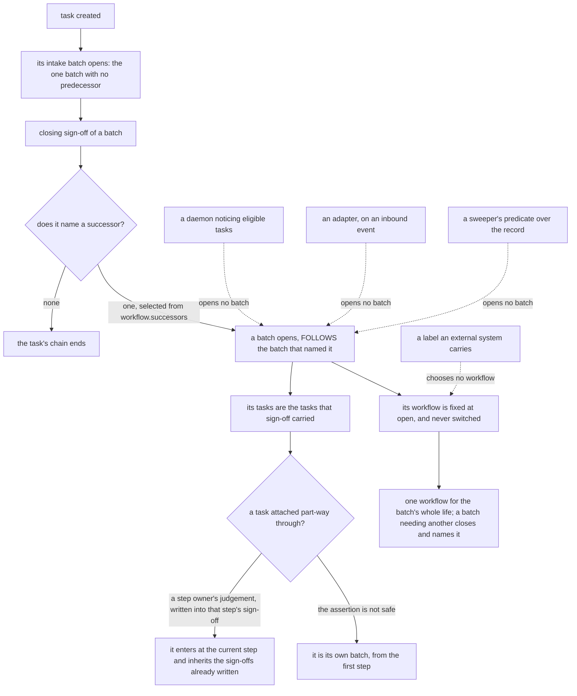

# Work model: how work is created, claimed, executed, and goes through workflows

**Kernel document:** read on every review (`conformance.md`). **Kind:** foundation; states the design and
never the state of a checkout. **Derived from:** synthesis `ent_b0ce322f768e4fc676b73139` (PR-01 to PR-03,
PR-05, C1, C2), prior art `ent_08460968e6f49dac21510f4a`, task `ent_da60df3beccb675ef8c8c0c5`, throughput
plan `ent_18b902cf72822373f9da8ced` decisions `pull_model_sequencing_build_the_claim_not_the_router`,
`non_github_execution_makes_pull_decisive`, `three_execution_mechanisms_not_one`, PR #745 operator
review (2026-09-04), and the operator's 2026-09-05 review (revision 18: how a batch is formed and what
chooses its workflow; revision 20: the batch-formation diagram, on the operator's request for visuals
during review), and the operator's 2026-09-05 12:52 memo (revision 21: workflows as the general mechanism
for changing the swarm's own operation). Supersedes `docs/archive/task_execution_loop.md`. What is built
is `status.md`; how each concept is recorded is `data_model.md`.

## Purpose

State how work is created, taken, executed, and returned: pull-only delivery; assignment as eligibility;
claim and lease as one primitive (lease as relationship); liveness derived at read time; no assignment
log; a task carries only status and edges; intake is every task's first workflow; tasks go through
workflows in batches, are attached to and detached from them, and nest under parents; a batch is opened
by a closing sign-off naming a successor and goes through exactly one workflow; a change to the swarm's
own operation is a task like any other, governed by the action gate the governance writes already reach;
artifacts are records a batch leaves, never its subject.

## Scope

The task path: a task claimed and executed by an agent. The other two execution mechanisms are named
below; steps and gates are `gates_and_workflows.md`; core workflows (including intake) are `workflows.md`
(authored companion, not inlined into review prompts); authority is `authority_model.md`; terms are
`vocabulary.md`; the record is `data_model.md`. Walkthroughs: `scenarios.md`.

## The invariants

### Pull is the only delivery; assignment constrains eligibility

Work reaches an agent only by claim. No router chooses claimants; no principal delivers a task; a workflow
step is claimed by its step owner the same way (`gates_and_workflows.md`). Reason: the actor that judges fit
must be the actor that acts and answers for the outcome. A router's inference sits in an actor that
neither acts nor answers for a misroute, so a wrong guess reaches an executor with nobody accountable for
the choice. A claim is a 1:1 judgment, "is this mine", bounded by the claimant's own `agent`,
which no central table encodes; routing is a 1:N choice with fallthrough, and fallthrough is where an
unknown principal is quietly resolved to somebody. A claim cannot fall through: the predicate reads
`assigned_to` directly, and an `assigned_to` naming a principal nobody can run raises a checkpoint
(reason `unspawnable_assignee`) instead of being resolved to someone else. Non-code agents are the first
consumers: their work has no file paths or closure keywords for a keyword matcher, and a claim bounded by
their own definition needs none. Subscriptions wake an agent; they never deliver work.

### Assignment restricts eligibility; it never creates a lease

`assigned_to` is eligibility: who may claim. It is not the holder. The principal the assignment names
still pulls by claiming; the lease holder is always the claimant. A task whose named principal never claims
is assigned-and-unclaimed, a fact about that principal, not a lease left hanging. Camunda's
`setAssignee()` (installs a holder with no check) is the operation this design does not have.

### The claim and the lease are one primitive

Two agents must not both take a task; a killed runner must not leave one held forever. The claim is keyed
on the task; the holder is read back after the write: an agent holds only if the persisted lease names
its runner id (principle 2). Atomicity is proven by the implementation, never assumed of the store: a
last-writer-wins snapshot and a name-collision policy that de-duplicates into one row do not raise.

### The lease is a relationship, not a set of task fields

The lease is an edge (principal ↔ task) with `claimed_at` and `expires_at`; renewal moves `expires_at`.
The task carries no lease fields. Derived at read: `held` while `expires_at` is future; `lapsed` once
past without an explicit end; `returned` when the claimant ended it. Nothing transitions a lease to
`lapsed` — the clock does (principle 11).

### Liveness is derived from activity at read time, never declared

`active` = held lease plus activity (`agent_session` or observations) within the lease window. A stored
liveness flag fails when the process that would clear it died. The two liveness assertions of the archived
loop document are retired: `executing` / `running` are not states.

### No assignment log; history is the task's own observations

Every status change is an observation; every lease is an edge with timestamps. A parallel assignment or
claim-history entity would be a second source of truth (principle 9). The current lease answers what
history cannot: who holds this right now. `agent_session` carries the identity half observations lack
(host, checkout, branch, head), not a history of runners.

### The transition vocabulary

The task's vocabulary is `created` plus its status (`open` / `blocked` / terminal). The lease carries
`held` / `lapsed` / `returned`. `active` is a derived read, never a state. Each word names one thing: a
task whose claimant died is a task with a lapsed lease, and a task its named principal has not taken is
assigned-and-unclaimed. Definitions: `vocabulary.md`.

### There is no task lifecycle; there are batches

A task carries status and edges only. Other state is a batch, lease, sign-off, or activity entity. A
task is never routed, executing, verified, or in review as a status; the batch it is in and that batch's
`FOLLOWS` chain say which of those is true (`gates_and_workflows.md`). This is C1: the states of the
archived loop document were facts about a batch, a lease, or a sign-off written onto the task, where a
process then had to keep them true (principle 11).

### Intake is every task's first workflow

Every task enters intake before any other workflow (`workflows.md#intake`): `classify`, `link`,
`dedupe`, `prioritize`, `route` (closing sign-off names one successor, none, or operator-only). An
unrouted task is a task with no intake batch — no separate unrouted state. Tasks a batch creates
(children, detached tasks, tasks extracted from a meeting) enter intake themselves; a child may take
intake's declared fast path and never skips intake.

### What a claim predicate treats as claimable

Claimable: not terminal, not `blocked`, no held lease. A lapsed lease never blocks a claim. Unassigned
tasks are a shared pool; an assigned task is claimable only by the principal it names. The status
vocabulary in the record is what tasks actually carry, not what an enum in code declares: a predicate is
written against the record (principle 3), because a normalizer that fails to map a live value onto a
terminal one makes finished work claimable. Live status distribution: `status.md`.

### A lapsed lease is not reaped; repeated lapse raises a checkpoint

No process returns a lapsed lease — it already does not count. The reaper is retired. The watchdog
observes lapses and, past a per-task cap, escalates: it raises one checkpoint on the task with reason
`repeated_lapse` (`failure_posture.md`); it never chooses a new claimant.

### At-least-once implies effect dedup

Lapse and re-claim is at-least-once. Every outbound effect is idempotent or deduplicated on its own key;
a re-claimed task is never replayed (`failure_posture.md`). The dedup key lives on the `action` entity
(`gates_and_workflows.md`).

### Operator-only tasks are claimed by the operator-facing agent

A task with `operator_only` actions is an ordinary task claimed by the `ateles` agent, which carries it to
the operator and holds the lease while the operator decides. It is not itself a checkpoint: it raises one
only when an action inside it reaches the action gate, which resolves `operator_only` to `NEVER`
(`gates_and_workflows.md`). The task path stays pull; only the action waits on a human.

### A task is executed only through a workflow

There is no path by which a task is executed outside a workflow. Every task enters intake, and intake's
closing sign off names the successor workflow it goes to, or none, or operator-only; whatever it does
after that, it does inside a batch going through a declared workflow, with that workflow's steps, step
owners, and sign offs. The design offers no side door: no status a principal sets that means "done
without a workflow", no direct-execution mode for small work, no class of task exempt because it is
urgent or trivial. Work small enough that most steps are unnecessary takes a declared fast path
(`gates_and_workflows.md`), which is a workflow saying which steps it skips — a decision recorded in the
declaration, judged once, and visible to every reader — rather than a task escaping the model.

**What this means for the self-triggering daemons.** A daemon produces tasks and takes actions, and it
receives no task itself (the four execution mechanisms, below); none of that is an exception to this
rule. Any task a daemon produces enters intake exactly like a task from any other source and is executed
through a workflow from there — the daemon that created it holds no privilege over it and does not
execute it outside the model. The daemon's own outbound effects are not task execution at all: they are
actions, and each passes the action gate on its own (`gates_and_workflows.md`, C2). So the daemon loop
sits beside the task path rather than around it, and the two meet where a daemon's output becomes a task
in intake.

### Changing the swarm is work, and it goes through a workflow like any other

A change to the swarm's own operation — a new workflow declaration, a step added to an existing one, a
step's owner role changed, a workflow retired, an agent's prompt or the `agent_policy` it renders from
rewritten — is **a task like any other**, and everything above applies to it unchanged. It is created,
it enters intake, it is classified and prioritized and routed, it is claimed by a principal that judged
it its own, it is executed inside a batch going through a declared workflow, and the writes it makes
reach the record through the gate those writes already pass. Nothing in the model has a clause that
distinguishes work aimed outward from work aimed at the swarm itself, and the reason is that the
distinction does not survive inspection: a change to a workflow declaration is a change to how every
future batch of that type is executed, which is a larger blast radius than most outward work carries,
not a smaller one. Exempting it would exempt the most consequential class of change in the design.

**The rule above already settles this, and it settles it for changes nobody asked for.** The no-side-door
rule is written about tasks, not about origins: it says there is no path by which *a task* is executed
outside a workflow, and it names the three shapes an exemption would take — a status meaning "done
without a workflow", a direct-execution mode for small work, a class of task exempt for being urgent or
trivial. None of the three is conditioned on who created the task or why. So a change the operator asked
for and a change the swarm proposed to itself are the same object under this rule, and the swarm's own
proposal is the case where the rule does the most work, because it is the case with no human in the loop
by default. A reading under which the rule covers only operator-initiated change would leave
self-initiated change ungoverned, which inverts the risk.

**A workflow may create a workflow, and a workflow may modify an agent.** Both follow from the two
sentences above and neither needs a new permission: the work is a task, the task goes through a
workflow, and the writes the work makes are `agent`, `agent_policy`, and `workflow` writes, which
`gates_and_workflows.md#two-policies-workflow-policy-and-action-policy` already names **governance
writes** and already makes actions at the action gate. So a batch may declare a new workflow, add a step,
change a step's `owner_role`, or retire a declaration, and each such write is an action carrying its
class, scored for confidence, resolved to a blast tier under the project's `action_policy`, and held as a
checkpoint where the tier and the confidence say to hold it. The same holds for a change to what an agent
is. A workflow that changes a workflow is not a special kind of workflow; it is a workflow whose steps
produce governance writes.

**What prevents an ungoverned self-change is the action gate, and it is not a second mechanism.** Name it
precisely, because "a self-modifying system with a gate on self-modification" is worth being able to
point at: the five governance types are a **closed and short list**, so the rule is checkable by
inspection rather than judged per write; every write to one of them is an action, so it is evaluated at
the moment it would be taken rather than at the moment it was proposed; `operator_only` resolves to
`NEVER` ahead of any policy, so a policy cannot demote a change the operator reserved; an unclassified
action type fails closed and loudly; and a proposed change is a proposal until the gate lets it through
and is **never a mutation an agent makes to itself on its own finding**
(`gates_and_workflows.md#a-finding-is-one-off-or-standing-and-a-standing-one-obliges-a-change-to-what-produced-it`).
Two more constraints hold without being added here. The principal making the change needs the capability
for it, read at the enforcement point on every check (`authority_model.md#grants`), so an agent cannot
widen its own grant by writing one — that write is itself a governance write to `agent_grant`, gated as
one. And a change proposed by a step owner is judged by a step owner: no principal signs for another, so
the batch that proposes a change to an agent does not also supply the sign-off that accepts it unless
the declaration puts both in one role, which is a property of the declaration a reader can see.

**Which class of change the swarm may never make to itself without the operator is a policy value, not a
new mechanism.** The question "what is off limits" is answered by the `action_policy`: a governance class
listed as `operator_only` resolves to `NEVER`, ahead of the confidence axis and ahead of the recurrence
path, and no accumulation of successful precedent graduates it. That is the existing expression of "never
without a human", and adding a second list of forbidden self-changes beside it would be the second gate
principle 6 forbids — two places to read before knowing whether a change may be taken, which is how the
two answers come to disagree. What the design therefore states is the *shape* of the answer and not its
content: the reservation is per action class, it lives in the policy, and it is the operator's to write.
Which classes belong there is not a design question this document can settle, because it is a judgement
about how much autonomy this operator wants, and the design's job is to make the judgement expressible
and enforceable rather than to make it.

**Open decision 18: whether a governance write is reserved to the operator by default.** Registered in
`conformance.md#the-register-of-open-design-decisions`. A policy is a value, and every value has a default for a project that has not written one. The two candidate defaults
are genuinely different postures and the choice is the operator's. **Reserved by default** — the five
governance classes carry `operator_only` unless a project's policy says otherwise — makes the swarm
unable to change itself out of the box, and every loosening a deliberate act with a record; the cost is
that the mechanism sits unused until someone writes a policy, and an unexercised path is one nobody has
tested (`failure_posture.md`). **Gated by default** — governance classes take a high blast tier, held at
a checkpoint but not reserved — makes self-change possible from the start under a per-change decision,
and the risk is that the checkpoint queue is where held work goes to be approved in bulk, so a tier that
merely holds can become a tier that merely delays. What would decide it: whether the checkpoint queue is
actually consumed, which is a measured property and not a design one (`status.md`). Until it is ruled, a
reader should assume neither default and read the project's `action_policy`; a project with no policy
value for a governance class is the unclassified case, which fails closed to `NEVER`
(`gates_and_workflows.md#confidence-and-three-blast-tiers`) — so the *absence* of a decision already
behaves as the reserved posture, which is the safe direction to be undecided in, and is not the same as
having ruled.

**The relationship to open decision 17.** Decision 17 asks a narrower question about one path into this
one: whether institutionalizing a *standing finding* is itself a workflow, and specifically whether the
batch that raised the finding waits on the institutionalization task it created or closes and leaves that
task to its own intake (`gates_and_workflows.md#a-finding-is-one-off-or-standing-and-a-standing-one-obliges-a-change-to-what-produced-it`).
This section does not answer it and does not depend on it. What this section states is that *a change to
the swarm goes through a workflow*, whatever produced the change; what 17 leaves open is *sequencing*
between two batches when one of them produced the other. Both readings of 17 are consistent with this
section, which is why ruling this one does not rule that one.

**Bootstrapping: the first workflow is not created by a workflow, and this is a stated limitation.** If
workflows are how workflows change, then the first declaration for a project has no workflow to come
through, and a workflow broken badly enough that no step of it opens cannot be repaired by a batch going
through it. The design does not resolve this, and inventing a mechanism for it would be inventing a side
door — a privileged path that creates or repairs a declaration outside the model is exactly the thing the
rule above forbids, and it would be available to every change and not only to the two cases that need it. So
the limitation is stated rather than mechanized, and what the design says about the two cases is what it
already says elsewhere. **The first declaration is an operator act**, of the same kind as issuing a
credential or widening a grant: provisioning is operator-only and out of band
(`authority_model.md#grants`), an agent neither performs it nor is empowered to have it performed by
raising a checkpoint. **A workflow too broken to open a step is an unreadable workflow**, which is a defined
state: no step of it is opened or claimed, its batch's tasks are escalated with one checkpoint (reason
`unreadable_workflow`), and nothing proceeds on an empty sequence
(`gates_and_workflows.md#an-unreadable-workflow-is-unknown-and-unknown-holds`). The repair then arrives
the way the first declaration did. Two consequences worth stating plainly. The swarm's ability to change
itself is bounded below by an operator who can write a declaration, and a swarm whose every workflow were
simultaneously unreadable could not recover on its own — that is a real limitation and not a gap in the
writing. And the failure is at least **loud**: an unreadable workflow halts rather than degrades, so the
condition presents as a checkpoint and an announcement rather than as work quietly not happening
(`failure_posture.md` rule 2), which is what makes an operator-only recovery viable at all.

### What goes through a workflow is a batch of tasks

Tasks go through a workflow in a batch: one or more tasks together, and the record of that. A single task
is a batch of one; there is no separate single-task path. When tasks enter a workflow a batch record is
opened if none exists, and each task is attached by an `ADDRESSED_BY` edge. Detaching a task ends its
edge; to split a task is to detach it and open a new batch for it, from the first step, while the original
batch continues with the tasks still attached. Attach and detach are edges, never fields (principle 11).

### How a batch is formed, and what chooses its workflow

The rule above says tasks go through a workflow in a batch and that a batch record is opened if none
exists. That leaves three questions a reader has to answer before they can build anything: what causes a
batch to come into existence, which tasks are in it, and which workflow it goes through. Each is answered
by a mechanism the model already has, and stating them together is what stops the answer being re-derived
differently at each call site.

**A batch comes into existence when a closing sign-off names a successor, and at no other moment.** There
is one cause, not several. Intake's `route` step closes on a sign-off naming one successor workflow, none,
or operator-only; every later batch closes the same way (`gates_and_workflows.md#sequencing-is-data-successors-and-the-chain`).
Where a successor is named, the batch for it opens and carries a `FOLLOWS` edge back to the batch that
named it. Where none is named, the task's chain ends. Nothing else opens a batch: no daemon opens one
because it noticed eligible tasks, no adapter opens one on an inbound event, and no scheduler sweeps for
work to group. The one batch with no predecessor is a task's intake batch, opened on the task's creation,
which is the universal entry (`#intake-is-every-tasks-first-workflow`, above) and the reason every chain
has a first link.

The consequence worth naming: a batch is always opened **by a principal's recorded verdict**, never by a
process acting on its own reading of the record. The sign-off names the successor, so the decision has an
author, a timestamp, and a reason, and a reader asking why these tasks are in this workflow is answered by
a verdict rather than by inferring what some sweeper's predicate must have matched.

**A batch's tasks are the tasks the closing sign-off carried, and grouping beyond that is a step's
judgement, recorded as one.** The default is the simple one: the tasks attached to the closing batch move
together into the successor, and a batch of one stays a batch of one. Two operations change a task set,
both already defined and both edges (principle 11): **detach**, which ends a task's `ADDRESSED_BY` edge and
opens a new batch for it from the first step of its workflow, and **attach**, which writes that edge. What
this section adds is who may do them and on what basis. Attaching a task to a batch that is already open,
part-way through its steps, is a step owner's judgement written into that step's sign-off, never an
adapter's guess and never a matcher's inference — the adapter rule already forbids the first
(`adapters.md#what-the-adapter-does-with-every-event`), and the second is the routing fallthrough the pull
rule forbids. A task attached part-way through enters at the batch's current step and inherits the
sign-offs already written on it, which is exactly why the judgement is a recorded one: those sign-offs were made
against a task set that did not include it, and a step owner who attaches is asserting that they still
hold. Where that assertion is not safe, the task is its own batch.

**The workflow is chosen once, by the sign-off that names the successor, from the declared list.** The
choice is not open-ended: `workflow.successors` names the workflows a closing batch's tasks may enter, and
the closing sign-off selects exactly one from that list or none. So the workflow for a batch is fixed
before the batch opens, by a named principal, bounded by a declaration that was reviewed when it was
written. There is no run-time selection inside the batch, no re-selection, and no workflow chosen by
matching a property of the tasks after the fact.

**A batch goes through exactly one workflow, for its whole life.** The workflow is a field of the batch
record (`data_model.md#concepts`), fixed at open. A batch that needed a different workflow does not switch:
it closes, and its closing sign-off names the one the tasks go to, which opens a new batch. This is what
makes the chain readable — each link is one workflow, entered by one verdict — and a batch that changed
workflow mid-flight would leave its earlier sign-offs pinned to steps that no longer exist in its
declaration.

**And a task is in one batch at a time but many over its life, which is the distinction to hold.** The
one-at-a-time rule is about simultaneity (above); the chain is the sequence. A task that went through
intake, then feature, then release has three batches, two closed and one live, and asking "which workflow
is this task in" is answered by its live batch alone.

The three questions and their one answer each, with the paths the rules above exclude drawn beside them:

Every arrow into a batch is a principal's recorded verdict; every dotted one is a path the rules above
close.

**What this deliberately does not do is let batch formation key on anything discovered later.** A
declaration's conditional may turn only on a property of the task set at intake, never on a label an
external system carries (`workflows.md`), and the rules above are the same constraint stated for
formation: the successor is named by a verdict at a close, from a list fixed in the declaration, on tasks
whose properties intake established. A formation rule that grouped tasks by a label an adapter wrote, or
that chose a workflow from an artifact's state, would put the choice back into an external system's hands
through the side door the boundary rules close.

Two questions about a batch's **lifetime** remain open and are not settled by any of the above: whether a
batch may hold on a condition discovered mid-flight, and whether a batch may depend on a task it created
(`gates_and_workflows.md#a-finding-is-one-off-or-standing-and-a-standing-one-obliges-a-change-to-what-produced-it`).
Both are downstream of this section rather than blocked by it — formation and workflow choice are settled
whichever way they go, because both concern what a batch may wait on once it is already open. They are
opened in full as decisions 13 and 14 below. Every open decision the foundation carries is indexed in
`conformance.md#the-register-of-open-design-decisions`.

### Open decision 13: whether a batch may hold on a condition discovered mid-flight

The formation rules above settle what a batch is opened by and what it carries; they say nothing about
what may suspend one that is already open. The question is opened here rather than resolved, in the idiom
decisions 17 and 18 were opened in.

**The question.** A condition declared at intake is already expressible: `applies_when` decides whether an
optional step opens, and it is evaluated against what the batch's tasks are and what their change touches
(`gates_and_workflows.md`). What is undecided is the other case — a step owner, part-way through a batch,
learns something that was not knowable when the batch was formed, and the right response is neither to sign
nor to fail but to **wait**: a rail's quote has expired and a re-quote is pending, an external system is
returning `unknown` rather than an answer, a second batch is producing the artifact this one's next step
reads. Whether the design admits a batch state that is open, unclosed, and deliberately not progressing,
and whether a step owner may put a batch into it, is what is not settled.

**If a batch may hold**, the condition is a first-class thing: it is declared somewhere, it is evaluated
by something, and something ends the hold. That means a held batch is readable as held rather than as
quiet, which is the property principle 11 asks for — state that needs a watchdog belongs in a relationship
rather than in a field — and it means the ten-day stall has a name instead of being invisible. The cost is
that a hold is a second waiting mechanism beside the checkpoint, which already suspends work pending a
principal's decision, and building it separately is the parallel-mechanism defect principle 6 forbids: two
places a batch can be waiting, two resolution protocols, and two queues, of which the second is the one
nobody consumes (principle 1).

**If a batch may not hold**, there is exactly one way to wait, and it is the checkpoint: a step owner who
cannot sign raises one, a principal resolves it, and the batch's suspension is the existing protocol with
an existing consumer. The cost is that a checkpoint asserts a **decision** is owed to a principal, and
most of the conditions above owe nobody a decision — a quote that will re-quote in ninety seconds does not
need the operator, and raising a checkpoint for it makes the queue a place where machine-resolvable
conditions are parked in front of a human. The alternative under this answer is that the step owner does
not wait at all: it signs a verdict of `unknown`, the batch closes, and the work re-enters through a new
batch when the condition has changed — which is honest, and which multiplies batches for what is
conceptually one piece of work, so the chain stops reading as the history of a task and starts reading as
the history of a retry.

**What would decide it:** whether any condition the design already names is genuinely machine-resolvable
and owes no principal a decision. If every real case turns out to owe someone a decision, the checkpoint
already covers it and no second mechanism is warranted. If some do not — and the payment rails'
expiring quote and the unconfirmed-effect `unknown` are the two candidates the documents already carry
(`payments.md`, `work_model.md#at-least-once-implies-effect-dedup`) — then a hold is a distinct thing and
the question is where its condition is declared, which is the same question `applies_when` answers for a
step and should be answered the same way.

**Until it is taken**, a batch has no held state: a step owner who cannot sign raises a checkpoint or signs
`unknown`, and there is no third option. That is the state a reader should assume and not the design's
ruling.

**Blocks:** decision 17's sequencing half, which cannot be ruled without it
(`gates_and_workflows.md#a-finding-is-one-off-or-standing-and-a-standing-one-obliges-a-change-to-what-produced-it`),
and decision 14 below, which is the specific case of this general question where the condition is a task
the batch itself created.

### Open decision 14: whether a batch may depend on a task it created

The narrower of the two, and the one with a named case already in the documents. Opened here rather than
resolved.

**The question.** A batch, part-way through, creates a task: a standing finding's proposed change to the
swarm's own operation (`gates_and_workflows.md`), an adapter admission the arch review step calls for
(`adapters.md`), a follow-up the implementer files rather than doing. That task enters intake and gets a
batch of its own, as every task does. What is undecided is whether the **creating** batch may make its own
progress conditional on the created task completing — whether a batch may say "I cannot close until the
task I created is done".

**If a batch may depend on a task it created**, the swarm can express the case where the work genuinely is
not finished: a review step that found the workflow itself wrong, and whose sign-off would be a lie if the
workflow went unchanged. The dependency is readable, and a reader asking why a batch has not closed gets
an answer that names the blocking task. The cost is a cycle risk that is not hypothetical: the created
task's batch may in turn create a task, and nothing in the rules above prevents its descendant depending
back. Cycle detection is then a mechanism the design owes, and a mechanism nothing currently owns. It also
makes a batch's lifetime unbounded by anything its own declaration states, which is exactly the property
that makes a batch's chain readable today.

**If a batch may not depend on a task it created**, every batch closes on its own steps, the chain stays a
sequence rather than a graph, and the created task is a peer entering intake on its own — which is the
behaviour `gates_and_workflows.md` already tells a reader to assume. The cost is that the creating batch's
closing sign-off asserts its steps are satisfied while its own owner believes something material is
outstanding, and the link between the two pieces of work survives only as provenance on the created task
rather than as anything that holds the first one open. Whether that is a defect or the correct division of
labour is precisely what is undecided: the design's usual answer is that provenance plus a separately
prioritized task is enough, and the standing-finding case is the one where it may not be.

**A third answer the design should consider and this section does not adopt:** the dependency exists but
runs the other way — the created task carries a `FOLLOWS`-like edge to the batch that created it, and
nothing holds, so the relationship is readable without any batch's lifetime changing. That would give the
readability without the cycle risk, and it is not adopted here because whether a readable-but-unenforced
link is a control at all is the question principle 1 asks of every mechanism, and answering it is the
decision rather than a step around it.

**What would decide it:** whether any step's sign-off is genuinely unsafe to write while the task it
created is outstanding. If a step owner can always honestly sign for the batch's own scope and leave the
created task to its own intake, no dependency is needed and the peer answer is right. The standing-finding
case is the test: a review step that judged a workflow wrong is being asked to sign that the workflow's
step was satisfied, and whether those are the same claim is the crux.

**Until it is taken**, a batch closes on its own steps and a task it created enters intake on its own, with
provenance back to the batch that created it and no hold on that batch
(`gates_and_workflows.md#a-finding-is-one-off-or-standing-and-a-standing-one-obliges-a-change-to-what-produced-it`).
That is the state a reader should assume and not the design's ruling.

**Blocks:** decision 17's sequencing half, together with decision 13. **Depends on** decision 13: if a
batch has no held state at all, this question has no mechanism to be answered with, so 13 is the more
general and should be taken first.

### Artifacts are records a batch leaves, never its subject

An `artifact` is an external record (issue, PR, release, message) linked by edge. A step is signed off on
the batch's tasks; the PR is the record left behind. An action is the intended effect; the artifact is
what the effect leaves. Which system holds the artifact, and what that system calls it, is outside the
design; how that system's events and operations map onto the record is `adapters.md`.

**The word is bound, and it is not a catch-all for outputs.** An artifact is a record living in an
external system, reachable only through that system's adapter, and always identified by the pair `system`
and `external_id` — a thing the swarm can point at but does not hold. Anything the swarm produces that
lives in the record is an **entity**, not an artifact: a sign off, an analysis, a draft, a checkpoint, a
plan, a page the swarm rendered into the record. The test is where the thing lives and how it is reached,
never how output-shaped it feels: if reading it means asking an external system through an adapter, it is
an artifact; if reading it is a retrieval from the record, it is an entity. Keeping the word this narrow
is what lets every rule about artifacts hold at once — that they are found by `system` and `external_id`,
that only an adapter touches them, that they are never the subject of a step, and that what happens to
them reaches a step only through a principal who reads and signs. A word that also covered the swarm's
own outputs would break all four.

### A task is in at most one batch at a time

At most one `ADDRESSED_BY` edge to a non-terminal batch. Sequential batches are normal: a task that went
through a pull-request workflow and then a release workflow has two edges, one to a closed batch and one to
a live one. Work needing two workflows at once is split into child tasks, one per batch.

### Parent and child tasks

Children `PART_OF` a parent (at most one parent). Parent completion is derived from children's terminal
states. Children go through workflows independently. A parent never enters a workflow — it is a
grouping, and a batch carries tasks that are executed, which a parent never is.

## The four execution mechanisms

(1) Task path above. (2) Dedicated daemons that self-trigger (a mail poller produces tasks and never
receives one). (3) The GitHub pipeline, which sequences steps for a batch and never writes task status — a
step opening is publication of claimable step work; the step owner claims it with a lease, the same
primitive as on a task (`gates_and_workflows.md`). It is the same pull, over steps. A roster role reachable
by none of these cannot receive work; the count is `status.md`. A daemon showing that a non-code agent
can self-trigger does not show it can receive work.

(4) **The interactive session, a work source that holds no lease.** An operator working directly with an
agent produces work, takes actions, and receives none of the swarm's work: it claims nothing, so it holds
no lease. Naming it a mechanism is what makes its consequence statable rather than merely true. Every
recovery guarantee in this document runs through the lease — a lapsed lease makes a task claimable again
with no process acting on it, and repeated lapse raises a checkpoint — and none of them reaches a session.
A session that dies mid-request leaves no lease to lapse and no task to re-claim.

So the session's output becomes **tasks**, and the sequence that turns it into them is a declared workflow
like any other (`workflows.md`), with an owning role, rather than an emergent practice. Work an
interrupted session left unfinished is recovered by **digestion** — reading the session back and filing
what it left — and that is stated as the design, not as a habit: the recovery is a workflow someone owns,
and its absence would be visible. Requiring a session to claim a lease like the other three would close the
gap in theory and be bypassed in practice, and a rule that is bypassed is not a control (principle 1);
naming the mechanism honestly and designing its recovery is what the model can actually hold.

## Contradictions this document settles

**C1.** The task-spine plan `ent_aff87747b49e338790568af6` (`task_lifecycle_state_machine`) and the archived
loop document define `created, routed, executing, verified, done` with a router assigning owners. Resolved
for pull: the third of those states asserts what it cannot back, and routing places the judgment of fit in an actor that
neither acts nor answers for it. That plan's state-machine criteria are superseded; the correction is a
request to its maintainer. **C2.** `subscriptions_detect_tasks_authorize` is true of the task path and
false of the self-triggering daemons, whose effects never pass through a task; a daemon's outbound effect
is still an `action` through the same action gate (`gates_and_workflows.md`). Open: unify the daemon loop
with the task path or keep both under an explicit contract (digest `ent_e04244959daf92416597ce28`).
**The reaper, retired** — lapse is read, not written; the watchdog keeps only its escalation rule
(`failure_posture.md` rules 4–5).

## Prior art

The claim-with-lease is the SQS visibility timeout almost exactly: a received message is invisible while
held and visible again on expiry with no cooperation from the consumer, renewal as the heartbeat,
at-least-once. Not shared: the 12-hour cap (tasks run for days) and deletion on success (observations are
the history). Temporal confirms the no-probe posture: its server does not detect a crashed process;
liveness is timeout expiry, and pull by the process is its model verbatim. Camunda supplies the vocabulary
by contrast: `claim()` throws when already claimed, which is the claim here; `setAssignee()` installs a
holder with no check, which is what assignment here deliberately does not do. Postgres `SKIP LOCKED` is
the property a claim needs; the substrate has to prove it. Sources: `ent_08460968e6f49dac21510f4a`.
