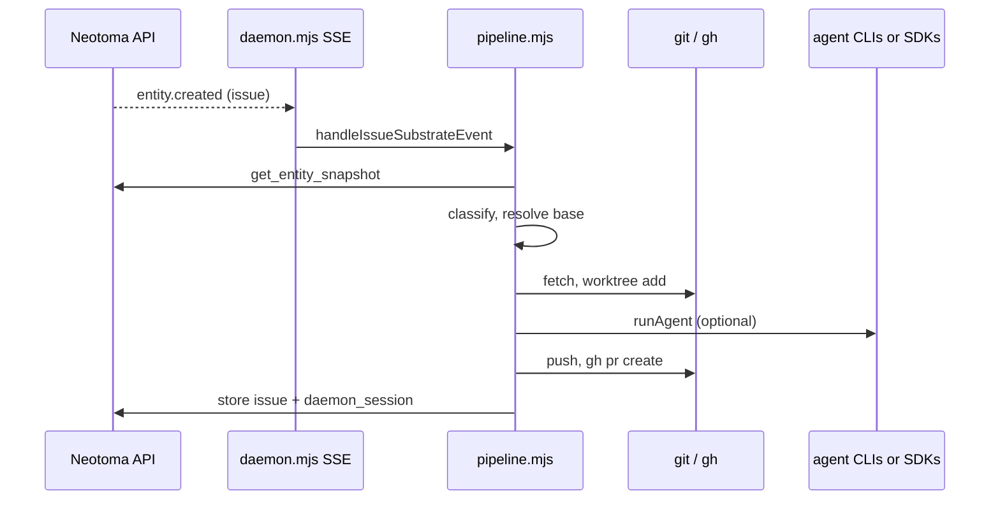

# Formica: architecture

## Role in the stack

Neotoma is the **substrate** (events, entities, storage). **Formica** (this daemon) is a **strategy-layer consumer** in **ateles**: it subscribes to events, reads/writes Neotoma over HTTP, and performs **local git** and **CLI** actions on operator-controlled machines.

It does **not** ship inside the Neotoma server process.

## High-level data flow

## Module responsibilities

| Module | Responsibility |
|--------|----------------|
| `daemon.mjs` | Load config, ensure subscription, open EventSource, serial dispatch, optional Telegram long-poll sidecar, PID file, SSE checkpoint. |
| `neotoma.mjs` | Thin HTTP client: subscribe, list subscriptions, store, query, snapshots, sources, relationships. |
| `pipeline.mjs` | End-to-end issue handler: kill switch, rate limit, snapshot, classify, base resolve, worktree, patch, session record, agent, preflight, PR, Telegram handoff, resume path. |
| `kill_switch.mjs` | Query `daemon_config` entities; gate processing. |
| `rate_limit.mjs` | Hourly PR open cap (in-process). |
| `classifier.mjs` | OpenAI JSON or heuristic labels written back to the issue. |
| `base_resolver.mjs` | `BASE_COMMIT` from `rebase_policy` + issue provenance + `git`. |
| `worktree_manager.mjs` | `git worktree add`, optional `git apply` for reporter patch sources. |
| `agent_runner.mjs` | Dispatches `oneshot` CLIs vs `conversational.sdk` vs `conversational.claude_api` vs `human_handoff`. |
| `cursor_sdk_runner.mjs` | `@cursor/sdk` multi-turn agent with `cwd` = worktree. |
| `anthropic_runner.mjs` | Anthropic Messages API multi-turn (text-only guidance). |
| `pr_manager.mjs` | Dirty-tree policy, optional rebase, push, `gh pr create`. |
| `operator_queue.mjs` | In-process FIFO bridging Telegram (or other) text to `pollOperator`. |
| `operator_transport.mjs` | Telegram send + `getUpdates` long poll, env substitution helpers. |
| `telegram_mirror.mjs` | Optional Neotoma persistence for every inbound Telegram line. |
| `state_updater.mjs` | `store` wrappers for issues, daemon sessions, thread messages. |

## Concurrency model

- **SSE events** are handled **serially** (a single promise chain in `daemon.mjs`) so two issues are never processed at once unless you change that pattern.
- **Telegram** runs concurrently in an async loop; it enqueues into `OperatorQueue` keyed by **`ent_*`** parsed from message text (or uses pending PR maps for **`/shipit`**).

## Failure and human-needed paths

When base resolution fails under `strict_reporter`, preflight is dirty, rebase fails, rate limit trips, or `auto_fix` is false with local commits, the daemon moves to **operator notification** (Telegram handoff when configured) and records state on the issue / `daemon_session` where applicable.

## Spec alignment

Canonical product spec (private Neotoma repo):

`docs/private/strategy/nervous_system_plans/04_issue_processing_daemon.md`
